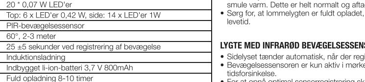
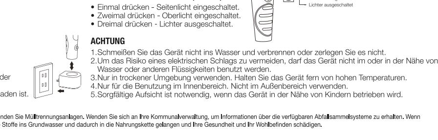
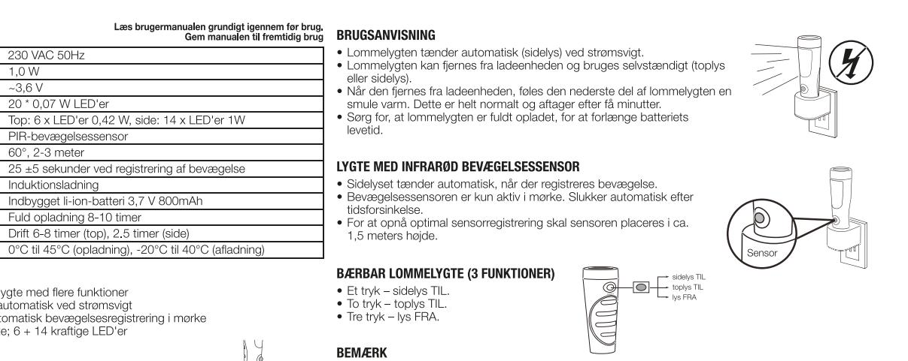
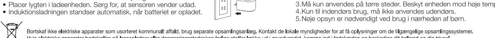
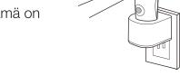
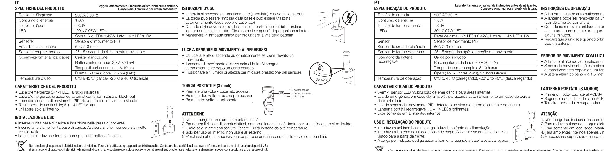
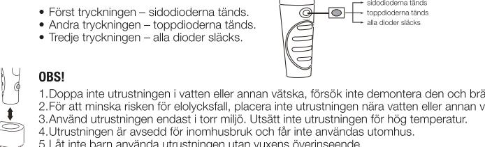
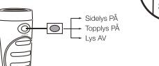

230VAC 50Hz

20 * 0.07W LEDs

PIR motion sensor

60°, 2-3 meters

Induction charging

Top: 6 x LEDs 0.42W, Side: 14 x LEDs 1W

25 ±5 seconds upon detection of motion

Operates 6-8 hours (Top), 2.5 hours (Side)

0°C to 45°C (charging), -20°C to 40°C (discharging),

Built-in Li-ion battery 3.7V 800mAh

Fully charged time 8-10 hours

1.0W

~3.6V

· 3-in-1 multifunction indoor LED emergency sensor light

· Enorgenoy power fairlio light; automatic motion detection in data
• PIR motion sensor light; automatic motion detection in dark
• Rechargeable portable flashlight; 6 + 14 b

· Insert the induction charging base unit into power supply

· Emergency power failure light; automatically switches on in power failure

Induction charging will automatically shut off when battery is charged

230VAC 50Hz

20*0.07W LEDs

60°, 2-3 Meter

230 VAC 50Hz

60°, 2-3 meter

Drift 6-8 timer (top), 2.5 timer (side

1,0 W

~3,6 V

• 3-i-1 indendørs LED-nødsensorlygte med flere funktioner

• Nødlygte til strømsvigt; tænder automatisk ved strømsvigt

· Genopladelig bærbar lommelygte; 6 + 14 kraftige LED'er

PRODUKTINSTALLATION OG -ANVENDELSE

· Placer induktionsladeenheden i strømforsyninger

· PIR-bevægelsessensorlygte; automatisk bevægelsesregistrering i mørke

Verzögerungszeit des Sensor | 25 ±5 Sekunden ab Wahrnehmung einer Bewegung

Induktives Laden

Oben: 6 x LEDs 0.42W, Seite: 14 x LEDs 1W

Eingebaute Li-Ionen Batterie 3.7V 800mAh

Betriebszeit 6-8 Stunden (Oberlicht), 2.5 Stunden (Seitenlicht

0°C bis 45°C (Beladung), -20°C to 40°C (Entladung)

Ladezeit für volle Beladung 8-10 Stunden

PIR (Passiv Infrarot) Bewegungssensor

1.0W

~ 3.6V

· 3-in-1 Multifunktions-LED-Notfall-Innenbeleuchtung mit Senson
• Notbeleuchtung; schaltet sich automatisch bei Stromausfall ein

· PIR (Passiv Infrarot) Bewegungsbeleuchtung; automatische

· Wiederaufladbare tragbare Taschenlampe; 6 + 14 helle LEDs

Bewegungswahrnehmung bei Dunkelheit

PRODUKTINSTALLATION UND BENUTZUNG

PRODUCT SPECIFICATION

Power consumption

Sensor distance area

Rechargeable battery

Operating temperature

PRODUCT FEATURES

· Indoor use only

DE

PRODUCT INSTALLATION AND USE

PRODUKTSPEZIFIKATIONEN

Erfassungsfeld des Sensors

Eingangsspannung

Energieverbrauch

LEDs

Akkubetrieb

Betriebstemperatur

PRODUKTEIGENSCHAFTEN

• Nur für den Innenbereich

PRODUCTSPECIFIKATION

Sensorafstand/-område

Genopladelig batteridrift

Sensorforsinkelse

Driftstemperatur

PRODUKTEGENSKABER

• Kun til indendørs brug

Indgangsspænding

Strømforbrug

LED'er

Sensor

Driftsspænding

DK

Betriebsspannung

· Insert the torch in charging base unit

insert the torem in charging base annt.
Make sure the sensor is facing forward

Sensor delay time

Operating voltage

Input voltage

LEDs

Sensor

operation

GB

# SecurELite 3-In-One EM1

n portion of flashligh

· Flashlight automatic switches on (Side light) during power failure

we historing would from the base unit, the bottom portion of flash.
When removed from the base unit, the bottom portion of flash.
Warm to touch. This is normal and will dissi

· The Side light automatically switches on with motion detected

· Motion Sensor only enabled in dark. Automatic off after time de

· The flashlight can be removed from base unit and

Keep flashlight fully charged to prolong battery life.

1. Do not immerse, incinerate or disassemble the unit

3. Dry location use only. Keep the unit away from high temperature
4. For indoor use only, do not use outdoors.

· Bei Stromausfall schaltet sich das Seitenlicht der Taschenlampe

benutzt werden (Ober- sowie Seitenlicht).

INFRAROT BEWEGUNGSBELEUCHTUNG

TRAGBARE TASCHENLAMPE (3 MODI)

Bewegung wahrgenommen hat.

· Die Taschenlampe kann aus der Station genommen und unabhängig

Wenn Sie die Taschenlampe von der Station genommen haben ist der

· Das Seitenlicht schaltet sich automatisch ein, sobald der Sensor eine

· Bewegungssensor funktioniert nur bei Dunkelheit. Licht schaltet sich

nach der Žeitverzögerung automatisch ab.
Für eine optimale Bewegungserkennung positionieren Sie den Senson
auf einer Höhe von ca. 1.5 Metern.

untere Teil leicht erwämt. Dies ist normal und wird sich nach einigen
Minten von selbst regulieren.
Halten Sie die Taschenlampe stets voll aufgeladen um die Lebensdauer de

5. Close supervision is necessary when operated near children

2 To reduce the risk of electrical shock, do not put in or near water or other liguid

INFRARED MOTION SENSOR LIGHT

PORTABLE FLASHLIGHT (3 MODES)

• First press – Side light ON.
• Second press – Top light ON.
• Third press – Lights OFF.

ATTENTION

automatisch ein.

Batterie zu verlängern

230VAC 50Hz

20 * 0.07W LED

60°, 2-3 meters

Recarga inducida

· Luz de emergencia en caso de falla electrica, encendido automatico en caso de que no

· Luz de sensor de movimiento PIB, detecta el movimiento automaticamente en la oscuridad

Sensor de movimiento PIR

Arriba: 6 X LEDs 0.42W, Lado: 14 X LEDs 1W

Bateria construida de Li-ion 3.7V 800mAh

0° to 45° (cargando), -20° to 40° (descargando)

Tiempo de carga completa 8-10 horas

25 ±5 segundos despues de detectado el movimiento

Operacion 6-8 horas (Arriba), 2.5 horas (descargando)

1.0W

~3.6V

· 3-en-1 sensor LED multifuncion de emergencia para interiores

· Introduzca la unidad base de carga inducida en la fuente de alimentacion

· Introduzca la linterna en la unidad base de carga. Asegurese que el sensor

• Carga inducida se apagara automaticamente cuando la bateria este cargada.

· Euz do oortatil recargable, 6 + 14 LEDs brillantes
· Linterna portatil recargable, 6 + 14 LEDs brillantes
· Para uso en interiores solamente

ESPECIFICACIONES DEL PRODUCTO

Voltage de entrada

Consumo de energia

Voltage de operacion

Sensor de area de distancia

Sensor de tiempo de retardo

Operacion de la bateria

Tempratura de operacion

hava electricidad

CARACTERISTICAS DEL PRODUCTO

USO E INSTALACION DEL PRODUCTO

este mirando hacia delante.

ES

LEDs

Sensor

recargable

# SecurELite 3-In-One EM1

#### Lea el manual de instrucciones detenidamente antes de usar
 INSTRUCCIONES DE OPERACION

- · La linterna se enciende automaticamente ( luz de al lado) si no ha
- electricidad. • La linterna puede ser removida de la unidad base y ser usada
- 
- · independiente ( Luz de aariba o Luz de lado).
 Cuando se retire la linterna de la unidad base, la parte inferior de la
misma se sentira un poco caliente al tacto. Esto es
- despues de unos minutos · Manetenga la linterna con el maximo de carga para prolongar la vida de
- la bateria

## SENSOR DE MOVIMIENTO CON LUZ INFRAROJA

- · La luz de al lado se enciende automaticamente cuando detecta movimiento · Sensor de movimiento solo esta disponible en la oscuridad. Se
- apaga automaticamente despues de un tiempo. apaga al funcionamiento optimo del sensor de movimie coloquelo a una altura de aproximadamente 1.5 metros

### LINTERNA PORTATIL (3 MODOS)

· Primer modo- Luz de lado ENCENDIDA • Segundo modo- Luz de arriba ENCENDID.
• Tercer modo- Luces apagadas.

FONCTIONNEMENT

haut ou par le côté).

quelques minutes

de la batte

d'environ 1,5m.

- 1.No sumerja, incinere o desarme la unidad 2. Para reducir el riesgo de choque electrico, no ponga la unidad cerca de aqua u otro liguido. 3.Solo para usar en lugares secos. Mantenga la unidad lejos de altas temperaturas.
- 4.Para uso en interiores solamente. No usar en exteriores
- 5.Supervision es necesaria cuando la unidad es operada cerca de los ninos

• La lumière latérale s'allume automatiquement en cas de panne d

· Lorsqu'elle est retirée de sa base, la partie inférieure de la lampe es

• La lampe peut être retirèe de sa base et utilisée indépendamment (par

légèrement chaude au toucher. Cela est normal et disparaitra au bout c

onserver la lampe chargée complètement pour prolonger la durée de v

- icos cono residuos municipales sin dasilica; utilize de recogida setectiva. Pórgese en ontacto con su administración bral para obtere información sobre información sobre los No deseche los aparat ecogida disponibles. Si se deserta aparens passueres, las sustancis paligross pueder passritive a la cadena almentica, con econsiguente daily piensi
- 
- FR Lisez attentivement le mode d'emploi avant toute utilisation.
 SPECIFICATIONS PRODUIT Tension d'entrée 230VAC 50Hz 1.0W Consommation Tension de fonctionnemen 3,6V LED 20 LED 0.07W Dessus : 6 LED 0.42W, Côté : 14 LED 1W Détection de mouvement par infrarouge Capteu Portée du capteu 60°, 2-3 mètres Délai du détecteur 25 ±5 seconds Batterie rechargeable Charge par induction Batterie Li-Ion intégrée 3,7V 800mAh Charge complète en 8-10h Durée de fonctionnement : dessus (6-8h), côté (2.5h)

### CARACTERISTIQUES

Fl

TEKNISET TIEDOT

Syöttöjännite

Käyttöjännite

Tunnistimen havaintoalu

Tunnistimen viiveaika

Ladattava akku

Käyttölämpötila

• Vain sisäkäyttöör

ASENNUS JA KAYTTO

OMINAISUUDET

Ottoteho

lunnistin

LEDit

• Lumière de secours 3-en-1 d'intérieur à LED, à détecteur infrarouge
• Lumière de secours en cas de panne de courant; s'allume automatiquement en

- cas de panne · Lumière à détecteur de mouvement infrarouge; détection automatique dans le noir · Lampe de poche rechargeable: 6 + 14 LED • Pour usage en intérieur uniquement
Températures de fonctionnement | 0°C à 45°C (pour la charge), -20°C à 40°C (pour la décharge)

## INSTALLATION

• Brancher la base de chargement par induction dans une prise de courant • Insérer la lampe dans la base, avec le capteur en face avant. · Le chargement par induction s'arrête automatiquement lorsque la batterie est chargée.

230VAC 50Hz

20 * 0,07 W LEDiä

25 ±5 s liikkeen tunnistuksesta

Latausaika 8-10 tuntia

PIR-liiketunnistin

60°, 2-3 m

Induktiolataus

Ylävalo: 6 LEDiä 0,42 W, sivuvalo: 14 LEDiä 1 W

Sisäänrakennettu Li-ion-akku 3,7V 800mAh

0 °C - 45 °C (lataus), -20 °C - 40 °C (käyttö)

Toiminta-aika 6-8 tuntia (yläosa), 2.5 tuntia (sivu

1,0 W

~ 3,6V

LAMPE PORTABLE (3 MODES) • 1 pression – Lumière latérale ON · 2 pressions - Lumière du haut ON · 3 appuis - Lumières OF ATTENTION

1.Ne pas immerger, mettre au feu ou démonter l'unité.
2.Pour réduire le risque de choc électrique, ne pas mettre l'unité dans ou trop proche de l'eau ou d'un

- 
- 5.Une surveillance étroite est nécessaire lorsque l'appareil est utilisé à proximité d'enfants

le iete costes ancels échets mérages pillas les intrastrums de collecte spécifiques Contacte es stimes de collecte de connaites sont instrumes out les contres de collecte des dans des déclarges, des substances peuvent contanier la nappe phéatique et se rerouver dans la châne almentaire, ce qui représente un issque pour la santé et le biereite

tu käyttöoppaaseen huolellisesti ennen käyttöä.
 Säilytä käyttöopas myöhempää tarvetta varten

• Stecken Sie die Induktionsladestation in die Steckdose • Stecken Sie die Taschenlampe in die Ladestation. Stellen sicher, dass de Sensor nach vorne gerichtet ist. · Induktionsbeladung stoppt automatisch, sobald die Batterie voll aufgeladen ist ntsorgen Sie Elektrogeräte nicht als unsortierten Kommunalabfall, sondern verv Elektrogeräte entsorgt ode zu Millide portent verden in Grundvasser und daduch in die Nahningskette gelagen und Inr Gesundhet und In Wohlbeinen schälgen.

Read the instruction manual thoroughly before use.

Do not dispose of ectical appliances as uses ease calection facilities. Ontact your learnet frincition regarding the codecine systems aralable

Lesen Sie sich die Bedienungsanleitung vor Gebrauch sorgfältig durch.
Bewahren Sie die Bedienungsanleitung zum späteren Nachschlagen auf. BEDIENUNGSANLEITUNG

2. For at forebygge risiko for elektriske stød må enheden ikke placeres i eller tæt på vand eller andre 3.Må kun anvendes på tørre steder. Beskyt enheden mod høje temperaturer

Bortskf ikke elektriske apprater som usotteret komminsspræg. Kortakt de klar myndigheder for at få opkøsninger og til tilgænelige opsamlings Hvis elektriske apparater bortskaffes på lossepladser eller deponering ssteder,kan farlige stoffer lække ud i grundvandet, komme ind i fødekæden og beskadige dit helbred og din t

1.Enheden må ikke nedsænkes, brændes eller skilles ad

4.Kun til indendørs brug, må ikke anvendes udendørs.
5.Nøje opsyn er nødvendigt ved brug i nærheden af børn

• 3-In-One liiketunnistimella varustettu LED-sisävalaisin

• Ladattava taskulamppu; 6 + 14 kirkasta LEDiä

· Kytke induktiolatausalusta pistorasiaa

· Varavalo; syttyy automaattisesti sähkökatkoksen yhteydessä

· PIR-liiketunnistin; automaattinen liikkeen tunnistus pimeässä

• Aseta valaisin induktiolatausalustalle. Varmista, että tunnistin on

· Induktiolataus päättyy automaattisesti, kun akku on latautunut täyteer

LUMIERE A DETECTEUR DE MOUVEMENT INFRAROUGE • La lumière latérale s'allume automatiquement lorsqu'elle détecte un • Le détecteur de mouvement ne se met en marche que dans l'obscuri La lampe s'éteint automatiquement après quelques instants. · Pour une meilleure détection, placer le détecteur à une hauteu

autre liquide 3. A utiliser dans des endroits secs uniquement. Tenir l'unité éloignée de sources de hautes températures

- 4.Pour usage intérieur uniquement, ne pas utiliser en extérieu
 KÄYTTÖOHJE • Valaisin (sivuvalo) syttyy automaattisesti sähkökatkoksen yhtet • Valaisin voidaan irrottaa alustasta ja käyttää taskulamppuna (ylä- ta sivuvalo). · Kun valaisin irrotetaan alustasta, sen alaosa on hieman lämmin. Täm normaalia ja valaisin jäähtyy muutamassa minuutissa.
• Pidä valaisin täyteen ladattuna akun käyttöiän pidentämiseks

INFRAPUNALIIKETUNNISTIN

TASKULAMPPU (3 TOIMINTOA) · 1. painallus - Sivuvalo pää

## · 2. painallus - Ylävalo päälle · 3. painallus - Valot pois.

# HUOMAUTUS

1. Älä upota laitetta veteen, älä heitä sitä avotuleen äläkä yritä purkaa sitä 2.Alä laita laitetta veteen tai veden läheisyyteen, sähköiskun vaara. 3.Saa käyttää vain kuivissa tiloissa. Älä altista laitetta korkeille lämpötiloille 4.Vain sisäkäyttöön, älä käytä ulkona 5.Älä anna lasten käyttää laitetta ilman valvontaa

lää häitä sähkölatteita laittelemattomina vaan käytä erillisä keräyspistetiä. Ota yhteyttä paikallisiin viranomasiin saadaksest teröo käytettävissä olevista keräyspistetä los sähkölaitteet hävitetään kaatonaikoille, vaaralliset ainta pohjaveteen ja päästä elintan vikä vahingoittaa terveyttä ja hyvin

SecurELite 3-In-One

| NL PRODUCTSPECIFICATIES                                                                                                                                                                                                                                                                                                          | Lees de gebruiksaanwiizing aandachtig door voor gebruik. Bewaar de gebruiksaanwijzing voor toekomstige raadpleging | GEBRUIKSINSTRUCTIES                                                                                                                                                   | SE TEKN |
|-------------------------------------------------------------------------------------------------------------------------------------------------------------------------------------------------------------------------------------------------------------------------------------------------------------------------------------|-----------------------------------------------------------------------------------------------------------------------|-----------------------------------------------------------------------------------------------------------------------------------------------------------------------|------------|
| Ingangsvoltage                                                                                                                                                                                                                                                                                                                      | 230VAC 50Hz                                                                                                           | • De zaklamp schakelt automatisch in bij stroompanne.                                                                                                                 |            |
| Energieverbruik                                                                                                                                                                                                                                                                                                                     | 1.0W                                                                                                                  | • De zaklamp kan uit het basisstation worden verwijderd om zelfstandig te worden gebruikt (bovenlicht en zijlicht).                                                | Eff        |
| Werkingsvoltage                                                                                                                                                                                                                                                                                                                     | ~3.6V                                                                                                                 | • Wanneer de zaklamp uit het basisstation komt, zal het onderste deel van                                                                                             | Dri        |
| LED's                                                                                                                                                                                                                                                                                                                               | 20 * 0.07W LED's                                                                                                      | de zaklamp een beetje warm aanvoelen. Dit is normaal en na een paar                                                                                                   | Lys        |
|                                                                                                                                                                                                                                                                                                                                     | Bovenlicht: 6 x 0,42W LED's, zijlicht: 14 x 1W LED's                                                                  | minuten zal de zaklamp afgekoeld zijn.                                                                                                                                |            |
| Sensor                                                                                                                                                                                                                                                                                                                              | PIR-bewegingssensor (PIR = passief infrarood)                                                                         | • Zorg ervoor dat de batterij van de zaklamp volledig opgeladen blijft om zo de levensduur van de batterii te verlengen.                                           | De         |
| Sensorbereik                                                                                                                                                                                                                                                                                                                        | 60°, 2-3 meter                                                                                                        |                                                                                                                                                                       | De         |
| Vertragingstijd sensor                                                                                                                                                                                                                                                                                                              | 25 ±5 seconden detectie van beweging                                                                                  |                                                                                                                                                                       | De         |
| Werking oplaadbare batterii                                                                                                                                                                                                                                                                                                         | Inductielading                                                                                                        | INFRARODE BEWEGINGSSENSOR MET LICHT                                                                                                                                   | Dri        |
|                                                                                                                                                                                                                                                                                                                                     | Ingebouwde Li-ionbatterij 3,7V 800mAh                                                                                 | · Het zijlicht springt automatisch aan bij het detecteren van beweging.                                                                                               | ba         |
|                                                                                                                                                                                                                                                                                                                                     | Volledig opgeladen in ca. 8-10 uur                                                                                    | · Bewegingsdetectie enkel in het donker.                                                                                                                              |            |
|                                                                                                                                                                                                                                                                                                                                     | Werkingstijd: ca. 6-8 uur (bovenlicht), 2.5 uur (zijlicht)                                                            | • Voor optimaal gebruik: plaats de sensor op een hoogte van ca. 1,5m.                                                                                                 |            |
| Gebruikstemperatuur                                                                                                                                                                                                                                                                                                                 | 0°C tot 45°C (bij het opladen). - 20°C tot 40°C (bij gebruik = ontlading)                                             |                                                                                                                                                                       | Dri        |
| PRODUCTEIGENSCHAPPEN                                                                                                                                                                                                                                                                                                                |                                                                                                                       | DRAAGBARE ZAKLAMP                                                                                                                                                     | PROI       |
| · 3-in1 multifunctioneel indoor LED-veiligheidslicht met sensor • Noodverlichting, schakelt automatisch in bij stroompanne • Sensor op basis van passieve infraroodstraling, automatische detectie van beweging in het donker • Oplaadbare draagbare zaklamp, 6 + 14 heldere LED's • Alleen voor gebruik binnenshuis |                                                                                                                       | zilicht AAN • 1ste druk op de knop - zijlicht AAN. bovenlicht AAN                                                                                               | · Trip     |
|                                                                                                                                                                                                                                                                                                                                     |                                                                                                                       | • 2de druk op de knop - bovenlicht AAN alle lichten UIT                                                                                                            | · Nö       |
|                                                                                                                                                                                                                                                                                                                                     |                                                                                                                       | · 3de druk op de knop - alle lichten UIT.                                                                                                                             | · Rö       |
|                                                                                                                                                                                                                                                                                                                                     |                                                                                                                       |                                                                                                                                                                       | mö . a  |
|                                                                                                                                                                                                                                                                                                                                     |                                                                                                                       | OPGELET                                                                                                                                                               | · En       |
| PRODUCTINSTALLATIE EN GEBRUIK                                                                                                                                                                                                                                                                                                       |                                                                                                                       | 1.Niet onderdompelen in water, aan vuur blootstellen of demonteren. 2. Om het risico op elektrische shocks te verminderen, plaats het in de buurt van water of een | INST       |

andere vloeistof

ALLATIE EN UEI · Stop het inductiebasisstation in het stopcontact

- 
NC

• Plaats de zaklamp in het inductiebasisstation. Zorg ervoor dat de senso naar voor is gericht.

- De inductielading stopt automatisch wanneer de batterij is opgeladen
ische toestaller was als niel operation in profiliad in the mortals on met we plaats like promació voor meer informale over de bastilikare inzamale over de bastilikare inzama ektrisshe toesteller worden verden gedumt, kunnen gevantilies stoffin in het grondrate bkien er zo in de vocssellen terech kome, wat stradelijk kar zijn vor u v gozorthed e

Les bruksanvisningen grundig før bruk
Ta vare på bruksanvisningen til senere PRODUKTSPESIFIKASJON

## BRUKERVEILEDNING

#### • Lykten slås automatisk på (sidelys) ved et strømbrudd I Inngangsspenning 230VAC 50Hz · Lykten kan fjernes fra holderenheten og brukes uavhengig (topplys elle Strømforbruk 1.0 W sidelys) Driftsspenning ~3,6 V Hvis lykten fjernes fra holderenheten, kan undersiden være noe varm LED-lysdioder 20 * 0,07 W LED-lysdioder berøre. Dette er normalt og opphører etter få minutter Topp: 6 x LED-lysdioder 0,42 W, Side: 14 x LED-lysdioder 1 W · Forleng batteriets levetid ved å holde lykten fulladet. PIR-bevegelsessensor Sensor Sensorens avstandsområde 60°, 2-3 meter INFRARØD BEVEGELSESSENSORLAMPE Sensorens forsinkelsestid 25 ±5 sekunder ved registrering av bevegelse · Sidelyset slås automatisk på ved registrering av beveg Funksjonen til det oppladbare Induksjonslading · Bevegelsessensoren aktiveres bare i mørket. Automatisk av ette batteriet tidsforsinkelse. Innebygd Li-ion-batteri 3,7 V 800mAh · For optimal sensorregistrering skal sensoren plasseres ved en høyd Tid for full lading 8-10 timer pa ca. 1,5 meter Driftstid 6-8 timer (topp), 2 5 timer (side Driftstemperatur 0 °C til 45 °C (lading), -20 °C til 40 °C (utlading) BÆRBAR LYKT (3 MODUSER) PRODUKTEGENSKAPER • Første trykk – Sidelys PÅ
• Andre trykk – Topplys PÅ · Flerfunksjons-, 3-i-1-sikkerhetssensorlampe (LED) for innendørs bruk • Strømbruddslampe; slås automatisk på ved strømbrudd · Tredie trykk - Lys AV. • PIR-bevegelsessensorlampe; automatisk registrering av bevegelse i mørket Oppladbar, bærbar lykt; 6 + 14 klare LED-lysdioder OBS! · Bare innendørs bruk 1.Enheten må ikke dyppes i vann, brennes eller demontere 2.For å redusere faren for støt må ikke enheten plasseres i eller ved vann eller annen væske

## INSTALLASJON OG BRUK AV PRODUKTET

- · Sett induksjonsladeenheten inn i strømforsyningen
- Sett lykten i ladeenheten. Pass på at sensoren vender forover
 Induksjonsladingen slås automatisk av når batteriet er ladet.

Elektrisk utsyr nå ikke kasseres som usoter avlade in de myndigher om du in internesin om inseminger som insesminger som innes. His elektrisk utsy
blir kasert på fillinge ell

## INSTRUÇÕES DE OPERAÇÃO

- · A lanterna acende automaticamente (luz lateral) se não há eletricidade › A lanterna pode ser removida da unidade base e ser usada indeper (Luz de cima ou Luz lateral) Quando se remove a unidade da base, a parte de baixo da lantern estara um pouco quente ao toque. Isto é normal e irá se dissipar após
SecurELite 3-In-One EM1

- Recarregue a unidade quando o brilho estiver fraco afim de prolongar a
## SENSOR DE MOVIMENTO COM LUZ INFRAVERMELHA

- · A luz lateral acende automaticamente quando detecta movimento · Sensor de movimento só está disponível no escuro .Se apaga automaticamente depois de um tempo.
• Ajuste a altura do sensor a 1.5 metros para melhor funcionament
## LANTERNA PORTÁTIL (3 MODOS)

- 
- 1.Não mergulhar, incinerar ou desmontar o aparelho
- 2. Para reduzir o risco de choque elétrico, não colocar a unidade em ou perto de áqua ou outro líguido
- 3.Usar somente em local seco .Mantenha o aparelho longe de alta temperatura. 4. Para ambientes internos apenas , não utlizar em áreas externas.
- 5.É necessário supervisão quando operado perto de criancas.

• Lampans sidodioder tänds automatiskt vid strömavbrott.
• Lampan kan tas ut ur induktionsladdarstället och användas som (både topp- och sidodioderna kan användas i detta läge). • När lampan tagits ut ur induktionsladdarstället är dess nedre del når
varm. Detta är helt normalt. Lampan svalnar efter några minuter. · Håll lampan fulladdad - det ger batteriet längre livslängo

- 
FUNKTION OCH HANDHAVANDE

ar aparelhos elétricos juntamente com os resíduos urbanos indiferenciados; utilize instalações 
s. Se os aparelhos elétricos forem eliminados em aterros ou lixeiras perigosa colha independentes. Contacte as autoridades locais relativamente a informações sobre os sistem
ão verter para o lençol freático e entrar na cadeia alimentar, prejudicando a

Läs bruksanvisningen noggrant före anvär

### TAN MASU

| ILNNIJNA UAIA           | Spara denna manual for framtida anvandr                                       |  |
|-------------------------|-------------------------------------------------------------------------------|--|
| Matningsspänning        | 230VAC 50Hz                                                                   |  |
| Effektförbrukning       | 1.0 W                                                                         |  |
| Driftspänning           | Cirka 3,6 V                                                                   |  |
| Lysdioder               | 20 st. om vardera 0.07 W                                                      |  |
|                         | Topp: 6 st. (totalt 0,42 W), sida: 14 st. (totalt 1 W)                        |  |
| Detektor                | Passiv infraröddetektor (PIR)                                                 |  |
| Detekteringsområde      | 60°, 2 till 3 meter                                                           |  |
| Detektorfördröjning     | 25 ± 5 sekunder räknat från detekteringsögonblicket                           |  |
| Drift med laddningsbart | Induktionsladdning                                                            |  |
| batteri                 | Inbvaat litiumbatteri 3.7 V 800mAh                                            |  |
|                         | Laddningstid för fulladdning cirka 8-10 timmar                                |  |
|                         | Ungefärlig drifttid 6-8 timmar (toppdioder), respektive 2.5 timmar (sidodiode |  |
| Drifttemperatur         | 0 till 45 °C (laddning), -20 till 40 °C (urladdning)                          |  |

### DUKTEGENSKAPER

- opelfunktions nödbelysningslampa för inomhusbruk, med lysdioder och rörelsedetektor dbelysning - tänds automatiskt vid strömavbrott relsedetektor – lampans passiva infraröddetektor (PIR) tänder lampan när rörelse
- örker detekteras
ddningsbar handlampa med 6 + 14 ljusstarka lysdiode
- dast för inomhusbruk

## INSTALLATION OCH ANVÄNDNING

### · Sätt induktionsladdarstället i ett vägguttag

- · Sätt i lampan i induktionsladdarstället. Se till att detektorn är vänd utåt mot
- rummet Induktionsladdningen slås automatiskt från när batteriet är fulladdat

Kasta inte de elektriska appaterra som osepara uppsamlingssällen. Kommin för mintin ni tillörndin nillätation nitligation nittlöstad mittit aller kan skada in hälse och titt

- RÖRELSEDETEKTOR (PIR) • Sidodioderna tänds automatiskt när rörelse detekter Rörelsedetektorn är aktiv endast i mörker. Ljuset släcks när detektorns fördröjning löpt ut. › Detektorn fungerar bäst om den placeras omkring 1,5 meter öve
- golvytar

### HANDLAMPA MED 3 LÄGEN

 1.Doppa inte utrustningen i vatten eller annan vätska, försök inte demontera den och bränn den inte
 2.För att minska risken för elolycksfall, placera inte utrustningen nära 3.Använd utrustningen endast i torr miljö. Utsätt inte utrustningen för hög temperatur.

- 5.Låt inte barn använda utrustningen utan vuxens överinseende
- 

- 
- 

3.Gebruik enkel op een droge locatie. Vermijd hoge temperaturen in de nabijheid van het toestel

4.Alleen voor gebruik binnenshuis, gebruik het toestel niet buitenshuis
 5.Niet zonder supervisie door kinderen laten gebruiken.

3.Bruk bare på tørre steder. Hold enheten unna høye temperaturer.

4 Bare for innendørs bruk skal ikke brukes ute 5.Nøye tilsyn er nødvendig ved bruk i nærheten av bar