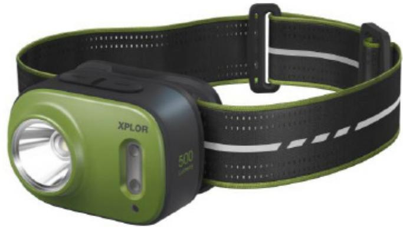

# **PRODUCT SPECIFICATIONS**

## **XPLOR Compact Headlamp (Trail Running) Model: PHR17**

Revision History

| Revision | Date       | Initiator   | Reason for Change |
|----------|------------|-------------|-------------------|
| R1       | 1 Mar 2022 | Patrick Lee | First release     |
|          |            |             |                   |
|          |            |             |                   |
|          |            |             |                   |
|          |            |             |                   |

| Prepared By      | Approved By      |
|------------------|------------------|
| Patrick Lee      | Antonio Arancio  |
| Date: 1 Mar 2022 | Date: 1 Mar 2022 |

# **Product Specification Model no.: PHR17**

#### **Basic information**

| Product Name     | : | XPLOR Compact Headlamp (Trail Running)                 |
|------------------|---|--------------------------------------------------------|
| Dimension        | : | 56 x 38 x 39mm                                         |
| Weight           | : | 59.5g                                                  |
| Housing material | : | Plastic                                                |
| Battery Type     | : | Built-in 1600 mAh Lithium Polymer rechargeable battery |
| Charging Port    | : | USB-C                                                  |
| Charging Time    | : | 140min.                                                |

#### **Per ANSI FL1 Standard**

| Spot LED chip       | : | CREE XPG3 S3 CRI70 6500K           |
|---------------------|---|------------------------------------|
| Lumen output (Spot) | : | 500lm  200lm  60lm  5lm         |
| Runtime             | : | 3h  4h  9h  100h                |
| Beam distance       | : | 85m  45m  25m  5m               |
|                     |   |                                    |
| Flood LED chip      | : | Lumileds 2835 0.5W SMD CRI90 4000K |
| Lumen output (Spot) | : | 50lm                               |
| Runtime             | : | 6h                                 |
| Beam distance       | : | 10m                                |
|                     |   |                                    |

| Night vision red LED  | : | 620nm 3535 1W SMD |
|-----------------------|---|-------------------|
| Lumen output (Spot)   | : | 10lm  5lm        |
| Runtime               | : | 6.5h  13h        |
| Beam distance         | : | 5m  4m           |
|                       |   |                   |
| Waterproof resistance | : | IPX6              |

| Impact resistance | : | 1m |
|-------------------|---|----|
|                   |   |    |

### **Product features**

Built-in 2x Lithium Polymer 800mAH rechargeable battery Built-in PCM battery protection Battery / Charge level indicator (green / red / flashing red) Low battery warning Two button electronic switch Turbo / Flood mode Night vision red LED Lockout mode SOS / Beacon mode Overheat warning- Red / Green LED flashing

#### **Applications**

Trail running, hiking, canoeing, camping and extreme outdoor adventures

#### **Accessories Included**

Washable reflective head strap 30cm USB-A to L-shaped USB-C charging cable User manual

#### **Certification**

CE, UKCA, RoHS, UN38.3, IEC62471