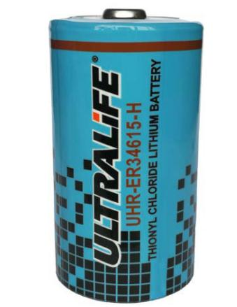
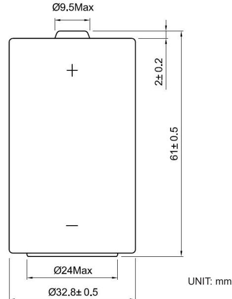
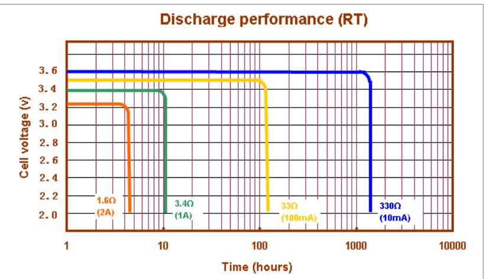
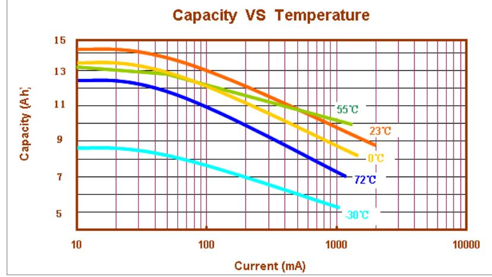

# UHR-ER34615-H: D size spiral cell (power type)

## Technical Datasheet

#### Features

- High and stable operating voltage
- Superior drain capability
- Low self-discharge rate (less than 2% after 1year of storage at 23°C)
- Hermetic glass-to-metal sealing
- Non-flammable electrolyte
- Finished product with PTC to avoid short circuit

### Applications

- Radio communication and other military applications
- Alarms and security systems
- Transmitters
- GPS
- LED lighting applications
- Others

| Technical Specifications  |                                                                                                                                                                                                                                                                                                                              |
|---------------------------|------------------------------------------------------------------------------------------------------------------------------------------------------------------------------------------------------------------------------------------------------------------------------------------------------------------------------|
| Part No                   | UHR-ER34615-H                                                                                                                                                                                                                                                                                                                |
| Cell Type                 | Primary, non-rechargeable                                                                                                                                                                                                                                                                                                    |
| Chemistry                 | Lithium Thionyl Chloride                                                                                                                                                                                                                                                                                                     |
| Voltage Range             | 2.0 to 3.7V                                                                                                                                                                                                                                                                                                                  |
| Nominal Voltage           | 3.6V                                                                                                                                                                                                                                                                                                                         |
| Nominal Capacity 1        | 14.5Ah                                                                                                                                                                                                                                                                                                                       |
| Max. Continuous Discharge | 2000mA                                                                                                                                                                                                                                                                                                                       |
| Max. Pulse Discharge      | Up to 3000mA (life, temperature and application dependent)                                                                                                                                                                                                                                                                |
| Weight                    | 107g                                                                                                                                                                                                                                                                                                                         |
| Operating Temperature 2   | -55°C to +85°C                                                                                                                                                                                                                                                                                                               |
| Storage Temperature 3     | +30°C max.                                                                                                                                                                                                                                                                                                                   |
| Exterior/Housing          | Stainless steel                                                                                                                                                                                                                                                                                                              |
| Terminals/Connector       | Radial tabs/ radial pins/axial leads/flying leads                                                                                                                                                                                                                                                                            |
| Safety                    | AL-MSDS/RD-002                                                                                                                                                                                                                                                                                                               |
| Transportation 4          | Excepted Dangerous Goods UN3091: Packed with or contained in equipment Air Shipment: Packing Instruction 969 and 970, Section I                                                                                                                                                                                     |
|                           | Class 9 Dangerous Goods UN3090: Bulk shipment Air shipment: Packing Instruction 968, Section IB                                                                                                                                                                                                                        |
| Quality Assurance         | Ultralife manufacturing facilities are ISO 9001:2008 and ISO 14001:2004 registered. Its products are listed under the Component Recognition Program of Underwriters Laboratories (UL) and have passed UN transportation testing, which is required for international transportation of all lithium batteries. |

- **Notes** 1. Discharged using 10mA to 2.0V @ +23°C.
- 2. Operation at extreme ranges (temperature or current) may lead to reduced capacity and lower voltage readings at beginning of pulses. Consult with Ultralife.
- 3. For additional conditions please consult Ultralife.
- 4. For bulk shipments by air that are no more than eight cells and one package, this cell is Excepted Dangerous Goods and can be shipped under Packing Instruction 968, Section II.

### Dimensions

### Performance Graphs

UHR-ER34615-H Newark, New York | +1 315-332-7100 | Fax: +1 315-331-7800

©2020 Ultralife Corporation • www.ultralifecorp.com • All information is subject to change without notice.

The information contained herein is for reference only and does not constitute a warranty of performance. • 05 MAY 20 UBM-0160 Rev: -