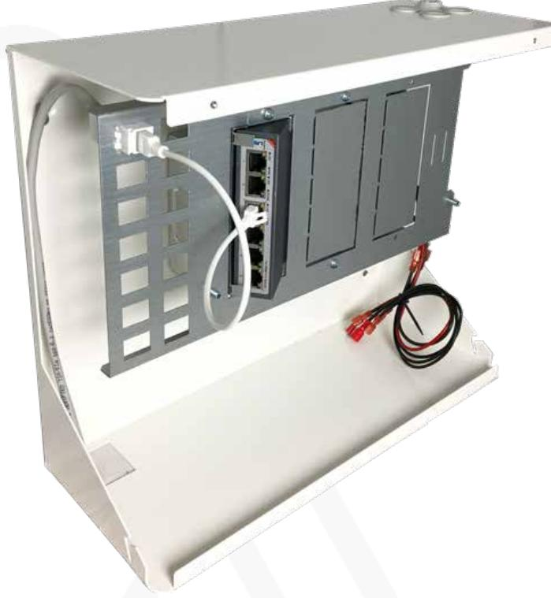
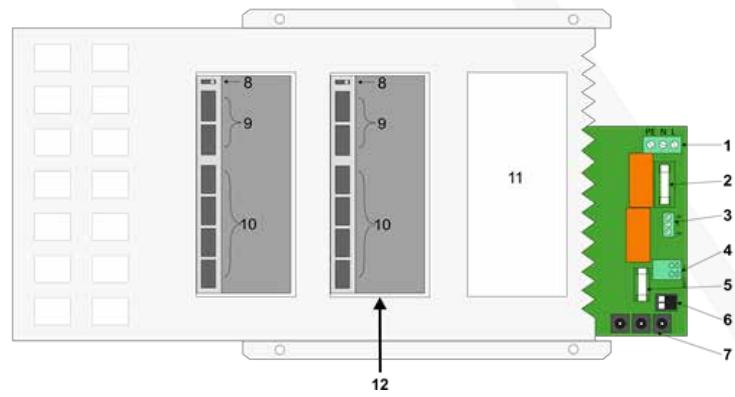
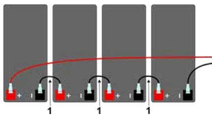

#### Manual

Updated 11/23/2020

# **AX-Power 4 Plus**

Power supply unit with PoE switch, possibility for reserve power and smart solutions for expansion and installation.

### Introduction

AX-Power 4 is a power supply unit PoE (Power over Ethernet) according to the standard IEEE 802.3at, with the possibility of uninterruptible power as the unit has room for 4 pcs. batteries (12V 7.2-9 Ah). A single Ethernet cable (CAT6 UTP) is all that is needed for the door environment. AX-Power 4 Plus has four PoE ports in the basic version, which supply door environments in Axema VAKA access control systems with up to 30W per port, as well as two standard network ports (without PoE, used as input / output).

AX-Power 4 Plus is ready for addition with two more. AX-Power Plus Switch Kit, to a total of 12 PoE ports.

AX-Power 4 Plus also has a built-in patch panel for Keystone jack, for simpler and nicer installations and for smooth connection with additional devices. AX-Power 4 Plus is protected against overload, short circuit and against deep discharge of the batteries. Mains, loads and batteries are protected by fuses.

### Security

This instruction must be read in its entirety by all operating personnel. In case of doubt about the unit's structure, function, components or safety, Axema must be contacted.

Only a qualified electrician may install and maintain this unit. Only insulated tools should be used when working with the unit. Note that dangerous voltages and currents can occur in the unit regardless of whether the internal fuses are switched on or off.

Check that the circuit boards are permanently mounted and that the unit is not damaged during transport.

If batteries are used, they are always electrochemically active. Do not short-circuit the battery terminals.

### Connections

- 1. Mains voltage, 230 VAC
- 2. Fuse 230 VAC side
- 3. Alarm output, indicates mains voltage interruption
- 4. Battery connection, note + and-
- 5. Battery fuse
- 6. 48 VDC output
- 7. Connectors with supply voltage for AX-Power Plus Switch Kit
- 8. Operating mode switch, must be in "Standard" mode.
- 9. RJ-45 ports without PoE (Ports 1-2)
- 10. RJ-45 ports with PoE (Ports 3-6)
- 11. Expansion space for AX-Power Plus Switch Kit.
- 12. The AX-Power Switch Kit is mounted in a free compartment

# Connection of 230 VAC

- 1. Install the unit with at least 100 mm of free air around the unit.
- 2. Connect the 230 VAC through any of the upper cable glands. The LED for mains voltage lights up. If not, check mains voltage and its fuse.
- 3. Before connecting the batteries to the battery connection on the main board, make sure that the batteries are connected in serial with the supplied cables.
- 4. Connect the batteries to the battery connector on the main board.

Tip: If the battery fuse triggers, check connections and connected equipment.

# Batteries connected in serial

The batteries in the power supply units are to be connected in serial to achieve the operational voltage. AX-Power 1 has two batteries, all other PoEswitches from Axema runs with four batteries.

- 1. Connection cable
- 2. Connect to battery connector of the PoE-switch (red +, black -)

# Approximate battery times

A door environment with a reading terminal with an inactive electric lock normally corresponds to a load of less than 6W.

| PoE-Portar Batteries |            |           | 30W / output. 15W / output. 6W / output. |          |
|----------------------|------------|-----------|------------------------------------------|----------|
| 4                    | 4 * 7.2 Ah | 1.5 hours | 5.3 hrs.                                 | 14 hrs.  |
| 8                    | 4 * 7.2 Ah | 50 min.   | 2.3 hrs.                                 | 6.3 hrs. |
| 12                   | 4 * 7.2 Ah | 25 min.   | 1.1 hrs.                                 | 3.1 hrs. |

# Technical data and performance

| Attribute         | AX-Power 4 Plus                     |
|-------------------|-------------------------------------|
| Power supply      | 88-265VAC +/- 15%, 1 phase 50-60 Hz |
| Built in switch   | Yes                                 |
| Built in firewall | No                                  |
| PoE-support       | Yes                                 |
| IP-rating         | IP20                                |
| IP rating         | IK06                                |
| Temperature range | -10° to +30°C                       |