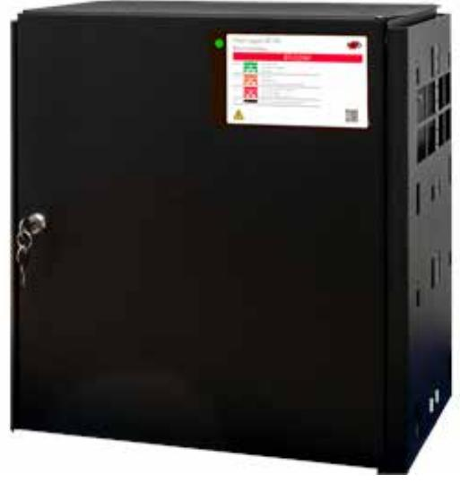

## BT-25 FLX LARGE COM

Artikelnummer: 28160158, E-nummer: 5257459

Batteribackup BT-25 FLX LARGE COM ur FLX-serien används främst i säkerhetssystem där en SSF 1014-certifierad batteribackup krävs eller när kunden vill ha de bästa funktionerna i sina säkerhetsanläggningar. Systemet är bland många andra funktioner utrustat med larm vid nätavbrott, låg batterispänning, frånkopplat batteri, cellkortslutning, åldrat batteri, utlöst lastsäkring, över/underspänning, låg systemspänning, sabotage.

- •20 avsäkrade utgångar
- •Larmklass 4 *

- •Kommunicerar via buss emot UC-50
* Produkten är testad och godkänd för SSF1014 Larmklass 4. Observera att för Larmklass 3-4 ska väggsabotage kontakt användas (tillbehör). För Larmklass 4 ska produkten monteras i ett låst och larmat utrymme.

BT-FLX-serien kan kompletteras med batterilådor. Batterilådan är ansluten via en snabbanslutningskabel. Batterilådan har plats för 2x 45Ah-batterier per låda, **ingår ej.** 

Möjliga medellaster:

- Larmklass 1/2: •
	- 3,6A utan batterilåda 7,3A med 1 batterilåda inkl. batterier 11,1A med 2 batterilådor inkl. batterier 14,8A med 3 batterilådor inkl. batterier 18,7A med 4 batterilådor inkl. batterier
- Larmklass 3/4: •

 1,4A utan batterilåda 2,9A med 1 batterilåda inkl. batterier 4,4A med 2 batterilådor inkl. batterier 5,9A med 3 batterilådor inkl. batterier 7,5A med 4 batterilådor inkl. batterier

*Undvik problem genom att läsa tillverkarens dokumentation före inkoppling!* Du hittar den t.ex. på vår hemsida under **Mediearkivet** > **Manualer** > **Aktuella manualer** > **Produkter** > **Strömförsörjning** . (Inloggning krävs.)

| Ingångar:                         | 2x10                                          |
|-----------------------------------|-----------------------------------------------|
| Utförande:                        | Svart                                         |
| Miljöklass:                       | Klass 1                                       |
| Kapslingsklassning:               | IP32                                          |
| Temperaturområde:                 | 5 - 40 °C (optimalt 5 - 20 °C)                |
| Montering:                        | Vägg eller 19" stativ                         |
| Mått (BxHxD):                     | 444x436x210mm                                 |
| Vikt:                             | 15                                            |
| Antal kabelgenomföringar:         | 4 st                                          |
| Inbygd fläkt:                     | Ja                                            |
| Matningsspänning:                 | 110V - 220VAC / 47-63Hz                       |
| Max. utgångsström:                | 25A                                           |
| Typ av försörjningsspänning:      | DC                                            |
| Första utgångsspänning (min-max): | 21-27,3                                       |
| Utgångsspänning:                  | 27,3VDC                                       |
| Batterikombination:               | 2 st. 45Ah-batterier                          |
| Batterityp:                       | 12V AGM-batteri                               |
| Testad och godkänd med:           | UPLUS 45Ah-batterier med design life på 10 år |
| SBSC Certifierad:                 | SSF 1014 Larmklass 4                          |
| Benämning producent (SBSC):       | NOVA 27 250-FLX_PRO1                          |