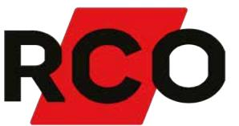

## BT-BOX FLX M/L

Artikelnummer: 28160162, E-nummer: 5257452

Används som tillval till BT-FLX M/L för att erhålla möjlighet till längre reservdrifttid alt. högre medellast i en klassad anläggning.

- •Plats för 2 st. 45Ah batterier
- •Snabbanslutningskabel
- •Larmklass 3/4

Ansluts enkelt till huvudenheten via en snabbanslutningskabel.

Batterilåda BT-Box FLX M / L kan användas tillsammans med:

- •BT-5 FLX MEDIUM COM
- •BT-5 FLX LARGE COM
- •BT-10 FLX LARGE COM
- •BT-15 FLX LARGE COM
- •BT-25 FLX LARGE COM

| Utförande:                  | Svart                          |
|-----------------------------|--------------------------------|
| Miljöklass:                 | Klass 1                        |
| Kapslingsklassning:         | IP32                           |
| Temperaturområde:           | 5 - 40°C (optimalt 15 - 20 °C) |
| Montering:                  | Under aggregaten               |
| Mått (BxHxD):               | 222x436x210 mm                 |
| Vikt:                       | 4 kg                           |
| Antal kabelgenomföringar:   | 4 st                           |
| Inbygd fläkt:               | Ja                             |
| Batterikombination:         | 2 st. 45Ah                     |
| Utgångsspänning:            | 27,3 VDC                       |
| Batterityp:                 | 12V AGM-batteri                |
| SBSC Certifierad:           | SSF 1014 Larmklass 3/4         |
| Benämning producent (SBSC): | Batterybox 24V-FLX M/L         |