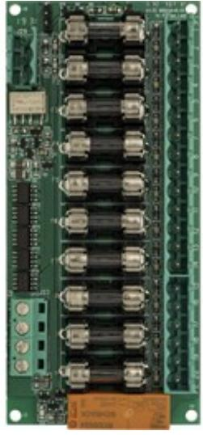

BT-FUSE-10

Artikelnummer: 28160196, E-nummer: 6310078

BT Fuse 10 är ett avsäkringskort med sju prioriterade (= alltid spänning) utgångar och tre oprioriterade utgångar.

Maxlast är 10A per lastutgång, och kortets totala last får ej överstiga 16A.

Fellarm via anslutning till huvudkortet.

| Miljöklass:        | 1            |
|--------------------|--------------|
| Temperaturområde:  | 5 °C - 40 °C |
| Mått (BxHxD):      | 30x55x120 mm |
| Vikt:              | 0,2 kg       |
| Max. utgångsström: | 16A          |
| Utgångsspänning:   | 24V          |