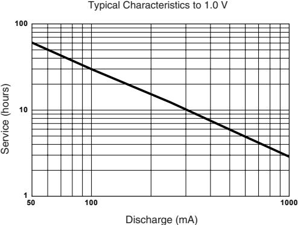
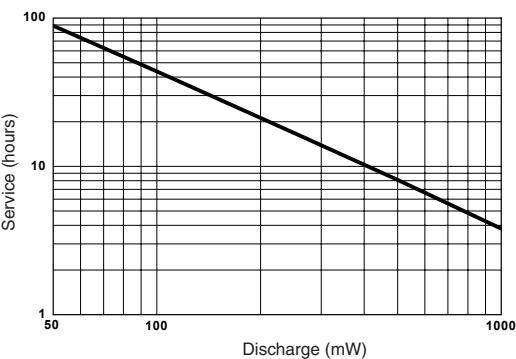
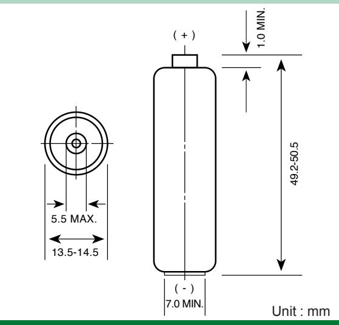
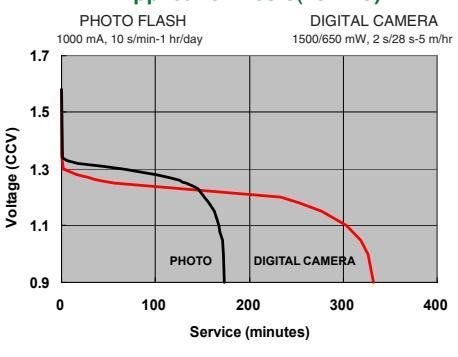
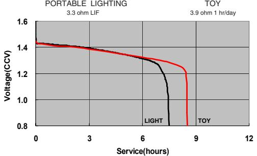
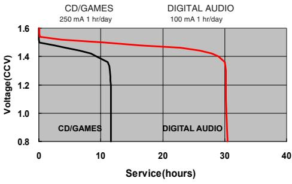

| NO MERCURY ADDED   |                                                                                                                 |  |  |  |
|--------------------|-----------------------------------------------------------------------------------------------------------------|--|--|--|
| Description        | : Mercury & Cadmium Free Lithium / Iron                                                                         |  |  |  |
|                    | Disulfide battery AA Size                                                                                       |  |  |  |
| Chemical System    | : Lithium / Iron Disulfide (Li/FeS2)                                                                            |  |  |  |
| Nominal Voltage    | : 1.5 Volts                                                                                                     |  |  |  |
| Nominal Dimensions | : Ø14.5 mm x 50.5 mm                                                                                            |  |  |  |
| Terminals          | : Protruded positive(+) and flat negative(-) contacts                                                        |  |  |  |
| Jacket             | : Foil jacket                                                                                                   |  |  |  |
| Applications       | : All electronic devices, e.g. Digital cameras, photoflash, toys, shavers, universal handheld GPS devices |  |  |  |
| Shelf life         | : 10 years at 21°C (80% rated capacity)                                                                         |  |  |  |
| Average Weight     | : 14.5g                                                                                                         |  |  |  |

# **Cross References:**

| GP   | JIS | IEC | Energizer | Duracell |
|------|-----|-----|-----------|----------|
| 15LF | FR6 | FR6 | L91       | LF1500   |

**Constant Current Performance (21°C)** 

### **Constant Power Performance (21°C)**  Typical Characteristics to 1.0 V

The information (subject to change without prior notice) contained in this document is for reference only and should not be used as a basis for product guarantee or warranty. For applications other than those described here, please consult your nearest GP Sales and Marketing Office or Distributors.

Manufacturer reserves the right to alter or amend the design, model and specification without prior notice.

# **Model No.:GP15LF**

**Application Tests(23±2°C)**

## **Application Tests(23±2°C)**

05120I12037