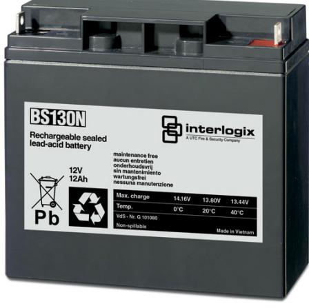

## Produktblad

# BS131N

Underhållsfri ackumulator 12 V, 18 Ah

### BS131N

Underhållsfri blyackumulator lämplig för kontinuerlig underhållsladdning, exempelvis inbrottslarms- och brandlarmscentraler.

#### Standardprestanda

- EUnderhållsfritt
- E Lång livslängd
- ETemperaturokänslig
- EUppladdningsbart
- ELäckagefri konstruktion

# BS131N

Underhållsfri ackumulator 12 V, 18 Ah

### Tekniska data

| Strömförsörjning      | 12 VDC            |
|-----------------------|-------------------|
| Kapacitet             | 18 Ah             |
| Max laddning vid +20° | 13,8 VDC          |
| Max laddningsström    | 5,4 A             |
| Max urladdning        | 90 A              |
| Resistans             | 10 mohm           |
| Temperatur            |                   |
| Laddning              | 0 till 40°C       |
| Drift                 | -15 till +50 °C   |
| Lagring               | -15 till +40 °C   |
| Anslutningar          | MS skruv & mutter |
| Materiel              | ABS               |
| Vikt                  | 6,3 kg            |
| Dimension (BxHxD)     | 181x76x167 mm     |

Order data

| Artikelnummer | Beskrivning                           |
|---------------|---------------------------------------|
| BS131N        | Underhållsfri ackumulator 12 V, 18 Ah |

