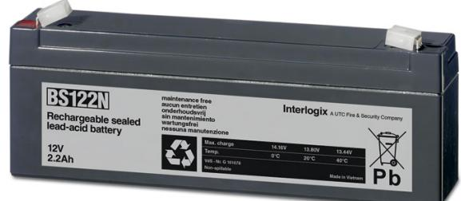

## Produktblad

# BS122N

Underhållsfri ackumulator 12 V, 2,2 Ah

### BS122N

Underhållsfri blyackumulator lämplig för kontinuerlig underhållsladdning, exempelvis inbrottslarms- och brandlarmscentraler.

#### Standardprestanda

- EUnderhållsfritt
- E Lång livslängd

- ETemperaturokänslig
- EUppladdningsbart
- ELäckagefri konstruktion

# BS122N

Underhållsfri ackumulator 12 V, 2,2 Ah

### Tekniska data

| Strömförsörjning      | 12 VDC          |
|-----------------------|-----------------|
| Kapacitet             | 2,2 Ah          |
| Max laddning vid +20° | 13,8 VDC        |
| Max laddningsström    | 0,69 A          |
| Max urladdning        | 11,5 A          |
| Resistans             | 42 mohm         |
| Temperatur            |                 |
| Laddning              | 0 till 40 °C    |
| Drift                 | -15 till +50 °C |
| Lagring               | -15 till +50 °C |
| Anslutningar          | Kabelsko 4,8 mm |
| Materiel              | ABS             |
| Vikt                  | 1,061 kg        |
| Dimension (BxHxD)     | 178x34x60 mm    |

Order data

Artikelnummer Beskrivning BS122N Underhållsfri ackumulator 12 V, 2,2 Ah