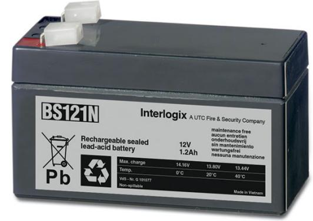

## Produktblad

# BS121N

Underhållsfri ackumulator 1,2 Ah

### BS121N

Underhållsfri blyackumulator lämplig för kontinuerlig underhållsladdning, exempelvis inbrottslarms- och brandlarmscentraler

#### Standardprestanda

- EUnderhållsfritt
- E Lång livslängd

- ETemperaturokänslig
- EUppladdningsbart
- ELäckagefri konstruktion

# BS121N

Underhållsfri ackumulator 1,2 Ah

### Tekniska data

| Strömförsörjning      | 12 VDC          |
|-----------------------|-----------------|
| Kapacitet             | 1,2 Ah          |
| Max laddning vid +20° | 13,8 VDC        |
| Max laddningsström    | 0,36 A          |
| Max urladdning        | 6 A             |
| Resistans             | 75 mohm         |
| Temperatur            |                 |
| Laddning              | 0 till 40°C     |
| Drift                 | -15 till +50 °C |
| Lagring               | -15 till +50 °C |
| Anslutningar          | Kabelsko 4,8 mm |
| Materiel              | ABS             |
| Vikt                  | 0,596 kg        |
| Dimension (BxHxD)     | 97x43x53 mm     |

Order data

Artikelnummer Beskrivning BS121N Underhållsfri ackumulator 1,2 Ah