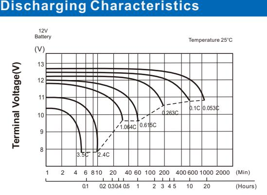

# UPBH90FT (12V90Ah)

## **UPBH SERIES**  *LONG STANDBY LIFE*

| Specification                       |                                                                                                                                                                                                                                              |                                                     |  |  |  |  |
|-------------------------------------|----------------------------------------------------------------------------------------------------------------------------------------------------------------------------------------------------------------------------------------------|-----------------------------------------------------|--|--|--|--|
| Nominal Voltage                     | 12V                                                                                                                                                                                                                                          |                                                     |  |  |  |  |
|                                     | 90Ah                                                                                                                                                                                                                                         | o (C , 10 1.80V/cel 25 l, C)            |  |  |  |  |
| Rated Capacity (Ah)                 | 90Ah                                                                                                                                                                                                                                         | o (C , 8 1.75V/cel 25 l, C)             |  |  |  |  |
|                                     | Length                                                                                                                                                                                                                                       | 405.4±2mm (15.96 inches)                            |  |  |  |  |
|                                     | Width                                                                                                                                                                                                                                        | 108±2mm ( 4.25 inches)                              |  |  |  |  |
| Dimension                           | Height                                                                                                                                                                                                                                       | 287±2mm (11.29 inches)                              |  |  |  |  |
|                                     | Total Height (with Terminal)                                                                                                                                                                                                                 | 287±2mm (11.29 inches)                              |  |  |  |  |
| Weight                              | 28.7Kg (63.27 Ibs)                                                                                                                                                                                                                           |                                                     |  |  |  |  |
| Terminal                            | Threaded M8 (T11) insert with M6 front terminal adaptor                                                                                                                                                                                   |                                                     |  |  |  |  |
| Container Material                  | PC-ABS flame retardant jar and cover to UL94V-0                                                                                                                                                                                              |                                                     |  |  |  |  |
| Max. Discharge Current              | 1080A (5s)                                                                                                                                                                                                                                   |                                                     |  |  |  |  |
| Internal Resistance                 | Approx 4.6mΩ(Fully charged)                                                                                                                                                                                                                  |                                                     |  |  |  |  |
| Operating Temp.Range                | o o Discharge : -40 C~65 C (-40 F~149 F) o o Charge : 0 C~40 C (32 F~104 F) o o o Storage : -20 C~40 C(-4 F~104 F)                                                                                       | o o o o o                               |  |  |  |  |
|                                     | o o 40 C (104 F)                                                                                                                                                                                                                    | 103%                                                |  |  |  |  |
| Capacity affected by Temperature | o o 25 C ( 77 F )                                                                                                                                                                                                                   | 100%                                                |  |  |  |  |
|                                     | o o 0 C ( 32 F )                                                                                                                                                                                                                    | 86%                                                 |  |  |  |  |
| Storage                             | at 25°C(77°F), For higher temperatures the time interval will be shorter. Battery needs to be given a freshening charge when the OCV approach 2.10V/cell or when the maximum storage time is reached, whichever occurs first. | UPBH series batteries can be stored up to 24 months |  |  |  |  |

162±0.5

| 0 0 Constant Current Discharge (Amperes) at 25 C (77 F ) |       |       |       |       |       |      |      |      |      |      |      |      |      |
|----------------------------------------------------------------|-------|-------|-------|-------|-------|------|------|------|------|------|------|------|------|
| F.V/Time                                                       | 10min | 15min | 20min | 30min | 45min | 1h   | 2h   | 3h   | 4h   | 5h   | 8h   | 10h  | 20h  |
| 1.85V/cell                                                     | 174.2 | 145.4 | 124.6 | 99.2  | 74.3  | 54.7 | 35.3 | 25.1 | 20.1 | 16.2 | 10.7 | 8.92 | 4.61 |
| 1.80V/cell                                                     | 195.8 | 162.6 | 134.8 | 104.0 | 78.6  | 57.0 | 36.6 | 26.1 | 20.3 | 16.4 | 11.0 | 9.00 | 4.72 |
| 1.75V/cell                                                     | 213.0 | 171.4 | 144.2 | 110.8 | 82.2  | 59.1 | 37.7 | 26.8 | 20.9 | 16.6 | 11.3 | 9.18 | 4.77 |
| 1.70V/cell                                                     | 227.4 | 181.3 | 151.8 | 115.2 | 85.1  | 60.6 | 38.4 | 27.2 | 21.2 | 16.7 | 11.3 | 9.36 | 4.84 |
| 1.67V/cell                                                     | 242.4 | 188.6 | 155.6 | 119.3 | 86.4  | 62.3 | 38.9 | 27.8 | 21.3 | 17.2 | 11.5 | 9.72 | 4.88 |
| 1.60V/cell                                                     | 256.0 | 197.4 | 161.6 | 120.4 | 88.1  | 63.4 | 39.2 | 28.1 | 21.5 | 17.5 | 11.7 | 9.90 | 4.96 |

| 0 0 Constant Power Discharge (Watts/cell) at 25 C (77 F ) |       |       |       |       |       |       |      |      |      |      |      |      |      |
|-----------------------------------------------------------------|-------|-------|-------|-------|-------|-------|------|------|------|------|------|------|------|
| F.V/Time                                                        | 10min | 15min | 20min | 30min | 45min | 1h    | 2h   | 3h   | 4h   | 5h   | 8h   | 10h  | 20h  |
| 1.85V/cell                                                      | 330.8 | 274.2 | 238.7 | 195.4 | 144.5 | 108.8 | 68.2 | 48.5 | 40.9 | 33.6 | 22.2 | 18.0 | 9.40 |
| 1.80V/cell                                                      | 367.4 | 303.3 | 254.4 | 204.9 | 150.2 | 113.0 | 71.0 | 51.6 | 42.3 | 34.6 | 22.7 | 18.3 | 9.61 |
| 1.75V/cell                                                      | 394.1 | 316.7 | 263.8 | 209.2 | 152.7 | 114.6 | 72.7 | 52.7 | 43.1 | 34.9 | 23.3 | 18.4 | 9.70 |
| 1.70V/cell                                                      | 419.8 | 330.8 | 274.2 | 215.3 | 155.6 | 115.9 | 73.7 | 53.3 | 43.6 | 35.4 | 23.5 | 18.5 | 9.78 |
| 1.67V/cell                                                      | 432.3 | 346.2 | 284.4 | 218.8 | 160.0 | 120.8 | 75.3 | 54.8 | 44.4 | 35.8 | 23.9 | 19.2 | 9.85 |
| 1.60V/cell                                                      | 453.7 | 354.3 | 291.7 | 223.4 | 163.2 | 122.4 | 76.9 | 55.4 | 45.0 | 36.3 | 24.1 | 19.3 | 9.94 |

Specifications subject to change without notice.

Unit: mm

12

3

## **Features & Benefits**

- 20 years design life( ) 25o C
- Low internal resistance
- Fast Charging Acceptance
- Premium ABS+ jar & covers
- IATA Approved for Air Freight
- Heat sealed plastic container
- UL Recognized, IEC Certified
- Automated COS & TTP welding
- M6 & M8 Terminal adapter options
- Flame Retardant to UL94V-0
- Long Shelf Life up to 2 years @25°C(77°F)
- High-rate performance, high energy density
- Virgin pure lead plates / copper alloy terminal inserts
- Excellent high rate discharge capability for emergency backup power supply.
- High quality AGM separators minimize electrical resistance to allow high current discharging properties.
- Outstanding high rate charge capability with Thin Plate Pure Lead technology

**Discharging Time**

## **Effect of Temperature on Discharging Time**

#### **Charging Characteristics**

#### **Charging Time(hours)**

#### **Float Life**

