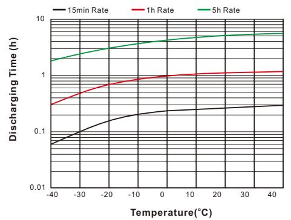
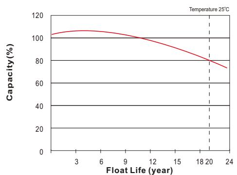

# UPBH40FT (12V40Ah)

# **UPBH SERIES**  *LONG STANDBY LIFE*

| Specification          |                                                                                                                                                                                                                                                        |                                                     |  |  |  |  |  |
|------------------------|--------------------------------------------------------------------------------------------------------------------------------------------------------------------------------------------------------------------------------------------------------|-----------------------------------------------------|--|--|--|--|--|
| Nominal Voltage        | 12V                                                                                                                                                                                                                                                    |                                                     |  |  |  |  |  |
|                        | 38Ah                                                                                                                                                                                                                                                   | o (C , 10 1.80V/cel 25 l, C)            |  |  |  |  |  |
| Rated Capacity (Ah)    | 38Ah                                                                                                                                                                                                                                                   | o (C , 8 1.75V/cel 25 l, C)             |  |  |  |  |  |
|                        | Length                                                                                                                                                                                                                                                 | 298.7±2mm (11.76 inches)                            |  |  |  |  |  |
|                        | Width                                                                                                                                                                                                                                                  | 97±2mm ( 3.82 inches)                               |  |  |  |  |  |
| Dimension              | Height                                                                                                                                                                                                                                                 | 184±2mm (7.24 inches)                               |  |  |  |  |  |
|                        | Total Height (with Terminal)                                                                                                                                                                                                                           | 184±2mm (7.24 inches)                               |  |  |  |  |  |
| Weight                 | 12.5Kg (27.5 Ibs)                                                                                                                                                                                                                                      |                                                     |  |  |  |  |  |
| Terminal               | Threaded M8 (T11) insert with M6 front terminal adaptor                                                                                                                                                                                             |                                                     |  |  |  |  |  |
| Container Material     | PC-ABS flame retardant jar and cover to UL94V-0                                                                                                                                                                                                        |                                                     |  |  |  |  |  |
| Max. Discharge Current | 456A (5s)                                                                                                                                                                                                                                              |                                                     |  |  |  |  |  |
| Internal Resistance    | Approx 4.9mΩ(Fully charged)                                                                                                                                                                                                                            |                                                     |  |  |  |  |  |
|                        | o o o o Discharge : -40 C~65 C (-40 F~149 F)                                                                                                                                                                                               |                                                     |  |  |  |  |  |
| Operating Temp.Range   | o o o o Charge : 0 C~40 C (32 F~104 F) o o o o Storage : -20 C~40 C(-4 F~104 F)                                                                                                                                    |                                                     |  |  |  |  |  |
| Capacity affected by   | o o 40 C (104 F)                                                                                                                                                                                                                              | 103%                                                |  |  |  |  |  |
| Temperature            | o o 25 C ( 77 F )                                                                                                                                                                                                                             | 100%                                                |  |  |  |  |  |
|                        | o o 0 C ( 32 F )                                                                                                                                                                                                                              | 86%                                                 |  |  |  |  |  |
| Storage                | o o at 25 C(77 F), For higher temperatures the time interval will be shorter. Battery needs to be given a freshening charge when the OCV approach 2.10V/cell or when the maximum storage time is reached, whichever occurs first. | UPBH series batteries can be stored up to 24 months |  |  |  |  |  |

Unit: mm

| 0 0 Constant Current Discharge (Amperes) at 25 C (77 F ) |       |       |       |       |       |      |      |      |      |      |      |      |      |
|----------------------------------------------------------------|-------|-------|-------|-------|-------|------|------|------|------|------|------|------|------|
| F.V/Time                                                       | 10min | 15min | 20min | 30min | 45min | 1h   | 2h   | 3h   | 4h   | 5h   | 8h   | 10h  | 20h  |
| 1.85V/cell                                                     | 77.7  | 64.2  | 55.1  | 42.7  | 31.7  | 24.7 | 15.9 | 11.1 | 8.70 | 6.63 | 4.57 | 3.72 | 2.08 |
| 1.80V/cell                                                     | 86.7  | 70.5  | 59.0  | 44.8  | 32.9  | 25.6 | 16.1 | 11.2 | 8.76 | 6.80 | 4.66 | 3.80 | 2.12 |
| 1.75V/cell                                                     | 91.9  | 73.7  | 61.6  | 46.2  | 33.8  | 26.3 | 16.2 | 11.3 | 8.79 | 6.96 | 4.75 | 3.86 | 2.15 |
| 1.70V/cell                                                     | 96.7  | 76.8  | 63.5  | 47.5  | 34.5  | 26.8 | 16.4 | 11.4 | 8.83 | 7.09 | 4.80 | 3.86 | 2.17 |
| 1.67V/cell                                                     | 104.9 | 81.6  | 66.5  | 48.8  | 35.1  | 27.2 | 16.5 | 11.5 | 8.85 | 7.20 | 4.86 | 3.94 | 2.18 |
| 1.60V/cell                                                     | 110.6 | 85.1  | 69.0  | 50.2  | 35.7  | 27.7 | 16.6 | 11.6 | 8.89 | 7.31 | 4.93 | 3.97 | 2.26 |

| 0 0 Constant Power Discharge (Watts/cell) at 25 C (77 F ) |       |       |       |       |       |      |      |      |      |      |      |      |      |
|-----------------------------------------------------------------|-------|-------|-------|-------|-------|------|------|------|------|------|------|------|------|
| F.V/Time                                                        | 10min | 15min | 20min | 30min | 45min | 1h   | 2h   | 3h   | 4h   | 5h   | 8h   | 10h  | 20h  |
| 1.85V/cell                                                      | 147.3 | 122.7 | 106.0 | 83.2  | 62.7  | 48.9 | 31.6 | 22.4 | 17.4 | 13.4 | 9.70 | 8.00 | 4.20 |
| 1.80V/cell                                                      | 161.7 | 133.0 | 112.5 | 86.6  | 64.6  | 50.5 | 31.9 | 22.5 | 17.5 | 13.7 | 9.90 | 8.10 | 4.30 |
| 1.75V/cell                                                      | 169.8 | 137.8 | 116.3 | 88.6  | 65.9  | 51.5 | 32.1 | 22.6 | 17.5 | 13.9 | 10.1 | 8.20 | 4.40 |
| 1.70V/cell                                                      | 176.1 | 141.9 | 118.7 | 90.5  | 66.9  | 52.2 | 32.4 | 22.7 | 17.6 | 14.2 | 10.1 | 8.30 | 4.40 |
| 1.67V/cell                                                      | 189.0 | 149.3 | 123.4 | 92.4  | 67.7  | 52.8 | 32.5 | 22.8 | 17.7 | 14.3 | 10.3 | 8.30 | 4.40 |
| 1.60V/cell                                                      | 194.0 | 152.4 | 125.9 | 93.8  | 68.2  | 53.3 | 32.8 | 23.0 | 17.7 | 14.5 | 10.4 | 8.50 | 4.50 |

Specifications subject to change without notice.

# **Features & Benefits**

- 20 years design life( ) 25o C
- Low internal resistance
- Fast Charging Acceptance
- Premium ABS+ jar & covers
- IATA Approved for Air Freight
- Heat sealed plastic container
- UL Recognized, IEC Certified
- Automated COS & TTP welding
- M6 & M8 Terminal adapter options
- Flame Retardant to UL94V-0
- Long Shelf Life up to 2 years @25°C(77°F)
- High-rate performance, high energy density
- Virgin pure lead plates / copper alloy terminal inserts
- Excellent high rate discharge capability for emergency backup power supply.
- High quality AGM separators minimize electrical resistance to allow high current discharging properties.
- Outstanding high rate charge capability with Thin Plate Pure Lead technology

### **Discharging Time**

# **Effect of Temperature on Discharging Time**

# **Charging Characteristics**

## **Charging Time(hours)**

## **Float Life**

