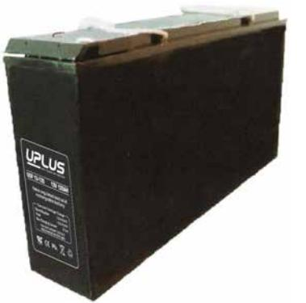
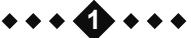
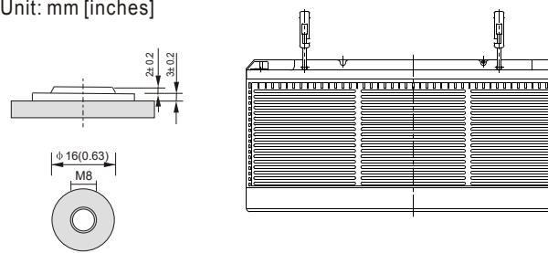
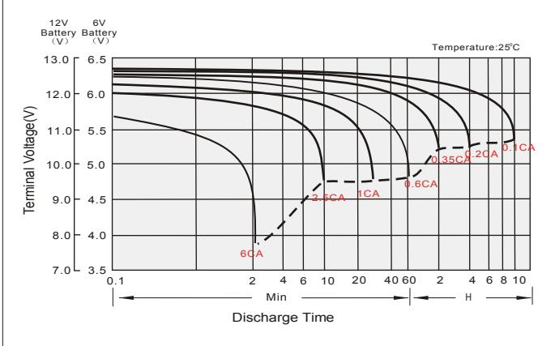
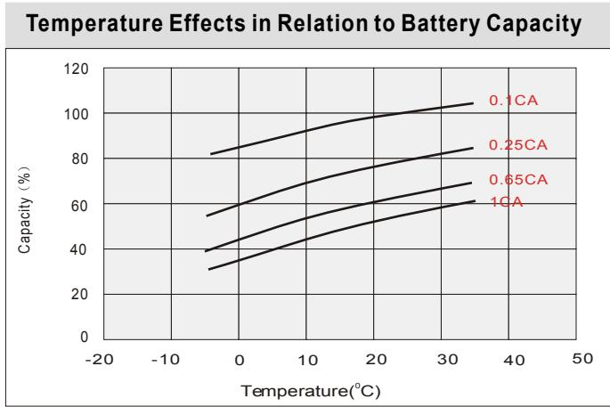
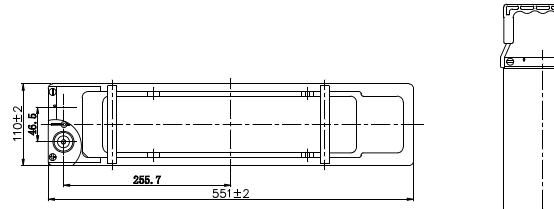
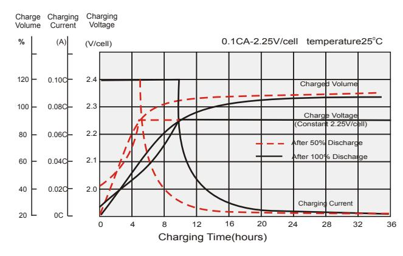
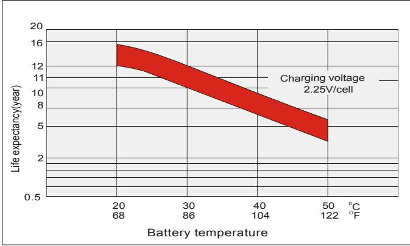
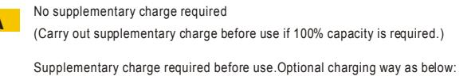

# USF12-125 (12V AH) **USF SERIES** 125

#### **General Features**

- Sealed and maintenance free operation.
- Non-Spillable construction design.
- ABS containers and covers(UL94HB, UL94V-0) optional.
- Safety valve installation for explosion proof.
- High quality and high reliability.
- Exceptional deep discharge recovery performance.
- Low self discharge characteristic.
- Flexibility design for multiple install positions.

| Battery Type         | Valve-Regulated,Absorbed Glass Mat(AGM) Technology   |                                        |                       |                                                           |                             |                      |  |  |  |  |
|----------------------|------------------------------------------------------|----------------------------------------|-----------------------|-----------------------------------------------------------|-----------------------------|----------------------|--|--|--|--|
| Nomial Voltage       | 12V                                                  |                                        |                       |                                                           |                             |                      |  |  |  |  |
| 0                    | 20HR(6.78A,1.8V/cell)                                |                                        | 10HR(13.0A,1.8V/cell) | 5HR(23.6A,1.75V/cell)                                     |                             | 1HR(88.8A,1.6V/cell) |  |  |  |  |
| Capacity( 25 C)      | 137.4AH                                              | 130.0AH                                |                       | 118.0AH                                                   |                             | 88.8AH               |  |  |  |  |
|                      | Length                                               |                                        | Width                 | Height                                                    |                             | Total Height         |  |  |  |  |
| Dimensions           | 551mm(21.69inches)                                   | 110mm(4.33inches) 287mm(11.3inches) |                       |                                                           |                             | 287mm(11.3inches)    |  |  |  |  |
| Approx Weight        | Approx 41.5 Kg (91.5lbs)                             |                                        |                       |                                                           |                             |                      |  |  |  |  |
| Internal Resistance  | 0 Full Charged at 25 C : Approx 3.2m              |                                        |                       |                                                           |                             |                      |  |  |  |  |
| Self Discharge       | 0 3% of capacity declined per month at 25 C       |                                        |                       |                                                           |                             |                      |  |  |  |  |
| Capacity affected by | 0 40 C                                            |                                        | 0 25 C             | 0 0 C                                                     |                             | 0 -15 C           |  |  |  |  |
| Temperature(10HR)    | 103%                                                 |                                        | 100%                  | 86%                                                       |                             | 65%                  |  |  |  |  |
|                      |                                                      | Cycle use                              |                       | Float use                                                 |                             |                      |  |  |  |  |
| Charging Voltage (V) | 0 14.4V~15.0V at 25 C. Temp. Coefficient -30mV/ C |                                        | 0                     | 0 0 13.5V~13.8V at 25 C. Temp. Coefficient -20mV/ C |                             |                      |  |  |  |  |
|                      | Max. Discharge Current(5s)                           |                                        |                       | Initial Charging Current                                  |                             |                      |  |  |  |  |
| Current              |                                                      | 1100A                                  |                       | Less than 37.5A                                           |                             |                      |  |  |  |  |
|                      | Discharge                                            |                                        | Charging              |                                                           | Storage                     |                      |  |  |  |  |
| Operating Temp.Range | 0 0 -15~50 C(5~122 F)                          |                                        | 0 0~40 C(32~104 F) | 0                                                         | 0 0 -15~40 C(5~104 F) |                      |  |  |  |  |

#### **0 0 Constant Current Discharge (Amperes) at 25 C** 77 **F )(**

| F.V/Time   | 10min | 15min | 20min | 30min | 45min | 1h   | 2h   | 3h   | 4h   | 5h   | 6h   | 8h   | 10h  | 20h  |
|------------|-------|-------|-------|-------|-------|------|------|------|------|------|------|------|------|------|
| 1.85V/cell | 217.4 | 181.2 | 155.5 | 122.0 | 94.6  | 76.9 | 45.9 | 33.0 | 26.5 | 21.9 | 19.1 | 14.9 | 12.4 | 6.57 |
| 1.80V/cell | 246.5 | 202.0 | 172.1 | 133.5 | 101.8 | 82.1 | 48.4 | 35.1 | 27.9 | 23.1 | 20.1 | 15.6 | 13.0 | 6.87 |
| 1.75V/cell | 270.5 | 218.6 | 183.7 | 140.3 | 105.7 | 85.0 | 49.3 | 35.7 | 28.6 | 23.6 | 20.4 | 15.8 | 13.1 | 6.98 |
| 1.70V/cell | 289.3 | 230.2 | 191.1 | 144.4 | 108.1 | 86.1 | 50.0 | 36.1 | 28.8 | 23.8 | 20.6 | 16.0 | 13.3 | 7.03 |
| 1.67V/cell | 299.4 | 236.0 | 195.0 | 146.2 | 108.5 | 86.5 | 50.1 | 36.3 | 29.0 | 24.0 | 20.9 | 16.3 | 13.4 | 7.06 |
| 1.60V/cell | 314.7 | 245.0 | 203.8 | 149.9 | 111.4 | 88.8 | 51.0 | 37.0 | 29.6 | 24.6 | 21.3 | 16.6 | 13.6 | 7.10 |

#### **0 0 Constant Power Discharge (Watts) at 25 C** (77 **F )**

| F.V/Time   | 10min | 15min | 20min | 30min | 45min | 1h    | 2h   | 3h   | 4h   | 5h   | 6h   | 8h   | 10h  | 20h  |
|------------|-------|-------|-------|-------|-------|-------|------|------|------|------|------|------|------|------|
| 1.85V/cell | 405.9 | 341.8 | 296.3 | 234.9 | 183.7 | 149.9 | 90.0 | 65.0 | 52.4 | 43.5 | 37.9 | 29.7 | 24.8 | 13.2 |
| 1.80V/cell | 454.8 | 375.8 | 323.1 | 253.2 | 196.1 | 159.1 | 94.3 | 68.8 | 54.8 | 45.5 | 39.7 | 31.1 | 25.9 | 13.7 |
| 1.75V/cell | 491.2 | 401.8 | 341.6 | 263.9 | 201.7 | 164.0 | 95.7 | 69.6 | 56.0 | 46.4 | 40.2 | 31.4 | 26.2 | 13.9 |
| 1.70V/cell | 513.7 | 417.4 | 352.7 | 270.1 | 203.6 | 165.7 | 96.9 | 70.2 | 56.3 | 46.5 | 40.6 | 31.8 | 26.4 | 14.0 |
| 1.67V/cell | 529.5 | 426.0 | 358.5 | 273.0 | 205.6 | 166.0 | 97.0 | 70.4 | 56.6 | 47.0 | 41.0 | 32.2 | 26.6 | 14.1 |
| 1.60V/cell | 541.3 | 433.6 | 369.3 | 276.2 | 208.8 | 168.6 | 97.8 | 71.4 | 57.5 | 48.0 | 41.6 | 32.8 | 27.1 | 14.1 |

### **Dimensions**

## **Terminal**

**Discharge characteristics Cycle use charging characteristics** 

**Effect of Temperature on Long Term Float Life**

#### **Self Discharge Characteristics**

1.Charged for above 3 days at limted current 0.25CA and constant volatge 2.25V/cell. 2.Charged for above 20hours at limted current 0.25CA and constant volatge 2.45V/cell. 3.Charged for 8~10hours at limted current 0.05CA .

Supplementary charge may often fail to recover the capacity. The battery should never be left standing till this is reached.

**A B C** Storage Time(Months) Remaining Capacity(%) 8 10 12 0 4 6 60 80 100 0 2 20 40 0 25 C 0 40 C0 30 C 0 10 C **A B C**

**2**