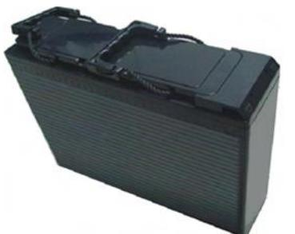
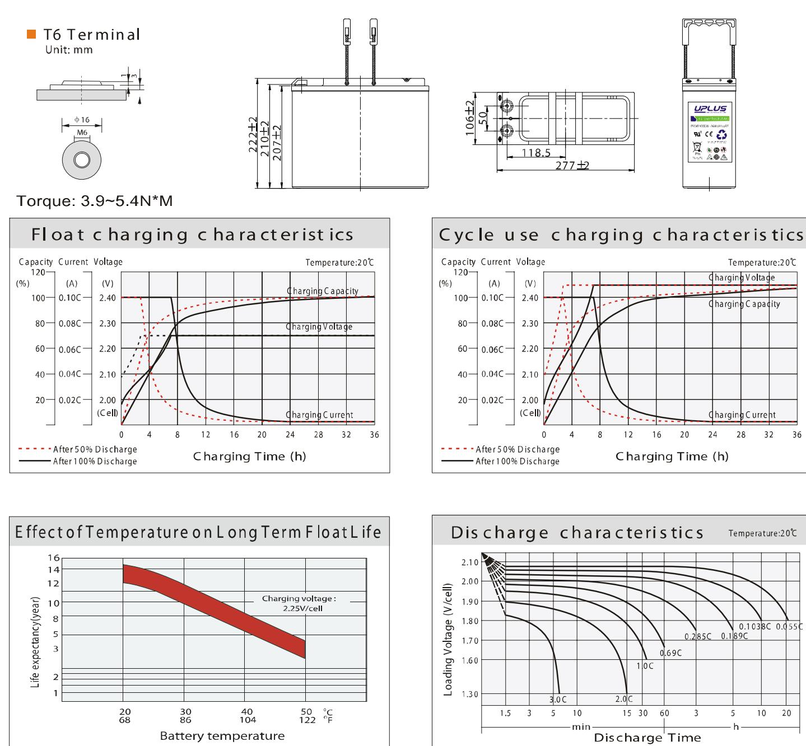
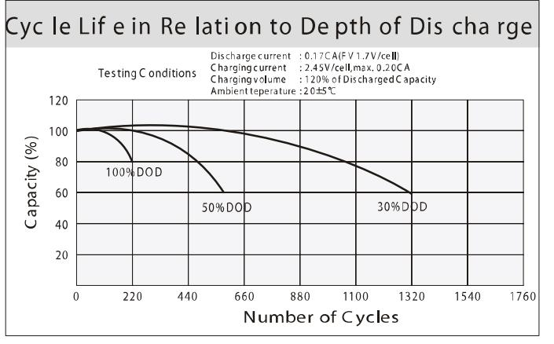
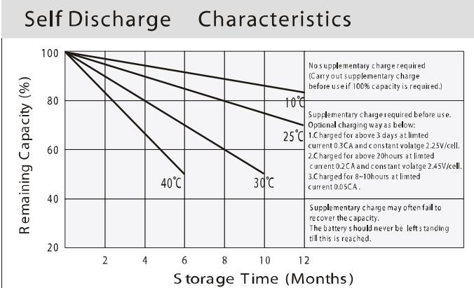

## US SERIES-Front Termin: US12-55FT (12V55AH

## General Features

- ◆ Sealed and maintenance free operation.
- ◆ Non-Spillable construction design.
- ◆ ABS containers and covers(UL94HB, UL94V-0) optional.
- ◆ Safety valve installation for explosion proof.
- ◆ High quality and high reliability.
- ♦ Exceptional deep discharge recovery performance.
- � Low self discharge characteristic.
- ♦ Flexibility design for multiple install positions.

| Battery Type          | Valve-Regulated,Absorbed Glass Mat(AGM) Technology |      |                   |                                                    |                        |                   |  |  |  |  |
|-----------------------|----------------------------------------------------------|------|-------------------|----------------------------------------------------|------------------------|-------------------|--|--|--|--|
| Nomial Voltage        | 12V                                                      |      |                   |                                                    |                        |                   |  |  |  |  |
|                       | 20HR(2.93A,1.8V/cell)                                    |      | 10HR(5.54A,1.80V) | 5HR(9.98A,1.75V)                                   |                        | 1HR(36.2A,1.67V)  |  |  |  |  |
| Capacity( 20 °C)      | 58.6AH 55.4AH                                         |      |                   | 49.9AH                                             |                        | 36.2AH            |  |  |  |  |
|                       | Length                                                   |      | Width             | Height                                             |                        | Total Height      |  |  |  |  |
| Dimensions            | 277mm(10.91inches)                                       |      | 106mm(4.17inches) | 222mm(8.74inches)                                  |                        | 222mm(8.74inches) |  |  |  |  |
| Approx Weight         | Approx 18.0 kg (39.7lbs)                                 |      |                   |                                                    |                        |                   |  |  |  |  |
| Internal Resistance   | Full Charged at 20℃ : Approx 6.0m   Ü                    |      |                   |                                                    |                        |                   |  |  |  |  |
| Self Discharge        | 3% of capacity declined per month at 20°C                |      |                   |                                                    |                        |                   |  |  |  |  |
| Capacity affected by  | 40°C                                                     |      | 25°C              |                                                    |                        | -15°C             |  |  |  |  |
| Temperature (10HR)    | 103%                                                     | 100% |                   | 86%                                                |                        | 65%               |  |  |  |  |
|                       | Cycle use                                                |      |                   | Float use                                          |                        |                   |  |  |  |  |
| Charging Voltage (V)  | 14.4V~15.0V at 20 °C.T emp. Coefficient -30mV/ °C        |      |                   | 13.5V~13.8V at 20 °C.Temp. Coefficient (-20mV/ °C) |                        |                   |  |  |  |  |
| Current               | Max. Discharge Current                                   |      |                   | Initial Charging Current                           |                        |                   |  |  |  |  |
|                       | 550A                                                     |      |                   | Less than 15.0A                                    |                        |                   |  |  |  |  |
|                       | Discharge                                                |      |                   | Charging                                           | Storage                |                   |  |  |  |  |
| Operating T emp.Range | -15~50°C (5 ~122°F)                                      |      |                   | 0~40°C (32 ~ 104°F)                                | -15 ~40°C (5 ~ 104 °F) |                   |  |  |  |  |

| (Co ns tant C urrent Dis ch arge (A mperes) a t 20 ℃ 68°F ) |        |        |        |        |        |      |      |      |      |      |      |      |      |      |
|-------------------------------------------------------------|--------|--------|--------|--------|--------|------|------|------|------|------|------|------|------|------|
| F.V/Tim e                                                   | 10 min | 15 min | 20 min | 30 min | 45 min | 1 h  | 2h   | 3h   | 4h   | 5h   | 6h   | 8h   | 10h  | 20h  |
| 1.8 5V /cell                                                | 90.9   | 75.8   | 65.0   | 51.0   | 39.5   | 32.1 | 19.4 | 13.9 | 11.2 | 9.27 | 8.15 | 6.35 | 5.29 | 2.81 |
| 1.8 0V /cell                                                | 103.0  | 84.4   | 72.0   | 55.8   | 42.5   | 34.3 | 20.4 | 14.8 | 11.8 | 9.75 | 8.56 | 6.67 | 5.54 | 2.93 |
| 1.7 5V /cell                                                | 113.1  | 91.4   | 76.8   | 58.6   | 44.2   | 35.5 | 20.8 | 15.1 | 12.1 | 9.98 | 8.70 | 6.75 | 5.60 | 2.98 |
| ' 1.7 0V /cell                                              | 120.9  | 96.2   | 79.9   | 60.3   | 45.2   | 36.0 | 21.1 | 15.2 | 12.2 | 10.0 | 8.80 | 6.84 | 5.66 | 3.00 |
| 1.6 7V /cell                                                | 125.1  | 98.6   | 81.5   | 61.1   | 45.3   | 36.2 | 21.2 | 15.3 | 12.2 | 10.1 | 8.91 | 6.94 | 5.71 | 3.01 |
| 1.6 0V /cell                                                | 131.6  | 102.4  | 85.2   | 62.6   | 46.5   | 37.1 | 21.5 | 15.6 | 12.5 | 10.4 | 9.07 | 7.10 | 5.82 | 3.03 |

| Co ns tant P ower Dis ch ar ge (W atts ) a t 2 0 ℃ (6 8 F ) |         |        |         |        |        |      |      |      |      |      |      |      |      |      |
|-------------------------------------------------------------|---------|--------|---------|--------|--------|------|------|------|------|------|------|------|------|------|
| F.V/Tim e                                                   | 10 m in | 15 min | 20 m in | 30 min | 45 min | 1 h  | 2h   | 3h   | 4h   | 5h   | 6h   | 8h   | 10h  | 20h  |
| 1.8 5V /cell                                                | 169.7   | 142.9  | 123.8   | 98.2   | 76.8   | 62.6 | 38.0 | 27.5 | 22.1 | 18.4 | 16.2 | 12.7 | 10.6 | 5.61 |
| 1.8 0V /cell                                                | 190.1   | 157.1  | 135.1   | 105.8  | 82.0   | 66.5 | 39.8 | 29.1 | 23.1 | 19.2 | 16.9 | 13.3 | 11.1 | 5.86 |
| 1.7 5V /cell                                                | 205.3   | 168.0  | 142.8   | 110.3  | 84.3   | 68.6 | 40.4 | 29.4 | 23.7 | 19.6 | 17.1 | 13.4 | 11.2 | 5.94 |
| 1.7 0V /cell                                                | 214.7   | 174.5  | 147.4   | 112.9  | 85.9   | 69.3 | 40.9 | 29.7 | 23.8 | 19.7 | 17.3 | 13.6 | 11.3 | 5.98 |
| 1.6 7V /cell                                                | 221.3   | 178.1  | 149.9   | 114.1  | 86.0   | 69.4 | 41.0 | 29.7 | 23.9 | 19.8 | 17.5 | 13.7 | 11.4 | 6.00 |
| ' 1.6 0V /cell                                              | 226.2   | 181.2  | 154.3   | 115.5  | 87.3   | 70.5 | 41.3 | 30.2 | 24.3 | 20.3 | 17.7 | 14.0 | 11.5 | 6.03 |

## Dimen si ons

36