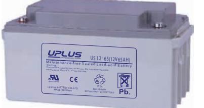
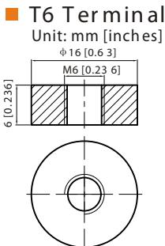
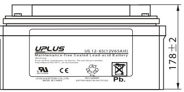
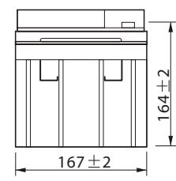
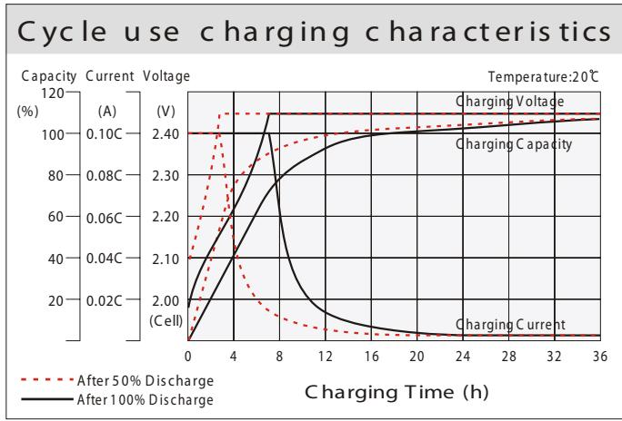
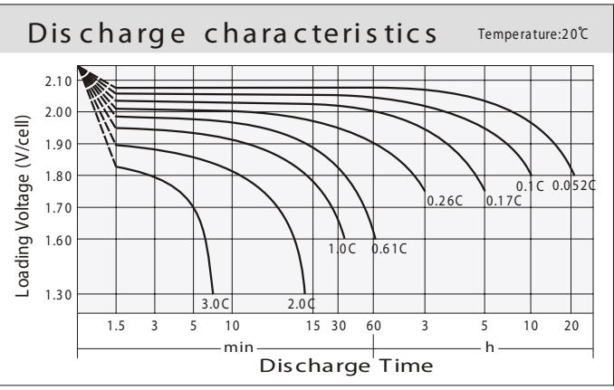
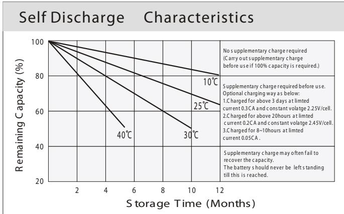
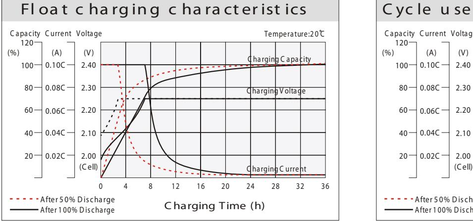
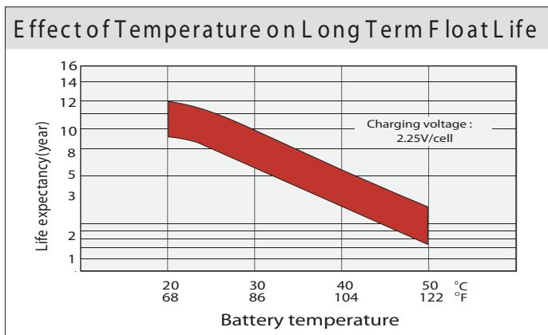
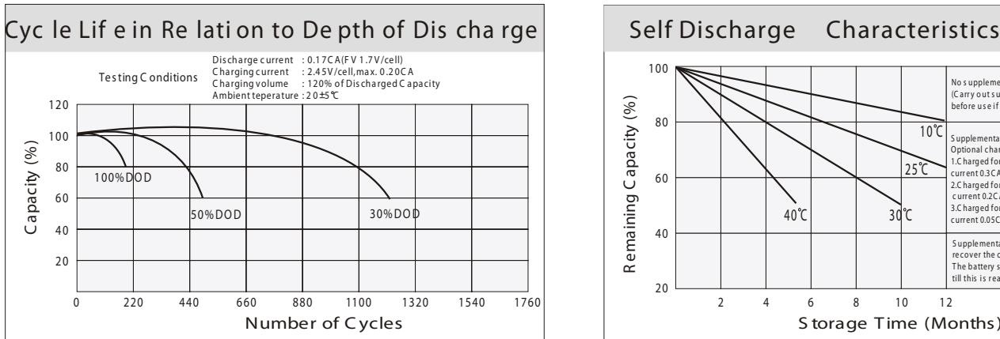

## 12 65 (12V65AH) US - **U S S E R IE S**

- ABS containers and covers(UL94HB, UL94V-0) optional.
- Safety valve installation for explosion proof.
- High quality and high reliability.

**General Features**

- Exceptional deep discharge recovery performance.
- Low self discharge characteristic.
- Flexibility design for multiple install positions.

|--|

| Battery Type          | Valve-Regulated,Absorbed Glass Mat(AGM) Technology |                   |                          |                          |                                    |                                     |  |  |  |  |  |
|-----------------------|----------------------------------------------------------|-------------------|--------------------------|--------------------------|------------------------------------|-------------------------------------|--|--|--|--|--|
| Nomial Voltage        | 12V                                                      |                   |                          |                          |                                    |                                     |  |  |  |  |  |
|                       | 20HR(3.37A,1.8V/cell)                                    | 10HR(6.31A,1.80V) |                          | 5HR(10.9A,1.75V)         |                                    | 1HR(38.3A,1.60V)                    |  |  |  |  |  |
| 0 20 C) Capacity(  | 67.4AH                                                   |                   | 63.1AH                   | 54.5AH                   |                                    | 38.3AH                              |  |  |  |  |  |
|                       | Length                                                   | Width             |                          |                          |                                    | Total Height                        |  |  |  |  |  |
| Dimensions            | 348mm(13.70inches)                                       | 167mm(6.57inches) | 178mm(7.01inches)        | 178mm(7.01inch)          |                                    |                                     |  |  |  |  |  |
| Approx Weight         |                                                          |                   | Approx 21.0 kg (46.3lbs) |                          |                                    |                                     |  |  |  |  |  |
| Internal Resistance   | 0 Full Charged at 20 C : Approx 7.3m Ù             |                   |                          |                          |                                    |                                     |  |  |  |  |  |
| Self Discharge        | 0 3% of capacity declined per month at 20 C        |                   |                          |                          |                                    |                                     |  |  |  |  |  |
| Capacity aected by    | o 40 C                                                |                   | 0 25 C                | 0 0 C                 |                                    | 0 -15 C                          |  |  |  |  |  |
| Temperature (10HR)    | 103%                                                     |                   | 100%                     | 86%                      |                                    | 65%                                 |  |  |  |  |  |
|                       | Cycle use                                                |                   |                          | Float use                |                                    |                                     |  |  |  |  |  |
| Charging Voltage (V)  | 0 14.25V~14.85V at 20 C. T emp. Coecient -30mV/       |                   | 0 C                   | 13.4V~13.7V at 20        | 0                                  | 0 C.Temp. Coecient (-20mV/ C) |  |  |  |  |  |
|                       | Max. Discharge Current                                   |                   |                          | Initial Charging Current |                                    |                                     |  |  |  |  |  |
| Current               |                                                          | 780A(5s)          |                          | Less than 19.5A          |                                    |                                     |  |  |  |  |  |
|                       | Discharge                                                |                   |                          | Charging                 | Storage                            |                                     |  |  |  |  |  |
| Operating T emp.Range | 0 0 -15 50 C (5 122 F)                       |                   | 0 0 40 C (32       | 0 104 F)              | 0 0 -15 40 C (5 104 F) |                                     |  |  |  |  |  |

**Co ns ta nt C ur re nt D is ch ar ge (A m pe re s) a t 0 0 2 0 C (6 8 F )**

| F.V/ Tim e   | 10 m in | 15 m in | 20 m in | 30 m in | 45 m in | 1h   | 2h   | 3h   | 4h   | 5h   | 6h   | 8h   | 10 h | 20 h |
|--------------|---------|---------|---------|---------|---------|------|------|------|------|------|------|------|------|------|
| 1.8 5V /cell | 72.2    | 60.8    | 53.9    | 44.7    | 34.5    | 29.5 | 19.3 | 14.5 | 11.9 | 10.0 | 8.86 | 7.11 | 6.11 | 3.26 |
| 1.8 0V /cell | 82.7    | 68.2    | 59.6    | 48.6    | 37.2    | 31.2 | 20.8 | 15.6 | 12.6 | 10.6 | 9.39 | 7.48 | 6.31 | 3.37 |
| 1.7 5V /cell | 93.9    | 76.9    | 65.9    | 52.8    | 40.6    | 34.0 | 21.6 | 16.2 | 13.1 | 10.9 | 9.68 | 7.73 | 6.47 | 3.46 |
| 1.7 0V /cell | 106.0   | 85.3    | 72.7    | 57.6    | 43.7    | 35.9 | 22.7 | 17.1 | 13.7 | 11.5 | 10.1 | 8.06 | 6.72 | 3.55 |
| 1.6 5V /cell | 113.9   | 91.3    | 77.3    | 60.8    | 46.3    | 37.2 | 23.6 | 17.8 | 14.2 | 11.8 | 10.5 | 8.33 | 6.91 | 3.66 |
| 1.6 0V /cell | 125.3   | 100.1   | 84.0    | 64.9    | 48.1    | 38.3 | 24.2 | 18.2 | 14.5 | 12.1 | 10.7 | 8.47 | 7.06 | 3.72 |

## **Co ns ta nt P ow er D is ch ar ge (W at ts ) a t 0 0 2 0 C (6 8 F )**

| F.V/ Tim e   | 10 m in | 15 m in | 20 m in | 30 m in | 45 m in | 1h   | 2h   | 3h   | 4h   | 5h   | 6h   | 8h   | 10 h | 20 h |
|--------------|---------|---------|---------|---------|---------|------|------|------|------|------|------|------|------|------|
| 1.8 5V /cell | 134.9   | 114.6   | 102.7   | 86.1    | 67.0    | 57.5 | 37.9 | 28.6 | 23.5 | 19.8 | 17.6 | 14.2 | 12.2 | 6.52 |
| 1.8 0V /cell | 152.6   | 127.0   | 111.9   | 92.1    | 71.7    | 60.4 | 40.5 | 30.5 | 24.8 | 20.9 | 18.6 | 14.9 | 12.6 | 6.74 |
| 1.7 5V /cell | 170.5   | 141.4   | 122.5   | 99.3    | 77.5    | 65.5 | 41.9 | 31.6 | 25.6 | 21.3 | 19.1 | 15.3 | 12.9 | 6.90 |
| 1.7 0V /cell | 188.3   | 154.7   | 134.2   | 107.8   | 83.2    | 69.1 | 44.1 | 33.2 | 26.7 | 22.5 | 20.0 | 16.0 | 13.4 | 7.07 |
| 1.6 5V /cell | 200.4   | 164.4   | 141.7   | 112.8   | 87.2    | 71.0 | 45.4 | 34.4 | 27.7 | 23.2 | 20.6 | 16.5 | 13.7 | 7.28 |
| 1.6 0V /cell | 215.4   | 177.1   | 152.3   | 119.6   | 90.2    | 72.7 | 46.4 | 35.2 | 28.2 | 23.6 | 21.0 | 16.7 | 14.0 | 7.39 |

## **D im en si o n s**

143 2 167 2 348 3 262 2 2-M6

Torque: 3.9~5.4N*M

*2*