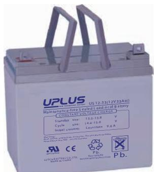
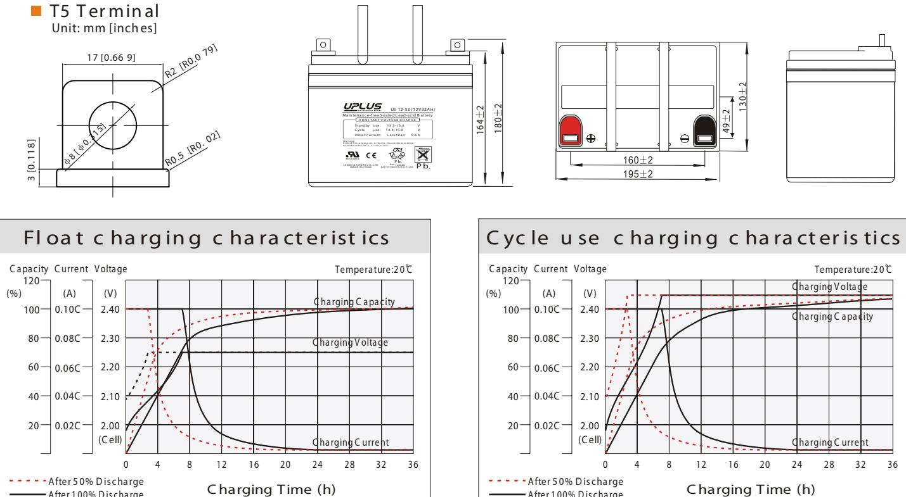
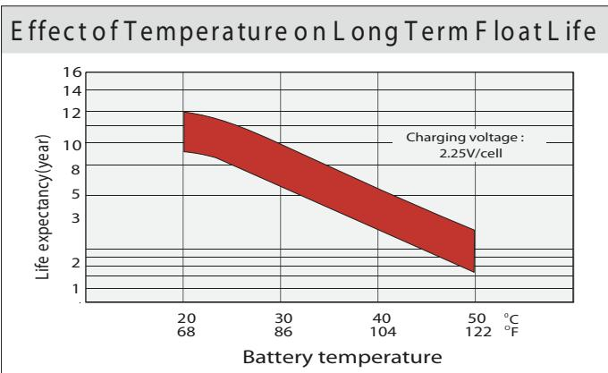
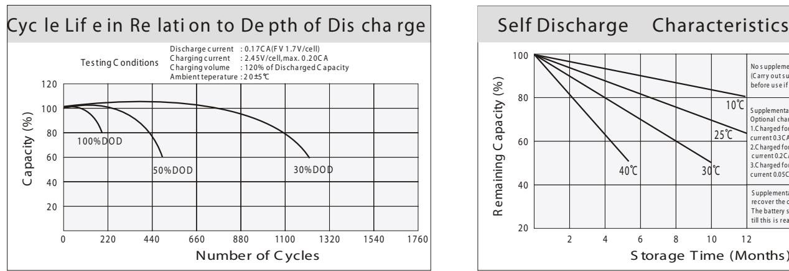
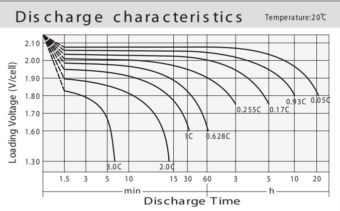
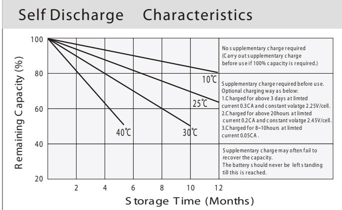

## US SERIES US12-33 (12V33AH)

## General Features

- ◆ Sealed and maintenance free operation.
- ◆ Non-Spillable construction design.
- ◆ ABS containers and covers(UL94HB, UL94V-0) optional.
- ◆ Safety valve installation for explosion proof.
- ◆ High quality and high reliability.
- ◆ Exceptional deep discharge recovery performance.
- ♦ Low self discharge characteristic.
- ♦ Flexibility design for multiple install positions.

|  | రించిన దివ్యాంగ్ రామం నుండి 10 కి.మీ. దూరంలో ఉంది. మూలాలు  గ్రామం నుండి 10 కి.మీ. దూరంలో ఉంది. మూలాలు  వైద్యశాల గ్రామం నుండి 10 కి.మీ. దూరంలో ఉంది. ప్రాథమిక ఆరోగ్య ఉంది. మార | Intertek ETL SEMKO | 20 MH26866 | GEO 1 ISO14001 | e Se ISO9001 | C C   TE EMC   图川ゆ tested Gellia Int |
|--|-------------------------------------------------------------------------------------------------------------------------------------------------------------------------------|--------------------|---------------|----------------------|-----------------|-----------------------------------------------|
|--|-------------------------------------------------------------------------------------------------------------------------------------------------------------------------------|--------------------|---------------|----------------------|-----------------|-----------------------------------------------|

| Battery Type          | Valve-Requlated,Absorbed Glass Mat(AGM) Technology |                   |                     |                                                    |                       |                   |  |  |  |  |  |
|-----------------------|----------------------------------------------------------|-------------------|---------------------|----------------------------------------------------|-----------------------|-------------------|--|--|--|--|--|
| Nomial Voltage        | 12V                                                      |                   |                     |                                                    |                       |                   |  |  |  |  |  |
| Capacity( 20°C)       | 20HR(1.6A,1.8V/cell)                                     | 10HR(2.98A,1.80V) |                     | 5HR(5.39A,1.75V)                                   |                       | 1HR(19.7A,1.60V)  |  |  |  |  |  |
|                       | 32.0AH                                                   |                   | 29.8AH              | 26.9AH                                             |                       | 19.7AH            |  |  |  |  |  |
|                       | Length                                                   |                   | Width               | Height                                             |                       | Total Height      |  |  |  |  |  |
| Dimensions            | 195mm(7.68inches)                                        |                   | 130mm(5.12inches)   | 164mm(6.56inches)                                  |                       | 180mm(7.09inches) |  |  |  |  |  |
| Approx Weight         | Approx 10.5 kg (23.1lbs)                                 |                   |                     |                                                    |                       |                   |  |  |  |  |  |
| Internal Resistance   | Full Charged at 20°C : Approx 12m   Ù                    |                   |                     |                                                    |                       |                   |  |  |  |  |  |
| Self Discharge        | 3% of capacity declined per month at 20 °C               |                   |                     |                                                    |                       |                   |  |  |  |  |  |
| Capacity affected by  | 40°C                                                     |                   | 25°C                | 0°C                                                |                       | -15°C             |  |  |  |  |  |
| Temperature (10HR)    | 103%                                                     | 100%              |                     | 86%                                                |                       | 65%               |  |  |  |  |  |
|                       | Cycle use                                                |                   |                     | Float use                                          |                       |                   |  |  |  |  |  |
| Charging Voltage (V)  | 14.4V~15.0V at 20 °C.T emp. Coefficient -30mV/ °C        |                   |                     | 13.5V~13.8V at 20 °C.Temp. Coefficient (-20mV/ °C) |                       |                   |  |  |  |  |  |
|                       | Max. Discharge Current                                   |                   |                     | Initial Charging Current                           |                       |                   |  |  |  |  |  |
| Current               | 495A                                                     |                   |                     | Less than 9.9A                                     |                       |                   |  |  |  |  |  |
|                       | Discharge                                                |                   |                     | Charging                                           | Storage               |                   |  |  |  |  |  |
| Operating T emp.Range | -15~50℃(5 ~122°F)                                        |                   | 0~40°C (32 ~ 104°F) |                                                    | -15 ~40°C (5 ~ 104°F) |                   |  |  |  |  |  |

| Co ns tant C urrent Dis charge (A mperes) at 20 ℃ (68ºF ) |       |        |        |        |        |        |      |      |      |      |      |      |      |      |      |
|-----------------------------------------------------------|-------|--------|--------|--------|--------|--------|------|------|------|------|------|------|------|------|------|
| F.V/Tim e                                                 | 5min  | 10 min | 15 min | 20 min | 30 min | 45 min | 1h   | 2h   | 3h   | 4h   | 5h   | 6h   | 8h   | 10h  | 20h  |
| 1.8 5V /cell                                              | 59.7  | 45.8   | 38.0   | 32.8   | 25.4   | 18.7   | 15.8 | 9.42 | 7.37 | 5.99 | 4.89 | 4.29 | 3.46 | 2.89 | 1.58 |
| 1.8 0V /cell                                              | 80.1  | 58.6   | 45.9   | 38.8   | 30.0   | 21.8   | 17.7 | 10.3 | 7.93 | 6.40 | 5.25 | 4.60 | 3.67 | 2.98 | 1.60 |
| 1.7 5V /cell                                              | 90.4  | 64.4   | 50.1   | 41.8   | 31.1   | 22.6   | 18.5 | 10.7 | 8.08 | 6.54 | 5.39 | 4.72 | 3.73 | 3.06 | 1.62 |
| 1.7 0V /cell                                              | 99.5  | 70.2   | 53.5   | 43.9   | 32.4   | 23.5   | 19.1 | 10.9 | 8.30 | 6.72 | 5.52 | 4.82 | 3.78 | 3.12 | 1.65 |
| 1.6 5V /cell                                              | 109.7 | 75.7   | 56.9   | 46.6   | 34.1   | 24.1   | 19.5 | 11.1 | 8.66 | 6.95 | 5.67 | 4.93 | 3.84 | 3.18 | 1.67 |
| 1.6 0V /ce ll                                             | 121.0 | 82.2   | 60.9   | 49.7   | 36.1   | 25.1   | 19.7 | 11.6 | 8.92 | 7.17 | 5.86 | 5.03 | 3.88 | 3.22 | 1.68 |

## Co ns tant P ower Dis ch ar ge (W atts ) a t 20 ℃ (6 8 ℉ )

| F.V/Tim e     | 5min  | 10 min | 15 min | 20min | 30 min | 45 min | 1h   | 2h   | 3h   | 4h   | 5h   | 6h   | 8h   | 10h  | 20h  |
|---------------|-------|--------|--------|-------|--------|--------|------|------|------|------|------|------|------|------|------|
| 1.8 5V /cell  | 109.2 | 84.7   | 70.9   | 61.9  | 48.4   | 36.0   | 30.4 | 18.3 | 14.4 | 11.7 | 9.58 | 8.43 | 6.82 | 5.71 | 3.14 |
| 1.8 0V /cell  | 145.0 | 106.9  | 84.5   | 72.1  | 56.2   | 41.5   | 33.9 | 19.8 | 15.4 | 12.4 | 10.2 | 9.00 | 7.22 | 5.88 | 3.17 |
| 1.7 5V /cell  | 160.0 | 115.6  | 91.1   | 76.8  | 57.9   | 42.6   | 35.3 | 20.5 | 15.6 | 12.7 | 10.5 | 9.22 | 7.32 | 6.03 | 3.19 |
| 1.7 0V /cell  | 171.3 | 123.2  | de d   | 80.1  | 59.9   | 44.2   | 36.3 | 21.0 | 16.0 | 13.0 | 10.7 | 9.40 | 7.42 | 6.15 | 3.25 |
| 1.6 5V /ce II | 186.2 | 131.7  | 101.2  | 84.5  | 62.7   | 44.9   | 36.9 | 21.1 | 16.6 | 13.4 | 11.0 | 9.57 | 7.52 | 6.26 | 3.29 |
| 1.6 0V /cell  | 200.6 | 139.7  | 106.5  | 89.0  | 65.7   | 46.5   | 37.0 | 21.9 | 17.0 | 13.8 | 11.3 | 9.75 | 7.57 | 6.32 | 3.30 |

A fte r 1 00% D is c ha rge

A fte r 1 00% D is c ha rge

