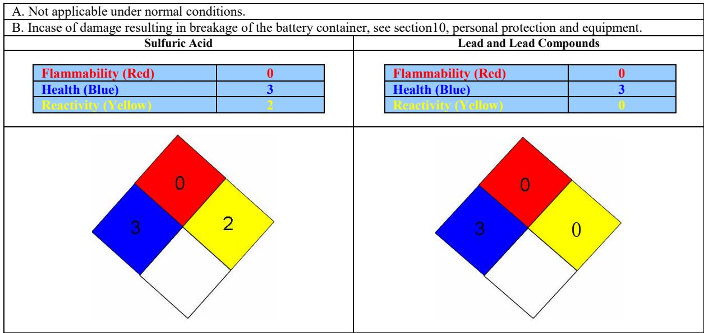

# **VALVE-REGULATED LEAD-ACID BATTERY SEALED MAINTENANCE-FREE NON-SPILLABLE**

## **SECTION 1: PRODUCT IDENTIFICATION**

| Product Name:    | Sealed Maintenance Free Lead-Acid Batteries: |  |  |
|------------------|----------------------------------------------|--|--|
|                  | US, USC, USL, USS, USX, USF Series           |  |  |
| Common Synonyms: | SLA, VRLA, Sealed Recombinent                |  |  |
| DOT Description: | Wet Battery, Non-Spillable                   |  |  |
| Chemical Family: | Electrical Battery Standby                   |  |  |
| Date Issued:     | February 1 , 2012                            |  |  |
|                  |                                              |  |  |

# **SECTION 2: HAZARDOUS INGREDIENTS/ IDENTITY INFORMATION**

| COMPONENTS                                             | Approx % by Wt. | CAS Number | Air Exposure Limits (μg/m3) |      |       | LD50 ORAL (Rat ) |
|--------------------------------------------------------|--------------------|------------|-----------------------------|------|-------|---------------------|
|                                                        |                    |            | ACGIH TLV                   | OSHA | NIOSH | (mg/kg)             |
| Inorganic Lead/Lead Compounds                       | 65-75              | 7439-92-1  | 50                          | 50   | 50    | 500                 |
| Tin (Sn)                                               | <0.5               | 7440-31-5  | 2000                        | 2000 | --    | --                  |
| Calcium (Ca)                                           | <0.1               | 7440-70-2  | --                          | --   | --    | --                  |
| Dilute Sulfuric Acid                                   | 10~20              | 7664-93-9  | 200                         | 1000 | 1000  | 2140                |
| Case Material: Acrylonitrile Butadine Styrene (ABS) | ~5                 | 9003-56-9  | --                          | --   | --    | --                  |

# **SECTION 3: PHYSICAL DATA**

| COMPONENTS                                                   | DENSITY g/cm3 | MELTING/BOILING (M/B) POINT     | SOLUBILITY (H2O)       | ODOR                                | APPEARANCE                  |
|--------------------------------------------------------------|------------------|------------------------------------|---------------------------|-------------------------------------|-----------------------------|
| Lead                                                         | 11.34            | 327.46 °C, 621.43 °F (M)           | None                      | None                                | Sliver-Gray Metal           |
| Lead Sulfate                                                 | 6.20             | 1170 °C, 2138 °F (B)               | 40 mg/l (15 °C, 59 °F) | None                                | White crystals or powder |
| Lead Dioxide                                                 | 9.40             | 290 °C, 554 °F (M)                 | None                      | None                                | Dark brown Powder        |
| Sulfuric Acid                                                | ~1.3             | 95°C -115°C , 203°F - 240°F (B) | 100%                      | Sharp, penetrating, pungent odor | Clear Colorless Liquid   |
| Case Material: Acrylonitrile Butadine Styrene (ABS) | 1.05-1.06        | 130-160°C 266°F -320°F (M)      | None                      | None                                | Solid                       |

# **SECTION 4: FLAMMABILITY DATA**

| COMPONENTS    | FLASHPOINT | EXPLOSIVE LIMITS | COMMENTS                                                       |
|---------------|------------|------------------|----------------------------------------------------------------|
| Lead          | None       | None             | None                                                           |
| Sulfuric Acid | None       | None             | None                                                           |
| Hydrogen      | --         | LEL=4.1%         | Sealed batteries can emit hydrogen only if over charged        |
|               |            | UEL=75%          | (float voltage> 2.4 VPC). The gas enters the air through       |
|               |            |                  | the vent caps. To avoid the chance of a fire or explosion,     |
|               |            |                  | keep sparks and other sources of ignition away from the        |
|               |            |                  | battery. Extinguishing Media: Dry chemical, foam, CO2          |
| Acrylonitrile | None       | --               | Temperatures over 300 °C (572°F) may release |

# **VALVE-REGULATED LEAD-ACID BATTERY SEALED MAINTENANCE-FREE NON-SPILLABLE**

| Butadine Styrene |  | combustible gases. In case of fire: wear positive pressure |
|------------------|--|------------------------------------------------------------|
| (ABS)            |  | self-contained breathing apparatus.                        |

# **SECTION 5: REACTIVITY DATA**

| COMPONENT              | Lead/lead compounds                                                                                   |
|------------------------|-------------------------------------------------------------------------------------------------------|
| Stability              | Stable                                                                                                |
| Incompatibility        | Potassium, carbides, sulfides, peroxides, phosphorus, sulfurs, ketone, ester, petrolatum              |
| Decomposition products | Oxides of lead and sulfur.                                                                            |
| Condition to avoid     | High temperature, Sparks and other sources of ignition.                                               |
| COMPONENT              | Sulfuric Acid                                                                                         |
| Stability              | Stable                                                                                                |
| Incompatibility        | Reactive metals, strong bases, most organic compounds                                                 |
| Decomposition products | Sulfuric dioxide, trioxide, hydrogen sulfide, hydrogen                                                |
| Condition to avoid     | Prohibit smoking, sparks, etc. from battery charging area. Avoid mixing acid with other chemicals. |
| POLYMERIZTION          | Sulfuric acid will not polymerize                                                                     |

# **SECTION 6: HEALTH HAZARD DATA**

Battery is considered as sealed non-spillable one. Under normal operating conditions, the materials sealed inside should not be hazardous to people's health. Only when these materials exposed during production or under case broken condition or being extremely heated (fired), they may be hazardous to people's health.

#### **Routes of Entry:**

Sulfuric Acid: Harmful by all routes of entry.

Lead Compounds: Hazardous Exposure can occur only when product is heated, oxidized, or otherwise processed or damaged to create dust, vapor or fume.

#### **Inhalation:**

Sulfuric Acid: Breathing sulfuric acid vapors and mists may cause severe respiratory problems. Lead Compounds: Dust or fumes may cause irritation of upper respiratory tract or lungs.

#### **Skin Contact:**

Sulfuric Acid: Severe irritation, burns and ulceration. Lead Compounds: Not absorbed through the skin.

#### **Ingestion:**

Sulfuric Acid: May cause severe irritation of the mouth, throat, esophagus, and stomach. Lead Compounds: May cause abdominal pain, nausea, vomiting, diarrhea, and severe cramping. Acute ingestion should be treated by a physician.

#### **Acute Health Hazards:**

Sulfuric Acid: Severe skin irritation, burns, damage to cornea may cause blindness, upper respiratory irritation.

Lead Compounds: May cause abdominal pain, nausea, headaches, vomiting, loss of appetite, severe cramping, muscular aches and weakness, and difficulty sleeping. The toxic effects of lead are cumulative and slow to appear. It affects the kidneys, reproductive and central nervous systems. The symptoms of lead overexposure are listed above. Exposure to lead from a battery most often occurs during lead reclamation operations through the breathing or ingestion of lead dust or fumes.

#### **Chronic Health Hazards:**

Sulfuric acid: Possible scarring of the cornea, inflammation of the nose, throat and bronchial tubes, possible erosion of tooth enamel.

Lead Compounds: May cause anemia, damage to kidneys and nervous system, and damage to reproductive system in both males and females.

#### **Medical Conditions Generally Aggravated by Exposure**

Inorganic lead and its compounds can aggravate chronic forms of kidney, liver, and neurological diseases. Contact of battery electrolyte (acid) with the skin may aggravate skin diseases such as eczema and contact dermatitis. Overexposure to sulfuric

# **VALVE-REGULATED LEAD-ACID BATTERY SEALED MAINTENANCE-FREE NON-SPILLABLE**

acid mist may case lung damage and aggravate pulmonary conditions.

#### **Emergency and First Aid Procedures**

**Inhalation**

Sulfuric Acid: Remove to fresh air immediately. If breathing is difficult, give oxygen

Lead Compounds: Remove from exposure, gargle, wash nose and lips, consult physician

#### **Ingestion**

Sulfuric Acid: Do not induce vomiting, consult a physician immediately.

Lead Compounds: Consult a physician immediately

**Eyes**

Sulfuric Acid: Flush immediately with water for 15 minutes, consult a physician.

Lead Compounds: Flush immediately with water for 15 minutes, consult a physician **Skin**

Sulfuric Acid: Flush with large amounts of water for at least 15 minutes, remove any contaminated clothing. If irritation develops seek medical attention.

Lead Compounds: Wash with soap and water.

#### **Proposition 65**

Warning: Battery posts, terminals and related accessories contain lead and lead compounds, chemical known to the State of California to cause cancer and reproductive harm. Batteries also contain other chemicals known to the State of California to cause cancer. Wash hands after handling.

### **SECTION 7: CARCINOGENICITY**

#### **Carcinogenicity**

Sulfuric Acid: The National Toxicological Program (NTP) and The International Agency for Research on Cancer (IARC) have classified strong inorganic acid mist containing sulfuric acid as a Category 1 carcinogen, a substance that is carcinogenic to humans. The ACGIH has classified strong inorganic acid mist containing sulfuric acid as an A2 carcinogen (suspected human carcinogen). These classifications do not apply to liquid forms of sulfuric acid or sulfuric acid solutions contained within a battery. Inorganic acid mist (sulfuric acid mist) is not generated under normal use of this product. Misuse of the product, such as overcharging, may result in the generation of sulfuric acid mist.

Lead Compounds: Human studies are inconclusive regarding lead exposure and an increased cancer risk. The EPA and the International Agency for Research on Cancer (IARC) have categorized lead and inorganic lead compounds as a B2 classification (probable/possible human carcinogen) based on sufficient animal evidence and inadequate human evidence.

### **SECTION 8: PRECAUTIONS FOR SAFE HANDLING AND USE**

#### **Spill or Leak Procedures**

In case the release occurs, stop flow of material: contain/absorb small spills with dry sand, earth, and vermiculite. If possible, carefully neutralize spilled electrolyte with soda ash, sodium bicarbonate, lime, etc. Wear acid-resistant clothing, boots, gloves, and face shield. Do not allow discharge of unneutralized acid to sewer.

#### **Waste Disposal Method**

Spent Batteries - send to secondary lead smelter for recycling. Follow applicable federal, state and local regulations Neutralize as in preceding step. Collect neutralized material in sealed container and handle as hazardous waste as applicable. A copy of this MSDS must be supplied to any scrap dealer or secondary lead smelter with the battery. Or, consult state environment agency and/ or federal EPA.

#### **Handling and Storing**

Store batteries in a cool, dry, well ventilated area that are separated from incompatible materials and any activities which may generate flames, sparks, or heat. Keep all metallic articles that could contact the negative and positive terminals on a battery and create a short circuit condition. Battery should be stored under roof for protection against adverse weather conditions. Store and handle only in areas wit adequate water supply and spill control. Avoid damage to battery case.

#### **Electrical Safety**

Due to the battery's low internal resistance and high power density, high levels of short circuit current can be developed across the battery terminals. Do not rest tools or cables on the battery. Use insulated tools only. Follow all installation instructions and diagrams when installing or maintaining battery systems.

# **VALVE-REGULATED LEAD-ACID BATTERY SEALED MAINTENANCE-FREE NON-SPILLABLE**

# **SECTION 9: ECOLOGICAL INFORMATION**

Lead and its compounds can pose a threat if released to the environment. See Waste Disposal Method in Section 8.

## **SECTION 10: CONTROL MEASURES**

#### **Engineering Controls:**

Store and handle in well-ventilated area. If mechanical ventilation is used, components must be acid resistant.

#### **Work Practices:**

Handle batteries cautiously to avoid damaging the case. Avoid contact with internal components. Do not allow metallic articles to contact the battery terminals during handling.

#### **Respiratory Protection:**

None required under normal conditions. When concentrations of sulfuric acid mist are known to exceed PEL, use NIOSH or MSHA-approved respiratory protection.

**Personal Protection and Equipment:** None needed under normal conditions. If battery case is damaged,

- Protective gloves: use rubber or plastic acid-resistant gloves with elbow-length gauntlet.
- Eye protection: use chemical goggles or face shield.
- Other protection: Acid-resistant apron. Under severe exposure or emergency conditions, wear acid –resistant clothing and boots.
- In areas where sulfuric acid is handled in concentrations greater than 1%, emergency eyewash stations and showers should be provided, with unlimited water supply.

# **SECTION 11: NFPA HAZARD RATING**

## **SECTION 12: TRANSPORTATION REGULATIONS (***Non-Restricted Status***)**

#### **GROUND – US DOT:**

Our non-spillable lead acid batteries are under the U.S. Department of Transportation's (DOT) hazardous materials regulations but are excepted from these regulations since they meet all of the following requirements found at 49 CFR 173.159(d).

- When offered for transport, the batteries are protected against short circuits and securely packaged as required by 49 CFR 173.159(d) (1);
- The batteries and outer packaging are marked with the words "NONSPILLABLE" or "NONSPILLABLE BATTERY" as required by 49 CFR173.159(d) (2);

# **VALVE-REGULATED LEAD-ACID BATTERY SEALED MAINTENANCE-FREE NON-SPILLABLE**

- The batteries comply with the vibration and pressure differential tests found in 49 CFR 173.159(d) (3).
## **AIRCRAFT – ICAO-IATA:**

Our non-spillable lead acid batteries also are excepted from the international hazardous materials (also known as "dangerous goods") regulations since they comply with the following requirements:

- According to the requirements of Packing Instruction 872 **in IATA (International Air Transport Association) and ICAO (International Civil Aviation Organization)**, there should not be any electrolyte leakage after the vibration and pressure differential tests.
- And, Special Provision A67 states "Non-spillable batteries are not subject to these Instructions ( Packing Instruction 872) if at the temperature of 55° C (131° F), the electrolyte will not flow from a ruptured or cracked case and there is no free liquid flow and if, when packaged for transport the terminals are protected from short circuit and unintentional activation."

## **VESSEL – IMO-IMDG:**

Our non-spillable batteries are excepted from the international hazardous materials (also known as "dangerous goods") regulations since they conform to the requirements of IMDG Code Special Provision 238 .1 and .2, that is the batteries have passed the vibration and pressure differential performance tests, and at a temperature of 55°C, the electrolyte will not flow from a ruptured or cracked case and there is no free liquid flow. And, when packaged for transport, the terminals are protected from short circuit.

#### **Additional Information:**

- Each battery and the outer packaging must be plainly and durably marked "Nonspillable" or "Nonspillable Battery". Transport requires proper packaging and paperwork, including the nature and quantity of goods, per applicable origin/destination/customs points as-shipped.
### **SECTION 13: Regulatory Information**

#### **RCRA**

Spent lead acid batteries are not regulated as hazardous waste by the EPA when recycled, however state and international regulations may vary. Spilled sulfuric acid is a characteristic hazardous waste; EPA hazardous waste number D2002 (corrosive).

#### **CERCLA (superfund) and EPCRA**

(a) Reportable Quantity (RQ) for spilled 100% sulfuric acid under CERCLA (superfund) and EPCRA (Emergency Planning Community Right to Know Act is 1,000lbs. State and local reportable quantities for spilled sulfuric acid may vary.

(b) Sulfuric acid is a listed "Extremely Hazardous Substance" under EPCRA with a Threshold Planning Quantity (TPQ) of 1,000lbs.

(c) EPCRA Section 302 Notification is required if 1,000lbs. or more of sulfuric acid is present at one site. The quantity of sulfuric acid will vary by battery type. Contact **SHENZHEN LEOCH BATTERY CORPORATION** for additional information.

(d) EPCRA Section 312 Tier 2 reporting is required for batteries if sulfuric acid is present in quantities of 500lbs. or more and/or lead is present in quantities of 10,00lbs. or more.

(e) Supplier Notification: This product contains toxic chemicals which may be reportable under EPCRA Section 313 Toxic Chemical Release Inventory (Form R) requirements. If you are a manufacturing facility under SIC codes 20 through 39 the following information is provided to enable you to complete the required reports:

| Toxic Chemical | CAS Number | Approximate% by weight |
|----------------|------------|------------------------|
| Lead           | 7439-92-1  | 65~75                  |
| Sulfuric Acid  | 7664-93-9  | 15~20                  |

If you distribute this product to other manufacturers in SIC codes 20 through 39, this information must be provided with the first shipment in a calendar year. The Section 313 supplier notification requirement does not apply to batteries which are "consumer products". Not present in all battery types. Contact **LEOCH BATTERY CORPORATION** for further information.

# **VALVE-REGULATED LEAD-ACID BATTERY SEALED MAINTENANCE-FREE NON-SPILLABLE**

## **TSCA**

Ingredients in Leoch Battery's batteries are listed in the TSCA registry as follows:

| Components                            | CAS Number | TSCA Status |
|---------------------------------------|------------|-------------|
| Inorganic Lead Compound: Lead (Pb) | 7439-92-1  | Listed      |
| Lead Oxide (PbO)                      | 1317-36-8  | Listed      |
| Lead Sulfate (PbSO4)                  | 7446-14-2  | Listed      |
| Calcium (Ca)                          | 7440-70-2  | Listed      |
| Tin (Sn)                              | 7440-31-5  | Listed      |

## **CANANIN REGULATIONS:**

All chemical substances in this product are listed on the CEPA DSL/NDSL or are exempt from list requirements.

## **DISCLAIMER:**

**ALL PERSONS USING THIS PRODUCT, ALL PERSONS WORKING IN AN AREA WHERE THIS PRODUCT IS USED AND ALL PERSONS HANDLING THIS PRODUCT SHOULD BE FAMILIAR WITH THE CONTENTS OF THIS DATA SHEET. THIS INFORMATION SHOULD BE EFFECTIVELY COMMUNICATED TO EMPLOYEES AND OTHERS WHO MIGHT COME IN CONTACT WITH THE PRODUCT.**

 **THIS MATERIAL SAFETY DATA SHEET IS BASED UPON INFORMATION AND SOURCES AVAILABLE AT THE TIME OF PREPARATION OR REVISION DATE. WE DO NOT ASSURE RESPONSIBILITY AND DISCLAIM LIABILITY FOR LOSS, DAMAGE OR EXPENSE IN ANY CONNECTED WITH THE HANDLING, STORAGE, USE OF, OR DISPOSAL OF THE PRODUCT. FOR ADDITIONAL INFORMATION CONCERNING**  *LEOCH BATTERY CORPORATION.* **PRODUCTS OR QUESTIONS CONCERNING THE CONTENT OF THIS MSDS PLEASE CONTACT** *LEOCH BATTERY CORPORATION***.**