# XLT Series - General Purpose XLT12-24 12V 24Ah

| Specifications                |                                                                      |                                                                                                                              |  |  |  |  |  |  |  |
|-------------------------------|----------------------------------------------------------------------|------------------------------------------------------------------------------------------------------------------------------|--|--|--|--|--|--|--|
| Nominal Voltage               | 12V                                                                  |                                                                                                                              |  |  |  |  |  |  |  |
| Nominal Capacity(20HR)        | 24.0AH                                                               |                                                                                                                              |  |  |  |  |  |  |  |
|                               | Length                                                               | 166.5 1mm (6.56 inches)                                                                                                   |  |  |  |  |  |  |  |
|                               | Width                                                                | 175 1mm (6.89 inches)                                                                                                     |  |  |  |  |  |  |  |
| Dimension                     | Container Height                                                     | 125 1mm (4.92 inches)                                                                                                     |  |  |  |  |  |  |  |
|                               | Total Height (with Terminal) 125 1mm (4.92 inches)             |                                                                                                                              |  |  |  |  |  |  |  |
| Approx Weight                 | Approx 7.2 kg (15.88lbs)                                             |                                                                                                                              |  |  |  |  |  |  |  |
| Terminal                      | T3 / T12                                                             |                                                                                                                              |  |  |  |  |  |  |  |
| Container Material            | ABS                                                                  |                                                                                                                              |  |  |  |  |  |  |  |
|                               | 24.0 AH/1.16A                                                        | 0 0 (20hr ,1.80V/cell,20 C/68 F)                                                                                       |  |  |  |  |  |  |  |
|                               | 21.7 AH/2.17A                                                        | 0 0 (10hr,1.80V/cell,20 C/68 F)                                                                                        |  |  |  |  |  |  |  |
| Rated Capacity                | 19.6 AH/3.92A                                                        | 0 0 (5hr,1.75V/cell,20 C/68 F)                                                                                         |  |  |  |  |  |  |  |
|                               | 17.6 AH/5.88A                                                        | 0 0 (3hr,1.75V/cell,20 C/68 F)                                                                                         |  |  |  |  |  |  |  |
|                               | 14.3 AH/14.3A                                                        | 0 0 (1hr,1.60V/cell,20 C/68 F)                                                                                         |  |  |  |  |  |  |  |
| Max. Discharge Current        | 360A (5s)                                                            |                                                                                                                              |  |  |  |  |  |  |  |
| Internal Resistance           | Approx 14mÙ                                                          |                                                                                                                              |  |  |  |  |  |  |  |
|                               | 0 Discharge : -15 50 C (5                                      | 0 122 F)                                                                                                                  |  |  |  |  |  |  |  |
| Operating Temp.Range          | 0 0 Charge : 0 40 C (32 104 F)                     |                                                                                                                              |  |  |  |  |  |  |  |
|                               | 0 0 Storage : -15 40 C (5 104 F)                      |                                                                                                                              |  |  |  |  |  |  |  |
| Nominal Operating Temp. Range | 0 0 20 3 C (68 5 F )                                     |                                                                                                                              |  |  |  |  |  |  |  |
|                               | Initial Charging Current less than 7.2A.Voltage                      |                                                                                                                              |  |  |  |  |  |  |  |
| Cycle Use                     | 0 0 0 14.25V~14.85V at 20 C(68 F)Temp. Coefficient -30mV/ C |                                                                                                                              |  |  |  |  |  |  |  |
|                               | No limit on Initial Charging Current Voltage                         |                                                                                                                              |  |  |  |  |  |  |  |
| Standby Use                   | 0 0 0 13.4V~13.7V at 20 C(68 F)Temp. Coefficient -20mV/ C   |                                                                                                                              |  |  |  |  |  |  |  |
|                               | o o 40 C (104 F)                                            | 103%                                                                                                                         |  |  |  |  |  |  |  |
| Capacity affected by          | o o 25 C ( 77 F)                                            | 100%                                                                                                                         |  |  |  |  |  |  |  |
| Temperature                   | o o 0 C ( 32 F)                                             | 86%                                                                                                                          |  |  |  |  |  |  |  |
| Self Discharge                |                                                                      | XLNT power XLT series batteries may be stored for up to 6 months at 20°C (68°F) and then a freshening charge is required. |  |  |  |  |  |  |  |

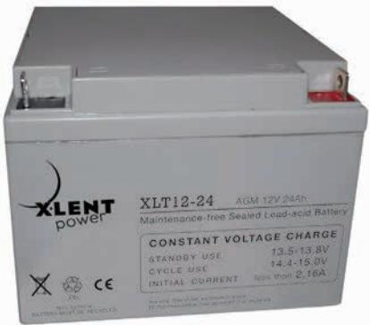

# Applications

- All purpose
- Uninterruptable Power Supply (UPS)
- Electric Power System (EPS)
- Emergency backup power supply
- Emergency light
- Railway signal
- Aircraft signal
- Alarm and security system
- Electronic apparatus and equipment
- Communication power supply
- DC power supply
- Auto control system

| 0 0 Cons tant Current Dis ch arge (Amperes) at 20 C (68 F ) |      |       |       |       |       |       |      |      |      |      |      |      |      |      |      |
|-------------------------------------------------------------------|------|-------|-------|-------|-------|-------|------|------|------|------|------|------|------|------|------|
| F.V/Tim e                                                         | 5min | 10min | 15min | 20min | 30min | 45min | 1h   | 2h   | 3h   | 4h   | 5h   | 6h   | 8h   | 10h  | 20h  |
| 1.85V/cell                                                        | 43.4 | 33.3  | 27.6  | 23.9  | 18.5  | 13.6  | 11.5 | 6.85 | 5.36 | 4.36 | 3.56 | 3.12 | 2.51 | 2.10 | 1.15 |
| 1.80V/cell                                                        | 58.3 | 42.6  | 33.4  | 28.2  | 21.8  | 15.8  | 12.8 | 7.48 | 5.77 | 4.65 | 3.82 | 3.34 | 2.67 | 2.17 | 1.16 |
| 1.75V/cell                                                        | 65.7 | 46.8  | 36.5  | 30.4  | 22.6  | 16.4  | 13.4 | 7.76 | 5.88 | 4.76 | 3.92 | 3.43 | 2.71 | 2.22 | 1.18 |
| 1.70V/cell                                                        | 72.4 | 51.0  | 38.9  | 31.9  | 23.5  | 17.1  | 13.9 | 7.95 | 6.04 | 4.88 | 4.02 | 3.51 | 2.75 | 2.27 | 1.20 |
| 1.65V/cell                                                        | 79.8 | 55.1  | 41.4  | 33.9  | 24.8  | 17.5  | 14.2 | 8.06 | 6.30 | 5.05 | 4.13 | 3.58 | 2.79 | 2.31 | 1.21 |
| 1.60V/cell                                                        | 88.0 | 59.8  | 44.3  | 36.1  | 26.2  | 18.2  | 14.3 | 8.41 | 6.49 | 5.21 | 4.26 | 3.66 | 2.82 | 2.34 | 1.22 |

For higher temperatures the time interval will be shorter.

| 0 0 Cons tant P ower Dis ch arge (Watts ) at 20 C (68 F ) |       |       |       |       |       |       |      |      |      |      |      |      |      |      |      |
|-----------------------------------------------------------------|-------|-------|-------|-------|-------|-------|------|------|------|------|------|------|------|------|------|
| F.V/Tim e                                                       | 5min  | 10min | 15min | 20min | 30min | 45min | 1h   | 2h   | 3h   | 4h   | 5h   | 6h   | 8h   | 10h  | 20h  |
| 1.85V/cell                                                      | 79.4  | 61.6  | 51.5  | 45    | 35.2  | 26.1  | 22.1 | 13.3 | 10.5 | 8.52 | 6.97 | 6.13 | 4.96 | 4.16 | 2.28 |
| 1.80V/cell                                                      | 105.4 | 77.8  | 61.4  | 52.4  | 40.9  | 30.2  | 24.6 | 14.4 | 11.2 | 9.05 | 7.45 | 6.55 | 5.25 | 4.28 | 2.30 |
| 1.75V/cell                                                      | 116.3 | 84.1  | 66.3  | 55.9  | 42.1  | 31.0  | 25.7 | 14.9 | 11.3 | 9.22 | 7.62 | 6.70 | 5.33 | 4.39 | 2.32 |
| 1.70V/cell                                                      | 124.6 | 89.6  | 69.8  | 58.3  | 43.6  | 32.1  | 26.4 | 15.2 | 11.6 | 9.45 | 7.80 | 6.83 | 5.40 | 4.47 | 2.36 |
| 1.65V/cell                                                      | 135.4 | 95.8  | 73.6  | 61.4  | 45.6  | 32.6  | 26.8 | 15.4 | 12.1 | 9.74 | 7.98 | 6.96 | 5.47 | 4.56 | 2.39 |
| 1.60V/cell                                                      | 145.9 | 101.6 | 77.4  | 64.7  | 47.8  | 33.8  | 26.9 | 16.0 | 12.4 | 10.0 | 8.22 | 7.09 | 5.51 | 4.60 | 2.40 |

# Dimensi ons

### T3 Termin al Unit: mm [inches]

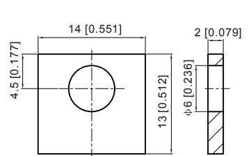

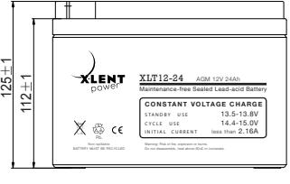

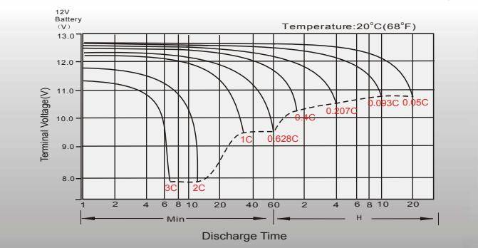

Temperatu re E ffects in R elation to B attery Capacity Eff ect of Temperature on L ong T**er m F lo at L if e**

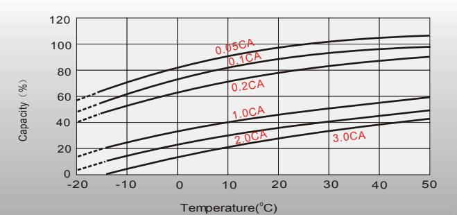

## Cycle Life in Rel atio n to Depth of Dis cha rge Self Discharge Characteristics

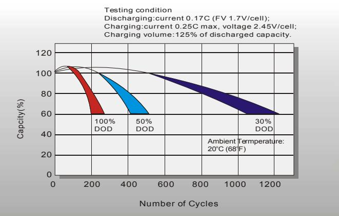

Sales Office

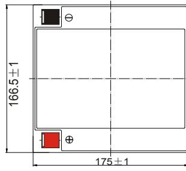

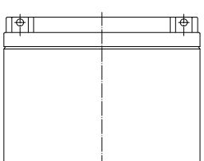

### Discharge Characteristics Float Charging Characteristics

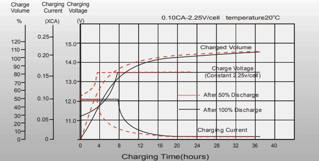

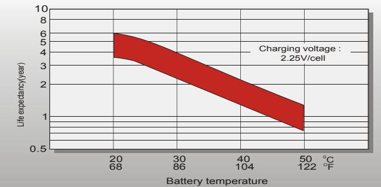

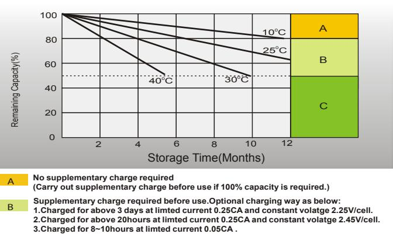

**Supplementary charge may often fail to recover the capacity. C**

**The battery should never be left standing till this is reached.**