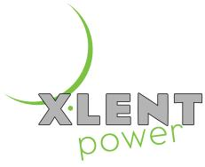
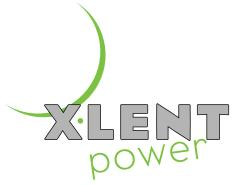
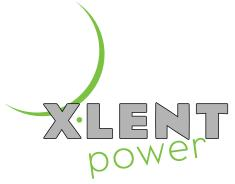
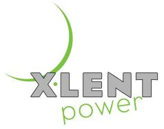
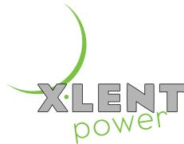
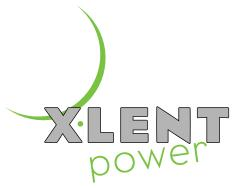

VALVE-REGULATED LEAD-ACID BATTERY

SEALED MAINTENANCE-FREE NON-SPILLABLE

## SECTION 1: IDENTIFICATION OF THE PRODUCT AND OF THE COMPANY

**Product Name:** Sealed Maintenance Free Lead-Acid Batteries: XLT, XLL, XLC,XLF, XLX Series

**Common Synonyms:** SLA, VRLA, Sealed Recombinent

**DOT Description:** Wet Battery, Non-Spillable

**Chemical Family:** Electrical Battery Standby

**Date Issued:** May 12, 2013

### SECTION 2: HAZARDS IDENTIFICATION

## Health Hazard Information (Acute and Chronic)-Battery Electrolyte (Sulfuric Acid only)

The international Agency for Research on Cancer (IARC) has classified "strong inorganic acid mist containing sulfuric acid "as a Category I carcinogen, a substance that is carcinogenic to humans. This classification does not apply to liquid forms of sulfuric acid or sulfuric acid solutions contained within the battery. Inorganic acid mist (sulfuric acid mist) is not generated under normal use of this product. Misuse of the product, such as overcharging, may however result in the generation of sulfuric acid mist.

### Eye

Contact electrolyte: Severe irritation,burns,blindness.

Contact lead dioxide and lead: May cause eye irritation.

### Skin

Contact electrolyte: Severe irritation,burns.

Contact lead dioxide and lead: May cause skin irritation.

### Inhalation

Contact electrolyte: Breathing of sulfuric acid vapors or mists may cause severe respiratory system irritation.

Contact lead dioxide and lead: May cause irritation of upper respiratory tract with nausea, vomiting, diarrhea. It may cause lung damage.

#### Ingestion

Contact electrolyte: May cause severe irritation of mouth, throat and stomach.

VALVE-REGULATED LEAD-ACID BATTERY

SEALED MAINTENANCE-FREE NON-SPILLABLE

Contact lead dioxide and lead: May cause abdominal pain, nausea, vomiting and diarrhea. This may lead rapidly to systemic toxicity.

## SECTION 3: COMPOSITION, INFORMATION OR INGREDIENTS

| COMPONENTS                                                   | Approx % by Wt. | CAS Number | Air Exposure Limits (µg/m3) |      |       | LD50 ORAL         |
|--------------------------------------------------------------|--------------------|------------|-----------------------------|------|-------|-------------------|
|                                                              |                    |            | AC GIH TLV                  | OSHA | NIOSH | (Rat ) (mg/kg) |
| Inorganic Lead/Lead Compounds                          | 65~75              | 7439-92-1  | 50                          | 50   | 50    | 500               |
| Tin (Sn)                                                     | <0.5               | 7440-31-5  | 2000                        | 2000 | --    | --                |
| Calcium (Ca)                                                 | <0.1               | 7440-70-2  | --                          | --   | --    | --                |
| Dilute Sulfuric Acid                                      | 10~20              | 7664-93-9  | 200                         | 1000 | 1000  | 2140              |
| Case Material: Acrylonitrile Butadine Styrene (ABS) | ~5                 | 9003-56-9  | --                          | --   | --    | --                |

## SECTION 4: FIRST AID MEASURES

## Battery Electrolyte

#### *Eyes*

Immediately flush eyes with plenty of water for at least 15 minutes, occasionally lifting the upper and lower eyelids. Get medical aid.

#### *Skin*

Remove contaminated clothes and rinse skin with plenty of water or shower for 15 minutes .Get medical aid.

#### *Inhalation*

Remove form exposure and move to fresh air immediately. Use oxygen if available.

#### *Ingestion*

Give at least 2 glasses of milk or water. Induce vomiting unless patient is unconscious. Call a physician.

VALVE-REGULATED LEAD-ACID BATTERY

SEALED MAINTENANCE-FREE NON-SPILLABLE

## SECTION 5: FIRE-FIGHTING MEASURES

### Extinguishing Media

Dry chemical, foam, CO2

### Firefighting

Use positive pressure, self-contained breathing apparatus. Beware of acid splatter during water application and wear acid-resistant clothing, gloves, face and eye protection. If batteries are on charge, shut off power to the charging equipment, but, note that strings series connected batteries. May still pose risk of electric shock even when charging equipment is shut down. In operation, batteries generate and release flammable hydrogen gas. If ignited by burning cigarette, naked flame e.g. spark, may cause battery explosion with dispersion of casing fragments and corrosive liquid electrolyte. Carefully follow manufacturer`s instructions for installation and service. Keep away all sources of gas ignition and do net allow metallic articles to simultaneously contact the negative and positive terminals of a battery.

## SECTION 6: ACCIDENTAL RELEASE MEASURES

### Steps to be Taken in case Material is Released or Spilled

If the battery is accidently broken and organic electrolyte leaks out, wipe it up with a cloth, and dispose of it in a plastic bag and put into a steel can.

The preferred response is to leave the area and allow the batteries to cool and vapors to dissipate. Provide maximum ventilation. Avoid skin and eye contact or inhalation of vapors.

Remove spilled liquid with absorbent and incinerate.

### Special File Fighting Procedures:

If batteries are on charge, turn off power. Use positive pressure, self-contained breathing apparatus in fighting fire. Water applied to electrolyte generates heat and causes it to splatter. Wear acid resistant clothing. Ventilate area well.

### Unusual fire and Explosion Hazards:

Hydrogen and oxygen gases are generated in cells during normal battery operation or when on charge. (Hydrogen is flammable and oxygen supports combustion). These gases enter the vent caps during battery overcharging. To avoid risk of fire or explosion, keep sparks and other sources of ignition away form the battery. Do not allow metal objects to simultaneously contact both positive and negative terminal of batteries. Ventilate area well.

VALVE-REGULATED LEAD-ACID BATTERY

SEALED MAINTENANCE-FREE NON-SPILLABLE

## Waste Disposal Method

It is recommended to discharge the battery to the end, to use up the metal lead inside the battery. And bury the discharged battery in soil.

## SECTION7: HANDING AND STORAGE

The batteries should not be opened, destroyed or incinerate, since they may leak or rupture and release to the environment the ingredients that they contain in the hermetically sealed container.

### Precautions to be taken in handing and storing

Avoid mechanical or electrical abuse. Storage preferably in cool, dry and ventilated area, which is subject to little temperature charge. Strorage at high temperatures should be avoided. Do not place the battery near heating equipment, nor expose to direct sunlight for long periods.

## SECTION 8: EXPOSURE CONTROLS, PERSONAL PROTECTION

### Engineering Controls

Store and handle in well- ventilated area。If mechanical ventilation is used, components must be acid-resistant.

### Work Practices

Handle batteries cautiously. Avoid bodily contact with internal components.

Wear protective clothing, eye and face protection, when filling or handling batteries.

### Respiratory protection

None required under normal conditions. When concentration of sulphuric acid mist are known to exceed PEL, use NIOSH or MSHA-approved respiratory protection.

### Protective Gloves

Rubber or plastic acid-resistant gloves.

Eye Protection

Chemical goggles or face shield.

Body Protection

Protective Clothing.

VALVE-REGULATED LEAD-ACID BATTERY

SEALED MAINTENANCE-FREE NON-SPILLABLE

## SECTION 9: PHYSICAL AND CHEMICAL PROPERTIES

**Nominal Voltage:** 2V, 4V, 6V, 8V, 12V, 24V

**Rated Capacity:** 0.5~3000Ah.

**Appearance Characters:** White, odorless, cuboid battery.

**Chemical Uses:** Telecom systems, Power systems, UPS,Standby power, Solar system, Electric mobility, Portable power tools, Electric vehicles and motorcycles, etc.

| COMPONENTS      | DENSITY    | MELTING POINT            | SOLUBILITY (H2O) | ODOR    | APPEARANCE                |
|-----------------|------------|--------------------------|---------------------|---------|---------------------------|
| Lead            | 11.34      | 327.4°C (Boiling)        | None                | None    | Sliver-Gray Metal      |
| Lead Sulfate    | 6.2        | 1070°C (Boiling)         | 40 mg/l (15°C)      | None    | White Powder              |
| Lead Dioxide    | 9.4        | 290°C (Boiling)          | None                | None    | Brown Powder              |
| Sulfuric Acid   | About 1.29 | About 114°C (Boiling) | 100%                | Acidic  | Clear Colorless Liquid |
| Fiberglass Sep. | N/A        | N/A                      | Slight              | Toxic   | White Fiberglass          |
| ABS or PP       | N/A        | N/A                      | None                | NO ODOR | Solid                     |

# SECTION 10: STABILITY AND REACTIVITY

#### Stability

Stable under normal conditions

### Conditions to Avoid

Heating, mechanical abuse and electrical abuse.

Sparking, other sources of ignition, prolonged overcharge, fire or explosion hazard due to possible hydrogen gas generation.

### Incompatibility

Electrolyte: Contact with combustibles and organic materials may cause fire and explsion. Also

Reacts violently with strong reducing agents, metals, sulfur trioxide gas, strong oxidizers and water. Contact with metals may produce toxic sulfur dioxide fumes and may relsase flammable hydrogen gas.

VALVE-REGULATED LEAD-ACID BATTERY

SEALED MAINTENANCE-FREE NON-SPILLABLE

Avoid contact with strong acids, bases, haliders, halogenates, potassium nitrate and reducing agents.

### Hazardous Decomposition products

Electrolyte: Sulfur trioxide, carbon monoxide, sulfuric acid mist, sulfur dioxide, hydrogen sulfide.

Lead dioxide and lead: Temperatures above the melting point are likely to produce toxic metal fume, vapor or dust.

## SECTION 11: TOXICOLOGICAL INFORMATION

**LEAD:** The toxic effects of lead are accumulative and slow to appear. It affects the kidneys, reproductive, and central nervous system.

The symptoms of lead overexposure are anemia, vomiting, headache, stomach pain (lead colic), dizziness, loss of appetite, and muscle and joint pain. Exposure to lead from a battery most often occurs during lead reclaim operations through the breathing or ingestion of lead dusts and fumes.

#### **THIS DATA MUST BE PASSED TO ANY SCRAP OR SMELTER WHEN A BATTERY IS RESOLD.**

**SULFURIC ACID:** Sulfuric acid is a strong corrosive. Contact with acid can cause severe burns on the skin and in the eyes. Ingestion of sulfuric acid will cause GI tract burns. Acid can be release if the battery case is damaged or if the vents are tampered with.

**FIBERGLASS SEPARATOR:** Fibrous glass is an irritant of the upper respiratory tract, skin and eyes. For exposure up to 10F/CC use MSA Comfort with type H filter. Above 10F/CC up to 50F/CC use Ultra-Twin with type H filter. NTP or OSHA does not consider this product carcinogenic.

## SECTION 12: ECOLOGICAL INFORMATION

- 1. Store lead/acid batteries with adequate ventilation. Room ventilation is required for batteries utilized for standby power generation. Never recharge batteries in an unventilated, enclosed space.
- 2. Do not remove vent caps. Follow shipping and handling instructions that are applicable to the battery type. To avoid damage to terminals and seals, do not double-stack industrial batteries.

### Steps to be taken in case of leaks or spills

If sulfuric acid is spilled from a battery, neutralize the acid with sodium bicarbonate (baking soda), sodium carbon (soda ash), or calcium oxide (lime). Flush the area with water discard to the sewage systems. Do not allow unneutralized acid into the sewage system.

VALVE-REGULATED LEAD-ACID BATTERY

SEALED MAINTENANCE-FREE NON-SPILLABLE

## SECTION 13: DISPOSAL CONSIDERATIONS

### Waste Disposal Method:

Spent batteries: Send to secondary lead smelter for recycling.

Place neutralized slurry into sealed acid resistant containers and dispose of as hazardous waste, as applicable. Large water-diluted spills, after neutralization and testing. Should be managed in accordance with approve local, state and federal requirements. Consult state environmental agency and/or federal EPA.

## SECTION 14: TRANSPORTATION INFORMATION

**Proper Shipping Name:** Batteries, wet, non-spillable

**Hazard Class:** 8

**UN No.:** UN2800

**Hazard Label:** Corrosive

Separate batteries when shipping to prevent short-circuiting. They should be packed in

strong packing for support during transport.

**Transport Fashion:** By air, by sea, by railway, by highway.

### Ground – US dot:

Our non-spillable lead acid batteries are under the U.S. Department of Transportation's (DOT) hazardous materials regulations but are excepted from these regulations since they meet all of the following requirements found at 49 CFR 173.159(d).

- When offered for transport, the batteries are protected against short circuits and securely packaged as required by 49 CFR 173.159(d) (1);
- The batteries and outer packaging are marked with the words "NONSPILLABLE" or "NONSPILLABLE BATTERY" as required by 49 CFR173.159(d) (2);
- The batteries comply with the vibration and pressure differential tests found in 49 CFR 173.159(d) (3).

### Aircraft – ICAO-IATA:

Our non-spillable lead acid batteries also are excepted from the international hazardous materials (also known as "dangerous goods") regulations since they comply with the following requirements:

- According to the requirements of Packing Instruction **806 in IATA (International Air Transport Association) and ICAO (International Civil Aviation Organization)**, there should not be any electrolyte leakage after the vibration and pressure differential tests.

VALVE-REGULATED LEAD-ACID BATTERY

SEALED MAINTENANCE-FREE NON-SPILLABLE

- And, Special Provision A67 states "Non-spillable batteries are not subject to these Instructions ( Packing Instruction 806 ) if at the temperature of 55° C (131° F), the electrolyte will not flow from a ruptured or cracked case and there is no free liquid flow and if, when packaged for transport the terminals are protected from short circuit and unintentional activation."
## Vessel – IMO-IMDG:

Our non-spillable batteries are excepted from the international hazardous materials (also known as "dangerous goods") regulations since they conform to the requirements of IMDG Code Special Provision 238 .1 and .2, that is the batteries have passed the vibration and pressure differential performance tests, and at a temperature of 55°C, the electrolyte will not flow from a ruptured or cracked case and there is no free liquid flow. And, when packaged for transport, the terminals are protected from short circuit.

### Additional Information:

- Each battery and the outer packaging must be plainly and durably marked "Nonspillable" or "Nonspillable Battery".
- Transport requires proper packaging and paperwork, including the nature and quantity of goods, per applicable origin/destination/customs points as-shipped.

## SECTION 15: REGULATORY INFORMATION

#### RCRA

Spent lead acid batteries are not regulated as hazardous waste by the EPA when recycled,however state and international regulations may vary. Spilled sulfuric acid is a characteristic hazardous waste; EPA hazardous waste number D2002 (corrosive).

### CERCLA (superfund) and EPCRA

- a) Reportable Quantity (RQ) for spilled 100% sulfuric acid under CERCLA (superfund) and EPCRA (Emergency Planning Community Right to Know Act is 1,000lbs. State and local reportable quantities for spilled sulfuric acid may vary.
- b) Sulfuric acid is a listed "Extremely Hazardous Substance" under EPCRA with a Threshold Planning Quantity (TPQ) of 1,000lbs.
- c) EPCRA Section 302 Notification is required if 1,000lbs. or more of sulfuric acid is present at one site. The quantity of sulfuric acid will vary by battery type.
- d) EPCRA Section 312 Tier 2 reporting is required for batteries if sulfuric acid is present in quantities of 500lbs. or more and/or lead is present in quantities of 10,00lbs. or more.
- e) Supplier Notification: This product contains toxic chemicals which may be reportable under EPCRA Section 313 Toxic Chemical Release Inventory (Form R) requirements. If you are a

VALVE-REGULATED LEAD-ACID BATTERY

SEALED MAINTENANCE-FREE NON-SPILLABLE

manufacturing facility under SIC codes 20 through 39 the following information is provided to enable you to complete the required reports:

| Toxic Chemical | CAS Number | Approximate% by weight |
|----------------|------------|------------------------|
| Lead           | 7439-92-1  | 65~72                  |
| Sulfuric Acid  | 7664-93-9  | 15~20                  |

If you distribute this product to other manufacturers in SIC codes 20 through 39, this information must be provided with the first shipment in a calendar year. The Section 313 supplier notification requirement does not apply to batteries which are "consumer products". Not present in all battery types.

### TSCA

Ingredients in Leoch Battery's batteries are listed in the TSCA registry as follows:

| Components           | CAS Number | TSCA Status |
|----------------------|------------|-------------|
| Inorganic Lead       | 7439-92-1  | Listed      |
| Compound: Lead (Pb)  |            |             |
| Lead Oxide (PbO)     | 1317-36-8  | Listed      |
| Lead Sulfate (PbSO4) | 7446-14-2  | Listed      |
| Calcium (Ca)         | 7440-70-2  | Listed      |
| Tin (Sn)             | 7440-31-5  | Listed      |

### Cananin regulations:

All chemical substances in this product are listed on the CEPA DSL/NDSL or are exempt from list requirements.

## SECTION 16: ADDITIONAL INFORMATION

The above information is based on the data of which we are aware and is believed to be correct as of the data hereof. Since this information may be applied under conditions beyond our control and with which may be unfamiliar and since data made available subsequent to the data hereof may suggest modification of information, we do not assume any responsibility for the results of its use. This information is furnished upon condition that the person receiving it shall make his own determination of the suitability of the material for his particular purpose.

### General Product Description-AGM Series VRLA Batteries

AGM Series batteries are valve regulated, non-spillable lead-acid batteries with pasted lead-calcium

VALVE-REGULATED LEAD-ACID BATTERY

SEALED MAINTENANCE-FREE NON-SPILLABLE

plates. The electrolyte in the AGM Series battery is held captive in an Absorbent Glass Mat (AGM) separator between the plates that immobilizes the electrolyte in the cell. AGM separator material is a highly porous, absorbent micro fiberglass mat mixed with polymer fibers. There is NO" free" electrolyte to leak out if the cell is tipped over (cell case and cover are sealed together) or if the cell is punctured. The AGM separator material immobilizes immobilizes the electrolyte and creates a situation where a spill of electrolyte is highly unlikely. Typical accidents where a VRLA battery case is punctured result in a slight drip or a slow ooze of material out of the cell that cannot be characterized as a spill.

**NOTE**: XLENT VRLA batteries do NOT contain a gel electrolyte. During normal battery installation, operation and maintenance, the user has NO contact with the internal components of the battery or its internal hazardous chemicals.