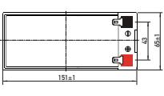
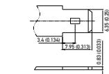
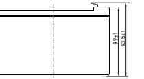
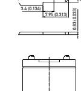
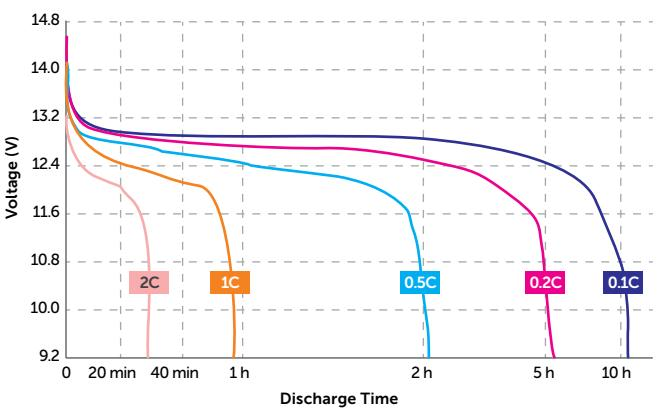
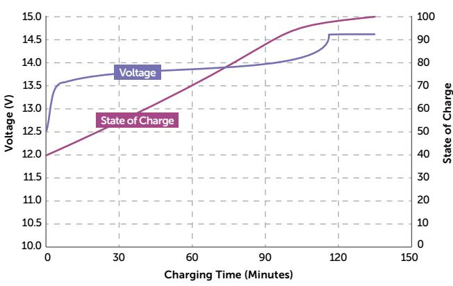
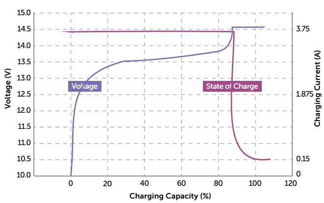
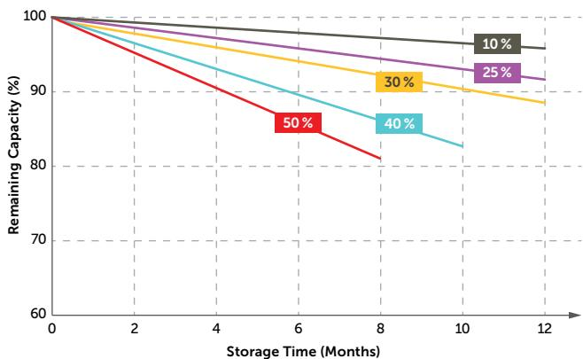

# Lithium Iron Phosphate (LiFePO4) Battery SPLi12-7.5 (12.8V, 7.5Ah)

E-number: 5233735

## Features of LiFePO4 Battery

◼ Longer Cycle Life: Offers up to 20 times longer cycle life and five times longer float/calendar life than lead acid battery, helping to minimize replacement cost and reduce total cost of ownership.

◼ Lighter Weight: About 40 % of the weight of a comparable lead acid battery. A 'drop in' replacement for lead acid batteries.

◼ Higher Power: Delivers twice the power of a lead acid battery, even high discharge rate, while maintaininghigh energy capacity.

◼ Wider Temperature Range: -20°C ~ 60°C

◼ Superior Safety: Lithium Iron Phosphate chemistry eliminates the risk of explosion or combustion due to high impact, overcharging or short circuit situation.

◼ Increased Flexibility: Modular design enables deployment of up to four batteries in series and up to ten batteries in parallell.

#### Physical Dimension

#### Application

- ◼ Electric vehicles, electric mobility
- ◼ Solar/wind energy storage system
- ◼ UPS, backup power
- ◼ Telecommunication
- ◼ Medical equipment
- ◼ Lighting

#### Specification

| Electrical Characteristics | Nominal Voltage           | 12.8 V                                                      |
|----------------------------|---------------------------|-------------------------------------------------------------|
|                            | Nominal Capacity          | 7.5 Ah (C5 , 25°C)                                       |
|                            | Energy                    | 96Wh                                                        |
|                            | Internal Resistance       | ≤ 60 mΩ                                                     |
|                            | Cycle Life                | > 2000 cycles @ 1C 100 % DOD                                |
|                            | Months Self Discharge     | < 3 %                                                       |
|                            | Efficienccy of Charge     | 100 % @ 0.5 C                                               |
|                            | Efficiency of Discharge   | 96~99 % @ 1 C                                               |
| Standard Charge            | Charge Voltage            | 14.6 ± 0.2 V                                                |
|                            | Charge Mode               | 0.2 C to 14.6 V, charge current to 0.02 C (CC/CV)           |
|                            | Charger Current           | 4 A                                                         |
|                            | Max. Charge Current       | 7.5 A                                                       |
|                            | Charge Cut-off Voltage    | 15.6 V ± 0.2 V                                              |
| Standard Discharge         | Continuous Current        | 15 A                                                        |
|                            | Max. Pulse Current        | 30 A (<3s)                                                  |
|                            | Discharge Cut-off Voltage | 8 V                                                         |
| Environmental              | Charge Temperature        | 0°C to 45°C (32 F to 113 F) @60 ± 25% Relative Humidity     |
|                            | Discharge Temperature     | -20°C to 60°C (-4 F to 140 F) @ 60 ± 25 % Relative Humidity |
|                            | Storage Temperature       | 0°C to 40°C (32 F to 104 F) @ 60 ± 25 % Relative Humidity   |
|                            | Water Dust Resistance     | IP56                                                        |
| Mechanical                 | Cell & Method             | 18650 4S5P                                                  |
|                            | Plastic Case              | ABS                                                         |
|                            | Dimensions (in/mm)        | 151 x 65 x 94 mm (5.95 x 2.56 x 3.70 in)                    |
|                            | Weight (lbs/kg)           | 1.10 kg (2.427 lbs)                                         |
|                            | Terminal                  | T2                                                          |
|                            | Protocol (optional)       | SMBus/RS485/RS232                                           |
|                            | SOC (optional)            | LED                                                         |

Different Temperature Discharge Curve @ 0.5C

State of Charge Curve @ 0.5C 25°C

#### Cycle Life Curve

Different DOD Discharge Cycle Life Curve @ 1C

#### Charging Characteristics @ 0.5C 25°C

### Self Discharge Characteristics Curve

Different Temperature Self Discharge Curve

