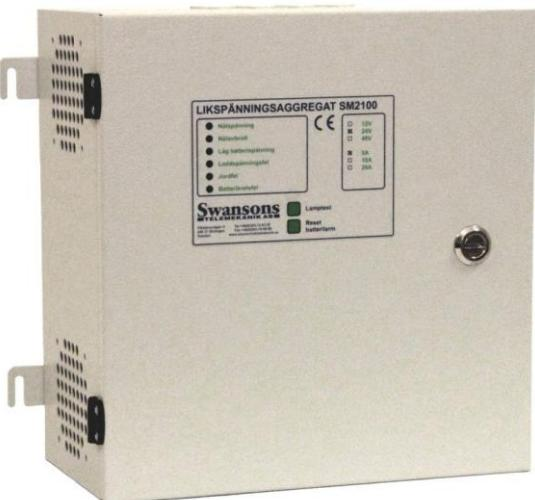
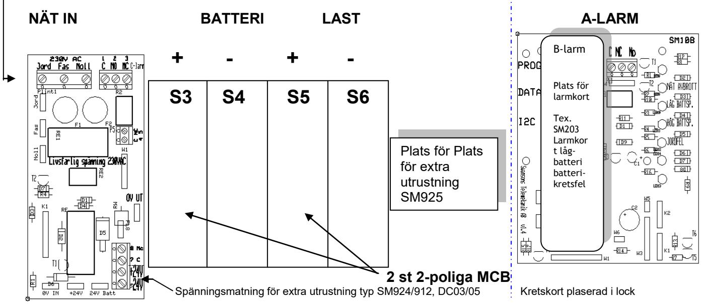
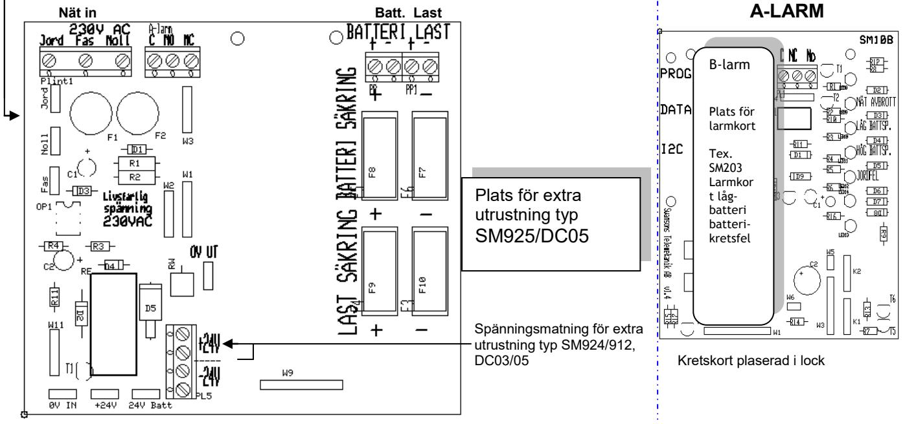

# **Manual Likriktare SM2100**

Postadress/Postal address **Swansons Telemekanik AB** Hålstensvägen 4 SE-446 37 Älvängen Telefon nr/Telephone no +46(0)303-746 320 Hemsida/Webb www.swtm.se Telefax nr/Telefax no +46(0)303-748 490 e-post info@swtm.se VAT.NO SE556289017701

| Beskrivning                                  | Sid |
|----------------------------------------------|-----|
|                                              |     |
| Innehållsförteckning                         | 2   |
| Säkerhet, Presentation, Funktionsbeskrivning | 3   |
| Driftsättning                                | 4   |
| Tekniska data / Interna säkringar            | 5   |

# **1. Säkerhet**

- Endast auktoriserad och erfaren personal inom AC och DC får använda, arbeta, serva/underhålla, installera denna enhet.
- Endast isolerade verktyg får användas i enheten.
- Observera att farliga spänningar och strömmar förekommer i apparaten både när interna säkringarna är av eller på.
- Denna manual skall läsas igenom grundligt och förstås av all handhavande personal. Vid minsta tveksamhet om systemets uppbyggnad, funktion, komponenter samt säkerhet skall leverantören kontaktas.

#### **2. Presentation**

SM 2100 är ett strömförsörjningsaggregat med små dimensioner och hög effekt. SM 2100 är lämpligt för drift av alla typer av svagströmsanläggningar som t.ex. telecom, larm, styr, rökluckor och passagesystem.

SM2100 är primärswitchad och har mycket lågt rippel och noggrann utspänning. Aggregatet är skyddat mot överbelastning och kortslutning.

Exakt laddning som ger maximala batteriprestanda. Skydd mot djupurladdning på batteriutgången.

Aggregatet är utfört i kiselgrå plåtkapsling med nätindikering på fronten. Kan enkelt förses med larmkort för olika typer av fellarm. Är vid leverans försedd med nätavbrottslarm. Larmen indikeras på front och summalarmrelä för vidaresändning. Aggregaten kan även förses med avsäkringskort och DC/DC omvandlare som snäppes fast på DIN-skena. Nät, last och batteri skyddas av säkringar.

# **3. Funktionsbeskrivning**

Inkommande 1-fas 230 V AC omvandlas via den primärswitchade effektmodulen inne i SM2100 enheten till en DC laddningsspänning som finns angiven på sida i manualen.

Inkommande växelspänning är avsäkrad via 2-poliga glasrörssäkringar och matar sedan effektmodulen som omvandlar den inkommande växelspänningen till en likspänning. DC-spänningen matar sedan batteriet (om det finns ett sådant anslutet) med en likspänning som är justerat på fabrik till rätt nivå, via 2-poliga glasrörssäkringar (alt. MCB) för anslutning till batteriet.

DC-spänningen matar även via 2-poliga glasrörssäkringar (alt. MCB) där en extern last kan anslutas.

SM2100 har följande skydd:

- Kortslutningsskydd
- Överbellastningsskydd
- Djupurladdningsskydd

I standardutförande har även SM2100 ett nätbortfallslarm, men kan enkelt kompletteras med ytterligare fler larmer (och även andra extra tillbehör, se kapitel 5).

Nätavbrottslarm indikeras med röd lysdiod på fronten och larmrelä som växlar.

## **4. Driftsättning**

- **Slå av batterisäkringar och utgångsäkringar**
- **Anslut 230V AC till "nät in" plinten. OBS! Det finns ingen AV/PÅ knapp på enhet vilket betyder att enheten startar så fort nätet ansluts.**
- **Kontrollera att utspänningen är riktig. Justera vid behov spänningen med P1.**
- **Anslut last och batteri**
- **Slå till batterisäkringarna och lastsäkringarna**
- **Kontrollera att den gröna lysdioden på fronten lyser och att inga larmer är aktiva.**

#### **Inkoppling SM2100 från 10 A och uppåt**

- **P1** Justering av utspänning

### **Inkoppling SM2100 2,5 - 5 A**

#### **P1 Justering av utspänning**

#### **5. Tekniska data**

| Inspänning:     | 88-264 VAC 1-fas 50-60Hz |
|-----------------|--------------------------------|
| Reglering:      | max 0,6 %                      |
| Rippelspänning: | Max 5% av utspänningen         |
| Temperaturomr:  | 0– 40 C                        |

| Nummer Typ | Apparatyp                                                                        | V / A | Batteri | Mått        |
|------------|----------------------------------------------------------------------------------|-------|---------|-------------|
| 210 02     | LADDN LIKR SM2100 12V 3A                                                         |       | 24AH    | 320x320x150 |
| 210 04     | LADDN LIKR SM2100 12V 5A                                                         |       | 24AH    | 320x320x150 |
| 210 10     | LADDN LIKR SM2100 12V 10A                                                        |       | 24AH    | 400x300x150 |
| 210 12     | LADDN LIKR SM2100 12V 10A                                                        |       | 45AH    | 400x400x210 |
| 210 14     | LADDN LIKR SM2100 12V 20A                                                        |       | 45AH    | 400x400x210 |
| 210 16     | LADDN LIKR SM2100 24V 3A                                                         |       | 7AH     | 320x320x150 |
| 210 17     | LADDN LIKR SM2100 24V 3A                                                         |       | 12AH    | 320x320x150 |
| 210 18     | LADDN LIKR SM2100 24V 3A                                                         |       | 24AH    | 400x400x210 |
| 210 19     | LADDN LIKR SM2100 24V 5A                                                         |       | 7AH     | 320x320x150 |
| 210 20     | LADDN LIKR SM2100 24V 5A                                                         |       | 12AH    | 320x320x150 |
| 210 21     | LADDN LIKR SM2100 24V 5A                                                         |       | 24AH    | 400x400x210 |
| 210 22     | LADDN LIKR SM2100 24V 5A                                                         |       | 45AH    | 600x400x260 |
| 210 23     | LADDN LIKR SM2100 24V 5A                                                         |       | 70AH    | 600x400x260 |
| 210 24     | LADDN LIKR SM2100 24V 10A                                                        |       | 24AH    | 400x400x210 |
| 210 26     | LADDN LIKR SM2100 24V 10A                                                        |       | 45AH    | 600x400x260 |
| 210 28     | LADDN LIKR SM2100 24V 10A                                                        |       | 70AH    | 600x400x260 |
| 210 30     | LADDN LIKR SM2100 24V 20A                                                        |       | 24AH    | 400x400x210 |
| 210 32     | LADDN LIKR SM2100 24V 20A                                                        |       | 45AH    | 600x400x260 |
| 210 35     | LADDN LIKR SM2100 24V 20A                                                        |       | 70AH    | 600x400x260 |
| 210 40     | LADDN LIKR SM2100 48V 2,5A                                                       |       | 7AH     | 400x400x210 |
| 210 41     | LADDN LIKR SM2100 48V 2,5A                                                       |       | 12AH    | 600x400x260 |
| 210 41     | LADDN LIKR SM2100 48V 5A                                                         |       | 7AH     | 400x400x210 |
| 210 44     | LADDN LIKR SM2100 48V 5A                                                         |       | 12AH    | 600x400x260 |
| 210 45     | LADDN LIKR SM2100 48V 5A                                                         |       | 33AH    | 600x400x260 |
| 210 48     | LADDN LIKR SM2100 48V 10A                                                        |       | 12AH    | 600x400x260 |
| 210 50     | LADDN LIKR SM2100 48V 10A                                                        |       | 33AH    | 600x400x260 |
| SM205A     | Larmkort Nätavbrott , laddspänningsfel, batterikretsfel, lågsp.larm.          |       |         |             |
| SM205L     | Larmkort Nätavbrott , laddspänningsfel, batterikretsfel, lågsp.larm., jordfel |       |         |             |
| 1203       | DC3 DC/DC 0MV 24/12V 3A                                                          |       |         |             |
| 1205       | DC5 DC/DC 0MV 24/12V 5A                                                          |       |         |             |
| 925F       | SM925 AVSÄKRINGSKORT 5 GRUPPER M. LARM 24V                                       |       |         |             |

#### **Interna säkringar**

| Typ             | F1,F2    | S3,S4    | S5,S6       |
|-----------------|----------|----------|-------------|
|                 | Nätsäkr. | Lastsäkr | Batterisäkr |
|                 |          |          |             |
| SM2100 12V 5A   | 2 AT     | 5 AT     | 6,3 AT      |
| SM2100 12V 10A  | 2 AT     | 10 AT    | 13 AT       |
| SM2100 12V 20A  | 4AT      | 20 AT    | 25 AT       |
|                 |          |          |             |
| SM2100 24V 5A   | 2 AT     | 5 AT     | 6,3 AT      |
| SM2100 24V 10A  | 4 AT     | 10 AT    | 13 AT       |
| SM2100 24V 20A  | 6,3 AT   | 20 AT    | 25 AT       |
|                 |          |          |             |
| SM2100 48V 2,5A | 2 AT     | 2 AT     | 3,15 AT     |
| SM2100 48V 5A   | 6,3 AT   | 5 AT     | 6,3 AT      |
| SM2100 48V 10A  | 6,3 AT   | 10 AT    | 13 AT       |
|                 |          |          |             |