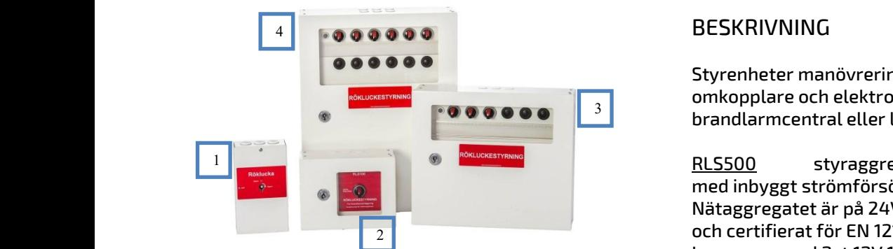
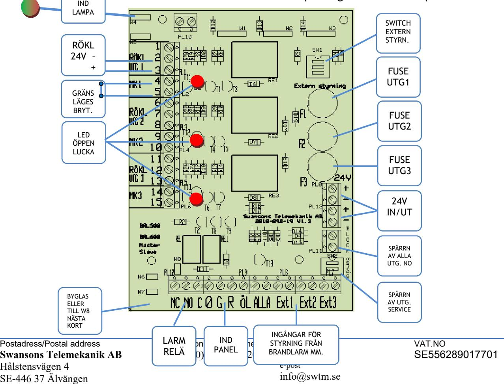
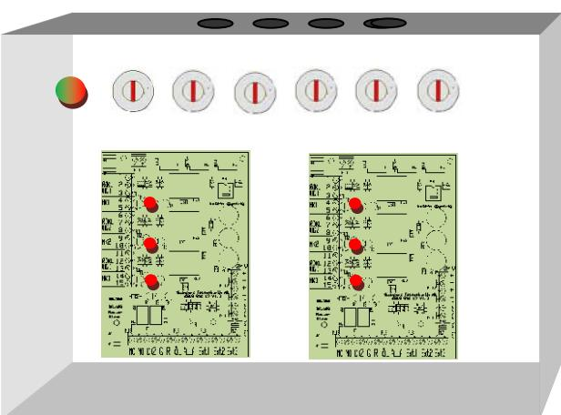
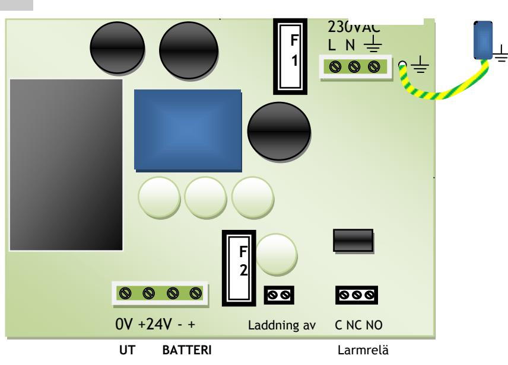

### **RLS 100/500/600 RÖKLUCKESTYRNING**

Skydd: Aggregatet är skyddad mot överbelastning och kortslutning. Inbyggt skydd mot djupurladdning av batterierna. Nät, last och batteri skyddas av säkringar. Indikeringar och larm: Status indikeras med lysdiod på fronten. Grön lysdiod normaldrift. Röd lysdiod vid - aktiverad röklucke-styrning, fel från magnetkontakt, lampfel. Summalarmrelä för vidarekoppling av larm,

öppen lucka, indikerings- eller säkringsfel.

#### STYRNINGAR

#### Utgångar-

- 1-12st grupper av rökluckor beroende på modell
- Yttre panel för indikering eller styrning av rökluckor från annan plats.
- Summalarmrelä
- Ingångar-
- Gränslägesbrytare för indikering stängd röklucka
- Styrning av rökluckor från brandlarmcentral
- Spärrning av utgångar
- Service switch som förhindrar ofrivilligt öppnande av luckor.

### BESKRIVNING

Styrenheter manövrering av rökluckor med omkopplare och elektronik för styrning från brandlarmcentral eller liknande.

RLS500 styraggregat för 1-6 sektioner med inbyggt strömförsörjning och batterier. Nätaggregatet är på 24V 3A och primärswitchat och certifierat för EN 12101-10. Levereras med 2st 12V 12Ah underhållsfria blybatterier.

Aggregatet är utfört i vit plåtkapsling och avsett för väggmontage med 6st genomförningar uppåt. Nät, last och batteri skyddas av säkringar.

RLS600 styraggregat för 1-12 sektioner och är avsett för yttre nätaggregat och har samma funktioner som RLS500.

RLS40 Nyckelstyrd central för rökluckor. För 1 sektion med inbyggd strömförsörjning på 24V 0,5A samt 2st 12V 0,8Ah batterier.

RLS100 Obestyckade kapslingar. Finns från 1-12vred,

#### TEKNISKA DATA

| Inspänning | 230VAC +/- 15%                         |
|------------|----------------------------------------|
|            | 1 fas 50-60Hz                          |
| Reglering  | max 0,6 %                              |
|            | Rippelspänn. max 0,5 % av utspänningen |
| Temp.omr-  | 0 – 30 C                               |
| CE-märkt   | EN61000-6-3:2001                       |
|            | EN61000-6-2:2005                       |

| E-Nr    | Typ       | Utsp. / Ström | Utgångar                           | Batteriplats | Kapsling | HxBxD mm    |
|---------|-----------|---------------|------------------------------------|--------------|----------|-------------|
| 6301010 | RLS40     | 24V 0,5A      | 1 utgång                           | 2x0,8Ah      | 1        | 200x110x60  |
| 6301000 | RLS500-1  | 24V 0,5A      | 1 utgång                           | 2x0,8Ah      | 2        | 160x220x80  |
| 6301003 | RLS500-3  | 24V 3A        | 3 utgångar                         | 2x12Ah       | 4        | 465x360x115 |
| 6301004 | RLS500-6  | 24V 3A        | 6 utgångar                         | 2x12Ah       | 4        | 465x360x115 |
| 6301001 | RLS600-1  | - -        | 1 utgång                           |              | 2        | 160x220x80  |
| 6301005 | RLS600-3  | - -        | 3 utgångar                         |              | 3        | 350x360x100 |
| 6301006 | RLS600-6  | - -        | 6 utgångar                         |              | 3        | 350x360x100 |
| 6301007 | RLS600-9  | - -        | 9 utgångar                         |              | 4        | 465x360x115 |
| 6301008 | RLS600-12 | - -        | 12 utgångar                        |              | 4        | 465x360x115 |
| 6301002 | RLS100-1  |               | Tom kapsling med hål för vred      |              | 2        | 160x220x80  |
| 6305002 | RLS100-2  |               | Tom kapsling med hål för 2st vred  |              | 2        | 160x220x80  |
| 6305003 | RLS100-6  |               | Tom kapsling med hål för 6st vred  |              | 3        | 350x360x100 |
| 6305004 | RLS100-12 |               | Tom kapsling med hål för 12st vred |              | 4        | 465x360x115 |

Postadress/Postal address **Swansons Telemekanik AB** Hålstensvägen 4 SE-446 37 Älvängen

Telefon nr/Telephone no +46(0)303-746 320

Hemsida/Webb www.swtm.se e-post info@swtm.se VAT.NO SE556289017701

## **RLS500/600 RÖKLUCKESTYRNING**

#### FUNKTION

- RLS 500/600 serien är en grupp styrcentraler avsedda för rökluckor med 24V magneter. Varje utgång har en växlande utgångs funktion och en ingång för gränslägesbrytare eller magnetkontakt för att övervaka rökluckornas läge. Varje utgång kan även individuellt styras från brandlarmcentral eller rökdetektor. Summalarmrelä finns för vidaresändning till larmcentral eller liknande. Indikeringslampa i fronten indikerar status på styrcentralen.  **SM40 Strömförsörjning med plats för batteri**
	- Vid normalt driftläge lämnas en konstant 24V spänning på utgång RÖKL 1 plint nr3 och plint nr1 är spänningslös. Plint nr2 är en gemensam minus för utgången. Ingång MK1 skall kopplas till någon form av brytare vid rökluckan för övervakning av om den är öppen eller stängd. Kontakten ska vara normalt sluten och brytas vid öppning.
- När vred eller ingång för extern öppning av röklucka aktiverats, försvinner 24V spänningen på utgång RÖKL 1 plint nr3 och spänningen kopplas till plint nr1 Rökluckorna öppnas och vredet lyser rött och larmreläet växlar. När vredet återställs kommer spänningen tillbaka på plint nr3. Lampan i knappen släcks när alla rökluckorna är stängda och övervakningsslingan är sluten. Larmreläet återställsautomatiskt.
- Styrning från brandlarmcentral eller rökdetektor med reläkontakt, kopplas till EXT plinten( NC). Ext1 styr utgång RÖKL1 osv. För att aktivera en extern styringång måste SW1 – Extern styrning – ställas i läge off. Brytare nr1 styr ingång Ext1 osv. Ingång ALLA styr alla tre utgångarna och då måste alla brytarna i SW1 ställas i läge off. Kontakten ska vara normalt sluten och brytas vid öppning. Rökdetektorn spänningsmatas från 24V plinten.

## **RLS500/600 RÖKLUCKESTYRNING**

 **SM40** 

### FUNKTION

#### EXTRA INDIKERINGSPANEL

- Extra panel för indikering, av status på övervakningen av rökluckor, för fastighetsskötare eller liknande. Kopplas till plint 9 och visar om luckor är stängda eller öppna.
#### BLOCKERING AV UTGÅNGAR

- BLOCK ingång Spärrar all utgångar när man inte vill att rökluckor ska öppnas tex vid sprinklerfunktion eller liknande. För spärrning så skall plint 1 kopplas till kontakt med slutande funktion.
- SERVICE Brytare som kan användas vid service för att förhindra oavsiktlig öppning av luckor. Ställs i läge ON för spärrning av alla utgångar.

#### SAMMANKOPPLING AV STYRKORT

- W7 kort1(Som normalt är försedd med jumper) kopplas till W8 på kort2 – kontakt till kontakt. W7 på kort2 förses med jumper.
#### FELINDIKERINGAR  **Strömförsörjning med plats för batteri**

#### INDIKERINGAR

- Indikeringslampan på fronten lyser grönt som driftindikering och allt är OK.
- Indikeringslampan lyser rött, lampan i vredet är tänd, LED på kortet lyser - Någon lucka är öppen/fel på gränslägesbrytare. Larmrelä aktiverat.
- Indikeringslampan lyser rött Säkring för utgång har löst. Lampa i vred och LED på kortet lyser inte och utspänning borta. Larmrelä aktiverat.

#### RLS600-6

Postadress/Postal address **Swansons Telemekanik AB** Hålstensvägen 4 SE-446 37 Älvängen

Telefon nr/Telephone no +46(0)303-746 320

Hemsida/Webb www.swtm.se e-post info@swtm.se VAT.NO SE556289017701

## **RLS500/600 RÖKLUCKESTYRNING**

 **SM40** 

### SÄKERHET

Endast auktoriserad och erfaren personal inom AC och DC får använda, arbeta,

serva/underhålla, installera denna enhet. Endast isolerade verktyg får användas i enheten.

Observera att farliga spänningar och strömmar förekommer i apparaten både när interna säkringarna är av eller på.

Denna instruktion skall läsas igenom grundligt och förstås av all handhavande personal. Vid minsta tveksamhet om systemets uppbyggnad, funktion, komponenter samt säkerhet skall leverantören kontaktas.

Kontrollera att kretskort sitter fast och inte är transportskadade.

Om batterier används är dessa alltid elektrokemiskt aktiva.

Kortslut inte batteripolerna.

| Modell   | Säkring F1 | Säkring F2 |  |
|----------|------------|------------|--|
| RLS500-3 | 2AT Cer    | 3,15AT     |  |
| RLS500-6 | 2AT Cer    | 3,15AT     |  |

#### INKOPPLING  **Strömförsörjning med plats för batteri**

- Montera aggregatet fritt. Minst 100mm på varje sida.
- Lossa de två skruvarna i locket.

 

- Lätta försiktigt på locket och lossa bandkabeln till lysdiodskortet.
- Placera batterierna på avsedd plats i skåpet och anslut med batterikablarna.
- Anslut först 230V AC. Spänningsätt.
- 3st gröna LED tänds på fronten.
- Kontrollera att utspänningen är riktig.
- Anslut därefter lasten.

- Löser utgångssäkringarna, kontrollera inkoppling och inkopplade apparater.
- Larmrelä ritade i olarmat läge.

# RLS500-3/6 Powermodul

Postadress/Postal address **Swansons Telemekanik AB** Hålstensvägen 4 SE-446 37 Älvängen

Telefon nr/Telephone no +46(0)303-746 320

Hemsida/Webb www.swtm.se e-post info@swtm.se VAT.NO SE556289017701