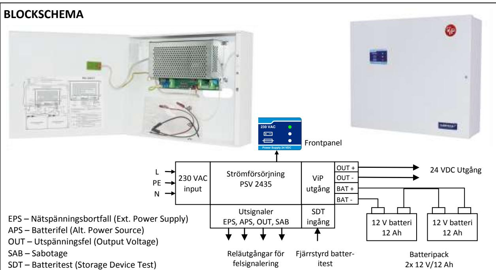
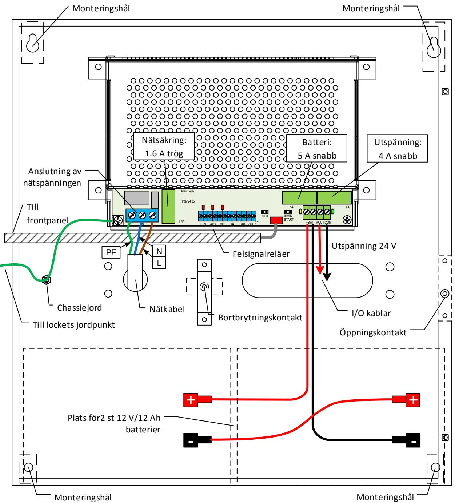
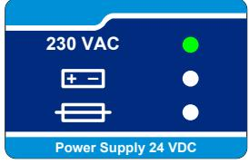
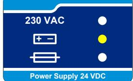
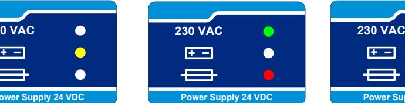
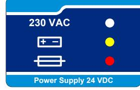
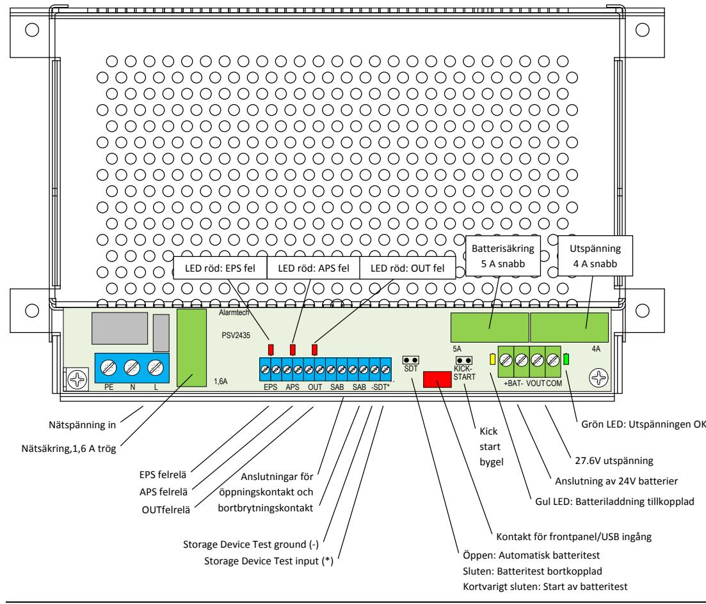

# **PSV 2435-12**

#### **BESKRIVNING**

PSV 2435-12 är en strömförsörjningsenhet med batteriladdning och plats för 2 st batterier 12V/12Ah. Den uppfyller normen EN 50131–6:2008, Säkerhetsklass 3, Miljöklass II. Den skall anslutas till nätet med ett frånkopplingsdon som ligger nära och är lätt tillgängligt. Den skall anslutas till nätet med ett frånkopplingsdon som ligger nära och är lätt tillgängligt.

PSV 2435-12 har den unika funktionen ViP (Voltage in Parallell) som har utvecklats av ALARMTECH. Strömförsörjningsaggregat med ViP funktion kan parallellkopplas, både plus (+) och minus (-) på samma matningsslinga utan extra synkronisering. Enheter anslutna på slingan kommer att dela på lasten. ViP funktionen kan användas för att bygga distribuerade och felsäkra strömförsörjningsanläggningar (redundans). Genom att placera ytterligare ViP aggregat på slingan kan ViP funktionen användas för att kompensera för spänningsfall.

Spänningsomvandlingen baseras på en högfrekvent SMPS resonans mode regulator med hög verkningsgrad och liten inre värmeutveckling som skyddar batterierna från överhettning. Den processorstyrda batteriladdningen arbetar med konstant spänning och begränsad ström, den mest avancerade och den bästa metoden för att erhålla längsta möjliga batterilivslängd.

Strömförsörjningsaggregatet har inbyggd självdiagnostik som indikerar nätspänningsbortfall, olika typer av batterifel, låg utspänning och säkringsfel.

Strömförsörjning till 24 V installationer för larmsystem

- Distribuerad strömförsörjning för att kompensera för spänningsfall och att bygga felsäkra system.
### **EGENSKAPER**

- Larmklass 3 (EN 50131-6:2008Security Grade 3 Class II)
- Typ A nätanslutning med laddningsbara batterier
- Utspänning 27,6 V
- Totalt maximalt strömuttag: 3,5 A
- Max ström till anläggningen 3 A
- Maximal batteriladdningsström: 0,2 A
- ViP (Voltage-in-Parallel) funktionen utökar säkerheten och kapaciteten I systemet. Strömförsörjningsenheter med ViP kan anslutas parallellt och delar lasten utan extra synkronisering oberoende märkströmmen
- Plats för och kapacitet att ladda två 12 V/12 Ah slutna blyackumulatorer på ca 24 tim från 0-80%.
- Kortslutningsskydd och överbelastningsskydd
- Detektering av nätspänningsbortfall (EPS-fel)
- Detektering av låg utspänning (OUT-fel)
- Detektering av säkringsfel (OUT-fel)
- Detektering av olika typer av batterifel (APS-fel) t.ex. ej anslutna batterier, låg spänning, hög intern resistans
- Djupurladdningsskydd för batterier som kopplar bort batteriet för låg batterispänning (DDP Deep Discharge Protection)
- Lokal eller fjärrstyrd start av batteritest
- Sabotageskydd mot öppning eller bortbrytning av plåtskåpet
- Anslutna batterier skall ha minst Flamklass V-2

outputs

test

**TILLÄMPNINGAR**

och industriella anläggningar

### **1. INSTALLATION**

#### **PSV 2435-12 Installationsanvisning och Uppstart:**

- Enheten måste anslutas till nätet med ett frånkopplingsdon som ligger nära och är lätt tillgängligt
- Montera enheten med hjälp av de 4 fästhålen
- Placera två slutna blyackumulatorer 12 V/12 Ah i botten av kapslingen med Flamklass minst V-2 enligt UL
- Koppla ihop batterierna med den medlevererade röda kabeln med kontakter i båda ändarna. Vänster batteri (-) till höger batteri (+).
- Anslut höger batteri (-) med svart batterikabel
- Anslut vänster batteri (+) med röd batterikabel
- Anslut utrustningen som skall spänningsmatas till utspänning 27,6V DC
- Om felutgångar/styringång för batteritest (utgång

EPS, APS, OUT, SAB, ingång –SDT*(Storage Device Test) skall användas anslut dessa till extern utrust-

- ning Säkerställ att 230 VAC kabeln inte är ansluten till elnätet
- Anslut 230 VAC kabeln till ingång 230 VAC, säkerställ att jordning sker på korrekt sätt
- OBS. Av säkerhetsskäl är batterierna bortkopplade när nätspänningen inte är tillkopplad. Innan nätspänningen är ansluten kan anläggningen drivas med enbart batterierna men då måste kick-starten användas för att öppna den elektroniska spärren.
- Slå på nätspänningen PSV 2415-7 kommer att starta automatiskt och leverera ström till anläggningen och övervaka alla funktioner

## **2. TEKNISK BESKRIVNING**

#### 2.1 Frontpanel

PSV 2435 har en indikeringspanel på lådans framsida som visar aktuell status. Panelens tre lysdioder indikerar:

Grön LED: Nätspänning OK – enheten är i EPS läge och matad från elnätet Gul LED: Nätspänning saknas - enheten är i APS läge och matas från batteri Röd LED: Fel detekterat – identifiering av fel är möjligt med hjälp av lysdioderna på kretskortet.

**Enheten OK** Matas från elnätet Batteri OK Utgång OK Inga fel

- **FEL på enheten** Saknar nätspänning (EPS utgång aktiv) Matas från batteri Inga andra fel
**FEL på enheten** Matas från elnätet Möjliga fel: APS (batteri) OUT (utspänning)

**FEL på enheten** Saknar nätspänning Matas från batteri Möjliga fel: APS (batterispänning låg) OUT (säkringsfel)

### 2.2 Interna indikeringar på kretskortet samt anslutningar i strömförsörjningsenheten

Elektronikens funktion visas med lysdioder (LED) på kretskortet för snabb identifiering. I bilden nedan visas placeringen av statusdioderna. Förklaring till diodernas färger är följande:

- Grön Normalt läge, OK
- Röd Fel detekterat
- Gul Informationsindikering

#### 2.3 Bygelfält

Strömförsörjningsenheten har 2 bygelfält som är placerade på kretskortet:

- "Kick-start" bygel (default-läge: öppen)

| Tillfällig bygling                                          | "Kick-start" av enheten från batteri (utan nätanslutning) |
|-------------------------------------------------------------|-----------------------------------------------------------|
| Öppen (default)                                             | Djupurladdningsskydd (DDP) av batteri aktiverat           |
| Stängd Djupurladdningsskydd (DDP) av batteri frånkopplat |                                                           |

- LBD (Local Battery Diagnostics) bygel (default-läge: öppen)

| Tillfällig bygling | Batteritest aktiverat (30 sek test av batteriets resistans) |
|--------------------|-------------------------------------------------------------|
| Öppen (default)    | Batteriladdning aktiverad                                   |
| Stängd             | Batteriladdning frånkopplad                                 |

#### 2.4 In och utgångar

| Ingång / Utgång     | Märkning | Beskrivning                                              |
|---------------------|----------|----------------------------------------------------------|
| Nätspänning         | PE, N, L | Anslutning av skyddsjord fas och nolla                   |
| Spänningsutgång     | -24VDC+  | en (-) och en (+) plint för enheter som skall matas      |
| Batterianslutning   | -BAT+    | (-) och (+) anslutning för 2st 12 V batterier            |
| Nätfelsutgång       | EPS      | Potentialfri NC opto reläutgång indikerar EPS fel        |
| Batterifelsutgång   | APS      | Potentialfri NC opto reläutgång indikerar APS fel        |
| Spänningsutgångsfel | OUT      | Potentialfri NC opto reläutgång indikerar OUT fel        |
| Batteritestingång   | -RBD*    | Test aktiveras vid tillfällig bygling mellan (-) och (*) |
| Sabotageutgång      | 2xSAB    | Anslutning av öppningskontakten och kontakten för        |
|                     |          | bortbrytning.                                            |

#### **3. TEKNISKA DATA**

| Typ av strömförsörjning:                 | Typ A nominellt 24V med batteriladdning,                        |
|------------------------------------------|-----------------------------------------------------------------|
| Nominell inspänning:                     | 230 VAC +/-15%, 0,71A med maximal last, 50 Hz                   |
| Utspänning:                              | 27,6 V DC                                                       |
| Totalt max strömuttag                    | 3,5 A                                                           |
| Max ström till anläggningen              | 3 A                                                             |
| Max ström till batteriet                 | 0,5A                                                            |
| Maximal rippel:                          | < 50mV                                                          |
| Batterityp:                              | Två 12 V/7 Ah blyackumulatorer (slutna) i serie med Flam        |
|                                          | klass minst V-2 enligt UL.                                      |
| Batteriladdningsmetod:                   | Konstant ström – begränsad spänning                             |
| Tid för återuppladdning av batterierna:  | Max 24 timmar                                                   |
| Batterispänning som aktiverar APS fel:   | 22 V                                                            |
| Batterispänning som aktiverar DDP krets: | 20 V                                                            |
| Utspänning som aktiverar OUT fel:        | 18 V                                                            |
| Övervakningsutgångar:                    | EPS – Nätspänningsfel                                           |
|                                          | APS – Batteri låg spänning, batterifel                          |
|                                          | OUT – Utspänning låg, Nätdelsfel                                |
|                                          | SAB – Kapslingssabotage                                         |
| Elektriska data på statusutgångar:       | Optoisolerade halvledarreläer                                   |
|                                          | för EPS, APS, OUT, max ström 100mA                              |
|                                          | Microswitchar för öppningsskydd och bortbrytningsskydd.         |
| Logiska data på statusutgångar:          | Sluten – inget fel (OK)                                         |
|                                          | Öppen – fel (LARM)                                              |
| Ingång för fjärrstyrd batteritest:       | -SDT* - slutning mellan (-) och (*) aktiverar 30 sek test av in |
|                                          | tern batteriresistans                                           |
| Bekräftelse på fjärrstyrd batteritest:   | APS utgång                                                      |
| Lokalt batteritest:                      | LBD bygel, tillfällig bygling                                   |
| Automatisk batteritest:                  | Aktiveras automatiskt var 10:e timme                            |
| Arbetstemperatur och luftfuktighet:      | -10º C…+40º C, RH till 90%, ingen kondensering                  |
| Miljöklass enligt EN 50130-5:1998:       | Miljöklass II                                                   |
| Uppfyller kraven:                        | SBSC säkerhetsklass 3, EN 50131-6:2008 Grade 3, Class II        |
| Lådans ytterdimensioner                  | 325x275x80 mm (BxHxD)                                           |
| Vikt utan batterier                      | 2,9 kg                                                          |