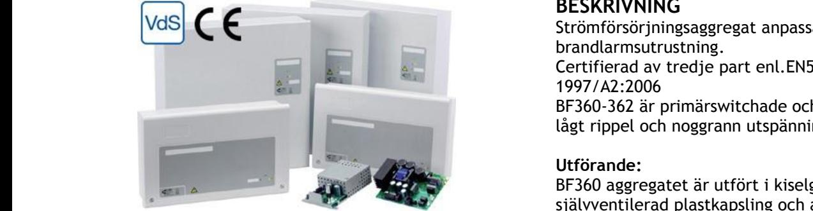

# **BF360-362**

**STRÖMFÖRSÖRJNING certifierade enl. EN54-4**

## **Skydd**:

Aggregatet är skyddat mot överbelastning och kortslutning. Inbyggt skydd mot djupurladdning av

batterierna. Nät och batteri är skyddas av säkring.

# **Indikeringar och larm**

| Drift: Fel: | Indikeras med grön lysdiod. Indikeras med gul lysdiod. |  |  |  |
|----------------|-----------------------------------------------------------|--|--|--|
|                | Växlande potentialfritt larmrelä (1A 50V).             |  |  |  |
| Externt fel:   | Indikeras med gul lysdiod.                                |  |  |  |
|                |                                                           |  |  |  |

Fellarm: Fel indikeras vid batterikretsfel eller laddarfel.

# **EXTRAUTRUSTNING**

Plats finns för eftermontage av ex. SM925 avsäkringskort m. 5 grupper. SM950 larmdonskort och I/O enheter.

# **BESKRIVNING**

Strömförsörjningsaggregat anpassad för drift av brandlarmsutrustning. Certifierad av tredje part enl.EN54-4; 1997/A2:2006 BF360-362 är primärswitchade och har mycket lågt rippel och noggrann utspänning.

## **Utförande:**

BF360 aggregatet är utfört i kiselgrå självventilerad plastkapsling och avsett för väggmontage. BF362 aggregatet är utfört i kiselgrå självventilerad plåtkapsling och avsett för väggmontage. AES aggregatet är utfört i kiselgrå självventilerad plåtkapsling och avsett för väggmontage.

Förberedd för 4st genomförningar uppåt. Kapslingsklass IP30.

Plats för underhållsfria blybatterier.

# **TEKNISKA DATA**

| Inspänning | 230VAC +/- 15%            |  |  |  |  |  |
|------------|---------------------------|--|--|--|--|--|
|            | 1 fas 50-60Hz             |  |  |  |  |  |
| Reglering  | max 0,6 %                 |  |  |  |  |  |
|            | Rippelspänn. max 0,1 % av |  |  |  |  |  |
|            | utspänningen              |  |  |  |  |  |
| Temp.omr-  | -15 – 40 C                |  |  |  |  |  |

#### *CE-märkt - EN61000-6-3:2001, EN61000-6-2:2005*

| E-Nummer | Typ        | Byglings alternativ | Utsp. | Utström    | Batterikapacitet max | Batteri plats internt | HxBxD mm        |
|----------|------------|------------------------|-------|------------|-------------------------|--------------------------|-----------------|
| 5250003  | BF360-12   | Alt. a                 | 12V   | 1,8A       | 4Ah                     | max 2x 3,4Ah             | 230 x 380 x 96  |
|          |            | Alt. b                 | 12V   | 1,3A       | 14Ah                    | max 2x 3,4Ah             | 230 x 380 x 96  |
| 5250004  | BF360-24   | Alt. a                 | 24V   | 1,3A       | 4Ah                     | max 2x 3,4Ah             | 230 x 380 x 96  |
|          |            | Alt. b                 | 24V   | 0,8A       | 14Ah                    | max 2x 3,4Ah             | 230 x 380 x 96  |
| 5250005  | BF362-1    | Alt. a                 | 24V   | 1A         | 10Ah                    | max 2x 18Ah              | 404 x 404 x 110 |
|          |            | Alt. b                 | 24V   | 0,5A       | 20Ah                    | max 2x 18Ah              | 404 x 404 x 110 |
| 5250006  | BF362-5    | -                      | 24V   | 4A         | 20Ah                    | max 2x 18Ah              | 404 x 404 x 110 |
| 5250007  | AES C38 SB | -                      | 24V   | 6A         |                         | Max 2 x 24Ah             | 289 x 350 x 189 |
| 5250010  | AES C85 SB | -                      | 24V   | 12A        |                         | Max 2 x 45Ah             | 408 x 408 x 224 |
| 5250011  | AES C180SB | -                      | 24V   | 16A        |                         | Max 2 x 70Ah             | 505 x 610 x 430 |
| E-Nummer | Typ        |                        |       |            |                         |                          |                 |
| 5247057  | SM950      | Larmdonskort           |       | 5 Utgångar |                         |                          |                 |