# **PowerWalker**

- 
- 
- 
- 
- 
- **VFI 6000 TGB VFI 10000 TGB**
- **VFI 6000 TGS VFI 10000 TGS**
- **VFI 6000 RTGE VFI 10000 RTGE**
- **VFI 6000 RTG VFI 10000 RTG**
- **VFI 6000 RTGS VFI 10000 RTGS**

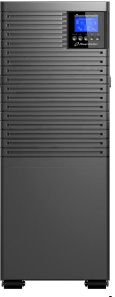

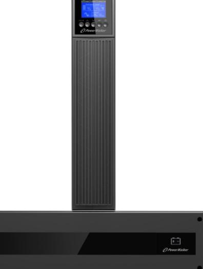

**User Manual**

| 1. INTRODUCTION 4                                                    |
|-------------------------------------------------------------------------|
| 1.1 ENVIRONMENTAL PROTECTION 4                                    |
| 2. PRESENTATION 6                                                    |
| 2.1 FRONT PANEL 6                                                    |
| 2.2 REAR PANELS 7                                                 |
| 2.3 CIRCUIT DIAGRAM 9                                             |
| 3. INSTALLATION 10                                                   |
| 3.1 INSPECTING THE EQUIPMENT  10                               |
| 3.2 UNPACKING THE UNIT  10                                     |
| 3.3 CHECKING THE ACCESSORY KIT 12                                 |
| 3.4 INSTALL THE UPS  13                                        |
| 3.5 INSTALL THE EBM  14                                        |
| 4. POWER CABLES CONNECTION 17                                        |
| 4.1 ACCESS TO TERMINAL BLOCKS(AC SOURCE TO UPS) 18             |
| 4.2 ACCESS TO TERMINAL BLOCKS(PDU SOURCE TO R/T UPS)(OPTIONAL) 20 |
| 4.3 PARALLEL INSTALLATION AND OPERATION 20                        |
| 5. OPERATION  24                                                  |
| 5.1 CONTROL PANEL  24                                          |
| 5.2 LCD DESCRIPTION 26                                         |
| 5.3 DISPLAY FUNCTIONS  29                                      |
| 5.4 USER SETTINGS 30                                              |
| 5.5 UPS STARTUP AND SHUTDOWN 31                                |
| 5.6 LCD OPERATION 32                                              |
| 6. COMMUNICATION 41                                                  |
| 6.1 COMMUNICATION PORTS  41                                    |

| 6.2 NETWORK MANAGEMENT CARD (OPTIONAL) | 42 |
|-------------------------------------------|----|
| 6.3 UPS MANAGEMENT SOFTWARE         | 42 |
| 7. UPS MAINTENANCE                     | 43 |
| 7.1 EQUIPMENT CARE                     | 43 |
| 7.2 TRANSPORTING THE UPS            | 43 |
| 7.3 STORING THE EQUIPMENT           | 43 |
| 7.4 REPLACING BATTERIES             | 44 |
| 7.5RECYCLING THE USED EQUIPMENT           | 46 |
| 8. TROUBLESHOOTING                        | 46 |
| 8.1 TYPICAL ALARMS AND FAULTS          | 46 |
| 8.2 SILENCING THE ALARM                | 51 |
| 9. SPECIFICATIONS                         | 51 |
|                                           |    |
| 9.1 MODEL SPECIFICATIONS            | 51 |

Service and support:

Call your local service representative

### **SAFETY INSTRUCTIONS**

**SAVE THESE INSTRUCTIONS. This manual contains important instructions that should be followed during installation and maintenance of the UPS and batteries.**

> The UPS models that are covered in this manual are intended for installation in an environment within 0 to 50°C, free of conductive contaminant.

### **Certification standards**

- Safety: EN 62040-1
- EMC: IEC/EN 62040-2
- Performance: IEC/EN 62040-3
- IEC 61000-4-2 (ESD): level 4.
- IEC 61000-4-3 (Radiated field): level 3.
- IEC 61000-4-4 (EFT): level 4.
- IEC 61000-4-5 (Fast transients): level 4.
- IEC 61000-4-6 (Electromagnetic field): level 3.
- IEC 61000-4-8 (Conducted magnetic field): level 4.

### **Special symbols**

The following are examples of symbols used on the UPS or accessories to alert you to important information:

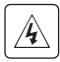

**RISK OF ELECTRIC SHOCK** - Observe the warning associated with the risk of electric shock symbol.

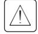

Important instructions that must always be followed.

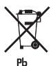

Do not discard the UPS or the UPS batteries in the trash.

This product contains sealed lead acid batteries and must be disposed as it's explain in this manual. For more information, contact your local recycling/reuse or hazardous waste center.

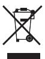

This symbol indicates that you should not discard waste electrical or electronic equipment (WEEE) in the trash. For proper disposal, contact your local recycling/reuse or hazardous waste center.

Information, advice, help.

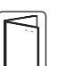

Refer to the user manual.

## **Safety of persons**

- RISK OF VOLTAGE BACKFEED. The system has its own power source (the battery). Isolate the UPS and check for hazardous voltage upstream and downstream during lockout-tagout operation. Terminal blocks may be energized even if the system is disconnected from the AC power source.
- Dangerous voltage levels are present within the system. It should be opened exclusively by qualified service personnel.
- The system must be properly grounded.
- The battery supplied with the system contains small amounts of toxic materials. To avoid accidents, the directives listed below must be observed:
	- Servicing of batteries should be performed or supervised by personnel knowledgeable about batteries and the required precautions.
	- When replacing batteries, replace with the same type and number of batteries or battery packs.
	- Do not dispose of batteries in a fire. The batteries may explode.
	- Batteries constitute a danger (electrical shock, burns). The short-circuit current may be very high.
- Precautions must be taken for all handling:
	- Wear rubber gloves and boots.
	- Do not lay tools or metal parts on top of batteries.
	- Disconnect charging source prior to connecting or disconnecting battery terminals.
	- Determine if battery is inadvertently grounded. If inadvertently grounded, remove source from ground. Contact with any part of a grounded battery can result in electrical shock. The likelihood of such shock can be reduced if such grounds are removed during installation and maintenance (applicable to equipment and remote battery supplies not having a grounded supply circuit).

### **Product safety**

- The UPS connection instructions and operation described in the manual must be followed in the indicated order.

- CAUTION To reduce the risk of fire, the unit connects only to a circuit provided with branch circuit overcurrent protection for :
63A rating, for 6kVA models,

100A rating, for 10kVA models

The upstream circuit breaker for Normal AC/Bypass AC must be easily accessible. The unit can be disconnected from AC power source by opening this circuit breaker.

- An additional AC contactor is used for backfeed protection and must comply with IEC/EN 62040-1 (the creep age and clearance distances shall meet the basic insulation requirements for pollution degree 2).
- Disconnection and overcurrent protection devices shall be provided by others for permanently connected AC input (Normal AC/Bypass AC) and AC output circuits.
- Check that the indications on the rating plate correspond to your AC powered system and to the actual electrical consumption of all the equipment to be connected to the system.
- For PLUGGABLE EQUIPMENT, the socket-outlet shall be installed near the equipment and shall be easily accessible
- Never install the system near liquids or in an excessively damp environment.
- Never let a foreign body penetrate inside the system.
- Never block the ventilation grates of the system.
- Never expose the system to direct sunlight or source of heat.
- If the system must be stored prior to installation, storage must be in a dry place.
- The admissible storage temperature range is -25°C to +60°C with battery(-15°C to +40°C without battery).

### **Special precautions**

- The unit is heavy: wear safety shoes and use vacuum lifter preferentially for handling operations.
- All handling operations will require at least two people (unpacking, lifting, installation in rack system).
- Straps are provided only for unpacking manually the unit from the carton; don't use the straps to carry the unit around. The unit can slip from the straps during handling (risk of injury and product damage):
	- keep 12in / 30cm minimum distance between the straps
	- lift the unit carefully and keep it at low height
- keep the unit horizontal during unpacking.
- Before and after the installation, if the UPS remains de-energized for a long period, the UPS must be energized for a period of 24 hours, at least once every 6 months (for a normal storage temperature less than 25°C). This charges the battery, thus avoiding possible irreversible damage.
- During the replacement of the Battery Module, it is imperative to use the same type and number of element as the original Battery Module provided with the UPS to maintain an identical level of performance and safety.

### **1. Introduction**

Thank you for selecting UPS to protect your electrical equipment. The UPS has been designed with the utmost care.

We recommend that you take the time to read this manual to take full advantage of the many features of your UPS (Uninterruptible Power System).

Before installing your UPS, please read the booklet presenting the safety instructions. Then follow the indications in this manual.

#### **1.1 Environmental protection**

Products are developed according to an eco-design approach.

#### **Substances**

This product does not contain CFCs, HCFCs or asbestos.

#### **Packing**

To improve waste treatment and facilitate recycling, separate the various packing components.

- The cardboard we use comprises over 50% of recycled cardboard.
- Sacks and bags are made of polyethylene.
- Packing materials are recyclable and bear the appropriate identification symbol

| Materials                 | Abbreviations | Number in the symbols |
|---------------------------|---------------|--------------------------|
| Polyethylene terephthalat | PET           | 01                       |
| High-density polyethylene | HDPE          | 02                       |
| Polyvinyl chloride        | PVC           | 03                       |

| Low-density polyethylene | LDPE | 04 |
|--------------------------|------|----|
| Polypropylene            | PP   | 05 |
| Polystyrene              | PS   | 06 |

Follow all local regulations for the disposal of packing materials.

### **Product**

The product is made up of recyclable materials.

Dismantling and destruction must take place in compliance with all local regulations concerning waste. At the end of its service life, the product must be transported to a processing center for electrical and electronic waste.

#### **Battery**

The product contains lead-acid batteries that must be processed according to applicable local regulations concerning batteries.

The battery may be removed to comply with regulations and in view of correct disposal.

#### **1.2 Electronic equipment protection**

The uninterruptible power system (UPS) protects your sensitive electronic equipment from the most common power problems, including power failures, power sags, power surges, brownouts, line noise, high voltage spikes, frequency variations, switching transients, and harmonic distortion.

Power outages can occur when you least expect it and power quality can be erratic. These power problems have the potential to corrupt critical data, destroy unsaved work sessions, and damage hardware - causing hours of lost productivity and expensive repairs.

With the UPS, you can safely eliminate the effects of power disturbances and guard the integrity of your equipment. Providing outstanding performance and reliability, UPS's unique benefits include:

- True online double-conversion technology with high power density, utility frequency independence, and generator compatibility.
- Selectable High Efficiency mode of operation.
- Standard communication options: one RS232 communication port, one USB communication port, one dry in port and dry out port.
- Optional connectivity cards with enhanced communication capabilities.
- Firmware that is easily upgradable without a service call.

## **2. Presentation**

**2.1 Front panel** 

Tower model:

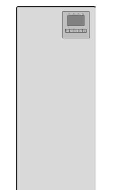

Tower UPS 6KS/10KS Tower UPS 6K/10K Tower EBM

RT model:

RT UPS 6K/6KS/10K/10KS UPS RT EBM

#### **2.2 Rear panels**

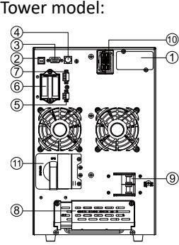

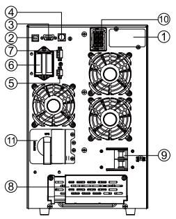

Tower UPS 6KS Tower UPS 10KS

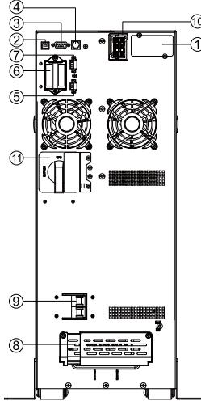

Tower UPS 6K Tower UPS 10K Tower EBM

- 1. Intelligent slot
- 2. USB
- 3. RS232

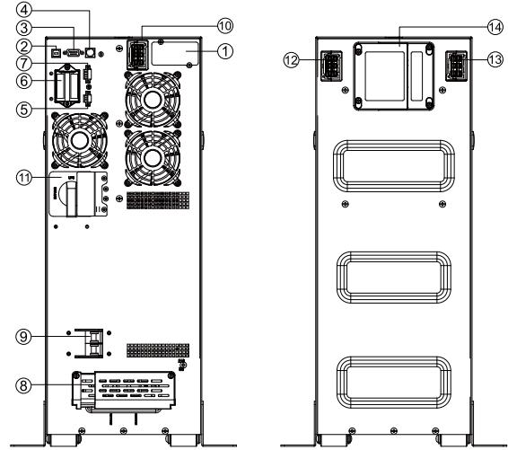

- 4. RJ11 (only for RT model)
- 5. EPO
- 6. Parallel card

- 7. Dry IN/OUT
- 8. Input /Output terminal

RT model:

(Standard model 5pole, IPL, IPN, PE, OPL, OPN; long backup model has 2 version, one is 5 Pole. Another is 7pole. 7pole add bat+, bat-, and no external battery connector #10.)

9. Input switch

- 10. External battery connector
- 11. Maintenance bypass switch (optional)
- 12. EBM connector
- 13. EBM connector
- 14. Fuse board cover (replace EBM fuse)

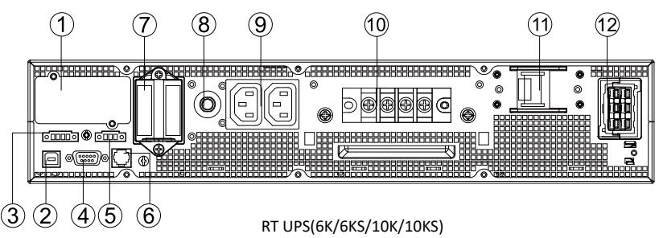

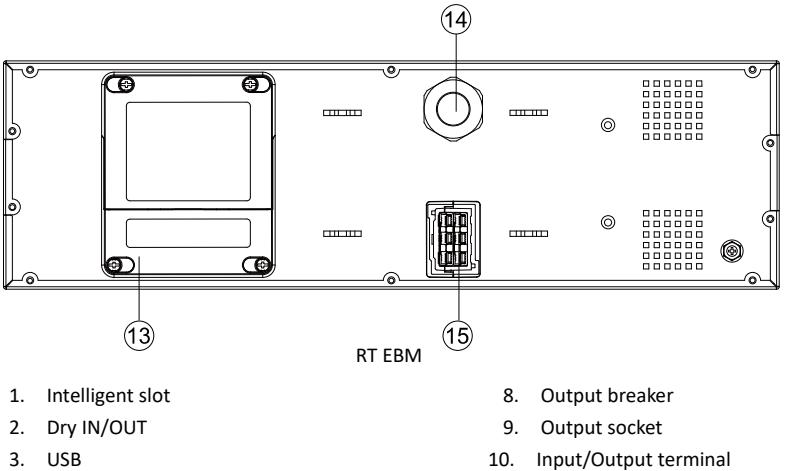

- 4. RS232
- 5. EPO
- 6. RJ11 (connect to PDU, only for RT model)
- 7. Parallel card
- (4pole IPL, IPN, OPL, OPN. PE is screw)
- 11. Input breaker (optional)
- 12. EBM connector
- 13. Fuse board cover (replace

EBM fuse)

15. EBM connector

14. EBM plug

#### **2.3 Circuit diagram**

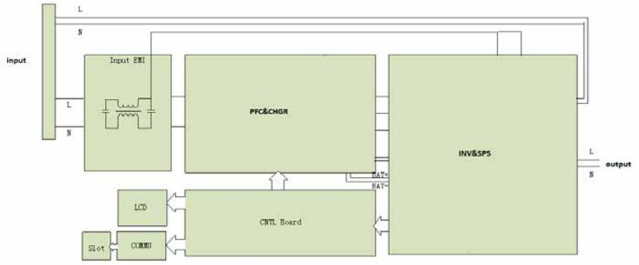

### **3. Installation**

It is recommended to move the equipment to the installation site by using a pallet jack or a truck before unpacking.

The system may be installed only by qualified electricians in accordance with applicable safety regulations.

The cabinet is heavy, please install it with two or more people.

#### **3.1 Inspecting the equipment**

If any equipment has been damaged during shipment, keep the shipping cartons and packing materials for the carrier or place of purchase and file a claim for shipping damage. If you discover damage after acceptance, file a claim for concealed damage.

### **3.2 Unpacking the Unit**

- 
 

- Unpacking the unit in a low-temperature environment may cause condensation occurred in and on the cabinet. Do not install the unit until the inside and outside of the unit are absolutely dry (hazard of electric shock).
Remove the packing materials and lift the unit out with two people at least.

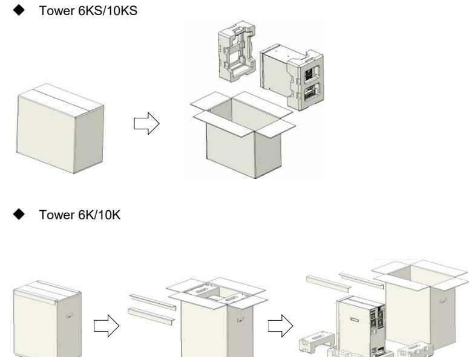

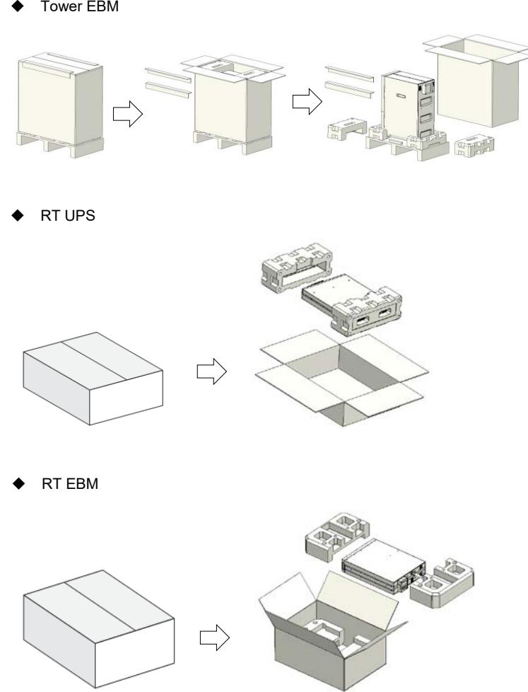

#### **Note:**

 

> The cabinet is heavy, please see spec weight provided on the carton/label. Do not lift the unit's front panel and rear panel.

Discard or recycle the packaging in a responsible manner, or store it for future

use.

Packing materials must be disposed in compliance with all local regulations concerning waste. Recycling symbols are printed on the packing materials to facilitate sorting.

#### **3.3 Checking the accessory kit**

Verify that the following additional items are included with the unit:

|                 | Tower UPS 6K/10K | Tower UPS 6KS/10KS | Tower EBM | RT UPS 6K/10K | RT UPS 6KS/10KS | RT EBM |
|-----------------|------------------------|--------------------------|--------------|------------------|--------------------|--------|
| Battery power   |                        |                          | V            |                  |                    | *      |
| cable           |                        |                          |              |                  |                    |        |
| USB cable       | V                      | V                        |              | V                | V                  |        |
| RS232 cable     | O                      | O                        |              | O                | O                  |        |
| Parallel cable  | V                      | V                        |              | V                | V                  |        |
| Dry contractor  | V                      | V                        |              | V                | V                  |        |
| EPO contractor  | *                      | *                        |              | *                | *                  |        |
| Stabilizer      | V                      |                          | V            | V                | V                  |        |
| bracket         |                        |                          |              |                  |                    |        |
| Extension plate |                        |                          |              |                  |                    |        |
| of Stabilizer   |                        |                          |              |                  |                    | V      |
| bracket         |                        |                          |              |                  |                    |        |
| Ear bracket     |                        |                          |              | V                | V                  | V      |
| Rail kit        |                        |                          |              |                  | O                  | O      |
| User manual     | V                      | V                        | V            | V                | V                  | V      |

V: standard configuration

*: assembled to unit

- O: optional configuration
If you ordered other accessories, please contact with local sale center.

### **3.4 Install the UPS**

#### **3.4.1 Tower model:**

1.Place the unit on a flat, stable surface in its final location,

- 2.Install 'Stabilizer bracket'(optional): remove side's screw from the unit, then install 'Stabilizer bracket' to the unit.
- 3.Install the unit to a surface(optional): place 4pcs bolts(M8 is recommended) to the final location previously, bolt's position please refer to below, then fix the unit to the bolts.

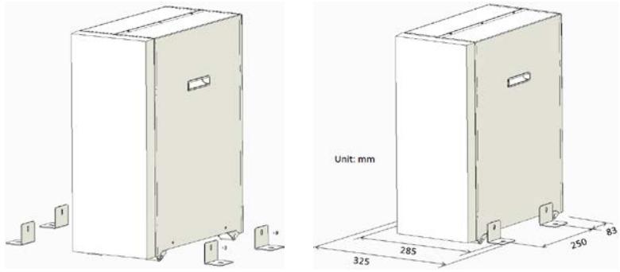

#### **3.4.2 RT model:**

#### **Rack position installing**

Identify the final position and keep '2U' space for this installing.

Note that you already installed a 'rail kit' to rack cabinet for this operation, and '1U' rail kit is recommended to be selected.

- 1. Install 'Ear bracket' to the unit by the M4 screws(flat head).
- 2. Slide the unit into 'rail kit' and make sure tighten the 'rack mounting screw' .

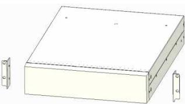

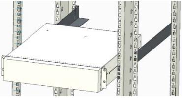

**Note:** 

This unit is suitable for 19 inch rack cabinet installation with a minimum of 800mm depth.

#### **Tower position installing**

- 1. Rotate the LCD model to tower direction
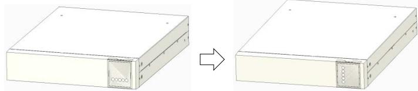

2. Set up the 'Stabilizer bracket', then take the unit into 'Stabilizer bracket'.

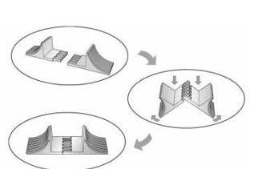

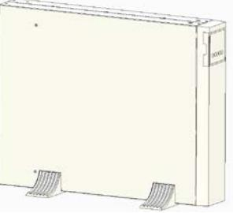

#### **3.5 Install the EBM**

#### **Tower EBM installation:**

- 1. Place the unit on a flat, stable surface in its final location.
- 2. Install 'Stabilizer bracket'(optional): remove the side's screw from the unit, then install 'Stabilizer bracket' to the unit.
- 3. Install the unit to a surface(optional): place 4pcs bolts(M8 is recommended) to the final location previously, bolt's position please refer to below, then fix the unit to the bolts.

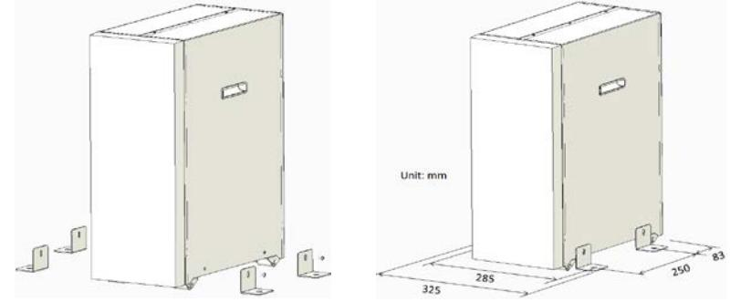

- 4. Plug 'Battery power cable' to UPS's external battery connector.
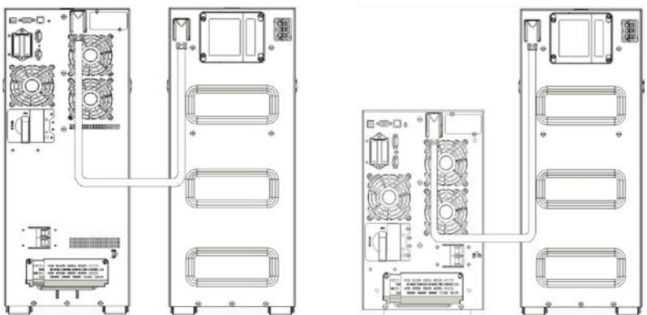

#### **Note:**

This 'Battery power cable' may have different plug according to the number of battery inside of this unit, please check the 'Voltage ' parameter on rear-panel if it matches the UPS before connection.

The battery number can be adjusted from '16pcs*2 strings' to '20pcs*2 strings' for this unit, if you ordered other type EBM, please contact with local sale center. If installing additional unit, place it next to the previous unit in their final location.

### **RT EBM installation: Rack position installing**

Identify the final position and keep '3U' space for this installing, and it is recommended to be installed below to UPS.

Note that you already installed a 'rail kit' to rack cabinet for this operation, and '2U' rail kit is recommended to be selected.

- 1. Install 'Ear bracket' to the unit by the M4 screws(flat head).
- 2. Slide the unit into 'rail kit' and make sure tighten the 'rack mounting screw' .

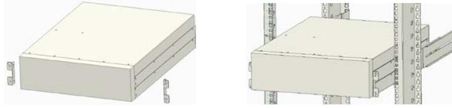

#### **Note:**

This unit is suitable for 19 inch rack cabinet installation with a minimum of 800mm depth.

- 3. Plug 'Battery power cable' to UPS's external battery connector.
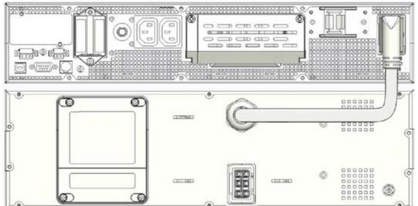

#### **Note:**

This 'Battery power cable' may have different plug according to the number of battery inside of this unit, please check the 'Voltage ' parameter on rear-panel if it matches the UPS before connection.

The battery number can be adjusted from '16pcs*1 strings' to '20pcs*1 strings' for this unit, if you ordered other type EBM, please contact with local sale center. If installing additional unit, place it next to the previous unit in their final location.

#### **Tower position installing**

- 1. Set up the 'Extension plate' as below and install to 'Stabilizer bracket' from UPS.
- 2. Connect to UPS with 'Battery power cable'--- Refer to rack position installing.

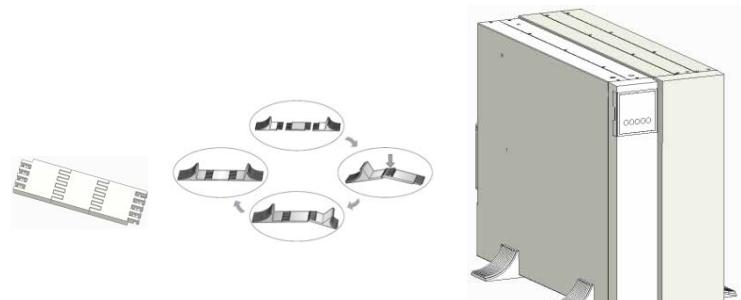

Note:

This unit is recommended to be installed to UPS's right side.

If installing additional unit, place it next to the previous unit in their final location.

### **4. Power cables connection**

Recommended protective devices and cable cross-sections

Recommended upstream protection

| UPS power rating | Upstream circuit  |
|------------------|-------------------|
| 6000VA           | D curve – 63A  |
| 10000VA          | D curve – 100A |

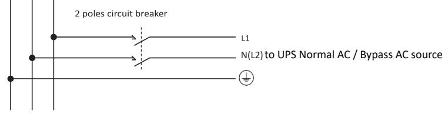

Read the Safety instructions page 3 regarding backfeed protection requirements. Recommended cable cross-sections

| 6K 10K Model |
|--------------------|
|--------------------|

| Protective earthing conductor Min cross section | 6mm^2 (8AWG) | 10mm^2 (6AWG) |
|----------------------------------------------------|--------------|---------------|
| Input L, N, G Min conductor cross section       | 6mm^2 (8AWG) | 10mm^2(6AWG)  |
| Input fuse                                         | 80A          | 100A          |
| Output L,N, Min conductor cross section         | 6mm^2 (8AWG) | 10mm^2(6AWG)  |

### **4.1 Access to terminal blocks(AC source to UPS)**

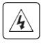

High leakage current:

Earth connection essential before connecting supply.

Common input/output sources connection

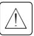

This type of connection must be carried out by qualified electrical personnel Before carrying out any connection, check that the upstream protection devices (Normal AC source and Bypass AC source) are open "O" (Off). Always connect the ground wire first

- 1. Remove the cover of terminal block.
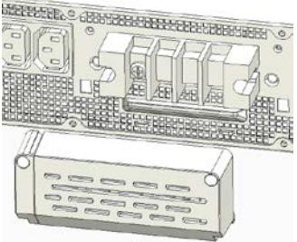

- 2. Connect the AC cable to terminal blocks refer to the indication on rear panel
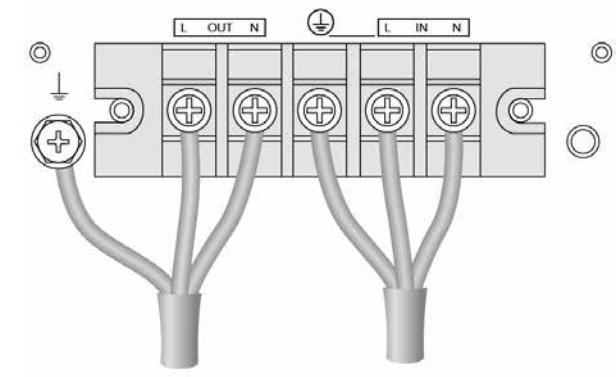

R/T model:

Tower model:

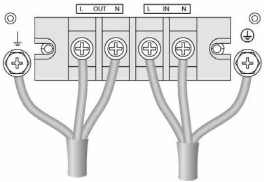

- 3. Tie up the AC cable to the rear panel.
- 4. Install back the cover of terminal block.

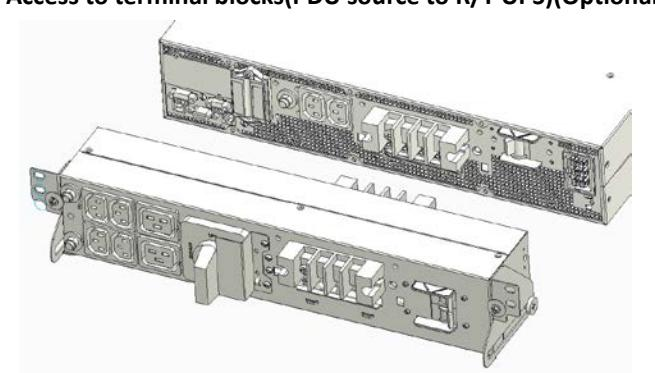

 If you ordered PDU model, please connect the UPS's terminal blocks from PDU's source, detail operation please refer to PDU's user manual.

#### **4.3 Parallel Installation and Operation**

As long as the UPS is equipped with parallel board and parallel cables, up to 3 UPSs can be connected in parallel to configure a sharing and redundant output power.

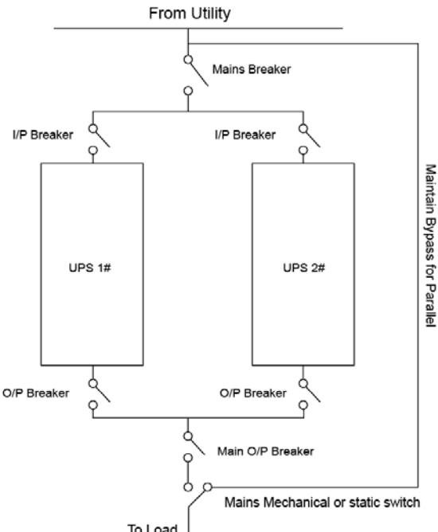

### **4.2 Access to terminal blocks(PDU source to R/T UPS)(Optional)**

#### **How to install a new parallel UPS system:**

- 1) Before installing a new parallel UPS system, please prepare the input /output wires, and breakers.
- 2) Independent battery packs for each UPS.
- 3) Remove the cover plate of parallel port on the UPS, connect each UPS one by one with parallel cable, and make sure the cable is screwed tightly.

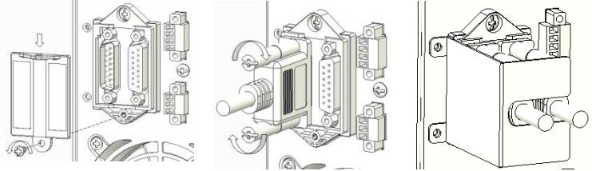

**Note:** The length of 'parallel cable' is appropriate to be less than 3 meters.

- 4) Connect the input and output wires and make sure all the breakers are turned off.

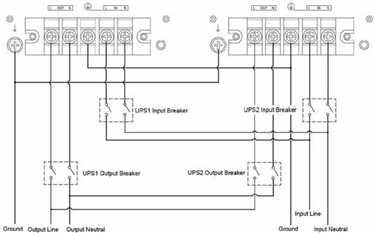

#### Rack model:

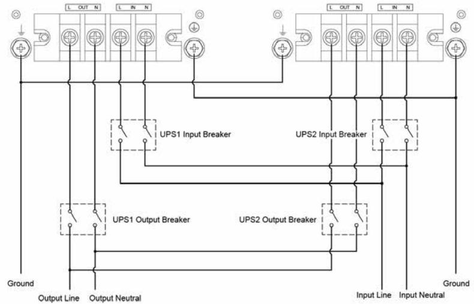

- 5) Turn on the input breakers for the parallel UPS.
- 6) Pressing button continuously for more than 1 second for one UPS of the system, then the system will turn on and enter line mode.
- 7) Regulate the output voltage of the each UPS separately, and check if the difference of output voltage is less than 0.5V among the parallel system. If the difference is more than 0.5V, the UPS need to be regulated.
- 8) If the difference output voltage is less than 0.5V, turn off the input breakers to let UPS shut down. And then switch on the output breakers for all the UPS.
- 9) Turn on the input breakers for the parallel UPS. Pressing button continuously for more than 1 second for one UPS of the system, then the system will turn on and enter line mode, after these operations, the system will work normally in parallel mode.

#### **The output wiring requirement as below:**

- 1) If the distance between the UPS and breaker panel is less than 10 meters in parallel system, the length difference between input and output cable of the UPSs is required to be less than 20%.
- 2) If the distance between the UPS and breaker panel is more than 20 meters

in parallel system, the length difference between input and output cable of the UPSs is required to be less than 5%.

#### **How to join a new UPS to parallel system:**

- 1) Firstly, a main maintenance mechanical switch or static switch should be installed for the parallel system.
- 2) Regulate the output voltage of the new UPS: check if the output voltage difference between the new UPS and the parallel system is less than 0.5V.
- 3) Ensure the bypass of the parallel system is normal and the auto bypass setting is "enable", then press the button to turn off the UPS, the UPS will turn to bypass mode.
- 4) Set the main maintenance switch or static switch from "UPS" to "BPS", then switch off the main output breaker, input breaker and mains breaker, then the UPS will shut down.
- 5) Connect the cable and wire for the new ups.
- 6) Switch on the input breakers and mains breaker, and make sure that every UPS work in bypass mode.
- 7) Switch on the O/P breakers and main O/P breaker,transfer the main maintenance switch or static switch from "BPS" to "UPS".
- 8) Press the button of one UPS, all the ups will turn on, after that, the system will work in Line mode.

#### **How to remove a single UPS from parallel system:**

- 1) Firstly, a main maintenance mechanical switch or static switch should be installed for the parallel system.
- 2) Ensure the bypass is normal and the auto bypass setting is "enable", press the button to turn off the UPS system, and the UPS system will turn to bypass mode.
- 3) Transfer the main maintenance switch or static switch from "UPS" to "BPS", then switch off the output breakers, input breakers and mains breaker in the parallel system, and the UPS will shut down.
- 4) Switch off the main O/P breaker and O/P breaker in the parallel system.
- 5) Remove the wanted UPS and disconnect cables/wires.
- 6) Switch on the mains breaker and input breaker of the reserved UPS, make sure the UPS work in bypass mode.
- 7) Switch on the O/P breaker and main O/P breaker.
- 8) Transfer the main maintenance switch or static switch from "BPS" to "UPS",

and press the button to turn on the UPS, and the UPS will turn on to Line mode.

### **5. Operation**

### **5.1 Control panel**

The UPS has a graphical LCD with five-button. It provides useful information about the UPS itself, load status, events, measurements and settings.

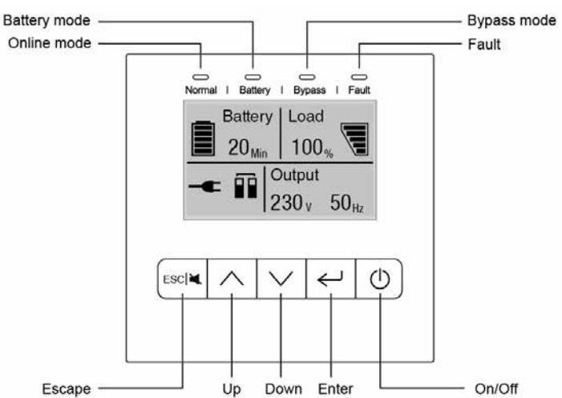

#### The following table shows the indicator status and description:

| Indicator           | Status | Description                                                            |  |
|---------------------|--------|------------------------------------------------------------------------|--|
| Normal (Green)   | On     | The UPS is operating normally on Online or on High Efficiency mode. |  |
| Battery (Orange) | On     | The UPS is on Battery mode.                                            |  |
| Bypass              | On     | The UPS is on Bypass mode.                                             |  |
| (Orange)            | Flash  | The UPS is on Standby mode.                                            |  |

|  | Fault (Red) | On | The UPS has an active alarm or fault. |
|--|----------------|----|---------------------------------------|
|--|----------------|----|---------------------------------------|

#### The following table shows the Control Button Functions:

| The Button | Function                       | Illustration                                                                                                                |
|------------|--------------------------------|-----------------------------------------------------------------------------------------------------------------------------|
|            | Power on                       | Press this button for >100ms&<1s can power on the ups without utility input at the condition of battery connected. |
|            | Turn on                        | When the unit is powered on and stayed is in Bypass mode, press this button for >1s can turn on the UPS.  |
|            | Turn off                       | Press this button >3s can turn off the UPS.                                                                                 |
|            | Clear fault                    | When the unit is in fault mode, press this button for >1s to stop alarm and clear fault                                  |
|            | Scroll up                      | Press this button for >100ms&<1s to scroll up the menu option                                                            |
|            | Scroll down                    | Press this button for >100ms&<1s to scroll down the menu option                                                          |
|            | Enter next menu tree        | Press this button for >100ms&<1s to select the present menu option, or enter next menu, but do not change any setting |
|            | Select one menu option      | Press this button for >100ms&<1s to select the present menu option, or enter next menu, but do not change any setting |
|            | Confirm the present setting | Press this button for >1s to confirm the edited options and change the setting                                        |
|            | Exit main menu                 | Press this button for > 100ms & < 2s to exit the present menu to default system status display                        |

|  |             |                                                                                                                                                                                       | menu or the higher level menu without executing a command or changing a setting |
|--|-------------|---------------------------------------------------------------------------------------------------------------------------------------------------------------------------------------|------------------------------------------------------------------------------------------------------|
|  | Mute buzzer | Press this button for > 2s to mute the buzzer temporarily, once new warning /fault is active or UPS reenters into bypass mode or battery mode, buzzer will work again. |                                                                                                      |

The Buzzer definition as below:

| UPS condition               | Buzzer status                                                  |
|-----------------------------|----------------------------------------------------------------|
| Fault active                | Continuous                                                     |
| Over Load Warning active | 2 Beep every second                                            |
| Other Warning active        | Beep every second                                              |
| Battery output              | Beep every 4 seconds, if battery low, buzzer Beep every second |
| Bypass output               | Beep every 2 minutes                                           |

#### **5.2 LCD description**

The LCD backlight automatically dims after 2 minutes of inactivity (except UPS is fault). Press any button to wake up the screen.

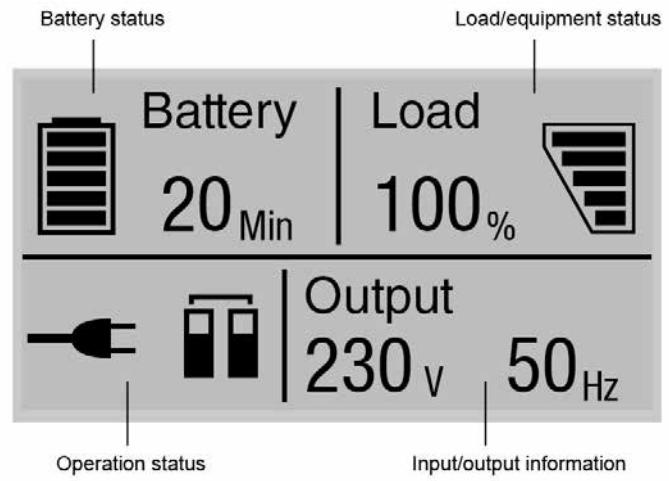

The following table describes the information of ups status.

Note: If other indicator appears, see troubleshooting on chapter 7.2 for more information.

| Operation status                                           | Cause                                                                | Description                                                                                                                                                                                                                                                     |
|------------------------------------------------------------|----------------------------------------------------------------------|-----------------------------------------------------------------------------------------------------------------------------------------------------------------------------------------------------------------------------------------------------------------|
| Standby mode                                               | The UPS is Off.                                                      | UPS is operating without output.                                                                                                                                                                                                                             |
| Online mode                                                | The UPS is operating normally.                                    | The UPS is powering and protecting the equipment.                                                                                                                                                                                                         |
| Battery mode 1 beep every 4                             | A utility failure has occurred and the UPS is on Battery mode. | The UPS is powering the equipment with the battery power. Prepare your equipment for shutdown.                                                                                                                                                            |
| seconds End of backup time 1 beep every 1 seconds | The UPS is on Battery mode and the battery is running low.     | This warning is approximate, and the actual time to shutdown may vary significantly. Depending on the UPS load and number of Extended Battery Modules (EBMs), the "Battery Low" warning may occur before the battery reaches 20% capacity. |

|                | mode.                                                                                                         | Battery mode and the load is supplied continuously. 1. The function could be enabled through the LCD setting or the software (Winpower, etc.) 2. It is reminded that the transfer time of UPS output from HE mode to battery mode is about 10ms. But it is still too long for some sensitive load.                                                       |
|----------------|---------------------------------------------------------------------------------------------------------------|----------------------------------------------------------------------------------------------------------------------------------------------------------------------------------------------------------------------------------------------------------------------------------------------------------------------------------------------------------------------------------------|
| Bypass mode    | Overload or fault has occurred, or a command has been received, and the UPS is in Bypass mode.    | Equipment is powered but not protected by the UPS.                                                                                                                                                                                                                                                                                                                                  |
| Converter mode | The UPS is operating on converter mode.                                                                 | In converter mode, the UPS would free run with fixed output frequency (50Hz or 60Hz). Once the mains is loss or abnormal, the UPS would transfer to battery mode and the load is supplied continuously. 1. The function could be enabled through the LCD setting or the software (Winpower, etc.). 2. The load should be derating to 60% in converter mode. |
| Warning        | There are some abnormal problems during the operation of UPS. Normally the problems are not fatal | The UPS continues working, but please pay attention to the warning, or the UPS may fail.                                                                                                                                                                                                                                                                                         |
| Fault          | Some fatal problems happened                                                                               | The UPS will cut off the output or transfer to bypass mode at once, and keep alarming.                                                                                                                                                                                                                                                                                     |

| Overload        | The load exceeds the capacity of the UPS               | Some unnecessary loads should be cut off one by one to reduce the load connected to the UPS. |
|-----------------|-----------------------------------------------------------|-------------------------------------------------------------------------------------------------------------|
| Battery test | UPS is executing a battery test                        | Test the battery                                                                                            |
| Battery fail    | The UPS detects bad battery or battery disconnected | The symbol of battery failure would be shown and UPS would alarm.                                        |
| UPS Parallel    | Using two or three UPS for heavy load or redundancy | Two or three UPS operation in parallel                                                                      |

### **5.3 Display functions**

Use the two middle buttons ( and ) to scroll through the menu structure. Press the Enter ( ) button to select an option. Press the ESC button to cancel or return to the previous menu.

When starting the UPS, the display is in the default UPS status summary screen.

| Main menu    | Submenu                      | Display information or Menu function             |
|--------------|------------------------------|--------------------------------------------------|
| UPS status   |                              | [status summary screen] / [Alarm] / [Battery     |
|              |                              | charging/Volt/level/remaining time] /            |
|              |                              | [mode/ Para Num. /Running time]                  |
| Measurements |                              | [Load] W VA/ [Output/Current] A % /              |
|              |                              | [Output/Voltage] V Hz/ [Input/Voltage] V Hz / |
|              |                              | [Battery] V % / [DC bus] V V /                   |
|              |                              | [temperature] °C                                 |
|              |                              | [Battery remaining time]Min                      |
| Control      | Single UPS battery test      | Starts a manual battery test for single UPS   |
|              | Parallel UPS battery test | Starts a manual battery test for parallel UPS |

| Single UPS turn off   | Turn off one UPS in parallel UPS system                                   |
|-----------------------|---------------------------------------------------------------------------|
| Reset fault status | Clears active fault                                                       |
| Clear event log       | Clears events                                                             |
| Restore factory set   | Returns all settings to original values                                   |
|                       | Sets parameters                                                           |
|                       | Event list                                                                |
|                       | [Product type/model] / [Part/Serial number] / [UPS/NMC firmware] |
|                       |                                                                           |

#### **5.4 User settings**

The following table displays the options that can be changed by the user.

| Submenu                                                  | Available settings                           | Default settings      |
|----------------------------------------------------------|----------------------------------------------|-----------------------|
| Password                                                 | Key the password                             | USER                  |
| language                                                 | [English][Deutsch][Español]                  |                       |
| User password                                            | [disabled] [Enabled]                         | [disabled]            |
| Audible alarm                                            | [enabled] [disabled]                         | [enabled]             |
| Output voltage                                           | [208V] [220V] [230V] [240V]                  | [230V]                |
|                                                          | Can be changed in Standby mode and        |                       |
|                                                          | Bypass mode                                  |                       |
| Output                                                   | [autosensing] [50HZ][60HZ]                |                       |
| Power strategy [normal] [high efficiency] [converter] |                                              | [normal]              |
| Auto bypass [enabled] [disabled]                      |                                              | [enabled]             |
| Auto restart [enabled] [disabled]                     |                                              | [enabled]             |
|                                                          | Authorize the product to restart             |                       |
|                                                          | automatically when mains recovers after a |                       |
|                                                          | complete battery discharge.                  |                       |
| Dry in [Disabled] [SON] [SOFF] [Maintain bypass]      |                                              | [Disabled]            |
| Dry out [Load powered] [On battery mode] [Battery  |                                              | [Load powered]     |
|                                                          | low] [Battery disconnected] [Bypass output]  |                       |
|                                                          | [UPS normal]                                 |                       |
| Start on battery [enabled] [disabled]                 |                                              | [enabled]             |
| External battery [0~20]                               |                                              | According to model |
| modules                                                  |                                              |                       |
| External battery                                         | [0~300]                                      | According to model |
| AH setting                                               |                                              |                       |

|  | Battery                                                                | [enabled] [disabled]                  | [enabled]         |
|--|------------------------------------------------------------------------|---------------------------------------|-------------------|
|  | remaining time                                                         |                                       |                   |
|  | Charger current                                                        | [0~4] 0~4A for standard model      | [1.4A] for 6K     |
|  |                                                                        | [0~12] 0~12A for long backup model | [2A] for 10K      |
|  |                                                                        |                                       | [4A] for 6KS/10KS |
|  | Site wiring fault [disabled] [enabled] LCD contrast [-5 ~ +5] |                                       | [disabled]        |
|  |                                                                        |                                       | [+0]              |

#### **5.5 UPS startup and shutdown**

Please make sure there is no load connected to the ups before the ups is turned on, and take on the load one by one after the UPS is turned on. Take off all of the connected loads before turning off the UPS.

#### **Starting the UPS with utility**

Verify that the total equipment ratings do not exceed the UPS capacity to prevent an overload alarm.

#### **Start the UPS with utility:**

Check all the connection is correct.

Power on the UPS, the fan begins to rotate. After that, the LCD will show the default UPS status summary screen.

Pressing button continuously for more than 1 second, the buzzer will beep 300ms, UPS starts to turn on.

A few seconds later, the UPS turns into Line mode. If the utility power is abnormal, the UPS will transfer to Battery mode without output interruption of the UPS.

#### **Starting the UPS on Battery**

Before using this feature, the UPS must have been powered by utility power with output enabled at least once.

After connect the UPS with battery, should wait 10s before pressing the button for pre-charging the auxiliary power supply.

Battery start can be disabled. See "Start on battery" setting in user settings refer to chapter 5.4.

#### **To start the UPS on battery:**

Check all the connection is correct.

Pressing button continuously for more than 100ms, the UPS would be powered on. At this time the fan begins to rotate. Then LCD will show the default UPS status summary screen.

Pressing button continuously for more than 1 second, the buzzer will beep for300ms, UPS starts to turn on.

A few seconds later, the UPS turns into Battery mode. If the utility power comes back, the UPS will transfer to Line mode without output interruption of the UPS.

#### **UPS shutdown with utility**

To shut down the UPS with utility:

Pressing button continuously for more than 3 seconds and the buzzer will beep 300ms. After that, the UPS will turn into Bypass mode at once.

When completing the above action, UPS output voltage is still present. In order to cut off the UPS output, simply cut off the utility power supply. A few seconds later, the ups will shut down and no output voltage is available from the UPS output terminal.

#### **UPS shutdown without utility**

To shut down the UPS without utility:

To power off the UPS by pressing button continuously for more than 3 second, and the buzzer will beep for 300ms. The UPS will cut off the output at once.

A few seconds later, the ups will shut down and no voltage is available from the UPS output.

#### **5.6 LCD operation**

Except the default UPS status summary screen, the user can get more useful information about UPS status, detailed various measurements, previous event records which ever occurred, UPS own identification, and could change the settings to fit the user own requirements, optimize the function of UPS.

#### **The main menu**

In the default UPS status summary screen, when pressing or <300ms, the detailed information about alarm, battery, the system status would be shown.

In the default UPS status summary screen, when pressing ESC >300ms, the display would enter main menu tree.

The main menu tree includes six branches: UPS status menu, measurement

menu, event log menu, control menu, identification menu and settings menu.

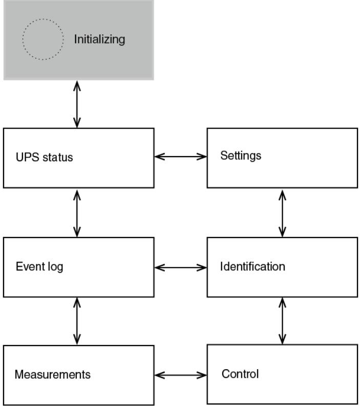

#### **The UPS status menu**

By pressing on the menu of "UPS status", the display would enter the next UPS status menu tree.

The content of UPS status menu tree is same as the default UPS status summary menu.

By pressing ESC >300ms, the display would return the last main menu tree.

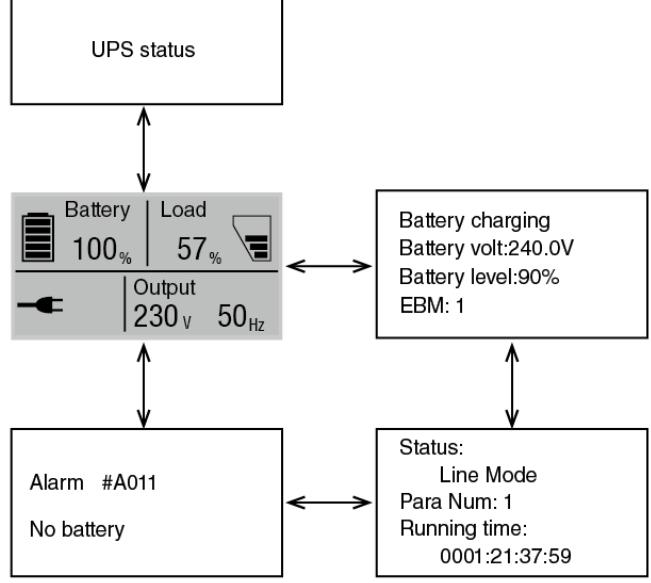

#### **The measurement menu**

By pressing on the menu of "Measurement", the display would enter the next measurement menu tree.

A lot of detailed useful information could be checked here, Ex. the output voltage and frequency, the output current, the load capacity, the input voltage and frequency, etc.

By pressing ESC >300ms, the display will return to the last main menu tree.

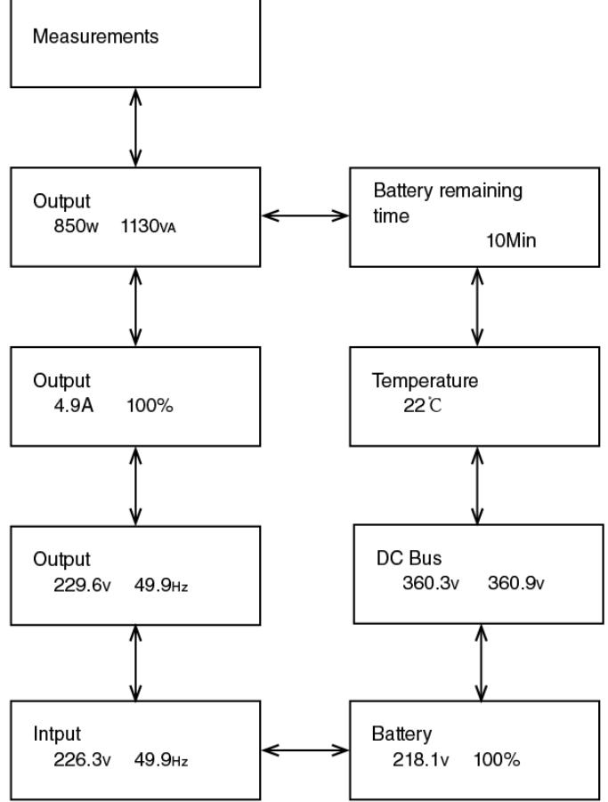

#### **The event log menu**

By pressing on the menu of "Event log", the display would enter the next event menu tree.

All the previous events, alarm and fault have been recorded here. The information includes the illustration, the event code, and the precise time of UPS when the event happened. By press or <300ms, all the events could be displayed one by one.

The max number of record is 100, when the number is larger than 100, the latest will replace the previous.

By pressing ESC >300ms, the display would return the last main menu tree.

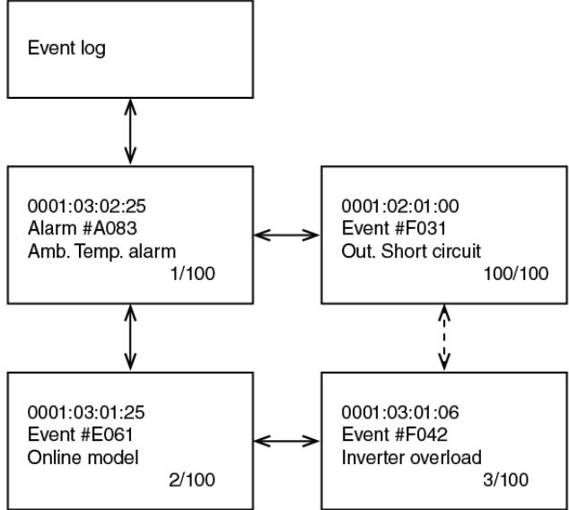

#### **The control menu**

By pressing on the menu of "Control", the display would enter the next control menu tree.

Start Battery Test: this is one command that control the UPS to do the battery test.

Reset Fault status: when fault occurs, UPS would keep in Fault mode and alarm. To recover to normal status, enter this menu to reset error status, then UPS would stop alarm and recover to bypass mode. And the reason of fault should be checked and deleted before UPS is turned on again by manual operation.

Restore factory settings: all the settings would be recover to default factory settings. It could only be done in Bypass mode.

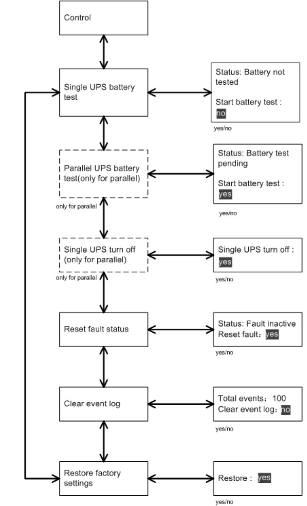

#### **The identification menu**

By press on the menu of "Identification", the display would enter the next identification menu tree.

The identification information includes UPS serial number, firmware serial number, model type, would be shown here.

By press ESC >300ms, the display would return the last main menu tree.

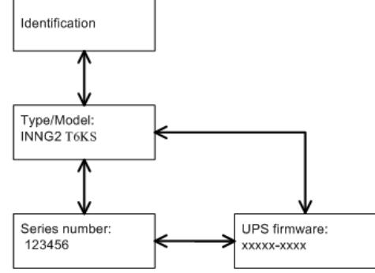

#### **The setting menu**

Please contact your local distributor for further information before using the settings. Some settings would be changed the specification, and some settings would enable or disable some functions. The unsuitable option setting by user may result in potential failures or protecting function loss, even directly damage the load, battery or UPS.

AH setting could be set via RS232 or USB communication. Default AH setting is disabled.

Most of settings could only be done while UPS is in Bypass mode.

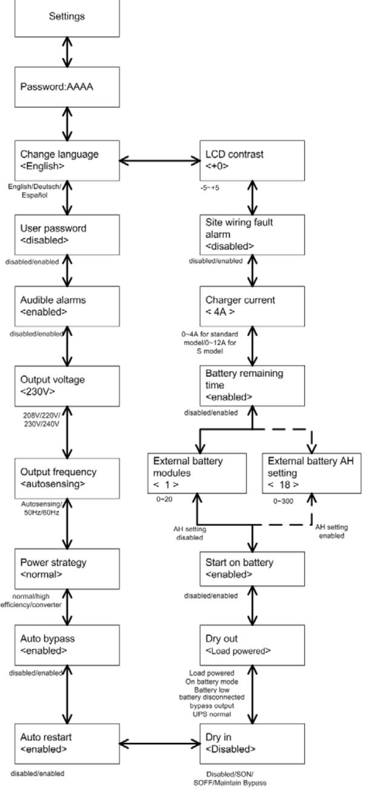

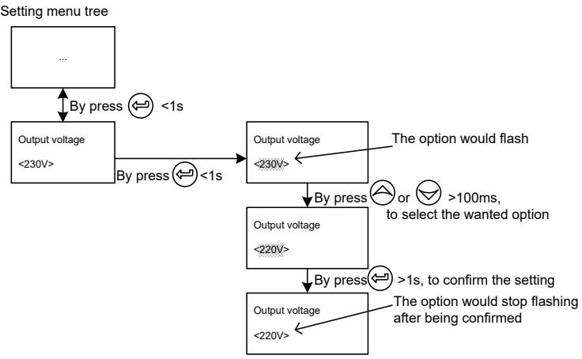

### **6. Communication**

### **6.1 Communication ports**

#### **RS232 or USB communication ports**

The RS232 and USB communication ports cannot operate simultaneously.

- 1. Communication cable to the serial or USB port on the computer.
- 2. Connect the other end of the communication cable to the RS232 or USB communication port on the UPS.

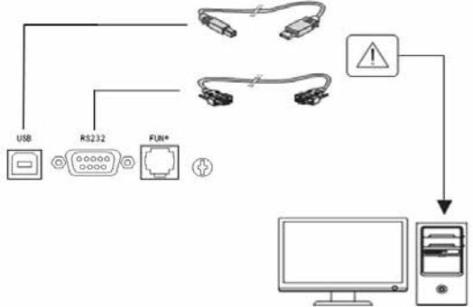

#### **Emergence Power Off**

The Emergence Power Off interface provides an emergence power off function. When the EPO function is enabled (default setting), once the EPO port is pulled out, the UPS would shut off the output and enter into EPO mode, and the UPS would not respond anything command unless the port is plugged back.

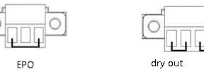

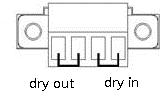

#### **Dry in & Dry out**

Dry in allows remote action to switch On/ switch Off/ maintain bypass the UPS. When contact changes from closed to open, the UPS is switch On/ switch Off/ maintain bypass the UPS.

#### **Dry out could indicate the state of UPS.**

The Dry out port is normally closed, if the Dry out port is open, it indicate that

the UPS is Loaded power/ On battery mode /Battery low /Battery disconnected /Bypass output/ups normal.

#### **6.2 Network Management Card (Optional)**

Network Management Card allow the UPS to communicate with different types of devices in variety of networking environments. The Online series has one available communication bay for the following connectivity cards:

1. Connect UPS-MS Web/SNMP Card – has SNMP and HTTP capabilities as well as monitoring through a Web browser interface; connects to a twisted-pair Ethernet (10/100BaseT) network. In addition.

2. This series UPS has AS400 card (an optional accessory) for AS400 communication protocol. Please contact your local distributor for details.

#### **6.3 UPS Management Software**

WinPower is a new software for UPS monitoring, which provides user-friendly interface to monitor and control your UPS. This unique software provides safely auto shutdown for multi-computer systems while power failure. With this software, users can monitor and control any UPS on the same LAN no matter how far from the UPSs.

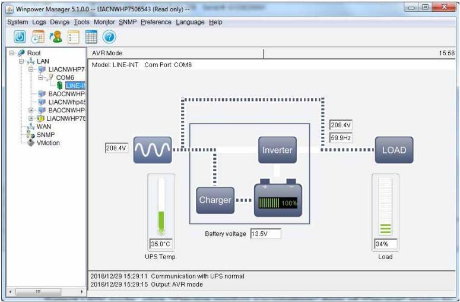

Installation procedure:

1. Go to the website:

http://winpower.powerwalker.com/

2. Choose the operation system you need and follow the instruction described on the website to download the software.

3. When downloading all required files from the internet, enter the serial No: 511C1-01220-0100-478DF2A to install the software.

When you finish installation, restart your computer, the WinPower software will appear as a green plug icon located in the system tray, near the clock.

### **7. UPS maintenance**

#### **7.1 Equipment care**

For the best preventive maintenance, keep the area around the equipment clean and dust free. If the atmosphere is very dusty, clean the outside of the system with a vacuum cleaner.

For full battery life, keep the equipment at an ambient temperature of 25°C (77°F).

If the UPS requires any type of transportation, verify that the UPS is disconnected and turned off. The batteries are rated for a 3-5 year service life. The length of service life varies, depending on the frequency of usage and ambient temperature. Batteries used beyond expected service life will often have severely reduced runtimes. Replace batteries at least every 4 years to keep units running at peak efficiency.

#### **7.2 Transporting the UPS**

The internal UPS batteries MUST be disconnected before transport.

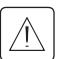

The following procedure should be performed or supervised by personnel knowledgeable about batteries and the required precaution. Keep unauthorized personnel away from batteries.

If the UPS requires any type of transportation, the batteries must be disconnected (but not removed) before the unit is transported:

- 1. Verify that the UPS is off and disconnected from utility power.
- 2. Place the UPS on a flat, stable surface with the front of the cabinet facing you.
- 3. Remove the UPS front cover
- 4 .Disconnect the internal battery connectors
- 5. Replace the UPS front cover

#### **7.3 Storing the equipment**

If you store the equipment for a long period, recharge the battery every 6

months by connecting the UPS to utility power. The EBM charge to 90% capacity in less than 3 hours.

However, recommends that the batteries charge for 48 hours after long-term storage.

If the date has passed and the batteries were never recharged, do not use them. Contact your service representative.

#### **7.4 Replacing batteries**

DO NOT DISCONNECT the batteries while the UPS is in Battery mode.

Consider all warnings, cautions, and notes before replacing batteries.

- Servicing should be performed by qualified service personnel with knowledgeable of batteries and required precautions. Keep unauthorized personnel away from batteries.
- Batteries can present a risk of electrical shock or burn from high short circuit current. Observe the following precautions:
	- 1. Remove watches, rings, or other metal objects,
	- 2. Use tools with insulated handles,
	- 3. Do not lay tools or metal parts on top of batteries,
	- 4. Wear rubber gloves and boots.
- When replacing batteries, replace with the same type and number of batteries or battery packs. Contact your service representative to order new batteries.
- Proper disposal of batteries is required. Refer to your local codes for disposal requirements.
- Never dispose of batteries in a fire. Batteries may explode when exposed to flame.
- Do not open or mutilate the battery or batteries. Released electrolyte is harmful to the skin and eyes and may be extremely toxic.
- Take care if the battery is inadvertently grounded. If grounded, remove source from ground. Contact with any part of a grounded battery may cause electrical shock.
- The likelihood of such shock can be reduced if such grounds are removed during installation and maintenance (applicable to equipment and remote battery supplies not having a grounded supply circuit).

- ELECTRIC ENERGY HAZARD. Do not attempt to alter any battery wiring or connectors. It may cause injury.
- Please disconnect battery charging source before battery replacing or maintenance.

#### **Replacing the EBM(s)**

| 八 |  |
|---|--|
|   |  |
|   |  |

The EBM is heavy. Lifting the cabinet into a rack requires two people at least. For Tower module, should turn the MBS to bypass and switch off the input and then replace the EBM(s).

For RT module, if PDU is connected with the UPS, should turn the MBS to bypass and switch off the input and then replace the EBM(s). If PDU is not connected with the UPS, should turn off the UPS and then replace the EBM.

#### **To replace the EBM(s):**

- 1. Unplug the EBM power cable from the UPS. If additional EBM(s) are installed, unplug the EBM power cable from each EBM.
- 2. Replace the EBM(s). See "Recycling the used equipment" refer to chapter 7.4 for proper disposal.

A small amount of arcing may occur when connecting the EBM to UPS. This is normal and will not harm personnel. Please connect the EBM cable to the UPS quickly and firmly.

- 3. Plug the EBM cable(s) into the battery connector(s).
- 4. Verify that the EBM connections are tight, and there are adequate bend radius and strain relief exist for each cable.

#### **Testing new batteries**

- 1. Charge the batteries for 48 hours.
- 2. By pressing on the menu of "Control".
- 3. Select Control then Single battery test.

The UPS can starts battery test only in line mode without active alarms.

During the battery test, the UPS transfers to Battery mode and discharges the batteries for 10 seconds. The front panel displays and the percentage of the test completed.

#### **7.5Recycling the used equipment**

Contact your local recycling or hazardous waste center for information on proper disposal of the used equipment.

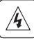

Do not dispose of the batteries in the fire. Which may cause battery explosion. The batteries must be rightly disposed according to local regulation.

Do not open or destroy the batteries. Escaping electrolyte can cause injury to the skin and eyes. It may be toxic.

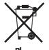

Do not discard the UPS or the UPS batteries in the trash. This product contains sealed, lead acid batteries and must be disposed of properly. For more information, contact your local recycling/ reuse or hazardous waste center.

Do not discard waste electrical or electronic equipment (WEEE) in the trash. For proper disposal, contact your local recycling/reuse or hazardous waste center.

### **8. Troubleshooting**

The UPS is designed for durable, automatic operation and also alert you whenever potential operating problems may occur. Usually the alarms shown by the control panel do not mean that the output power is affected. Instead, they are preventive alarms intended to alert the user.

- Events are silent status information that are recorded into the Event log. Example = "Battery charging".
- Alarms are recorded into the Event log and displayed on the LCD status screen with the logo blinking. Some alarms may be announced by a beep every 1 second. Example = "Battery low".
- Faults are announced by a continuous beep and red LED, recorded into the Event log. Example = Out. short circuit.

Use the following troubleshooting chart to determine the UPS alarm condition.

### **8.1 Typical alarms and faults**

To check the Event log:

- 1. By pressing on the menu of "Event log".
- 2. Scroll through the listed events or faults.
- 3. The following table describes typical conditions.

| Conditions | Possible cause | Action |
|------------|----------------|--------|
|------------|----------------|--------|

| Battery mode             | A utility failure has occurred     | The UPS is powering the       |
|--------------------------|------------------------------------|-------------------------------|
| Battery(Orange) LED is   | and the UPS is in Battery mode.    | equipment with battery        |
| On.                      |                                    | power. Prepare your           |
| 1 beep every 4 seconds.  |                                    | equipment for shutdown.       |
| Code: E062               |                                    |                               |
| Battery low              | The UPS is in Battery mode and     | This warning is               |
| Battery(Orange) LED is   | the battery is running low.        | approximate, and the          |
| On.                      |                                    | actual time to shutdown       |
| 1 beep every 1 second.   |                                    | may vary significantly.       |
| Code: A012               |                                    | Depending on the UPS          |
|                          |                                    | load and number of            |
|                          |                                    | Extended Battery Modules      |
|                          |                                    | (EBMs), the "Battery Low"     |
|                          |                                    | warning may occur before      |
|                          |                                    | the batteries reach 20%       |
|                          |                                    | capacity.                     |
| No battery               | The batteries are disconnected. | Verify that all batteries are |
| Fault (Red) LED is Flash |                                    | properly connected.           |
| 1beep every 1 second     |                                    | If the condition persists,    |
| Code: A011               |                                    | contact your service          |
|                          |                                    | representative.               |
| Bypass mode              | An overload or a fault has         | Equipment is powered but      |
| Bypass (Orange) LED is   | occurred, or a command has         | not protected by the UPS.     |
| on.                      | been received and the UPS is in    | Check for one of the          |
| Code: E060               | Bypass mode                        | following alarms: over        |
|                          |                                    | temperature, overload or      |
|                          |                                    | UPS failure.                  |
| Power overload           | Power requirements exceed          | Remove some of the            |
| Fault (Red) LED is Flash | the UPS capacity                   | equipment from the UPS.       |
| 2beep every 1 second     |                                    | The UPS continues to          |
| Code: A041               |                                    | operate, but may switch to    |
|                          |                                    | Bypass mode or shut down      |
|                          |                                    | if the load increases.        |
|                          |                                    | The alarm resets when the     |
|                          |                                    | condition becomes             |
|                          |                                    | inactive.                     |

| UPS over temperature  | The UPS internal heat sink     | Clear vents and remove       |
|--------------------------|--------------------------------|------------------------------|
|                          | temperature is too high or a   | any heat sources. Allow      |
| Fault (Red) LED is On.   | fan has failed.                | the UPS to cool. Ensure the  |
| Beep continuous.         | At the warning level, the UPS  | airflow around the UPS is    |
| Code: F081               | generates the alarm but        | not restricted. Restart the  |
|                          | remains in the current         | UPS.                         |
|                          | operating state.               | If the condition continues   |
|                          | If the temperature rises       | to persist, contact your     |
|                          | another 2°C, the UPS transfers | service representative.      |
|                          | to Bypass mode or Standby      |                              |
|                          | mode.                          |                              |
| ON Maintenance           | UPS was manually commanded     | Check the maintain bypass    |
| Bypass                   | to switch to bypass and will   | switch status                |
| Bypass (Orange) LED is   | remain in bypass until         |                              |
| on.                      | commanded out of bypass        |                              |
| Code: A072               |                                |                              |
| In HE Mode            | The UPS is on bypass while     | The equipment transferred    |
| Line(green) LED is on.   | operating on the High          | to bypass utility power as a |
| Code: E063               | Efficiency setting.            | normal function of High      |
|                          |                                | Efficiency operation.        |
|                          |                                | Battery mode is available    |
|                          |                                | and your equipment is        |
|                          |                                | protected.                   |
| Site Wiring Fault        | Site Fault detection is        | Site Fault detection should  |
| Fault (Red) LED is flash | supported on all models        | be enabled by default. It    |
| 1beep every 1 second     | anytime there is a Grounding   | can still be enabled /       |
| Code: A004               | Neutral connection.            | disabled from the LCD        |
|                          | Alarm triggers when the        | settings menu.               |
|                          | difference between ground and  | Reconnect all input wires.   |
|                          | neutral voltage is > 15v.      |                              |
| Back feed                | UPS has a unexpected bypass    | Transfer to maintenance      |
| Fault (Red) LED is On.   | current on battery mode        | bypass and call service.     |
| Beep continuous.         |                                |                              |
| Code: F093               |                                |                              |
|                          |                                |                              |

| Inv Overload Fault Fault (Red) LED is On Beep continuous. Code: F042    | UPS has transferred to bypass or fault mode because of overload in inverter mode                                         | The UPS transfers to Battery mode if supporting the load. Remove some of the equipment from the UPS                                                    |  |
|----------------------------------------------------------------------------------|--------------------------------------------------------------------------------------------------------------------------------|--------------------------------------------------------------------------------------------------------------------------------------------------------------------|--|
| Byp Overload Fault Fault (Red) LED is On. Beep continuous. Code: F043   | UPS has cut off the output and transferred to fault mode because of overload in bypass mode or HE mode.               | Remove some of the equipment from the UPS                                                                                                                       |  |
| Output Short Circuit Fault (Red) LED is On. Beep continuous. Code: F031 | Indicates that the UPS has detected abnormally low impedance placed on its output and considers it a short circuit | Remove all the loads. Turn off the UPS. Check if UPS output and loads is short circuit. Ensure short circuit is removed before turning on again. |  |
| Fan Failure Fault (Red) LED is flash 1 beep every 1 second Code: A085   | Indicates that the fan could not work normally                                                                           | Check fans of UPS                                                                                                                                                  |  |
| BUS Over Voltage Fault (Red) LED is On. Beep continuous. Code: F021     | Indicates that the UPS get BUS over voltage fault because of BUS.                                                        | The UPS transfers to Bypass mode if supporting the load                                                                                                      |  |
| BUS Under Voltage Fault (Red) LED is On. Beep continuous. Code: F022    | Indicates that the UPS get BUS under voltage fault                                                                          | The UPS transfers to Bypass mode if supporting the load                                                                                                      |  |
| BUS Unbalance Fault (Red) LED is On. Beep continuous. Code: F023        | Indicates that the positive BUS voltage and negative BUS voltage are too lopsided to fault                         | The UPS transfers to Bypass mode if supporting the load                                                                                                      |  |
| BUS Short Fault (Red) LED is On. Beep continuous. Code: F024            | Indicates that the BUS voltage decrease very fast                                                                           | Contact your service representative                                                                                                                             |  |

| BUS Softstart Fail      | Indicates that the BUS could      | Contact your service        |  |
|-------------------------|-----------------------------------|-----------------------------|--|
| Fault (Red) LED is On.  | not soft start successfully       | representative              |  |
| Beep continuous.        |                                   |                             |  |
| Code: F025              |                                   |                             |  |
| Inv Over Voltage        | Indicates that the UPS get        | The UPS transfers to        |  |
| Fault (Red) LED is On.  | invert over voltage fault         | Bypass mode if supporting   |  |
| Beep continuous.        |                                   | the load                    |  |
| Code: F032              |                                   |                             |  |
| Inv Under Voltage       | Indicates that the UPS get        | The UPS transfers to        |  |
| Fault (Red) LED is On.  | inverter under voltage fault      | Bypass mode if supporting   |  |
| Beep continuous.        |                                   | the load                    |  |
| Code: F033              |                                   |                             |  |
| Inv Softstart Fail      | Indicates that the inverter       | Contact your service        |  |
| Fault (Red) LED is On.  | could not soft start successfully | representative              |  |
| Beep continuous.        |                                   |                             |  |
| Code: F034              |                                   |                             |  |
| Charger Fail            | Indicates that the UPS has        | The UPS turns off the       |  |
| Fault (Red) LED is      | confirmed the charger has         | charger until the next      |  |
| flash                   | failed                            | power recycle. Contact      |  |
| 1 beep every 1 second   |                                   | your service representative |  |
| Code: A015              |                                   |                             |  |
| Battery Over Voltage | Indicates that the battery        | The UPS will turn off the   |  |
| Fault (Red) LED is On.  | voltage is too high               |                             |  |
| Beep continuous.        |                                   | voltage is normal           |  |
| Code: F016              |                                   |                             |  |
| Negative power Fault    | In parallel system,power of       | Redundancy mode,the         |  |
| Fault (Red) LED is On.  | UPS is negative                   | fault UPS turn to fault     |  |
| Beep continuous.        |                                   | mode without output         |  |
| Code: F0E1              |                                   | Increase mode,UPS1&         |  |
|                         |                                   | UPS2 turn to fault mode     |  |
| Parallel cable loss     | In parallel system,parallel       | Disconnect parallel cable   |  |
| Fault (Red) LED is On.  | cable disconnect                  | one turn to fault mode      |  |
| Beep continuous.        |                                   |                             |  |
| Code: F0E2              |                                   |                             |  |

| Parallel system battery status Fault (Red) LED is flash 1 beep every 1 second Code: A0E6 | UPS1 connect battery,UPS2 without battery                    | Check battery connect status                                               |  |
|------------------------------------------------------------------------------------------------------|-----------------------------------------------------------------|-------------------------------------------------------------------------------|--|
| Line input different Fault (Red) LED is flash 1 beep every 1 second Code: A0E7              | Parallel system,UPS1 line ok, UPS2 line loss                 | Check the line input                                                          |  |
| Power strategy different Fault (Red) LED is flash 1 beep every 1 second Code: A0E9          | Parallel system,UPS mode (normal ,converter,HE) different | Check UPS OP mode, Keep OP mode be the same                                |  |
| Rate power different Fault (Red) LED is flash 1 beep every 1 second Code: A0EA              | Parallel system rate power different                         | Rate power different,not allow turn on UPS. Keep rate power be the same |  |
| HE in parallel Fault (Red) LED is flash 1 beep every 1 second Code: A0EB                    | Parallel system,UPS mode set as HE                           | HE not allow in parallel system,change UPS mode                            |  |

#### **8.2 Silencing the alarm**

Press the ESC (Escape) button 3s on the front panel display to silence the alarm. Check the alarm condition and perform the applicable action to resolve the condition. If the alarm status changes or press the ESC button 3s on the front panel dispaly, the alarm beeps again, overriding the previous alarm silencing.

### **9. Specifications**

#### **9.1 Model specifications**

Table 1. Power Module model list

| Model         | Power Ratings    |
|---------------|------------------|
| VFI 6000 TGB  | 6000VA / 6000W   |
| VFI 10000 TGB | 10000VA / 10000W |
| VFI 6000 TGS  | 6000VA / 6000W   |
| VFI 10000 TGS | 10000VA / 10000W |
| VFI 6000 RTG  | 6000VA / 6000W   |
| VFI 10000 RTG | 10000VA / 10000W |

| VFI 6000 RTGS  | 6000VA / 6000W   |
|----------------|------------------|
| VFI 10000 RTGS | 10000VA / 10000W |

#### Table 2. Extended Battery Module model list

| Model    | Configuration | Battery voltage | For power ratings |
|----------|---------------|-----------------|-------------------|
| Tower BP | Tower         | 192Vdc          | 6000-10000VA      |
| Tower BP | Tower         | 240Vdc          | 6000-10000VA      |
| Rack BP  | RT            | 192Vdc          | 6000-10000VA      |
| Rack BP  | RT            | 240Vdc          | 6000-10000VA      |

#### Table 3. Weights and dimensions

| Description           | Weights (kg) | Dimensions (mm) W x H x D |
|-----------------------|--------------|---------------------------|
| VFI 6000 TGB          | 52.7         | 225*589*452               |
| VFI 10000 TGB         | 60.3         | 225*589*452               |
| VFI 6000 TGS          | 13           | 225*348*452               |
| VFI 10000 TGS         | 15.2         | 225*348*452               |
| Tower EBM 16*2 BAT | 84.6         | 225*589*452               |
| Tower EBM 20*2 BAT | 102          | 225*589*452               |
| VFI 6000 RTG          | 13           | 438*86*573                |
| VFI 10000 RTG         | 14.7         | 438*86*573                |
| VFI 6000 RTGS         | 13.1         | 438*86*573                |
| VFI 10000 RTGS        | 15           | 438*86*573                |
| RT EBM 16 BAT      | 45.4         | 438*129*593               |
| RT EBM 20 BAT      | 54.6         | 438*129*593               |

#### Table 4. Electrical input

| Nominal frequency    | 50/60Hz auto-sensing                                        |  |
|----------------------|-------------------------------------------------------------|--|
| Frequency range      | 40 Hz– 70 Hz≤60% rated load 45 Hz– 55 Hz(50Hz system) |  |
|                      | 54 Hz – 66 Hz (60Hz system) >60% rated load     |  |
|                      | 45 Hz– 55 Hz                                                |  |
|                      | 54 Hz – 66 Hz >60% rated load                      |  |
| Bypass voltage range | 176~264Vac (default)                                     |  |
| Noise filtering      | MOV for normal and common mode noise                     |  |

| Model                       | Default input     | Selectable input Voltage | Voltage      |
|-----------------------------|-------------------|--------------------------|--------------|
|                             | (Voltage/Current) | range                    | at 100% Load |
| Tower/RT 6K 16PCS BAT | 230V / 31.2A      | 208/220/230/240V         | 176~275Vac   |
| Tower/RT 6K 20PCS BAT       | 230V / 32.3A      | 208/220/230/240V         | 176~275Vac   |
| Tower/RT 6KS 16PCS BAT   | 230V / 38.7A      | 208/220/230/240V         | 176~275Vac   |
| Tower/RT 6KS 20PCS BAT      | 230V / 42.3A      | 208/220/230/240V         | 176~275Vac   |
| Tower/RT 10K 16PCS BAT      | 230V / 49.9A      | 208/220/230/240V         | 176~275Vac   |
| Tower/RT 10K 20PCS BAT      | 230V / 50.9A      | 208/220/230/240V         | 176~275Vac   |
| Tower/RT 10KS 16PCS BAT  | 230V / 57.6A      | 208/220/230/240V         | 176~275Vac   |
| Tower/RT 10KS 20PCS BAT     | 230V / 60.2A      | 208/220/230/240V         | 176~275Vac   |

#### Table 5. Electrical input connections

| Model          | Input connection | Input cable  |
|----------------|------------------|--------------|
| Tower 6K/6KS   |                  |              |
| RT 6K/6KS      |                  | Not provided |
| Tower 10K/10KS | Hardwired        |              |
| RT 10K/10KS    |                  |              |

#### Table 6. Electrical output

| All models                          | Normal mode                                                                                                                            | Battery mode                                |
|-------------------------------------|----------------------------------------------------------------------------------------------------------------------------------------|---------------------------------------------|
| Voltage regulation                  | ±1%                                                                                                                                    | ±1%                                         |
| Efficiency                          | > 98% (High Efficiency mode) > 95%                                                                                               | > 93%                                       |
| Frequency regulation                | Sync with line ±10% of nominal line frequency (outside this range: ±0.1% of auto-selected nominal frequency)                     | ±0.1% of auto-selected nominal frequency |
| Nominal output                      | 208V*, 220V, 230V, 240V (voltage configurable) 6000/10000VA* 6000/10000W*                                                           |                                             |
| Frequency                           | 50 or 60Hz, autosensing or configurable as a frequency converter                                                                    |                                             |
| Output overload                     | 100-105% : no alarm 105-125% : load transfers to Bypass mode after 10 minutes 125-150% : load transfers to Bypass mode after 30s |                                             |
| Output overload (Bypass mode) | 100-105% : no alarm 105-125% : continue working and alarm 125-150% : UPS shuts down after 30s                                    |                                             |
| Voltage waveform                    | Sinewave                                                                                                                               |                                             |
| Harmonic distortion                 | < 1% THDV on linear load < 5% THDV on non-linear load                                                                               |                                             |

| Transfer time    | Online mode: 0 ms (no break) High Efficiency mode: 10ms maximum (due to loss of utility) |
|------------------|---------------------------------------------------------------------------------------------|
| Power factor     | 1                                                                                           |
| Load crest ratio | 3 to 1                                                                                      |

* for 208V output, the load level will be derating to 90%.

#### Table 7. Electrical output connections

| Model          | Output connection | Output cable |
|----------------|-------------------|--------------|
| Tower 6K/6KS   |                   |              |
| RT 6K/6KS      |                   |              |
| Tower 10K/10KS | Hardwired         | Not provided |
| RT 10K/10KS    |                   |              |

#### Table 8. Environmental and safety

| Certifications   | EN 62040-1                                                         |
|------------------|--------------------------------------------------------------------|
|                  | IEC/EN 62040-2: Cat. C2                                            |
|                  | IEC/EN 62040-3                                                     |
|                  | EN 60950-1                                                      |
| EMC (Emissions)* | IEC 61000-3-2 (-3-12)                                              |
|                  | IEC 61000-3-3 (-3-11)                                              |
| EMC (Immunity)   | IEC 61000-2-2                                                      |
|                  | IEC 61000-4-2, Level 4                                             |
|                  | IEC 61000-4-3, Level 3                                             |
|                  | IEC 61000-4-4, Level 4 (also on signal ports) IEC 61000-4-5, Level |
|                  | 4, Criteria B                                                      |
|                  | IEC 61000-4-6, Level 3                                             |
|                  | IEC 61000-4-8, Level 4                                             |
|                  | IEC 61000-4-11                                                     |
|                  |                                                                    |

* for output cable < 10m.

| Agency markings     | CE                                                           |
|---------------------|--------------------------------------------------------------|
| Operating           | 0~40℃ full load no derating                               |
| temperature         | 40~50℃ output power derating to 50% load, Charger current |
|                     | derating 50%                                                 |
| Storage temperature | -15 to 40°C (32 to 104°F) with batteries                  |
|                     | -25 to 60°C (5 to 140°F) without batteries                   |
| Transit temperature | -25 to 55°C (-13 to 130°F)                                   |

| Relative humidity  | 0 to 95% no condensing                                          |
|--------------------|-----------------------------------------------------------------|
| Operating altitude | Up to 3,000 meters (9,843 ft) above sea level with 10% derating |
|                    | per 1000m                                                       |
| Transit altitude   | Up to 10,000 meters (32,808 ft) above sea level                 |
| Audible noise      | < 50 dBA at 1 meter typical for 6kVA models                  |
|                    | < 55 dBA at 1 meter typical for 10kVA models                 |

#### Table 9. Battery

|               | EBMs                                                                                                                                             |
|---------------|--------------------------------------------------------------------------------------------------------------------------------------------------|
| Rack / Tower  | 240Vdc 20 x 12V, 7Ah                                                                                                                             |
| configuration | 240Vdc 20 x 12V, 9Ah                                                                                                                             |
|               | 192Vdc 16 x 12V, 7Ah                                                                                                                          |
|               | 192Vdc 16 x 12V, 9Ah                                                                                                                          |
| Fuses         | 100A for 10kVA models and EBM                                                                                                                 |
| Type          | Sealed, maintenance-free, valve-regulated, lead-acid, with minimum 3-year float service life at 25°C (77°F). Lifetime is reduced above 30 °C. |
| Monitoring    | Advanced monitoring for earlier failure detection and warning                                                                                    |
| Battery port  | External ANEN-SA30 connector on power module for connection to                                                                                   |
|               | EBM                                                                                                                                              |
|               | EBM battery cable 100cm for tower models                                                                                                         |

#### Table 10. Communication options

| Communication bay   | available independent communication bay for connectivity |
|---------------------|----------------------------------------------------------|
|                     | cards                                                    |
| Compatible          | MODBUS card                                              |
| connectivity cards  | NMC card                                                 |
|                     | AS400 card                                            |
| Communication ports | RS-232 (DB9): 2400 bps                                |
|                     | USB: 2400 bps                                         |
| Dry out             | 2 pins jumper (normally closed)                          |
| Dry in              | 2 pins jumper (normally closed)                          |
| Emergency Power Off | 3 pins jumper (normally closed)                          |

### **10 Glossary**

| Bypass AC source                   | Source supplying the bypass line. The equipment can be transferred to the bypass line if an overload occurs on the UPS output, for maintenance or in the event of a malfunction.                                  |
|------------------------------------|-------------------------------------------------------------------------------------------------------------------------------------------------------------------------------------------------------------------------------------------------------|
| Frequency converter                | Operating mode used to convert the AC-power frequency between the UPS input and output (50Hz -> 60Hz or 60Hz -> 50Hz).                                                                                                                          |
| Low-battery warning                | This is a battery-voltage level indicating that battery power is low and that the user must take action to prevent the imminent break in the supply of power to the load.                                                                    |
| Backup time                        | Time during which the load can be supplied by the UPS operating on battery power.                                                                                                                                                                  |
| HE mode                            | Operating mode by which the load is supplied directly by the AC source if it is within the tolerances defined by the user. This mode reduces the consumption of electrical power                                                             |
| Manual bypass                      | Rotary switch controlled by the user, used to connect the loads directly to the AC source. Transfer of the load to the manual bypass enables UPS maintenance without interrupting the supply of power to the connected loads. |
| Normal (double conversion) mode | The normal UPS operating mode in which the AC source supplies the UPS which in turn supplies the connected loads (after electronic double conversion).                                                                                          |
| Normal AC source                   | Normal source of power for the UPS.                                                                                                                                                                                                                   |
| Relay contacts                     | Contacts supplying information to the user in the form of signals.                                                                                                                                                                                 |