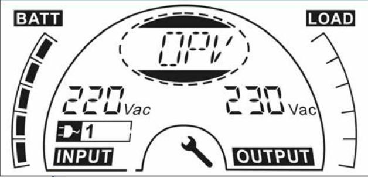

# **USER MANUAL**

## **PowerWalker VFI 1000-2000-3000 TG VFI 1000-2000-3000 TGS**

## **EN, DE, PL**

| 1. Safety and EMC Instructions1                                                                                                                                                         |   |
|--------------------------------------------------------------------------------------------------------------------------------------------------------------------------------------------|---|
| 1.1 Installation1 1.2 Operation 2 1.3 Maintenance, servicing and faults 3 1.4 Transport4 1.5 Storage4 1.6 Standards 4                                           |   |
| 2. Description of Commonly Used Symbols                                                                                                                                                    | 6 |
| 3. Introduction7                                                                                                                                                                           |   |
| 4. Panel Description 9                                                                                                                                                                  |   |
| 4.1 Button9 4.2 LCD description 10                                                                                                                                                |   |
| 5. Connection and Operation13                                                                                                                                                              |   |
| 5.1 Inspection:13 5.2 Connection:13 5.3 Battery charge:16 5.4 Turn on the UPS: 16 5.5 Test function:16 5.6 Turn off the UPS: 17 5.7 Audible alarm mute function:17 |   |
| 6. Operating Mode for All Models18                                                                                                                                                         |   |
| 6.1 Line mode 19 6.2 Battery mode20 6.3 Bypass mode 21 6.4 No Output mode21 6.5 EPO (Emergency Power Off)22 6.6 ECO mode (Economy mode)22 6.7 CVCF mode 22   |   |
| 6.8 Abnormal mode23                                                                                                                                                                        |   |

| 7. Setting by LCD Module 23                                                                                                                                                                       |  |
|---------------------------------------------------------------------------------------------------------------------------------------------------------------------------------------------------------|--|
| 8. Trouble Shooting 28                                                                                                                                                                               |  |
| 9. Maintenance 31                                                                                                                                                                                    |  |
| 9.1 Operation 31 9.2 Storage31                                                                                                                                                                    |  |
| 10. Technical Data32                                                                                                                                                                                    |  |
| 10.1 Electrical specifications32 10.2 Operating Environment32 10.3 Typical backup time (Typical values at 25°C in minutes :)33 10.4 Dimensions and weights 33                               |  |
| 11. Communication Port34                                                                                                                                                                                |  |
| 11.1 USB (Optional) and RS-232 Communication Ports 34 11.2 USB for HID power device 34 11.2 AS400 Interface (Option)34 11.2 CMC Interface (Option)34 11.2 NMC Interface (Option)34 |  |
| 12. Software35                                                                                                                                                                                          |  |
| Appendix: Rear panel 36                                                                                                                                                                              |  |

#### **1. Safety and EMC Instructions**

#### **Please read carefully the following user manual and the safety instructions before installing or operating the unit!**

#### **1.1 Installation**

- ★ See installation instructions before connecting to mains power.
- ★ Condensation may occur if the UPS is moving directly from a cold to a warm environment. The UPS must be absolutely dry before being installation. It is recommended to have an acclimatization time at least two hours.
- ★ Do not install the UPS near water or in damp environment.
- ★ Do not install the UPS where it would be exposed to direct sunlight or near heat.
- ★ Do not connect appliances or items of equipment which would overload the UPS (e.g. laser printers, etc.) to the UPS output.
- ★ Place cables properly to avoid someone treaded or tripped over them.
- ★ Assure to connect with the earth reliably.
- ★ Connect the UPS only to a socket outlet which is earthed shockproof type.
- ★ The building wiring socket outlet (shockproof socket outlet) must be easily accessible to close to the UPS.
- ★ With the installation of the equipment, the sum of the leakage current of the UPS and the connected load does not exceed 3.5mA.
- ★ An additional circuit breaker or fuse with rating 16A and breaking capacity 3kA shall be used between power source and input when installation this unit.
- ★ Do not block ventilation openings on the UPS's housing. Ensure the air vents on the front, side and rear of the UPS are not blocked.

Recommended at least 25cm of space on each side. The air flow diagram is shown as below:

■ **Figure 1.1 The Air Flow Diagram**

- ★ This UPS receives power from more than one source-disconnection of AC source and the DC source is required to de-energize this unit before servicing.
#### **1.2 Operation**

- ★ For safety consideration, do not disconnect the mains cable on the UPS or the building wiring socket (grounded shockproof socket) during operation, the grounding for the UPS and all loads connected will be disconnected.
- ★ The UPS features its own, internal current source (batteries). You may be electric shocked when you touch the UPS output sockets or output terminal block even if the UPS is not connected to the building wiring socket.
- ★ In order to fully disconnect the UPS, first press the OFF button to turn off the UPS, and then disconnect the mains lead.
- ★ Ensure that no liquid or other external objects can enter the UPS.
- ★ Do not remove the enclosure. This system is to be serviced by qualified service personnel only. There are NO USER

SERVICEABLE PARTS inside the UPS.

- ★ Remove the protective panel only after disconnecting the terminal connections.
#### **1.3 Maintenance, servicing and faults**

- ★ The UPS operates with hazardous voltages. Repairs may be carried out only by qualified maintenance personnel.
- ★ Caution risk of electric shock. Even after the unit is disconnected from the mains power supply (building wiring socket), components inside the UPS are still connected to the battery which are potentially dangerous.
- ★ Before carrying out any kind of service and/or maintenance, disconnect the batteries. Verify that no current is present and no hazardous voltage exists in the capacitor or BUS capacitor terminals.
- ★ Batteries must be replaced only by qualified personnel.
- ★ Caution risk of electric shock. The battery circuit is not isolated from the input voltage. Hazardous voltages may occur between the battery terminals and the ground. Verify that no voltage is present before servicing!
- ★ Batteries have a high short-circuit current and pose a risk of shock. Take all precautionary measures specified below and any other measures necessary when working with batteries:
	- remove all jewellery, wristwatches, rings and other metal objects
	- use only tools with insulated grips and handles.
	- Wear rubber gloves and boots.
	- Do not lay tools or metal parts on top of batteries.
	- Disconnect the charging source prior to connecting or disconnecting battery terminals.
- ★ When changing batteries, replace with the same quantity and the same type of batteries.
- ★ Do not attempt to dispose of batteries by burning them. It could

cause explosion.

- ★ Do not open or destroy batteries. Effluent electrolyte can cause injury to the skin and eyes. It may be toxic.
- ★ Please replace the fuse only by a fuse of the same type and of the same amperage in order to avoid fire hazards.
- ★ Do not dismantle the UPS, except the qualified maintenance personnel.

#### **1.4 Transport**

- ★ Please transport the UPS only in the original packaging (to protect against shock and impact).
#### **1.5 Storage**

- ★ The UPS must be stockpiled in the room where it is ventilated and dry.

#### **1.6 Standards**

| * Safety                                         |         |             |
|--------------------------------------------------|---------|-------------|
| IEC/EN 62040-1:2008+A1:2013                      |         |             |
| * EMI                                            |         |             |
| Conducted Emission:IEC/EN                        | 62040-2 | Category C2 |
| Radiated Emission:IEC/EN                         | 62040-2 | Category C2 |
| Harmonic Current:IEC/EN 61000-3-2                |         |             |
| Voltage Fluctuation and Flicker:IEC/EN 61000-3-3 |         |             |
| *EMS                                             |         |             |
| ESD:IEC/EN 61000-4-2                             |         | Level 3     |
| RS:IEC/EN 61000-4-3                              |         | Level 3     |
| EFT:IEC/EN 61000-4-4                             |         | Level 4     |
| SURGE:IEC/EN 61000-4-5                           |         | Level 3&4   |
| CS………………………………….……:IEC/EN 61000-4-6              |         | Level 3     |
| MS………………………………………: IEC/EN 61000-4-8              |         | Level 3     |
| Voltage Dips………………………: IEC/EN 61000-4-11         |         |             |
| Low Frequency Signals:IEC/EN 61000-2-2           |         |             |

#### **2. Description of Commonly Used Symbols**

Some or all of the following symbols may be used in this manual. It is advisable to familiarize yourself with them and understand their meaning:

|                       | Symbol and Explanation                |        |                                       |  |
|-----------------------|---------------------------------------|--------|---------------------------------------|--|
| Explanation Symbol |                                       | Symbol | Explanation                           |  |
|                       | Alert you to pay special attention |        | Alternating current source (AC)    |  |
|                       | Caution of high voltage            |        | Direct current source (DC)         |  |
|                       | Turn on the UPS                       |        | Protective ground                     |  |
|                       | Turn off the UPS                      |        | Recycle                               |  |
|                       | ldle or shut down the UPS          |        | Do not dispose with ordinary trash |  |

#### **3. Introduction**

This On-Line-Series is an uninterruptible power supply incorporating double-converter technology. It provides perfect protection specifically for Linux, UNIX, and Windows servers.

The double-converter principle eliminates all mains power disturbances. A rectifier converts the alternating current from the socket outlet to direct current. This direct current charges the batteries and powers the inverter. On the basis of this DC voltage, the inverter generates a sinusoidal AC voltage, which permanently supplies the loads.

Computers and periphery are thus powered entirely by the mains voltage. In the event of power failure, the maintenance-free batteries power the inverter.

This manual covers the UPS listed as follows. Please confirm whether it is the model you intend to purchase by performing a visual inspection of the Model No. on the rear panel of the UPS.

| Item | Model name   | Power Rating | Model type | Model description      | Other                                        |
|------|--------------|-----------------|---------------|---------------------------|----------------------------------------------|
| 1    | VFI 1000 TG  | 1000VA 900W  | Tower         | Standard model         | Single Phase input Single Phase Output |
| 2    | VFI 1000 TGS | 1000VA 900W  | Tower         | Long Backup time model | Single Phase input Single Phase Output |
| 3    | VFI 2000 TG  | 2000VA 1800W | Tower         | Standard model         | Single Phase input Single Phase Output |
| 4    | VFI 2000 TGS | 2000VA 1800W | Tower         | Long Backup time model | Single Phase input Single Phase Output |
| 5    | VFI 3000 TG  | 3000VA 2700W | Tower         | Standard model         | Single Phase input Single Phase Output |
| 6    | VFI 3000 TGS | 3000VA 2700W | Tower         | Long Backup time model | Single Phase input Single Phase Output |

#### **The Model List**

#### **UPS Block Diagram**

#### **4. Panel Description**

The display panel of 1000-3000 TG(S) is the same, which is shown as below:

■ **Figure 4.1 The Display Panel**

#### **4.1 Button**

| Switch     | Function                                                                |  |  |
|------------|-------------------------------------------------------------------------|--|--|
| ON/Silence | Turn on UPS system:                                                     |  |  |
| Button     | By pressing the ON-Button continuously for more than 1 second the    |  |  |
|            | UPS system is turned on.                                                |  |  |
|            | Deactivate acoustic alarm:                                              |  |  |
|            | By pressing this Button an acoustic alarm can be deactivated in the     |  |  |
|            | battery mode.                                                           |  |  |
|            | By short touch this Button all acoustic alarms can be deactivated in |  |  |
|            | all modes.                                                              |  |  |
|            | Do the battery test:                                                    |  |  |
|            | By pressing this Button the UPS can do the battery test in the Line     |  |  |
|            | mode or ECO mode or CVCF mode.                                       |  |  |
| OFF        | When mains power is normal, the UPS system switches to No               |  |  |
| Button     | output or Bypass mode by pressing OFF-Button " ", and the inverter   |  |  |
|            | is off. At this moment, if Bypass is enabled, then the output sockets   |  |  |
|            | are supplied with voltage via the bypass if the mains power is       |  |  |
|            | available.                                                              |  |  |

|        | Deactivate acoustic alarm:                                                   |  |
|--------|------------------------------------------------------------------------------|--|
|        | By pressing this Button an acoustic alarm can be deactivated in the          |  |
|        | bypass mode.                                                                 |  |
|        | Release the UPS from fault mode and EPO status.                              |  |
| Select | The output voltage, frequency, Bypass disable/enable and operating           |  |
| Button | mode in No output or Bypass mode, Battery Ah, Battery remain time      |  |
| Enter  | display disable/enable and Charger current in all mode, could be |  |
| Button | selected by pressing Select-Button, and confirmed by pressing                |  |
|        | Enter-Button.                                                                |  |

#### **4.2 LCD description**

#### **LCD icon Function**

| Display           | Function                                                                                    |  |
|-------------------|---------------------------------------------------------------------------------------------|--|
| Input Information |                                                                                             |  |
|                   | It indicates input voltage/frequency value, which are displayed alternately. |  |

|                                | It indicates the input is connected with mains, and the input power is single phase input.                                                                                        |
|--------------------------------|-----------------------------------------------------------------------------------------------------------------------------------------------------------------------------------------|
| Output Information             |                                                                                                                                                                                         |
|                                | It indicates output voltage/frequency value, which are displayed alternately.                                                                                                  |
| Load Information               |                                                                                                                                                                                         |
|                                | It indicates the load level. Every grid represents the level of 20%. One grid would be displayed if the level is 0~20%                                 |
| Battery Information         |                                                                                                                                                                                         |
|                                | It indicates the battery capacity. Every grid represents the capacity of 20%.                                                                                                  |
| Mode/Fault/Warning Information |                                                                                                                                                                                         |
|                                | It Indicates the operating mode or Fault kind or Warning kind or battery remain time, several warning kinds at the same time could be displayed alternately. |
| Else                           |                                                                                                                                                                                         |
|                                | It indicates the UPS is in setting mode.                                                                                                                                                |

**LCD display in different mode**

The different message/string would be displayed on the LCD screen corresponding to their operating modes, and they are illustrated as the following table. At any time, only one normal operating string or fault string is presented, but the warning, if several warning happen at the same time, they can be displayed on the LCD alternately. And the normal operating mode string and the warning string would be shown circularly. Once one fault is come forth, all previous warnings and the fault string would be shown circularly.

| Normal operating mode | Code |
|-----------------------|------|
| No output mode        | STbY |
| Bypass mode           | bYPA |
| Line mode             | LINE |
| Battery mode          | bATT |
| Battery test mode     | TEST |
| ECO mode              | ECO  |
| Converter mode        | CVCF |

#### **5. Connection and Operation**

The system may be installed and wired only by qualified electricians in accordance with applicable safety regulations!

When installing the electrical wiring, please note the nominal amperage of your incoming feeder.

#### **5.1 Inspection:**

Inspect the packaging carton and its contents for damage. Please inform the transport agency immediately if you find signs of damage. Please keep the packaging in a safe place for future use.

*Note: To avoid any safety issue, please ensure that the incoming feeder (mains) is isolated completely while whole installing process.*

#### **5.2 Connection:**

#### **(1) UPS Input Connection**

If the UPS is connected via the power cord, please use a proper socket with protection against electric current, and pay attention to the capacity of the socket. The UPS System has an input breaker on the standard cabinet.

#### **(2) UPS Output Connection**

The output sockets and types of the UPS are shown below:

| Model No. | Output Socket -SCHUKO(pcs) | Output Socket -IEC(pcs) |
|--------------|-------------------------------|-------------------------------|
| VFI 1000 TG  | 3*Schuko                      | 4*C13                         |

| VFI 1000 TGS | 2*Schuko       | 3*C13                   |
|--------------|----------------|-------------------------|
| VFI 2000 TG  | 4*Schuko       | 4*C13                   |
| VFI 2000 TGS | 2*Schuko+1*C13 | 6*C13                   |
| VFI 3000 TG  | 4*Schuko       | 4*C13+1*C19             |
| VFI 3000 TGS | 2*Schuko+1*C19 | 3*C13+Terminal block |

#### **(3) Battery Input Connection for long backup time model**

When connecting the external batteries it's recommended to pay attention to these following items:

#### ★ Use the battery pack with voltage:

24VDC for 1000 TG(S) (2 pcs of 12V batteries),

48VDC for 2000 TG(S) (4 pcs of 12V batteries),

72VDC for 3000 TG(S) (6 pcs of 12V batteries)

Note: Connection of batteries more than or less than required will cause abnormality or permanent damage.

- ★ One Standard type battery connector on the rear panel is used for connecting the battery pack.
- ★ The battery connection procedure is very important. Any incompliance may result in the risk of electric shock. Therefore, the following steps must be strictly complied with.
- ★ Prepare the battery cable with Standard type connector which should be able to carry the current.
- ★ If there is a battery breaker then turn it off first. Then connect the battery cable to the Standard type battery connector on the real panel.
- ★ Connect the input power cord of the UPS to mains power supply, the battery would start to be charged.

#### **The Caution!**

A DC breaker must be connected between the UPS and external battery if no used standard battery pack.

#### **The Caution!**

The output sockets of the UPS system may still be electrically live even if the power supply system has been disconnected.

#### **(4) EPO Connection:**

EPO (Emergency Power Off) function is standard feature for UPS, the polarity of EPO is configurable; EPO is normally close as default setting. If the connection between two ports of EPO connector is disconnected, EPO function will be active and the UPS will stop output power immediately.

#### ● Normally open

Normally EPO connector is open on the rear panel. Once the connector is closed with a wire, the UPS will stop output until EPO status is reset.

Disable EPO status Enable EPO status

- Normally close
Normally EPO connector is closed with a wire on the rear panel. Once the connector is open, the UPS will stop output until EPO status is disabled

Enable EPO status Disable EPO status

#### **5.3 Battery recharge:**

Fully charge the batteries (external) of the UPS system by leaving the UPS system connected to the mains power for 1-2 hours approximately. The UPS system is able to operate directly without recharging process, but the backup time may be shorter than the nominal value specified.

#### **5.4 Turn on the UPS:**

#### **(1) With mains power connecting:**

Press On-button continuously for more than 1 second to turn on the UPS, the UPS will get into the Line mode; the LCD screen will indicate the state of the UPS.

#### **(2) Without mains power connecting:**

Even though mains power is not connected to the UPS, the UPS still can be turned on by just simply pressing on button continuously for more than 1 second with external batteries connected, the UPS will get into the Battery mode, and the LCD screen will indicate the state of the UPS.

*Note: The default setting for bypass mode is no output after UPS is connecting mains power and breaker is turned on. This can be configurable.*

#### **5.5 Test function:**

Test function is checking battery performance of the UPS system by pressing the On-Switch for more than 1 second while UPS is operating in Line mode, the UPS would detect whether the battery is connected or the battery is weak. And the UPS could also implement this test automatically and periodically, the period time is configurable.

#### **5.6 Turn off the UPS:**

#### **(1) In Line Mode:**

Press OFF button continuously for more than 1 second to turn off the UPS, the UPS will get into no output or bypass mode. In circumstance, the UPS might have output power if bypass mode is enabled. Disconnect the mains power to turn off the output.

#### **(2) In Battery Mode:**

Press OFF button continuously for more than 1 second to turn off the UPS, the UPS will get into no output or standby mode. After 10s UPS will be shut down completely.

#### **5.7 Audible alarm mute function:**

If the audio alarm is too annoying in battery mode, the audio alarm is able to mute by press ON button continuously for more than 1 second. Moreover, the audio alarm will be active again when the battery reaches low status for reminding that UPS output power will shut down soon.

If the audio alarm is too annoying in bypass mode, the audio alarm is able to mute by press OFF button continuously for more than 1 second. This action doesn't affect the warning and fault alarm.

In any mode, if the warning or fault alarm is too annoying, you can mute it by press ON button less than 0.5 second, and enable it by press ON button less than 0.5 second again. If the new warning or fault alarm is appeared, the buzzer will beep again.

#### **Alarm Table List**

| NO. | Status                                                | Alarm                 |
|-----|-------------------------------------------------------|-----------------------|
| 1   | Battery mode                                          | Beep once every 4 sec |
| 2   | Battery mode with battery low                   | Beep once every sec   |
| 3   | Bypass mode                                           | Beep once every 2 min |
| 4   | Overload                                              | Beep twice every sec  |
| 5   | Warning active (see Warning& Fault Code Table ) | Beep once every sec   |
| 6   | Fault active                                          | Beep continuously  |
| 7   | Button function active                             | Beep once             |

#### **6. Operating Mode for All Models**

The different string could be displayed on the LCD screen corresponding to their operating modes, and they are illustrated as the following table. At any time, only one normal operating string or fault string is presented. But the warning, even several warnings could appear in a certain normal operating mode at one time. And the normal operating mode string and the warning string would be shown circularly. Once one fault is come forth, then all previous warnings would not be shown again but only the fault string is presented.

| Warning& Fault Code Table 6.1 |  |  |
|-------------------------------|--|--|
|                               |  |  |

| Warning                             | String |
|-------------------------------------|--------|
| Site fail                           | SITE   |
| Fan fail                            | FANF   |
| Battery over voltage (over charged) | HIGH   |
| Battery low                         | bLOW   |
| Charge fail                         | CHGF   |
| Inverter temperature high           | TEPH   |
| Battery open                        | bOPN   |

| Overload                       | OVLD   |
|--------------------------------|--------|
| Digital bigger charger fail | dCHF   |
| Inner temperature high         | ITPH   |
| Fault                          | String |
| Inverter short                 | SHOR   |
| Overload fault                 | OVLD   |
| Inverter soft start fail       | ISFT   |
| Bus soft start fail            | bSFT   |
| Over temperature fault         | OVTP   |
| Inverter Volt Low              | INVL   |
| Inverter Volt High             | INVH   |
| Bus volt over                  | bUSH   |
| Bus volt Low                   | bUSL   |
| Bus short                      | bUSS   |
| Inverter NTC open              | NTCO   |
| Emergency Power Off            | EPO    |

#### **6.1 Line mode**

The LCD display in Line mode is shown as figure6.1. The information about the mains power, the battery level, the UPS output and the load level will be displayed. The "LINE" string indicates UPS working in Line mode.

 ■ **Figure 6.1 The Line mode**

#### **6.2 Battery mode**

The LCD display in battery mode is shown as figure6.2. The information about the battery voltage, the battery level, the UPS output and the load level will be displayed. The "bATT" string indicates UPS working in the battery mode. If the function of battery remain time is set to enable, the "bATT" string and battery remaining time (in unit Min or Sec) would display in turn every 2s.

When the UPS is running in battery mode, the buzzer beeps once every 4 seconds. If the "ON" button on the front panel is pressed for more than 1 second, the buzzer will stop beeping (in silence mode). Press the "ON" button once again for more than 1 second to resume the alarm function.

■ **Figure 6.2 The Battery mode**

#### **6.3 Bypass mode**

The LCD display in bypass mode is shown as figure6.3. The information about the mains power, the battery level, the UPS output and the load level will be displayed. The UPS will beep once every 2 minutes in bypass mode. The "bYPA" string indicates UPS working in the bypass mode

 ■ **Figure 6.3 The Bypass mode**

#### **6.4 No Output mode**

The LCD display in No output mode is shown as figure6.4. The information about the mains power, the battery level, the UPS output and the load level could be displayed. The "STbY" string indicates UPS working in the No output mode.

■ **Figure 6.4 The No output mode**

#### **6.5 EPO (Emergency Power Off)**

It is also called RPO (Remote Power Off). On LCD display, the word of "EPO" will be presented in the position of output voltage.

It is a special status which the UPS will shut the output off and send out alarm. The UPS cannot be turned off by pressing "OFF" button on the panel, only after resetting EPO status.

#### **6.6 ECO mode (Economy mode)**

It is also called high efficiency mode. After turning UPS on in ECO mode, the output power will be supplied from mains power directly via internal filter while the mains power is in certain range, so the high efficiency performance would be gained in ECO mode. Once the mains power is loss or out of range, the UPS will transfer to battery mode and the load will be supplied continuously by the battery.

- 1) ECO mode can be enabled through the LCD setting or the software (Winpower, etc.).
- 2) The transfer time of UPS output from ECO mode to battery mode is less than 10ms. It is suggested that takes account of application for some sensitive load.

#### **6.7 CVCF mode**

CVCF (Constant Voltage Constant Frequency) which is also called converter mode, UPS would works in frequency free-run with fixed output frequency (50Hz or 60Hz). Once the mains are loss or abnormal, the UPS would transfer to battery mode and the load is supplied continuously by the battery.

- 1) CVCF mode can be enabled through the LCD setting or the software (Winpower, etc.).
- 2) The normal power rating will be derating to 60% in converter mode.

#### **6.8 Abnormal mode**

In abnormal mode such as Bus fault etc., the corresponding fault string would be shown on LCD display to indicate the status of the UPS, and the background light will become red color. For example "SHOR" would be shown when the connected load or the UPS output is in short-circuited, the LCD display is shown as figure6.5 followings.

■ **Figure 6.5 The Fault mode**

#### **7. Setting by LCD Module**

The output voltage/frequency, Auto bypass status, operating mode in No output mode or Bypass mode, charger current, external Battery AH and battery remaining time function in all mode could be set directly through LCD module.

In bypass or no output mode, pressing the "Enter" button on the LCD panel for more than 1 second to enter setting mode. The LCD display is shown in the following figure7.1. The string "OPV" that stands for output voltage. "230Vac" indicates the existing output voltage is 230Vac. if you want to set output voltage, press the "Enter" button for more than 1 second, a flickering string "220" would be shown, if the "Enter" button is pressed again, the string "220" turn to flickerless, the output volt is changed to 220V; if the "Select" button is pressed for more than 1 second, the next flickering string "230" appear, the order of flickering string is 220 – 230 – 240 – 220 – 230,

Press "Enter" button to confirm the output volt what you want.

■ **Figure 7.1 Setting by LCD**

To exit the setting mode that requests a pressing once on the "Enter" button; to continue setting, press "Select" button. If no any pressing on the "Select" or "Enter" button lasting for more than 10 seconds, the setting mode will exit automatically.

The output frequency string "OPF", Bypass status string " bYPA", operating mode string "MOdE", External Battery Ah string "EbAH", battery remaining time string "bATT" , Charger current string"CHG" would be presented circularly. The only one voltage value can be selected in "220V", "230V", "240V" at any time; The only one frequency value can be selected in "50Hz", "60Hz" at any time; Bypass status can be selected in "000" or "001"(Here 000 means Bypass Disable,001 means Bypass Enable),The UPS would turn to bypass mode in several seconds if "Bypass Enable" is selected, and turn to no output mode in several seconds if "Bypass Disable" is selected; Operating mode can be selected in "UPS", "ECO", "CVF"(Here "UPS" means the normal online mode, "ECO" means the high efficiency mode, and "CVF" means the converter mode), The mode change would be active only after the UPS is turned on; External Battery Ah could be selected from "005" to "300"(Here "005" means 5Ah total external battery); Charger Current could be selected 3.0/6.0 for 1KL T and 1.5/3.0/4.5/6.0 for 2KL/3KL T (Here 3.0 means 3A charger). The battery remaining time function could be selected in "000" or "001". (Here 000 means battery remaining time function is disabled, then the battery remaining time could not display on LCD in

battery mode. 001 means battery remaining time function is enabled, then in battery mode or battery test mode the battery remaining time (in unit Min or Sec) and string "bATT" would display on LCD in turn every 2s).

■ **An example for changing the Operating mode from normal mode to converter mode through the LCD display.**

**Step 1:** "OPV" after pressing the "Enter" button.

**Step 2:** "OPF" after pressing the "Select" button.

**Step 3:** "bYPA" after pressing the "Select" button.

**Step 4:** "MOdE" after pressing the "Select" button. "UPS" is flickering after pressing the "Enter" button.

**Step 5:** "ECO" flickering after pressing the "Select" button.

 **Step 6**: "CVF" flickering after pressing the "Select" button. Press the "Enter" button Short touch "Enter" button exit setting mode.

#### **8. Trouble Shooting**

If the UPS system does not operate correctly, check the operating status on the LCD display. The Warning code or fault code is shown in Warning& Fault Code Table 6.1

If the UPS system does not operate correctly, please attempt to solve the problem using the table below.

| Warning       | Problem                                                                                                | Possible cause Remedy                                               |                                                                                                                                          |
|---------------|--------------------------------------------------------------------------------------------------------|------------------------------------------------------------------------|------------------------------------------------------------------------------------------------------------------------------------------|
| &             |                                                                                                        |                                                                        |                                                                                                                                          |
| Fault Code |                                                                                                        |                                                                        |                                                                                                                                          |
| /             | No indication, no warning tone even though system is connected to mains power supply | 1) No input voltage 2) Breaker open                        | 1) Check building wiring socket outlet and input cable. 2) Check the Breaker                                           |
| /             | No Communication data                                                                            | 1) RS232 wire is not matched 2) USB wire is not matched | 1) check or change the RS232 wire 2) check or change the USB wire                                                         |
| /             | Emergency supply period shorter than nominal value                                            | 1) Batteries not fully charged 2) Batteries defect      | 1) Charge the batteries until the Batteries are fully charged 2) Change the batteries or consult your dealer. |
| FANF          | Fan fail                                                                                               | Fan abnormal                                                           | Check if the fan is running                                                                                                           |
| HIGH          | Battery over voltage                                                                                | Battery is over charged                                             | Switching to battery mode automatically,                                                                                              |

|      |                                      |                                                 | and after the battery voltage is normal and the mains is normal, the UPS would Switch to line mode automatically again. |
|------|--------------------------------------|-------------------------------------------------|----------------------------------------------------------------------------------------------------------------------------------------------|
| bLOW | Battery low                          | Battery voltage is low                       | When audible alarm sounding every second, battery is almost empty.                                                                  |
| bOPN | Battery open                         | Battery pack is not connected correctly   | Do the battery test to confirm. Check the battery bank is connected to the UPS. Check the battery                             |
|      |                                      |                                                 | breaker is turn on.                                                                                                                          |
| CHGF | Charge fail                          | The charge is broken                         | Notify dealer.                                                                                                                               |
| dCHF | Digital bigger charger fail    | The charge is broken                         | Notify dealer.                                                                                                                               |
| bUSH | Bus high                             | UPS internal fault                              | Notify dealer                                                                                                                                |
| bUSL | Bus low                              | UPS internal fault                              | Notify dealer                                                                                                                                |
| bSFT | Bus soft start fail                  | UPS internal fault                              | Notify dealer                                                                                                                                |
| bUSS | Bus short                            | UPS internal fault                              | Notify dealer                                                                                                                                |
| TEPH | Inverter temperature high         | Inside temperature of the UPS is too high | Check the ventilation of the UPS, check the ambient temperature.                                                                       |
| ITPH | Inner Ambient temperature high | The ambient temperature is too high       | Check the environment ventilation.                                                                                                        |
| INVH | Inverter high                        | UPS internal fault                              | Notify dealer                                                                                                                                |
| INVL | Inverter low                         | UPS internal fault                              | Notify dealer                                                                                                                                |
| ISFT | Inverter soft start fail          | UPS internal fault                              | Notify dealer                                                                                                                                |
| NTCO | Inverter NTC open                 | UPS internal fault                              | Notify dealer                                                                                                                                |

| SHOR | Inverter short            | Output short circuit                                                  | Remove all the loads. Turn off the UPS. Check whether the output of UPS and loads is short circuit. Make sure the short circuit is removed, and the UPS has no internal faults before |
|------|---------------------------|--------------------------------------------------------------------------|---------------------------------------------------------------------------------------------------------------------------------------------------------------------------------------------------------------|
| OVTP | Over temperature fault | Over temperature                                                         | turning on again. Check the ventilation of the UPS, check the ambient temperature and ventilation.                                                                                                |
| OVLD | Overload                  | Overload                                                                 | Check the loads and remove some non-critical loads. Check whether some loads are failed.                                                                                                          |
| SITE | Site fail                 | Phase and neutral conductor at input of UPS system are reversed | Rotate mains power socket by 180° or connect UPS system.                                                                                                                                                |
| EPO  | EPO active                | EPO function is enabled                                               | Plug into the EPO switch.                                                                                                                                                                               |

Please have the following information at hand before calling the After-Sales Service Department:

- 1. Model number, serial number
- 2. Date on which the problem occurred
- 3. LCD display status, Buzzer alarm status
- 4. Utility power condition, load type and capacity, environment temperature, ventilation condition
- 5. The information (battery capacity, quantity) of external battery pack
- 6. Other information for complete description of the problem

#### **9. Maintenance**

#### **9.1 Operation**

The UPS system contains no user-serviceable parts.

#### **9.2 Storage**

If the batteries are stored in temperate climatic zones, it is recommended to recharge those batteries every three months for 1~2 hours. It is highly suggested to shorten the recharging intervals in every two months at locations where subjects to high temperatures.

#### **10. Technical Data**

#### **10.1 Electrical specifications**

| INPUT      |                |              |              |              |                     |                     |
|------------|----------------|--------------|--------------|--------------|---------------------|---------------------|
| Model No.  | 1000 TG        | 1000 TGS     | 2000 TG      | 2000 TGS     | 3000 TG             | 3000 TGS            |
| Phase      | Single         |              |              |              |                     |                     |
| Frequency  | 40~70 Hz    |              |              |              |                     |                     |
|            | 220/230/240VAC |              |              |              |                     |                     |
| Current(A) | 4.9/4.7/4.5A   | 5.7/5.4/5.2A | 9.7/9.3/8.9A | 9.7/9.3/8.9A | 14.5/13.9/13. 3A | 14.5/13.9/1 3.3A |

| OUTPUT        |                      |                |                |  |
|---------------|----------------------|----------------|----------------|--|
| Model No.     | VFI 1000 TG (S)      | VFI 2000 TG(S) | VFI 3000 TG(S) |  |
| Power rating* | 1kVA/0.9kW           | 2kVA/1.8kW     | 3kVA/2.7kW     |  |
| Voltage       | 220Vac/230Vac/240Vac |                |                |  |
| Frequency     | 50/60Hz              |                |                |  |
| Wave form  | sinusoidal           |                |                |  |

#### ***Note: the active power is defined in rated voltage input**

| BATTERIES |         |            |         |            |         |            |
|-----------|---------|------------|---------|------------|---------|------------|
| Model No. | 1000 TG | 1000 TGS   | 2000 TG | 2000 TGS   | 3000 TG | 3000 TGS   |
| Voltage   | 24V     | 24V        | 48V     | 48V        | 72V     | 72V        |
| Capacity  | 9Ah     | 5Ah~120Ah* | 9Ah     | 5Ah~120Ah* | 9Ah     | 5Ah~120Ah* |

*Note : the Capacity of external batteries can be set to 300Ah maximum but it may need more time to fully charge the batteries.

#### **10.2 Operating Environment**

| Ambient Temperature | oC oC 0 to 40           |  |
|---------------------|----------------------------------|--|
| Operating humidity  | < 95%                            |  |
|                     | < 1000m(Note 1)                  |  |
| Altitude            | Altitude≤3000m(Note 2) 1000m< |  |
| Storage temperature | -25°C~55°C                       |  |

Note 1: the load no derating

Note 2: the load should derating 1 % for every up 100m

#### **10.3 Typical backup time (values at 25°C in minutes)**

| Model No.    | 100 % Load               | 50 % Load            |  |
|--------------|--------------------------|----------------------|--|
| VFI 1000 TG  | 3'30"                    | 10'30"               |  |
| VFI 1000 TGS | 16'30" (Base on 1EBM) | 45'00"(Base on 1EBM) |  |
| VFI 2000 TG  | 3'30"                    | 10'30"               |  |
| VFI 2000 TGS | 16'30" (Base on 1EBM)    | 45'00"(Base on 1EBM) |  |
| VFI 3000 TG  | 4'00"                    | 11'30"               |  |
| VFI 3000 TGS | 11'00"(Base on 1EBM)     | 28'00"(Base on 1EBM) |  |

#### **10.4 Dimensions and weights**

| Model No.    | Dimensions W×H×D (mm) | Net Weight (kg) |
|--------------|-----------------------------|--------------------|
| VFI 1000 TG  | 144*229*345                 | 9.3Kg              |
| VFI 1000 TGS | 102*229*345                 | 3.7Kg              |
| VFI 2000 TG  | 190*330*393                 | 22.2Kg             |
| VFI 2000 TGS | 102*330*393                 | 5.4Kg              |
| VFI 3000 TG  | 190*330*393                 | 22.2Kg             |
| VFI 3000 TGS | 102*330*393                 | 5.4Kg              |

#### **11. Communication Port**

On the rear panel of the UPS (see Appendix), USB connector is standard, RS232 connector and Slot for optional connectivity cards are optional.

#### **11.1 USB and RS-232(Optional) Communication Ports**

To establish communication between the UPS and a computer by use an appropriate communication cable.

#### **11.2 USB for HID power device**

The USB interface offers feature "smart battery" which supports HID (Human Interface Device) Power Device Class, no more software installation is needed. Computer's OS (Operating System) such as Windows/Linux/Mac OS comes with an embedded power management and monitoring function. When such computer connects to UPS via USB cable, the UPS will be automatically recognized by the OS as a "HID UPS Battery", and user can configure the alarm action in the event of low battery, such as shutting down the computer automatically. UPS with this feature is also ideal as a back-up power for NAS (Network-Attached Storage).

#### **11.2 AS400 Interface (Optional)**

It owns isolated dry contact relay outputs for UPS status: such as Mains/Utility failure, Battery low, UPS alarm/OK, or on Bypass and so on. To see more detail about the interface definitions please check the AS400 user manual.

## **11.1 CMC Interface (Optional)**

It provides connection to Modbus protocol with standard RS485 signal. To see more detail please check the CMC user manual.

## **11.2 NMC Interface (Optional)**

NMC (Network Management Card) allows the UPS to communicate in a variety of networking environments and with different types of devices. NMC achieves a remote management for the UPS through internet/intranet. Please contact your local dealer for further information. To see more detail please check the NMC user manual

#### **12. Software**

#### **Software Download – WinPower**

PowerWalker WinPower is a UPS monitoring software, which provides user-friendly interface to monitor and control your UPS. This unique software provides safely auto shutdown for multi-computer systems while power failure. With this software, users can monitor and control any UPS on the same LAN no matter how far from the UPSs.

#### **Installation procedure:**

- 1. Go to the website: http://winpower.powerwalker.com/
- 2. Choose the operation system you need and follow the instruction described on the website to download the software.
- 3. When downloading all required files from the internet, enter the serial No: **511C1-01220-0100-478DF2A** to install the software.

When your computer restarts, the WinPower software will appear as a green plug icon located in the system tray, near the clock.

#### **Appendix: Rear panel**

2000 TG(S) Back View of Schuko

3000 TG(S) Back View of Schuko

1000 TG(S) Back View of IEC

2000 TG(S) Back View of IEC

3000 TG(S) Back View of IEC

11.04.2016 614-02071-00

# **Bedienungsanleitung**

# **PowerWalker VFI 1000-2000-3000 TG VFI 1000-2000-3000 TGS**

**DE**

| 1. Sicherheits- und EMC-Hinweise 1                                                                                                                                                                                              |  |
|------------------------------------------------------------------------------------------------------------------------------------------------------------------------------------------------------------------------------------|--|
| 1.1 INSTALLATION 1 1.2 BETRIEB 2 1.3 WARTUNG, INSTANDHALTUNG UND FEHLER 3 1.4 TRANSPORT 4 1.5 LAGERUNG 4 1.6 NORMEN 4                                                              |  |
| 2. Beschreibung der häufig verwendeten Symbole 6                                                                                                                                                                                |  |
| 3. Einführung 7                                                                                                                                                                                                                    |  |
| 4. Beschreibung Bedienfeld 9                                                                                                                                                                                                    |  |
| 4.1 BUTTON 9 4.2 LCD-BESCHREIBUNG 10                                                                                                                                                                                |  |
| 5. Verbindung und Betrieb13                                                                                                                                                                                                        |  |
| 5.1 INSPEKTION: 13 5.2 ANSCHLUSS: 13 5.3 BATTERIE LADEN: 16 5.4 EINSCHALTEN DER USV:16 5.5 TESTFUNKTION: 17 5.6 AUSSCHALTEN DER USV:17 5.7 AKUSTISCHE ALARM- UND STUMMSCHALTFUNKTION: 17 |  |
| 6. Betriebsart für alle Modelle18                                                                                                                                                                                                  |  |
| 6.1 LINIENMODUS19 6.2 BATTERIEBETRIEB20 6.3 BYPASS-MODUS21 6.4 KEIN AUSGABEMODUS 21 6.5 EPO (NOTABSCHALTFUNKTION) 22 6.6 ÖKO-MODUS (SPARBETRIEB)  22                                        |  |

| 6.7 CVCF MODUS 22                                                                                                                                                                                                                                 |  |
|------------------------------------------------------------------------------------------------------------------------------------------------------------------------------------------------------------------------------------------------------------|--|
| 6.8 ABNORMALER MODUS23                                                                                                                                                                                                                                  |  |
| 7. Einstellung durch das LCD-Modul23                                                                                                                                                                                                                       |  |
| 8. Trouble Shooting-Fehlerbehebung29                                                                                                                                                                                                                       |  |
| 9. Wartung34                                                                                                                                                                                                                                               |  |
| 9.1 BETRIEB 34 9.2 LAGERUNG34                                                                                                                                                                                                                     |  |
| 10. Technische Daten 35                                                                                                                                                                                                                                 |  |
| 10.1 ELEKTRISCHE SPEZIFIKATIONEN35 10.2 BETRIEBSUMGEBUNG35 10.3 TYPISCHE BACKUP-ZEIT (TYPISCHE WERTE BEI 25°C IN MINUTEN:)36 10.4 MAßE UND GEWICHTE36                                                                              |  |
| 11. Kommunikationsanschluss 37                                                                                                                                                                                                                          |  |
| 11.1 USB (OPTIONAL) UND RS-232 KOMMUNIKATIONSANSCHLUSS 37 11.2 USB FÜR HID GERÄT 37 11.2 AS400 SCHNITTSTELLE (OPTION) 37 11.2 CMC SCHNITTSTELLE (OPTION) 37 11.2 NMC SCHNITTSTELLE (OPTION) 38 |  |
| 12. Software38                                                                                                                                                                                                                                             |  |
| Anhang: Rückwand  Fehler! Textmarke nicht definiert.                                                                                                                                                                                                 |  |

#### **1. Sicherheits- und EMC-Anweisungen**

#### **Bitte lesen Sie die folgende Bedienungsanleitung und die Sicherheitsanweisungen vor Installation oder Gebrauch des Geräts!**

#### **1.1 Installation**

- ★ Siehe Installationsanweisungen vor Anschluss an das Stromnetz.
- ★ Die Kondensation kann auftreten, wenn die USV direkt von einer kalten in eine warme Umgebung bewegt wird. Die USV muss vor der Installation absolut trocken sein. Es wird eine Akklimatisierungszeit von zwei Stunden empfohlen.
- ★ Die USV nicht in der Nähe von Wasser oder in einer feuchten Umgebung aufstellen.
- ★ Die USV nicht in direktem Sonnenlicht oder in der Nähe von Wärmequellen aufstellen.
- ★ Schließen Sie keine Haushalts- oder sonstigen Geräte oder Sachgegenstände, die die USV überlasten würden (z.B. Laserdrucker, etc.) an den USV-Ausgang an.
- ★ Kabel so platzieren, dass keiner darauf treten oder darüber stolpern kann.
- ★ Sicher mit der Erdung verbinden.
- ★ Schließen Sie die USV nur an eine ordnungsgemäß geerdete und abgesicherte Steckdose an.
- ★ Die Steckdose, die die USV versorgt, sollte in der Nähe der USV installiert und leicht zugänglich sein.
- ★ Bei der Installation des Gerätes muss darauf geachtet werden, dass die Summe des Verluststroms der USV und der angeschlossenen Last 3,5 mA nicht übersteigt.
- ★ Ein zusätzlicher Schutzschalter oder Sicherung bis 16A und einer Schaltleistung von 3kA zwischen Netzstrom und Eingang ist bei der Installation erforderlich.
- ★ Blockieren Sie nicht die Lüftungsöffnungen im USV-Gehäuse.

Stellen Sie sicher, dass die Lüftungsschlitze vorne und hinten an der USV nicht blockiert sind. Sorgen Sie dafür, dass mindestens 25 cm Platz an jeder Seite sind. Wie das nachstehende Luftstrom-Diagramm zeigt:

#### ■ **Abbildung 1.1 Luftstrom-Diagramm**

- ★ Diese USV bezieht Leistung von mehreren AC-Abschaltquellen und es ist erforderlich, die Gleichstromquelle vor der Wartung freizuschalten.
#### **1.2 Betrieb**

- ★ Trennen Sie aus Sicherheitsgründen während des Betriebs nicht das Netzkabel an der USV oder der Gebäudeverkabelungssteckdose (Schuko-Steckdose), da dies die Erdung zur USV und aller angeschlossenen Lasten entfernt.
- ★ Die USV verfügt über eine eigene interne Stromquelle (Batterien). Sie können einen Stromschlag bekommen, wenn Sie die USV-Ausgangssteckdosen oder den Ausgangsklemmenblock berühren, selbst, wenn die USV nicht an die Gebäudeverkabelungssteckdose angeschlossen ist.
- ★ Um die USV vollständig zu trennen, drücken Sie die AUS-Taste, um die USV abzuschalten und trennen Sie dann das

Anschlusskabel.

- ★ Stellen Sie sicher, dass keine Flüssigkeit oder andere Fremdkörper in die USV eindringen können.
- ★ Das Gehäuse nicht entfernen. Das System darf nur von qualifiziertem Servicepersonal gewartet werden. Es befinden sich KEINE DURCH DEN ANWENDER ZU WARTENDEN TEILE im Inneren der USV.
- ★ Entfernen Sie die Schutztafel nur, nachdem Sie die Anschlussverbindungen getrennt haben.

#### **1.3 Wartung, Instandhaltung und Fehler**

- ★ Die USV wird mit gefährlichen Spannungen betrieben. Reparaturen dürfen nur von qualifiziertem Wartungspersonal durchgeführt werden.
- ★ Vorsicht Gefahr eines Stromschlages. Selbst nachdem das Gerät vom Netzstrom (Gebäudeverkabelungssteckdose) getrennt ist, werden die Komponenten in der USV immer noch an die Batterie angeschlossen, was potenziell gefährlich sein kann.
- ★ Vor Ausführung jeglicher Art von Instandhaltung und/oder Wartung, müssen die Batterien abgeklemmt werden. Stellen Sie sicher, dass kein Strom oder gefährliche Spannung im Kondensator oder in den BUS-Kondensatorklemmen vorhanden ist.
- ★ Batterien dürfen nur von qualifiziertem Personal ausgetauscht werden.
- ★ Vorsicht Gefahr eines Stromschlages. Der Batteriekreis wird nicht von der Eingangsspannung isoliert. Gefährliche Spannungen können zwischen den Batterieterminals und dem Boden auftreten. Stellen Sie sicher, dass vor der Wartung keine Spannung vorhanden ist!
- ★ Batterien haben einen hohen Kurzschlussstrom und stellen ein Stromschlagrisiko dar. Ergreifen Sie alle nachstehend spezifizierten Vorsichtsmaßnahmen und alle anderen notwendigen Maßnahmen, wenn Sie mit Batterien arbeiten:

- Entfernen Sie Schmuck, Armbanduhren, Ringe und sonstige Metallgegenstände.
- Verwenden Sie nur Werkzeug mit isolierten Griffen.
- Tragen Sie Gummihandschuhe und Stiefel.
- Keine Werkzeuge oder Metallteile auf die Batterie legen.

-Trennen Sie die Ladequelle, bevor Sie die Batterieklemmen anschließen oder trennen.

- ★ Wenn Sie die Batterien austauschen, verwenden Sie die gleiche Menge oder Art von Batterien.
- ★ Versuchen Sie nicht, Batterien durch Verbrennen zu entsorgen. Dies könnte zu einer Explosion führen.
- ★ Öffnen oder zerstören Sie die Batterien nicht. Ausströmende Elektrolyte können Verletzungen an Haut und Augen verursachen. Es kann giftig sein.
- ★ Bitte ersetzen Sie die Sicherung nur mit einer Sicherung des gleichen Typs und mit der gleichen Amperezahl, um Brandgefahr zu vermeiden.
- ★ Bauen Sie die USV nicht auseinander, mit Ausnahme des qualifizierten Wartungspersonals.

#### **1.4 Transport**

- ★ Bitte transportieren Sie die USV nur in der Originalverpackung (zum Schutz gegen Stöße und Schläge).
#### **1.5 Lagerung**

- ★ Die USV muss in einem Raum gelagert werden, der belüftet und trocken ist.

#### **1.6 Standards**

| * Sicherheit                                             |                                        |              |  |
|----------------------------------------------------------|----------------------------------------|--------------|--|
| IEC/EN 62040-1:2008+A1:2013                              |                                        |              |  |
| * EMI                                                    |                                        |              |  |
| Durchgeführte Emission: IEC/EN 62040-2                   |                                        | Kategorie C2 |  |
|                                                          | Ausgestrahlte Emission: IEC/EN 62040-2 |              |  |
| Oberschwinungsstrom : IEC/EN 61000-3-2                   |                                        |              |  |
| Spannungsschwankungen und Flackern…: IEC/EN 61000-3-3 |                                        |              |  |
| *EMS                                                     |                                        |              |  |
| ESD: IEC/EN 61000-4-2                                    |                                        | Stufe 3      |  |
| RS: IEC/EN 61000-4-3                                     |                                        | Stufe 3      |  |
| EFT: IEC/EN 61000-4-4                                    |                                        | Stufe 4      |  |
| Überspannung: IEC/EN 61000-4-5                           |                                        | Stufe 3&4    |  |
| CS………………………………………: IEC/EN 61000-4-6                      |                                        | Stufe 3      |  |
| MS………………………………………: IEC/EN 61000-4-8                      |                                        | Stufe 3      |  |
| Spannungseinbrüche……: IEC/EN 61000-4-11                  |                                        |              |  |
| Niederfrequenzsignale: IEC/EN 61000-2-2                  |                                        |              |  |

#### **2. Beschreibung der häufig verwendeten Symbole**

Einige oder alle der folgenden Symbole können in diesem Handbuch verwendet werden. Es wird empfohlen, sich mit den Symbolen vertraut zu machen und ihre Bedeutung zu verstehen:

| Symbol and Explanation |                                       |        |                                       |  |  |
|------------------------|---------------------------------------|--------|---------------------------------------|--|--|
| Symbol                 | Explanation                           | Symbol | Explanation                           |  |  |
|                        | Alert you to pay special attention | 2      | Alternating current source (AC)    |  |  |
|                        | Caution of high voltage            |        | Direct current source (DC)         |  |  |
|                        | Turn on the UPS                       |        | Protective ground                     |  |  |
|                        | Turn off the UPS                      |        | Recycle                               |  |  |
|                        | Idle or shut down the UPS          |        | Do not dispose with ordinary trash |  |  |

#### **3. Einführung**

Diese On-Line-Serie ist eine unterbrechungsfreie Stromversorgung mit eingebauter Doppelwandler-Technologie. Sie bietet perfekten Schutz, speziell für Novell-, Windows-, NT- und UNIX-Server.

Das Doppelwandler-Prinzip eliminiert alle Netzstörungen. Ein Gleichrichter konvertiert den Wechselstrom aus der Steckdose in Gleichstrom. Dieser Gleichstrom lädt die Batterien und versorgt den Inverter mit Strom. Auf Basis dieser DC-Spannung erzeugt der Inverter eine sinusförmige AC-Spannung, die die Ladungen dauerhaft versorgt.

Computer und Peripherie werden somit komplett durch Netzspannung betrieben. Im Falle eines Stromausfalls wird der Inverter von wartungsfreien Batterien betrieben.

Diese Bedienungsanleitung deckt, die folgenden aufgeführten USVs ab. Bitte bestätigen Sie, ob dies das Modell ist, das Sie beabsichtigen zu kaufen, indem Sie eine Sichtprüfung der Modell-Nr. auf der Rückseite der USV durchführen.

| Artik | Modell-Name  | Nennleist       | Modell | Modell                     | Sonstiges                            |
|-------|--------------|-----------------|--------|----------------------------|--------------------------------------|
| el    |              | ung             | Typ    | Beschreibung               |                                      |
| 1     | VFI 1000 TG  | 1000VA 900W  | Tower  | Standard-Modell            | Einphaseneingang Einphasenausgang |
| 2     | VFI 1000 TGS | 1000VA 900W  | Tower  | Long Backup time Modell | Einphaseneingang Einphasenausgang |
| 3     | VFI 2000 TG  | 2000VA 1800W | Tower  | Standard-Modell            | Einphaseneingang Einphasenausgang |
| 4     | VFI 2000 TGS | 2000VA 1800W | Tower  | Long Backup time Modell | Einphaseneingang Einphasenausgang |
| 5     | VFI 3000 TG  | 3000VA 2700W | Tower  | Standard-Modell            | Einphaseneingang Einphasenausgang |
| 6     | VFI 3000 TGS | 3000VA 2700W | Tower  | Long Backup time Modell | Einphaseneingang Einphasenausgang |

#### **Modell-Liste**

#### **USV Blockdiagramm**

#### **4. Display Beschreibung**

Das Display von Modell 1000-3000 TG(S) ist das gleiche wie im Folgenden gezeigt:

#### ■ **Abbildung 4.1 Display-Platte**

#### **4.1 Taste**

| Schalter          | Funktion                                                        |  |  |  |
|-------------------|-----------------------------------------------------------------|--|--|--|
| EIN/Stummschalter | USV einschalten:                                                |  |  |  |
|                   | Durch Drücken der EIN-Taste für 1 Sekunde wird das           |  |  |  |
|                   | USV-System eingeschaltet.                                       |  |  |  |
|                   | Akustischen Alarm abstellen:                                    |  |  |  |
|                   | Durch Drücken dieser Taste kann der akustische Alarm im         |  |  |  |
|                   | Batteriebetrieb deaktiviert werden.                             |  |  |  |
|                   | Durch kurzes Drücken dieser Taste können alle |  |  |  |
|                   | akustischen Alarme in allen Modi deaktiviert werden.            |  |  |  |
|                   | Batterietest durchführen:                                       |  |  |  |
|                   | Durch Drücken dieser Taste kann die USV den Batterietest        |  |  |  |
|                   | im ECO Modus oder CVCF Modus durchführen.                 |  |  |  |
| AUS-Taste         | Wenn der Netzstrom normal ist, schaltet das USV-System          |  |  |  |
|                   | durch Drücken der AUS-Taste in den "Keine-Ausgabe oder          |  |  |  |
|                   | Bypass-Modus " ", und der Inverter ist ausgeschaltet. In     |  |  |  |
|                   | diesem Moment, wenn der Bypass aktiviert ist, werden die        |  |  |  |
|                   | Ausgangssteckdosen über den Bypass mit Spannung                 |  |  |  |

|               | versorgt, wenn der Netzstrom verfügbar ist. Akustischen Alarm abstellen: Durch Drücken dieser Taste kann ein akustischer Alarm im Bypass-Modus deaktiviert werden. Nehmen Sie die USV aus dem Fehlermodus und EPO-Status.                                                         |
|---------------|-----------------------------------------------------------------------------------------------------------------------------------------------------------------------------------------------------------------------------------------------------------------------------------------------------------------------|
| Auswahl-Taste | Die Ausgangsspannung, Frequenz,                                                                                                                                                                                                                                                                                 |
| Eingabe-Taste | Bypass-Aktivierung/Deaktivierung und Betriebsmodus im Kein-Ausgabe- oder Bypass-Modus, zwei Lastsegmente im Ausgabemodus, die Anzahl an EBM in allen Modi können direkt durch Drücken der Auswahl-Taste ausgewählt und durch Drücken der Eingabe-Taste bestätigt werden. |

#### **4.2 LCD-Beschreibung**

#### ■ **Abbildung 4.2 LCD Display**

#### **LCD Symbol-Funktion**

| Display              | Funktion |
|----------------------|----------|
| Eingabeinformationen |          |

|                                | Zeigt die Eingangsspannung/ Frequenzwert an, die im Wechsel angezeigt werden.                                                                               |  |  |  |
|--------------------------------|-------------------------------------------------------------------------------------------------------------------------------------------------------------------------------------|--|--|--|
|                                | Zeigt an, dass der Eingang an das Stromnetz angeschlossen ist und die Eingangsspannung vom Stromnetz geliefert wird.                                                 |  |  |  |
| Ausgabeinformationen           |                                                                                                                                                                                     |  |  |  |
|                                | Zeigt die Ausgangsspannung/ Frequenzwert an, die im Wechsel angezeigt werden.                                                                               |  |  |  |
| Lastinformationen              |                                                                                                                                                                                     |  |  |  |
|                                | Zeigt das Lastniveau an. Jedes Netz stellt das Niveau von 20% dar.                                                                                                            |  |  |  |
| Batterieinformationen          |                                                                                                                                                                                     |  |  |  |
|                                | Zeigt die Batteriekapazität an. Jedes Netz stellt die Kapazität von 20% dar.                                                                                                     |  |  |  |
| Modus/Fehler/Warninformationen |                                                                                                                                                                                     |  |  |  |
|                                | Zeigt den Betriebsmodus oder die Fehlerart oder die Art der Warnung an, verschiedene Warnarten können gleichzeitig alternativ angezeigt werden. |  |  |  |
| Sonstiges                      |                                                                                                                                                                                     |  |  |  |

| Zeigt, dass sich die USV im Einstellmodus befindet.        |
|------------------------------------------------------------------------------|
| Zeigt, dass die USV im Fehlermodus ist oder ein paar Warnungen vorliegen. |

#### **LDC-Display bei verschiedenen Modi**

Verschiedene Meldungen/Strings der entsprechenden Betriebsarten werden auf dem LCD-Display angezeigt, wie die folgende Tabelle zeigt. Es kann immer nur ein normaler Betriebsstring oder Fehlerstring dargestellt werden. Aber die Warnung, selbst verschiedene Warnungen könnten in bestimmten Betriebsmodi gleichzeitig erscheinen. Und der normale Betriebsmodusstring und der Warnungsstring werden kreisförmig angezeigt. Sobald ein Fehler aufgetreten ist, werden alle vorherigen Warnungen nicht mehr angezeigt, sondern es wird nur der Fehlerstring dargestellt.

| Normaler Betriebsmodus | Code |
|------------------------|------|
| Kein Ausgabemodus      | STbY |
| Bypass-Modus           | bYPA |
| Line-Modus             | LINE |
| Batteriebetrieb        | bATT |
| Batterietestmodus      | TEST |
| ÖKO-Modus              | ECO  |
| Konverter-Modus        | CVCF |

### **5. Verbindung und Betrieb**

Das System darf nur von qualifizierten Elektrikern, in Übereinstimmung mit den geltenden Sicherheitsbestimmungen installiert werden!

Beim Installieren der elektrischen Verdrahtung bitte die Nennamperezahl Ihrer Einspeisung beachten.

#### **5.1 Inspektion:**

Prüfen Sie den Verpackungskarton und dessen Inhalt auf Schäden. Sollten Sie Schäden feststellen, informieren Sie sofort den Spediteur. Bewahren Sie die Verpackung für künftige Verwendungszwecke auf.

*Hinweis: Bitte stellen Sie sicher, dass die Einspeisung (Netz) isoliert und gesichert ist, um zu verhindern, dass sie nicht wieder eingeschaltet werden kann.* 

#### **5.2 Anschluss:**

#### **(1) USV-Eingangsanschluss**

Wenn die USV über die Elektrozuleitung angeschlossen wird, bitte eine ordnungsgemäße Steckdose mit Schutz gegen Strom verwenden und auf die Kapazität der Steckdose achten. Das USV-System verfügt serienmäßig über einen Eingangstrennschalter im Schaltschrank.

#### **(2) USV-Ausgangsanschluss**

Ausgangsbuchsen und Modelle der USV, siehe unten:

| Modell Nr.   | Ausgangsbuchse -SCHUKO(pcs) | Ausgangsbuchse -IEC(pcs) |
|--------------|--------------------------------|-----------------------------|
| VFI 1000 TG  | 3*Schuko                       | 4*C13                       |
| VFI 1000 TGS | 2*Schuko                       | 3*C13                       |
| VFI 2000 TG  | 4*Schuko                       | 4*C13                       |
| VFI 2000 TGS | 2*Schuko+1*C13                 | 6*C13                       |
| VFI 3000 TG  | 4*Schuko                       | 4*C13+1*C19                 |
| VFI 3000 TGS | 2*Schuko+1*C19                 | 3*C13+Klemmleiste           |

#### **(3) Batterie-Eingangsanschluss für Long backup time Modelle**

Beim Anschluss an externe Batterien, sind folgende Punkte zwingend zu beachten:

- ★ Verwenden Sie Batteriepacks mit folgenden Spannungen:
24VDC für 1000 TG(S) (2 Stück 12V Batterien),

48VDC für 2000 TG(S) (4 Stück 12V Batterien),

72VDC für 3000 TG(S) (6 Stück 12V Batterien)

Hinweis: Der Anschluss von mehr oder weniger Batterien als erforderlich, kann Abnormitäten oder permanente Schäden verursachen.

- ★ Ein Standard-Batterieanschluss auf der Rückseite wird zum Anschluss der Batteriepacks verwendet.
- ★ Das Batterieanschlussverfahren ist sehr wichtig. Jede Nichteinhaltung kann einen Stromschlag verursachen. Deshalb müssen die folgenden Schritte streng eingehalten werden.
- ★ Bereiten Sie das Batteriekabel mit dem Standardstecker vor.
- ★ Wenn ein Batterietrennschalter vorhanden ist, dann schalten Sie

diesen zuerst ab. Verbinden Sie dann das Batteriekabel mit dem Standard-Batteriestecker.

- ★ Verbinden Sie das Netzkabel der USV mit der Netzstromversorgung, die Batterie beginnt zu laden.
#### **Vorsicht!**

Ein DC-Trennschalter muss zwischen der USV und der externen Batterie angeschlossen werden.

#### **Vorsicht!**

Die Ausgangssteckdosen des USV-Systems können immer noch spannungsführend sein, selbst wenn das Stromversorgungssystem getrennt ist.

#### **(4) EPO Anschluss:**

EPO (Notabschaltfunktion) ist standardmäßig bei USVs, die EPO-Polarität ist konfigurierbar; EPO ist normalerweise als Standard voreingestellt. Wenn die Verbindung zwischen den beiden Ports des EPO-Anschlusses getrennt ist, wird die EPO-Funktion aktiv und die USV stoppt die Ausgangsleistung sofort.

- Normal geöffnet
Normalerweise ist der EPO-Stecker auf der Rückenplatte offen. Sobald der Stecker mit einem Draht geschlossen wird, stoppt die USV die Ausgabe, bis der EPO-Status deaktiviert ist.

EPO Status deaktivieren EPO Status aktivieren

Normalerweise ist der EPO-Stecker auf der Rückenplatte mit einem Draht geschlossen. Sobald der Anschlussstecker offen ist, stoppt die USV die Ausgabe, bis der EPO-Status deaktiviert ist.

EPO Status aktivieren EPO Status deaktivieren

#### **5.3 Batterieladung:**

Laden Sie die Batterien (extern) des USV-Systems vollständig, indem Sie das USV-System für 1-2 Stunden am Netz lassen. Sie können das USV-System direkt verwenden ohne es zu laden, aber die Überbrückungszeit kann kürzer sein als der angegebene Nennwert.

#### **5.4 Einschalten der USV:**

#### **(1) Mit angeschlossenem Netzstrom:**

Drücken Sie die ON-Taste länger als 1 Sekunde, um die USV einzuschalten, die USV wechselt in den Line-Modus; der LCD-Bildschirm zeigt den Status der USV an.

#### **(2) Ohne angeschlossenem Netzstrom:**

Auch wenn die USV nicht an das Netz angeschlossen ist, kann die USV durch Drücken der Taste für mehr als 1 Sekunde, mit externen Batterien angeschlossen werden. Die USV wechselt in den Batteriebetrieb und der LCD-Bildschirm zeigt den Status der USV an.

*Hinweis: Die Standardeinstellung für den Bypass-Modus ist, dass. kein Ausgang nach der USV an die Netzspannung angeschlossen und der Trennschalter eingeschaltet ist. Dies kann konfigurierbar sein.* 

#### **5.5 Testfunktion:**

Die Testfunktion überprüft durch Drücken der AN-Taste für mehr als 1 Sekunde die Batterieleistung des USV-Systems, während sich die USV im Line-Modus befindet. Die USV erkennt, ob die Batterie angeschlossen ist oder ob die Batterie einen Niedrigstand aufweist. Die USV kann diesen Test automatisch und periodisch durchführen. Die Periodenzeit ist konfigurierbar.

#### **5.6 Ausschalten der USV:**

#### **(1) Im Linienmodus:**

Drücken Sie die AUS-Taste kontinuierlich länger als 1 Sekunde, um die USV auszuschalten, die USV wechselt in den Ausgabe- oder Bypass-Modus. Zu diesem Zeitpunkt könnte die USV Ausgangsleistung haben, wenn der Bypass aktiviert ist. Trennen Sie die Netzspannung, um den Ausgang abzuschalten.

#### **(2) Im Batteriebetrieb:**

Drücken Sie die AUS-Taste kontinuierlich länger als 1 Sekunde, um die USV auszuschalten, die USV wechselt in den Ausgang- oder Standby-Modus. Nach 10s wird die USV vollständig abgeschaltet.

#### **5.7 Akustikalarm Stummschaltung:**

Wenn der Akustikalarm im Batteriebetrieb störend ist, können Sie die AN-Taste dauerhaft für mehr als 1s drücken, um ihn stumm zu schalten. Zudem wird der Alarm wieder aktiviert, wenn der Batteriestand niedrig ist, um Sie daran zu erinnern, dass die USV-Ausgangsleistung bald heruntergefahren wird.

Wenn der Akustikalarm im Bypass-Modus störend ist, können Sie die AUS-Taste dauerhaft für mehr als 1s drücken, um ihn stumm zu schalten. Diese Aktion betrifft nicht die Warnung und den Fehleralarm.

Wenn der Alarm zu störend ist, können Sie ihn durch Drücken der AN-Taste stumm schalten, wenn die Alarme wieder aktiviert werden sollen, kurz erneut die AN-Taste drücken. Tritt eine neue Warnung oder Störungsmeldung auf, ertönt erneut ein akustisches Signal.

| NO. | Status                                                         | Alarm                       |
|-----|----------------------------------------------------------------|-----------------------------|
| 1   | Batteriebetrieb                                                | Signalton alle 4 sec.       |
| 2   | Batteriebetrieb mit schwacher Batterie                   | Signalton jede sec.         |
| 3   | Bypass-Modus                                                   | Signalton alle 2 min.       |
| 4   | Überlast                                                       | Signalton zweimal jede sec. |
| 5   | Warnung aktiv (siehe Warnung & Fehlercode Tabelle) | Signalton alle sec          |
| 6   | Fehler vorhanden                                               | Signalton kontinuierlich    |
| 7   | Tastenfunktion aktiv                                           | Signalton einmal            |

#### **Alarmliste**

#### **6. Betriebsart für alle Modelle**

Die verschiedenen Zeichenfolgen können entsprechend ihrer eigenen Betriebsart auf dem LCD-Display angezeigt werden und sind in der folgenden Tabelle dargestellt. Es kann immer nur ein Betriebsstring oder ein Fehlerstring dargestellt werden. Aber die Warnung, selbst verschiedene Warnungen, könnten in bestimmten Betriebsmodi gleichzeitig erscheinen. Und der normale Betriebsmodus-String und der Warnungsstring werden kreisförmig angezeigt. Sobald ein Fehler aufgetreten ist, werden alle vorherigen Warnungen nicht mehr angezeigt, sondern es wird nur der Fehlerstring dargestellt.

|  |  | Warnung & Fehlercode Tabelle | 6.1 |
|--|--|------------------------------|-----|
|--|--|------------------------------|-----|

| Warnung                             | String |
|-------------------------------------|--------|
| Seitenfehler                        | SITE   |
| Lüfterausfall                       | FANF   |
| Batterieüberspannung (überladen) | HIGH   |
| Batterie schwach                    | BLOW   |
| Ladefehler                          | CHGF   |

| Inverter-Temperatur hoch           | TEPH   |
|------------------------------------|--------|
| Batterie geöffnet                  | bOPN   |
| Überlastung                        | OVLD   |
| Digital stärkerer Ladefehler    | dCHF   |
| Innentemperatur hoch               | ITPH   |
| Fehler                             | String |
| Inverter kurz                      | SHOR   |
| Überlastfehler                     | OVLD   |
| Inverter soft Start fehlgeschlagen | ISFT   |
| Bus soft Start fehlgeschlagen      | bSFT   |
| Übertemperaturfehler               | OVTP   |
| Inverter Volt niedrig              | INVL   |
| Inverter Volt hoch                 | INVH   |
| Bus Volt hoch                      | bUSH   |
| Bus Volt niedrig                   | bUSL   |
| Bus kurz                           | bUSS   |
| Inverter NTC geöffnet              | NTCO   |
| Notabschaltung                     | EPO    |

#### **6.1 Line-Modus**

Das LCD-Display im Line-Modus wie in Abbildung 6.1 dargestellt. Die Informationen über die Netzspannung, den Batteriestand, die USV-Ausgabe und die Last können angezeigt werden. Der "LINE"

String weist darauf hin, dass sich die USV im Line-Modus befindet.

 ■ **Abbildung 6.1 The Line Mode**

#### **6.2 Batteriebetrieb**

Das LCD-Display im Batteriebetrieb wird in Abbildung 6.2 dargestellt. Die Informationen über die Netzspannung, den Batteriestand, die USV-Ausgabe und die Last können angezeigt werden. Der "bATT" String weist darauf hin, dass sich die USV im Batteriebetrieb befindet. Ist die Funktion Batterierestzeit aktiviert, wird alle 2s das "bATT" Zeichen und die Batterierestzeit (in Min oder Sec) angezeigt.

Wenn die USV im Batteriebetrieb läuft, ertönt einmal alle 4 Sekunden ein Signalton. Wenn die EIN-Taste auf der Frontplatte erneut länger als eine Sekunde gedrückt wird, erlischt der Signalton (im stillen Modus). Drücken Sie die "EIN"-Taste länger als eine Sekunde, um die Alarmfunktion wieder zu aktivieren.

■ **Abbildung 6.2 Batteriebetrieb**

#### **6.3 Bypass-Modus**

Das LCD-Display im Bypass-Modus wird in Abbildung 6.3 dargestellt. Die Informationen über die Netzspannung, den Batteriestand, die USV-Ausgabe und die Last können angezeigt werden. Die USV piept im Bypass-Modus einmal alle zwei Minuten. Der "bYPA" String weist darauf hin, dass die USV im Bypass-Modus betrieben wird.

 ■ **Abbildung 6.3 Bypass-Modus**

#### **6.4 Kein Ausgabemodus**

Das LCD-Display im Kein Ausgabemodus wird in Abbildung 6.4 dargestellt. Die Informationen über die Netzspannung, den Batteriestand, die USV-Ausgabe und die Last können angezeigt werden. Der "STbY" String weist darauf hin, dass. die USV im Kein Ausgabemodus betrieben wird.

■ **Abbildung 6.4 Kein Ausgabemodus**

#### **6.5 EPO (Emergency Power Off) (Notabschaltfunktion)**

Es wird auch RPO (Remote Power Off - Notabschaltfunktion) genannt. Auf dem LCD-Display erscheint "EPO" und wird in der Position der Ausgangsspannung dargestellt.

In diesem Sonderstatus wird der USV-Ausgang abgeschaltet und sendet einen Alarm. Die USV kann nicht durch Drücken der "AUS"-Taste auf der Frontplatte ausgeschaltet werden, sondern erst nach dem Zurücksetzen des EPO-Status.

#### **6.6 ECO Modus (Sparmodus)**

Er wird auch als Hocheffizienzmodus bezeichnet. Nach dem Einschalten der USV im ECO Modus, wird die Ausgangsleistung direkt über einen internen Filter von der Netzspannung geliefert, während die Netzspannung in einem bestimmten Bereich ist. So kann eine hocheffiziente Leistung im ECO Modus gewonnen werden. Sobald ein Netzspannungsverlust auftritt oder außerhalb des Bereiches ist, schaltet die USV in den Batteriebetrieb und die Last wird dauerhaft von der Batterie versorgt.

- 1) Der ECO Modus kann über die LCD-Einstellung oder die Software (Winpower, etc.) aktiviert werden.
- 2) Die Übertragungszeit des USV-Ausgangs vom ECO Modus in den Batteriebetrieb beträgt weniger als 10ms. Es ist zu berücksichtigen, dass es für die empfindliche Last immer noch zu lange ist.

#### **6.7 CVCF Modus**

CVCF (konstante Spannung und Frequenz) der auch Konvertermodus genannt wird, die USV arbeitet im Frequenz Freilauf mit einer festen Ausgangsfrequenz (50Hz oder 60Hz). Liegt ein Netzausfall oder ein abnormales Netz vor, schaltet die USV in den Batteriebetrieb und die Last wird dauerhaft von der Batterie versorgt.

1) CVCF Modus kann über die LCD-Einstellung oder die Software

(Winpower, etc.) aktiviert werden.

- 2) Die Nennleistung wird im Konvertermodus um 60% gedrosselt.
#### **6.8 Abnormaler Modus**

Im abnormalen Modus, wie ein Bus-Fehler usw., wird der entsprechende Fehlerstring angezeigt, um auf den Betriebsmodus der USV hinzuweisen und das Hintergrundlicht wird rot. Es würde z.B. "SHOR" angezeigt werden, wenn die angeschlossene Last oder der USV-Ausgang kurzgeschlossen ist, auf dem LCD-Display erscheint, wie Abbildung 6.5 dargestellt.

■ **Abbildung 6.5 Störmodus**

#### **7. Einstellung durch das LCD-Modul**

Die Ausgangsspannung / Frequenz, Auto Bypass-Status, Betriebsart im Kein Ausgabe Modus oder Bypass-Modus, Ladestrom, externe AH-Batterie und Batterierestzeitfunktion, kann direkt über das LCD-Modul eingestellt werden.

Im Bypass- oder Kein Ausgangsmodus drücken Sie die "ENTER"-Taste auf dem LCD-Bildschirm länger als eine Sekunde, um in den Einstellungsmodus zu gelangen. Das LCD-Display wird in Abbildung 7.1 dargestellt. Der String "OPV" zeigt an, dass die vorhandene Ausgangsspannung "230Vac" beträgt. Wenn Sie die Ausgangsspannung

einstellen wollen, drücken Sie die "Enter" Taste länger als eine Sekunde, ein flackernder String "220" würde angezeigt werden. Wird die "ENTER"-Taste erneut gedrückt, wechselt der String "220" in flimmerfrei, die Ausgangsspannung wird auf 220V geändert; wenn die "Select"-Taste länger als eine Sekunde gedrückt wird, erscheint der nächste flackernde String "230", die Reihenfolge der flackernden Strings ist 220 – 230 – 240 – 220 – 230, Drücken Sie die "ENTER"-Taste, um die ausgewählte Ausgangsspannung zu bestätigen.

■ **Abbildung 7.1 Einstellung durch LCD**

Verlassen Sie den Einstellungs-Modus, indem Sie die "Enter" Taste kurz berühren; setzen Sie die Einstellung fort, indem Sie die "Select" Taste drücken. Wird die "Select" oder "Enter" Taste länger als 10 Sekunden nicht mehr gedrückt, wird der Einstellungs-Modus automatisch verlassen.

Die Ausgangsfrequenz String "OPF", Bypass Status String "bYPA", Betriebsmodus String "MOdE", Externe Batterie String "EbAH", Batterierestzeit String "bATT", Ladestrom String "CHG" würden kreisförmig dargestellt. Der einzige Spannungswert von "220V", "230V", "240V" kann jederzeit ausgewählt werden; Der einzige Frequenzwert von "50Hz", "60Hz" kann jederzeit ausgewählt werden; Der Bypass-Status kann in "000" oder "001" ausgewählt werden (Hier bedeutet 000 Bypass-Deaktivierung, 001 bedeutet Bypass-Aktivierung). Nachdem "Bypass aktiviert" gewählt wurde, würde die USV in den Bypass-Modus umschalten und nachdem "Bypass deaktiviert" ausgewählt wurde, in den Kein Ausgangsmodus schalten; Es kann die Betriebsart "UPS", "ECO", "CVF" ausgewählt werden (hier

bedeutet "USV" der normale Konvertermodus, "ECO" bedeutet Hocheffizienz-Modus und "CVF" bedeutet Konvertermodus). Der Moduswechsel wird erst aktiv, wenn die USV eingeschaltet ist. Die externe AH-Batterie kann von "005" bis "300" ausgewählt werden (hier bedeutet "005" 5Ah externe Batterie gesamt); Ladestrom könnte gewählt werden zwischen 3.0/6.0 für 1KL T und 1.5/3.0/4.5/6.0 für 2KL/3KL T (hier bedeutet 3.0 3A Ladegerät). Die Batterierestzeitfunktion kann gewählt werden von "000" oder "001" (hier bedeutet 000 Batterierestzeitfunktion ist deaktiviert, in diesem Fall kann die Batterie die verbleibende Zeit nicht auf dem LCD im Batteriemodus anzeigen. 001 bedeutet, Batterierestzeitfunktion ist aktiviert, in diesem Fall wird im Batteriebetrieb oder Batterietestmodus die verbleibende Zeit angezeigt (in Min. oder Sek.) und der String "bATT" wird alle 2s auf dem LCD angezeigt).

- **Hier ist ein Beispiel vom Wechsel der Betriebsart vom Normalmodus in den Konvertermodus über die LCD-Anzeige.**

**Schritt 1:** "OPV" nach drücken der Eingabetaste.

**Schritt 2:** "OPF" nach drücken der Auswahltaste.

 **Schritt 3:** "bYPA" nach drücken der Auswahltaste.

**Schritt 4:** "MOdE" nach drücken der Auswahltaste. "USV" flackert nach drücken der Eingabetaste.

**Schritt 5:** "ECO" flackert nach drücken der Auswahltaste.

 **Schritt 6**: "CVF" flackert nach erneutem drücken der Auswahltaste. Drücken Sie die Eingabetaste für den Moduswechsel,

drücken Sie kurz die Eingabetaste, um den Einstellungsmodus zu verlassen.

#### **8. Problembehebung**

Wenn das USV-System nicht korrekt funktioniert, prüfen Sie den Betriebsstatus auf dem LCD-Display. Dier Warncodes oder Fehlercodes werden in der Warn- & Fehlercode Tabelle 6.1erläutert.

Wenn das USV-System nicht korrekt funktioniert, versuchen Sie das Problem mit Hilfe der folgenden Tabelle zu lösen.

| Warn- & Fehlercode | Problem                                                                                                 | Mögliche Ursache                                                                         | Abhilfe                                                                                                                           |  |
|-----------------------|---------------------------------------------------------------------------------------------------------|------------------------------------------------------------------------------------------|-----------------------------------------------------------------------------------------------------------------------------------|--|
| &                     |                                                                                                         |                                                                                          |                                                                                                                                   |  |
| Fault Code         |                                                                                                         |                                                                                          |                                                                                                                                   |  |
| /                     | Keine Angabe, kein Warn- & Fehlercode, obwohl das System an das Stromnetz angeschlossen ist | 1) Keine Eingangsspann ung 2) Trennschalter offen                      | 1) Steckdose der Hausinstalla tion und Eingangsleit ung prüfen. 2) Prüfen Sie den Trennschalt er |  |
| /                     | Keine Verbindungsdaten                                                                               | 1) RS232 Kabel ist nicht angepasst 2) USB Kabel ist nicht angepasst | 1) RS232 prüfen oder wechseln 2) USB Kabel prüfen oder wechseln                                           |  |

| /    | Notversorgungszeit kürzer als der Nennwert | 1) Batterien nicht vollständig geladen 2) Batterien defekt | 1) Laden Sie die Batterien, bis sie vollständig aufgeladen sind 2) Wechseln Sie die Batterien oder fragen Sie Ihren Händler. |  |
|------|--------------------------------------------------|------------------------------------------------------------------------------|------------------------------------------------------------------------------------------------------------------------------------------------------------------------|--|
| FANF | Lüfterausfall                                    | Lüfter abnormal                                                              | Prüfen Sie, ob der Lüfer läuft                                                                                                                                      |  |
| HIGH | Batterieüberspannung                             | Batterie ist überladen                                                    | Stoppen Sie das automatische Laden der Batterie und laden Sie sie erneut, wenn die Batteriespannun g und das Netz wieder normal sind.       |  |
| bLOW | Batteriestand niedrig                            | Batteriespannung ist niedrig                                              | Wenn der Akustikalarm jede Sekunde ertönt, ist die Batterie fast leer.                                                                                  |  |
| bOPN | Batterie offen                                   | Batteriepack ist nicht richtig angeschlossen                           | Führen Sie einen Batterietest zur Bestätigung durch. Überprüfen Sie, ob die Batterie                                                                 |  |

|      |                                      |                     | an die USV                 |
|------|--------------------------------------|---------------------|----------------------------|
|      |                                      |                     | angeschlossen              |
|      |                                      |                     | ist.                       |
|      |                                      |                     | Prüfen Sie, ob             |
|      |                                      |                     | der                        |
|      |                                      |                     | Trennschalter              |
|      |                                      |                     | eingeschaltet ist.         |
| CHGF | Laden fehlgeschlagen                 | Das Laden wurde  | Händler                    |
|      |                                      | unterbrochen        | benachrichtigen.           |
| dCHF | Digital größeres                     | Das Laden wurde     | Händler                    |
|      | Ladegerät                            | unterbrochen        | benachrichtigen.           |
|      | fehlgeschlagen                       |                     |                            |
| bUSH | Bus hoch                             | Interner USV-Fehler | Händler                    |
|      |                                      |                     | benachrichtigen            |
| bUSL | Bus niedrig                          | Interner USV-Fehler | Händler                    |
|      |                                      |                     | benachrichtigen            |
| bSFT | Bus Softstart                        | Interner USV-Fehler | Händler                    |
|      | fehlgeschlagen                       |                     | benachrichtigen            |
| bUSS | Bus Kurzschluss                      | Interner USV-Fehler | Händler                    |
|      |                                      |                     | benachrichtigen            |
| TEPH | Inverter-Temperatur zu               | Innentemperatur     | Prüfen Sie die             |
|      | hoch                                 | der USV zu hoch     | Lüftung der                |
|      |                                      |                     | USV, prüfen Sie            |
|      |                                      |                     | die                        |
|      |                                      |                     | Umgebungstem               |
|      |                                      |                     | peratur.                   |
| ITPH | Umgebungstemperatur                  | Umgebungstemper     | Prüfen Sie die             |
|      | hoch                                 | atur ist zu hoch    | Umgebungs-Bel              |
|      |                                      |                     | üftung.                    |
| INVH | Inverter hoch                        | Interner USV-Fehler | Händler                    |
|      |                                      |                     | benachrichtigen            |
| INVL | Inverter niedrig                     | Interner USV-Fehler | Händler                    |
|      |                                      |                     | benachrichtigen            |
| ISFT | Inverter Softstart fehlgeschlagen | Interner USV-Fehler | Händler benachrichtigen |
| NTCO | Inverter NTC offen                   | Interner USV-Fehler | Händler                    |
|      |                                      |                     | benachrichtigen            |
| SHOR | Inverter Kurzschluss                 | Ausgangskurzschlu   | Alle Lasten                |

|      |                      | ss                                                                       | entfernen. USV ausschalten. Prüfen Sie, ob der Ausgang der USV und die Lasten einen Kurzschluss haben. Stellen Sie sicher, dass der Kurzschluss beseitigt wird und die USV keine internen |
|------|----------------------|--------------------------------------------------------------------------|-------------------------------------------------------------------------------------------------------------------------------------------------------------------------------------------------------------------------------|
|      |                      |                                                                          | Fehler hat bevor Sie sie wieder einschalten.                                                                                                                                                                            |
| OVTP | Übertemperaturfehler | Übertemperatur                                                           | Prüfen Sie die Lüftung der USV, prüfen Sie die Umgebungstem peratur und Belüftung.                                                                                                                          |
| OVLD | Überlast             | Überlast                                                                 | Prüfen Sie die Lasten und entfernen Sie einige nichtkritische Lasten. Prüfen Sie, ob ein paar Lasten fehlgeschlagen sind.                                                                          |
| SITE | Site fehlgeschlagen  | Phase und Nullleiter am Eingang der USV-Anlage sind vertauscht. | Drehen Sie die Netzsteckdose um 180° oder schließen Sie das USV-System an.                                                                                                                               |
| EPO  | EPO aktiv            | EPO Funktion ist aktiviert                                            | Schalten Sie den EPO-Schalter                                                                                                                                                                                           |

ab.

Bitte halten Sie die folgenden Informationen bereit, bevor Sie die

Kundendienst-Serviceabteilung kontaktieren:

- 1. Modellnummer, Seriennummer
- 2. Datum, an dem das Problem auftrat
- 3. LCD-Displaystatus, Buzzer-Alarmstatus
- 4. Netzstromzustand, Lasttyp und Kapazität, Umgebungstemperatur, Belüftungszustand
- 5. Informationen (Batteriekapazität, Menge) des externen Batteriepacks
- 6. Sonstige Informationen für eine komplette Beschreibung des Systems

#### **9. Wartung**

#### **9.1 Betrieb**

Das USV-System enthält keine Teile, die vom Benutzer gewartet werden könnten.

#### **9.2 Lagerung**

Wenn die Batterien in gemäßigten Klimazonen aufbewahrt werden, sollten sie alle drei Monate für 1~2 Stunden geladen werden. An Orten, die hohen Temperaturen ausgesetzt sind, müssen die Ladeabstände auf zwei Monate verkürzt werden.

### **10. Technische Daten**

#### **10.1 Elektrische Spezifikationen**

| EINGANG        |              |              |              |              |                     |                     |
|----------------|--------------|--------------|--------------|--------------|---------------------|---------------------|
| Modell-Nr.     | 1000 TG      | 1000 TGS     | 2000 TG      | 2000 TGS     | 3000 TG             | 3000 TGS            |
| Phase          | Single       |              |              |              |                     |                     |
| Frequenz       | 40~70 Hz  |              |              |              |                     |                     |
| 220/230/240VAC |              |              |              |              |                     |                     |
| Strom (A)      | 4.9/4.7/4.5A | 5.7/5.4/5.2A | 9.7/9.3/8.9A | 9.7/9.3/8.9A | 14.5/13.9/13. 3A | 14.5/13.9/1 3.3A |

| AUSGANG       |                      |                |                |  |
|---------------|----------------------|----------------|----------------|--|
| Modell-Nr.    | VFI 1000 TG (S)      | VFI 2000 TG(S) | VFI 3000 TG(S) |  |
| Nennleistung* | 1kVA/0.9kW           | 2kVA/1.8kW     | 3kVA/2.7kW     |  |
| Spannung      | 220Vac/230Vac/240Vac |                |                |  |
| Frequenz      | 50/60Hz              |                |                |  |
| Wellenform    | sinusförmig          |                |                |  |

***Hinweis: die Wirkleistung wird in der Nenneingangsspannung definiert**

| BATTERIEN  |         |            |         |            |         |            |
|------------|---------|------------|---------|------------|---------|------------|
| Modell-Nr. | 1000 TG | 1000 TGS   | 2000 TG | 2000 TGS   | 3000 TG | 3000 TGS   |
| Spannung   | 24V     | 24V        | 48V     | 48V        | 72V     | 72V        |
| Kapazität  | 9Ah     | 5Ah~120Ah* | 9Ah     | 5Ah~120Ah* | 9Ah     | 5Ah~120Ah* |

*Hinweis: die Kapazität der externen Batterien können maximal bis 300 Ah eingestellt werden, es kann aber mehr Zeit benötigt werden, um die Batterien vollständig aufzuladen.

#### **10.2 Betriebsumgebung**

| Umgebungstemperatur | 0 o C bis 40 o C                   |  |
|---------------------|------------------------------------|--|
| Luftfeuchtigkeit    | < 95%                              |  |
|                     | < 1000 m (Hinweis 1)               |  |
| Höhe                | 1000m< Altitude≤3000 m (Hinweis 2) |  |
| Lagertemperatur     | -25°C~55°C                         |  |

Hinweis 1: Belastungs-Derating Hinweis 2: die Last sollte um 1 % für jede 100m gedrosselt werden

#### **10.3 Typische Backup-Zeit (Werte bei 25°C in Minuten)**

| Modell-Nr.   | 100 % Last               | 50 % Last               |
|--------------|--------------------------|-------------------------|
| VFI 1000 TG  | 3'30"                    | 10'30"                  |
| VFI 1000 TGS | 16'30" (Beruht auf 1EBM) | 45'00"(Beruht auf 1EBM) |
| VFI 2000 TG  | 3'30"                    | 10'30"                  |
| VFI 2000 TGS | 16'30" (Beruht auf 1EBM) | 45'00"(Beruht auf 1EBM) |
| VFI 3000 TG  | 4'00"                    | 11'30"                  |
| VFI 3000 TGS | 11'00"(Beruht auf 1EBM)  | 28'00"(Beruht auf 1EBM) |

#### **10.4 Maße und Gewichte**

| Modell-Nr.   | Maße W×H×D (mm) | Netto-Gewicht (kg) |
|--------------|--------------------|-----------------------|
| VFI 1000 TG  | 144*229*345        | 9.3Kg                 |
| VFI 1000 TGS | 102*229*345        | 3.7Kg                 |
| VFI 2000 TG  | 190*330*393        | 22.2Kg                |
| VFI 2000 TGS | 102*330*393        | 5.4Kg                 |
| VFI 3000 TG  | 190*330*393        | 22.2Kg                |
| VFI 3000 TGS | 102*330*393        | 5.4Kg                 |

#### **11. Kommunikationsanschluss**

Auf der Rückseite der USV (siehe Anhang), ist der USB-Anschluss Standard, der RS232-Anschluss und der Steckplatz für optional erhältliche Netzwerkkarten sind optional.

#### **11.1 USB und RS-232 (Optional) Kommunikationsanschlüsse**

Um die Kommunikation zwischen der USV und einem Computer herzustellen, verbinden Sie einen Computer über ein geeignetes Kommunikationskabel mit einem Kommunikationsanschluss der USV.

### **11.2 USB für HID Leistungseinrichtung**

Die USB-Schnittstelle verfügt über die Funktion "Smart Batterie", die HID Geräte (Human Interface Device) unterstützt. Eine Software-Installation ist nicht erforderlich. Computers OS (Operating System) wie Windows/Linux/Mac OS werden mit einem integrierten Power-Management und Überwachungsfunktion geliefert. Wenn solch ein Computer über USB-Kabel mit der USV verbunden wird, wird die USV automatisch vom Betriebssystem als "HID USV Batterie" erkannt und Benutzer können die Alarmaktion im Falle einer niedrigen Batteriespannung konfigurieren, wie das automatische Herunterfahren des Computers. Eine USV mit dieser Funktion ist auch ideal als Backup-Stromversorgung für NAS (Network-Attached Storage /Netzwerkspeicher).

#### **11.2 AS400 Schnittstelle (Optional)**

Besitzt einen isolierten, potenzialfreien Relais Ausgangskontakt für USV: wie Netzausfall, schwache Batterie, USV Alarm/OK oder auf Bypass usw. Informationen zur Schnittstellendefinition finden Sie im AS 400 Benutzerhandbuch.

#### **11.1 CMC Schnittstelle (Optional)**

Unterstützt die Verbindung zum Modbus-Protokoll mit dem RS485 Standardsignal.

Für mehr Informationen lesen Sie bitte das CMC-Benutzerhandbuch.

## **11.2 NMC Schnittstelle (Optional)**

NMC (Network Management Card / Netzwerkmanagementkarte) ermöglicht der USV, in einer Vielzahl von Netzwerkumgebungen mit verschiedenen Gerätetypen zu kommunizieren. NMC für eine Fernverwaltung der USV über das Internet/Intranet. Für weitere Auskünfte nehmen Sie bitte Kontakt mit Ihrem Händler auf. Für weitere Informationen lesen Sie bitte das NMC-Benutzerhandbuch.

#### **12. Software**

#### **Software Download – Winpower**

Winpower ist die Überwachungssoftware der USV, mit benutzerfreundlicher Schnittstelle zur Überwachung und Steuerung Ihrer USV. Diese einzigartige Software bietet kompletten Leistungsschutz für Ihr Computer-System bei Stromausfall. Mit der Software können Benutzer jeden USV-Status auf dem gleichen LAN überwachen.

#### **Installationsvorgang:**

- 1. Gehen Sie auf die Webseite: http://winpower.powerwalker.com/
- 2. Wählen Sie das Betriebssystem aus und folgen Sie den Anweisungen auf der Webseite zum Software-Download.

- 3. Geben Sie bei der Installation folgende Seriennummer ein: **511C1-01220-0100-478DF2A**.
Nach dem Neustart des Computers erscheint ein grünes Symbol in der Taskleiste in der Nähe der Uhr.

#### **Anhang: Rückwand**

1000 TG(S) Schuko Rückansicht

#### 2000 TG(S) Schuko Rückansicht

3000 TG(S) Schuko Rückansicht

#### 1000 TG(S) IEC Rückansicht

2000 TG(S) IEC Rückansicht

-41-

#### 3000 TG(S) IEC Rückansicht

11.04.2016 614-02071-00

# **INSTRUKCJA OBSŁUGI**

## **PowerWalker VFI 1000-2000-3000 TG VFI 1000-2000-3000 TGS**

**PL**

| 1. BEZPIECZEŃSTWO I INSTRUKCJE EMC1                                                                                                                                                                                                                                           |
|-------------------------------------------------------------------------------------------------------------------------------------------------------------------------------------------------------------------------------------------------------------------------------|
| 1.1 INSTALACJA1 1.2 PRACA2 1.3 KONSERWACJA, SERWISOWANIE I BŁĘDY3 1.4 TRANSPORT 4 1.5 PRZECHOWYWANIE4 1.6 STANDARDY 5                                                                                                               |
| 2. OPIS NAJCZĘŚCIEJ UŻYWANYCH SYMBOLI6                                                                                                                                                                                                                                        |
| 3. WSTĘP 6                                                                                                                                                                                                                                                                 |
| 4. OPIS PANELU8                                                                                                                                                                                                                                                               |
| 4.1 PRZYCISKI8 4.2 OPIS EKRANU LCD9                                                                                                                                                                                                                                  |
| 5. POŁĄCZENIE ORAZ PRACA12                                                                                                                                                                                                                                                    |
| 5.1 INSPEKCJA: 12 5.2 POŁĄCZENIE:12 5.3 ŁADOWANIE BATERII:15 5.4 WŁĄCZANIE UPS:15 5.5 FUNKCJA TESTU:16 5.6 WYŁĄCZANIE UPS:16 5.7 FUNKCJA WYCISZANIA ALARMU: 16                                                                   |
| 6. TRYBY PRACY DLA WSZYSTKICH MODELI17                                                                                                                                                                                                                                        |
| 6.1 TRYB LINIOWY 18 6.2 TRYB BATERYJNY19 6.3 TRYB BYPASS 20 6.4 TRYB BEZ PODAWANIA MOCY NA WYJŚCIU20 6.5 EPO (AWARYJNE WYŁĄCZENIE ZASILANIA)21 6.6 TRYB ECO (EKONOMICZNY)21 6.7 TRYB CVCF21 6.8 TRYB NIEPRAWIDŁOWY22 |
| 7. USTAWIENIA PRZEZ MODUŁ LCD 22                                                                                                                                                                                                                                           |
| 8. ROZWIĄZYWANIE PROBLEMÓW 26                                                                                                                                                                                                                                              |
| 9. SERWISOWANIE 30                                                                                                                                                                                                                                                         |
| 9.1 OPERACJE 30 9.2 PRZECHOWYWANIE30                                                                                                                                                                                                                              |
| 10. DANE TECHNICZNE 30                                                                                                                                                                                                                                                     |

| 10.1 PARAMETRY ELEKTRYCZNE 30                                 |  |
|---------------------------------------------------------------------|--|
| 10.2 ŚRODOWISKO PRACY31                                          |  |
| 10.3 TYPOWY CZAS PODTRZYMANIA (TYPOWY PRZY 25°C W MINUTACH)31 |  |
| 10.4 WYMIARY I WAGA32                                            |  |
| 11. PORTY KOMUNIKACYJNE32                                           |  |
| 11.1 PORTY KOMUNIKACYJNE USB I RS-232 (OPCJONALNE)32       |  |
| 11.2 USB DO URZĄDZEŃ TYPU HID32                               |  |
| 11.3 INTERFEJS AS400 (OPCJONALNE)33                           |  |
| 11.4 INTERFEJS CMC (OPCJONALNE) 33                         |  |
| 11.5 INTERFEJS NMC (OPCJONALNE) 33                         |  |
| 12. OPROGRAMOWANIE33                                                |  |
| DODATEK: TYLNY PANEL 35                                          |  |

#### **1. Bezpieczeństwo i instrukcje EMC**

**Proszę uważnie przeczytać poniższą instrukcję oraz instrukcje bezpieczeństwa przed instalacją lub pracą urządzenia!**

#### **1.1 Instalacja**

- ★ Zobacz instrukcje instalacyjne przed podłączeniem urządzenia do zasilania.
- ★ Może nastąpić kondensacja, jeśli UPS zostanie przeniesiony bezpośrednio z zimnego do ciepłego otoczenia. UPS musi być całkowicie suchy przed jego instalacją. Zaleca się, aby czas aklimatyzacji urządzenia wynosił co najmniej dwie godziny.
- ★ Nie należy instalować UPS w pobliżu wody lub w wilgotnym otoczeniu.
- ★ Nie wystawiaj UPS na bezpośrednie działanie światła słonecznego lub grzejnika.
- ★ Nie podłączaj pod wyjście UPS urządzeń lub elementów wyposażenia, które mogłyby spowodować przeciążenie (takie jak laserowe drukarki, etc.).
- ★ Podłącz kable w taki sposób, aby wyeliminować ryzyko nadepnięcia lub potknięcia o nie.
- ★ Zapewnij prawidłowe i niezawodne podłączenie urządzenia do uziemienia.
- ★ Podłącz UPS tylko do gniazda wyjściowego z uziemieniem, które powinno być przeciwporażeniowe.
- ★ Gniazdo sieciowe (przeciwporażeniowe gniazdo wyjściowe) musi być łatwo dostępne w celu wyłączenia UPS.
- ★ Podczas instalacji sprzętu, upewnij się, że suma (upływu) prądu UPS i podłączonych obciążeń nie może przekroczyć 3.5mA.
- ★ Dodatkowy wyłącznik lub bezpiecznik 16A z zdolnością obciążenia 3kA powinien być zastosowany między źródłem zasilania a

wejściem podczas instalacji urządzenia.

- ★ Nie należy blokować otworów wentylacyjnych na obudowie UPS. Upewnij się, że otwory wentylacyjne z przodu, boku, tyłu urządzenia nie są zablokowane. Pozostaw co najmniej 25cm wolnej przestrzeni z każdej strony. Schemat przepływu powietrza został przedstawiony poniżej:

 ■ **Rysunek 1.1 Schemat przepływu powietrza**

- ★ Ten UPS jest zasilany z więcej niż jednego źródła zasilania odłączenie zasilania AC oraz DC jest wymagane do wyłączenia urządzenia przed serwisowaniem.
#### **1.2 Praca**

- ★ Ze względu bezpieczeństwa, nie należy odłączać kabla zasilania od UPS lub od gniazda zasilania elektrycznego (uziemionego gniazda przeciwporażeniowego) podczas pracy urządzenia. W przeciwnym wypadku spowoduje to odłączenie uziemienia od UPS oraz wszystkich podłączonych obciążeń.
- ★ UPS posiada własne, wewnętrzne źródło prądu (baterie). Możesz doznać porażenia elektrycznego po dotknięciu gniazd wyjściowych UPS lub blok zacisków wyjściowych, nawet jeśli zasilacz nie jest podłączony do gniazdka instalacji elektrycznej budynku.

- ★ W celu całkowitego odłączenia UPS, należy najpierw nacisnąć przycisk OFF, aby wyłączyć UPS a następnie odłączyć przewód zasilający.
- ★ Upewnij się, że żadne płyny lub inne zewnętrzne obiekty nie przedostaną się do UPS.
- ★ Nie zdejmuj obudowy. System ten może być serwisowany jedynie przez wykwalifikowany personel. Urządzenie nie posiada żadnych CZĘŚCI SERWISOWANYCH PRZEZ UŻYTKOWNIKA wewnątrz UPS.
- ★ Zdejmuj panel ochronny tylko po odłączeniu przyłączy zaciskowych.

#### **1.3 Konserwacja, serwisowanie i błędy**

- ★ UPS pracuje na niebezpiecznych napięciach. Naprawy mogą być wykonywane wyłącznie przez wykwalifikowany personel.
- ★ Uwaga ryzyko porażenia prądem. Nawet po odłączeniu urządzenia od sieci elektrycznej budynku, komponenty wewnątr UPS są nadal podłączone do baterii, które są potencjalnie niebezpieczne.
- ★ Przed przystąpieniem do wykonywania wszelkiego rodzaju serwisowania i/lub konserwacji, odłącz baterie. Sprawdź czy nie występuje prąd oraz czy nie istnieje niebezpieczne napięcie na zaciskach kondensatora o dużej zdolności, takich jak kondensatory BUS.
- ★ Baterie mogą być wymienione tylko przez wykwalifikowany personel.
- ★ Uwaga ryzyko porażenia prądem. Obwód baterii nie jest odizolowany od napięcia wejściowego. Niebezpieczne napięcia mogą wystąpić pomiędzy zaciskami baterii a uziemieniem. Przed serwisowaniem należy sprawdzić, czy nie ma obecnego napięcia!
- ★ Barie mogą spowodować porażenie prądem. Należy zastosować środki zapobiegawcze określone poniżej oraz wszelkie inne niezbędne środki podczas pracy z bateriami:

- usuń całą biżuterię, zegarki, pierścionki i inne metalowe przedmioty
- należy używać wyłącznie narzędzi z izolowanymi uchwytami i rączkami.

- Gumowe rękawice i buty.
- Nie kładź narzędzi ani innych metalowych rzeczy na bateriach.

-Odłącz źródło ładowania przed podłączeniem o odłączeniem zacisków akumulatora.

- ★ Podczas wymiany baterii, zastąp je tą samą ilością i tego samego typu.
- ★ Nie wolno wrzucać baterii do ognia. Może to spowodować wybuch.
- ★ Nie otwieraj ani nie niszcz baterii. Przeciekający elektrolit może spowodować obrażenia skóry i oczu. Może być to toksyczne.
- ★ Wymieniaj bezpiecznik tylko tego samego typu i amperażu w celu uniknięcia pożaru.
- ★ Nie demontuj UPS z wyłączeniem wykwalifikowanego personelu serwisowego.

#### **1.4 Transport**

- ★ Proszę transportować UPS tylko w oryginalnym opakowaniu (w celu ochrony przed wstrząsami i uderzeniami).
#### **1.5 Przechowywanie**

- ★ UPSS musi być składowany w pomieszczeniu wentylowanym i suchym.

#### **1.6 Standardy**

| * Bezpieczeństwo                                  |                 |
|---------------------------------------------------|-----------------|
| IEC/EN 62040-1:2008+A1:2013                       |                 |
| * EMI                                             |                 |
| Emisja przewodzenia:IEC/EN 62040-2                | Kategoria C2 |
| Emisja promieniowania:IEC/EN 62040-2              | Kategoria C2    |
| Natężenie harmoniczne:IEC/EN 61000-3-2            |                 |
| Wahanie i migotanie napięcia:IEC/EN 61000-3-3     |                 |
| *EMS                                              |                 |
| ESD:IEC/EN 61000-4-2                              | Poziom 3     |
| RS:IEC/EN 61000-4-3                               | Poziom 3        |
| EFT:IEC/EN 61000-4-4                              | Poziom 4        |
| SURGE:IEC/EN 61000-4-5                            | Poziom 3&4      |
| CS………………………………….……:IEC/EN 61000-4-6               | Poziom 3        |
| MS………………………………………: IEC/EN 61000-4-8               | Poziom 3        |
| Spadki napięcia………………….…: IEC/EN 61000-4-11       |                 |
| Sygnały o niskiej częstotliwości:IEC/EN 61000-2-2 |                 |

#### **2. Opis najczęściej używanych symboli**

Niektóre lub wszystkie z następujących symbole mogą być użyte w niniejszej instrukcji. Wskazane jest, aby zapoznać się z nimi i zrozumieć ich znaczenie:

|        | Symbol and Explanation                |        |                                       |  |
|--------|---------------------------------------|--------|---------------------------------------|--|
| Symbol | Explanation                           | Symbol | Explanation                           |  |
|        | Alert you to pay special attention | 2      | Alternating current source (AC)    |  |
|        | Caution of high voltage            |        | Direct current source (DC)         |  |
|        | Turn on the UPS                       |        | Protective ground                     |  |
|        | Turn off the UPS                      |        | Recycle                               |  |
|        | Idle or shut down the UPS          |        | Do not dispose with ordinary trash |  |

#### **3. Wstęp**

Ta seria On-Line jest awaryjnym systemem zasilania z technologią podwójnego konwertera. Zapewnia doskonałą ochronę specjalnie dla serwerów Linux, UNIX, i Windows.

Zasada podwójnego konwertera eliminuje wszelkie zakłócenia zasilania sieciowego. Prostownik zamienia prąd zmienny z gniazda sieciowego na prąd stały. Ten prąd ładuje baterie oraz zasila inwerter. Na podstawie napięcia DC inwerter generuje sinusoidalne napięcie AC, które stale dostarcza prąd do obciążeń..

Komputery i peryferia są zasilanie napięciem sieciowym. W przypadku awarii zasilania, baterie bezobsługowe zasilają inwerter.

Ta instrukcja obejmuje UPS wymienione w następujący sposób. Proszę sprawdzić czy jest to model, który zamierzasz kupić, przeprowadzając oględziny nr. modelu na tylnej obudowie UPS.

| Pozy             | Nazwa         | Moc      | Typ                 | Opis modelu         | Inne                |
|------------------|---------------|----------|---------------------|---------------------|---------------------|
| cja              | modelu        | znamiono | modelu              |                     |                     |
|                  |               | wa       |                     |                     |                     |
| 1 VFI 1000 TG | 1000VA        |          | Standardowy         | Jednofazowe wejście |                     |
|                  | Tower 900W | model    | Jednofazowe wyjście |                     |                     |
|                  |               | 1000VA   |                     | Dłuższy czas        | Jednofazowe wejście |
| 2                | VFI 1000 TGS  | 900W     | Tower               | podtrzymania        | Jednofazowe wyjście |
| 3 VFI 2000 TG | 2000VA        |          | Standardowy         | Jednofazowe wejście |                     |
|                  | 1800W         | Tower    | model               | Jednofazowe wyjście |                     |
|                  |               | 2000VA   |                     | Dłuższy czas        | Jednofazowe wejście |
| 4                | VFI 2000 TGS  | 1800W    | Tower               | podtrzymania        | Jednofazowe wyjście |
| 5 VFI 3000 TG | 3000VA        |          | Standardowy         | Jednofazowe wejście |                     |
|                  | 2700W         | Tower    | model               | Jednofazowe wyjście |                     |
|                  | 3000VA        |          | Dłuższy czas        | Jednofazowe wejście |                     |
| 6                | VFI 3000 TGS  | 2700W    | Tower               | podtrzymania        | Jednofazowe wyjście |

#### **Lista modeli**

#### **Schemat blokowy UPS**

#### **4. Opis panelu**

Panel wyświetlacza 1000-3000 TG(S) jest taki sam, jak pokazane jest poniżej:

#### ■ **Rysunek 4.1 Panel wyświetlacza**

#### **4.1 Przyciski**

| Przełącznik   | Funkcja                                                           |
|---------------|-------------------------------------------------------------------|
| Przycisk      | Włączenie systemu UPS:                                            |
| ON/Wyciszenia | Naciskając w sposób ciągły przycisk ON dłużej niż 1 sekundę |
|               | system UPS zostanie włączony.                                     |
|               | Wyłączanie alarmu akustycznego:                                   |
|               | Poprzez naciśnięcie tego przycisku, wyciszenie alarmu może        |
|               | zostać wyłączone w trybie bateryjnym.                             |
|               | Dzięki krótkim naciśnięciom tego przycisku wszystkie alarmy       |
|               | dźwiękowe można wyłączyć we wszystkich trybach.                   |
|               | W celu testu baterii:                                             |
|               | Poprzez naciśnięcie tego przycisku UPS może wykonać test          |
|               | baterii w trybie liniowy lub trybie ECO lub CVCF.                 |
| Przycisk OFF  | Kiedy zasilanie z sieci jest normalne, system UPS przejdzie w     |
|               | tryb bez podawania mocy na wyjściu lub w tryb Bypass              |
|               | naciskając ten przycisk OFF " ", oraz inwerter zostanie     |
|               | wyłączony. W tym momencie, jeżeli Bypass jest włączony to         |
|               | gniazda wyjściowe podają napięcie z bypass jeśli główne           |

|                | zasilanie sieci jest dostępne.                                        |  |  |
|----------------|-----------------------------------------------------------------------|--|--|
|                | Wyłączanie alarmu:                                                    |  |  |
|                | Naciskając ten przycisk alarm dźwiękowy może zostać |  |  |
|                | wyłączony w trybie bypass.                                            |  |  |
|                | Zwalnia UPS z trybu błędu i statusu EPO.                           |  |  |
| Przycisk       | Napięcie wyjściowe, częstotliwość, Bypass                    |  |  |
| Select         | wyłączony/włączony oraz tryb pracy w trybie bez podawania          |  |  |
| Przycisk Enter | mocy na wyjściu lub trybie Bypass, Ah baterii, wyświetlenie        |  |  |
|                | czasu pozostałego baterii włączony/wyłączony oraz prąd |  |  |
|                | ładowania we wszystkich trybach może zostać wybrane |  |  |
|                | poprzez naciśnięcie przycisk-Select, oraz potwierdzając to            |  |  |
|                | przyciskiem Enter.                                                    |  |  |

#### **4.2 Opis ekranu LCD**

#### **Funkcja ikon LCD**

| Wyświetlana informacja                  | Funkcja                                                                                                                                                                                        |  |  |
|-----------------------------------------|------------------------------------------------------------------------------------------------------------------------------------------------------------------------------------------------|--|--|
| Informacje wejściowe                    |                                                                                                                                                                                                |  |  |
|                                         | Wskazuje wartość wejściowego napięcia/częstotliwości, które są wyświetlane naprzemiennie.                                                                                                   |  |  |
|                                         | Wskazuje, że wejście jest podłączone do sieci a prąd wejściowy jest jednofazowy.                                                                                                            |  |  |
| Informacje wyjściowe                    |                                                                                                                                                                                                |  |  |
|                                         | Wskazuje wartość wyjściowego napięcia/częstotliwości, które są wyświetlane naprzemiennie.                                                                                                   |  |  |
| Informacje o obciążeniu                 |                                                                                                                                                                                                |  |  |
|                                         | Wskazuje poziom obciążenia. Każdy segment prezentuje 20% poziomu. Jeden segment zostanie wyświetlony, jeśli poziom wynosi 0~20%                                                          |  |  |
| Informacje o baterii                    |                                                                                                                                                                                                |  |  |
|                                         | Wskazuje pojemność baterii. Każdy segment prezentuje 20% pojemności.                                                                                                                     |  |  |
| Informacja o Trybie/Błędzie/Ostrzeżeniu |                                                                                                                                                                                                |  |  |
|                                         | Wskazuje tryb pracy lub rodzaj błędu lub ostrzeżenia lub It czas podtrzymania baterii. Kilka rodzajów ostrzegawczych może być wyświetlone jednocześnie na przemian. |  |  |

| Inne |                                                                        |
|------|------------------------------------------------------------------------|
|      | Wskazuje, że UPS jest w trybie ustawień.                            |
|      | Wskazuje, że UPS jest w trybie błędu lub posiada pewne ostrzeżenia. |

#### **Wyświetlacz LCD w innym trybie**

Różne ciągi znaków mogą zostać wyświetlane na wyświetlaczu LCD odpowiadając swoim trybom pracy jak przedstawiono w poniższej tabeli. W każdym momencie, tylko jeden normalny tryb pracy (ciągu znaków lub błędu) jest przedstawiony. Jednakże ostrzeżenie, a nawet kilka ostrzeżeń może pojawić się w normalnym trybie pracy w tym samym czasie. Normalny tryb pracy oraz ostrzeżenie będzie pokazywane kołowo. Jeżeli, powstanie nowy błąd, wcześniejsze ostrzeżenia nie zostaną pokazane ponownie a jedynie ciągi znakowe błędów będą prezentowane.

| Normalny tryb pracy   | Kod  |
|-----------------------|------|
| Tryb bez wyjścia mocy | STbY |
| Tryb Bypass           | bYPA |
| Tryb liniowy          | LINE |
| Tryb bateryjny        | bATT |
| Tryb testu baterii    | TEST |
| Tryb ECO              | ECO  |
| Tryb konwertera       | CVCF |

#### **5. Połączenie oraz praca**

System może być zainstalowany oraz okablowany jedynie przez wykwalifikowanych elektryków zgodnie z obowiązującymi przepisami bezpieczeństwa!

Podczas instalacji przewodów elektrycznych, należy zwrócić uwagę na nominalną wartość natężenia twojego podajnika wejściowego.

#### **5.1 Inspekcja:**

Przeprowadź inspekcję czy opakowanie i jego zawartość nie jest uszkodzona. Niezwłocznie poinformuj przewoźnika jeśli znajdziesz oznaki uszkodzenia. Przechowuj opakowanie w bezpiecznym miejscu w celu późniejszego użycia.

*Info: W celu uniknięcia wszelkich kwestii bezpieczeństwa, upewnij się, że sieć elektryczna jest całkowicie odizolowana podczas procesu instalacji urządzenia.*

#### **5.2 Połączenie:**

#### **(1) Podłączenie wejścia UPS**

Jeśli UPS jest podłączony za pomocą przewodu zasilającego, należy użyć odpowiedniego gniazda z zabezpieczeniami i zwrócić uwagę na pojemność gniazda. System UPS posiada wyłącznik wejściowy w standardowej szafie.

#### **(2) Podłączenie wyjścia UPS**

Typy gniazd wyjściowych oraz rodzaje zostały przedstawione poniżej:

| Nr. modelu | Gniazdo wyjściowe -SCHUKO(szt) | Gniazdo wyjściowe -IEC(szt) |
|---------------|--------------------------------------|-----------------------------------|
| VFI 1000 TG   | 3*Schuko                             | 4*C13                             |
| VFI 1000 TGS  | 2*Schuko                             | 3*C13                             |
| VFI 2000 TG   | 4*Schuko                             | 4*C13                             |
| VFI 2000 TGS  | 2*Schuko+1*C13                       | 6*C13                             |
| VFI 3000 TG   | 4*Schuko                             | 4*C13+1*C19                       |
| VFI 3000 TGS  | 2*Schuko+1*C19                       | 3*C13+blok zacisków            |

**(3) Wejściowe połączenie baterii dla modelu o dłuższym czasie podtrzymania**

Podczas podłączania baterii zewnętrznych zaleca się zwrócić uwagę na następujące elementy:

- ★ Używaj zestawów baterii z napięciem:
24VDC for 1000 TG(S) (2 szt 12V baterii),

48VDC for 2000 TG(S) (4 szt of 12V baterii),

72VDC for 3000 TG(S) (6 szt of 12V baterii)

Info: Połączenie akumulatorów mniej lub więcej ilości od wymaganej może spowodować trwałe uszkodzenie lub wadę.

- ★ Jeden standard typu złącza baterii na tylnym panelu służy do podłączenia zestawu baterii.
- ★ Procedura podłączenia baterii jest bardzo ważna. Każda niezgodność może spowodować ryzyko porażenia prądem. W związku z tym, następujące kroki muszą być ściśle przestrzegane.

- ★ Przygotuj przewód baterii ze standardowym typem złącza, które powinno być w stanie przenosić prąd.
- ★ Jeśli istnieje wyłącznik baterii, należy wyłączyć go w pierwszej kolejności. Następnie podłącz kabel baterii do standardowego przyłącza typu baterii na tylnym panelu.
- ★ Podłącz wejściowy przewód zasilający UPS do zasilania elektrycznego, następnie baterie zaczną być ładowane.

#### **Uwaga!**

Wyłącznik DC musi zostać podłączony pomiędzy UPS a zewnętrznymi bateriami jeśli nie został użyty standardowy zestaw baterii.

#### **Uwaga!**

Gniazda wyjściowe systemu UPS mogą wciąż być pod napięciem.

#### **(4) Połączenie EPO:**

Funkcja EPO (Awaryjnego wyłączenia zasilania) jest standardową funkcją dla UPS, polaryzacja EPO jest konfigurowalna; EPO jest normalnie wyłączone jako ustawienie domyślne. Jeżeli połączenie pomiędzy dwoma portami na złączu EPO jest odłączone, funkcja EPO będzie aktywna i UPS natychmiast przestanie zasilać gniazda wyjściowe.

- Normalnie otwarte
Normalnie złącze EPO jest otwarte na tylnym panelu. Po zamknięciu połączenia kabla, UPS przerwie podawanie mocy na wyjściu, aż status EPO będzie wyłączony.

Wyłączony status EPO Włączony statusu EPO

● Normalnie zamknięte

Złącze EPO jest zamknięte z przewodem na tylnym panelu. Gdy złącze jest otwarte, UPS przerwie podawanie mocy na wyjściu, aż do czasy kiedy status EPO będzie wyłączony.

Włączony status EPO Wyłączony status EPO

#### **5.3 Ładowanie baterii:**

Naładuj baterie (zewnętrzne) systemu UPS poprzez pozostawienie urządzenia podłączonego do zasilania sieciowego przez około 1-2 godziny. System UPS jest w stanie działać bezpośrednio, bez procesu ładowania, ale czas podtrzymania może być krótszy niż określona nominalna wartość.

#### **5.4 Włączanie UPS:**

#### **(1) Z podłączeniem zasilania sieciowego:**

Naciśnij w sposób ciągły przycisk-On przez czas dłuższy niż 1 sekundę, aby włączyć UPS. Następnie urządzenie przejdzie w tryb liniowy; ekran LCD będzie wskazywał status UPS.

#### **(2) Bez podłączania zasilania sieciowego:**

Nawet jeśli zasilanie sieciowe nie jest podłączone do UPS, nadal można włączyć urządzenie poprzez proste naciśnięcie przycisku w sposób ciągły dłużej niż 1 sekundę z podłączonymi zewnętrznymi bateriami. Następnie UPS przejdzie w tryb bateryjny a ekran LCD będzie wskazywał status UPS.

*Info: Ustawienia domyślne dla trybu bypass nie podają mocy na wyjściu po podłączeniu zasilania elektrycznego UPS oraz gdy wyłącznik jest włączony. Jest to konfigurowalne.*

#### **5.5 Funkcja testu:**

Funkcja testu sprawdza wydajność baterii systemu UPS poprzez naciśnięcie włącznika On dłużej niż 1 sekundę podczas pracy UPS is w trybie liniowym, UPS wykryje czy baterie są podłączone lub baterie są słabe. Również UPS może realizować powyższy test automatycznie i okresowo a czas okresu jest konfigurowalny.

#### **5.6 Wyłączanie UPS:**

#### **(1) W trybie liniowym:**

Naciśnij przycisk OFF w sposób ciągły dłużej niż 1 sekundę w celu wyłączenia UPS. Następnie UPS przejdzie w tryb bez podawania mocy na wyjściu lub w tryb bypass. W okolicznościach, UPS może posiadać moc wyjściową gdy włączony jest tryb bypass. Odłącz zasilanie sieciowe, aby wyłączyć podawanie mocy na wyjściu.

#### **(2) W trybie bateryjnym:**

Naciśnij przycisk OFF w sposób ciągły dłużej niż 1 sekundę w celu wyłączenia UPS. Następnie UPS przejdzie w tryb bez podawania mocy na wyjściu lub standby. Po 10 sekundach UPS zostanie całkowicie wyłączony.

#### **5.7 Funkcja wyciszania alarmu:**

Jeśli alarm jest zbyt denerwujący w trybie bateryjnym, możesz nacisnąć przycisk ON w sposób ciągły dłużej niż 1 sekundę. Jednakże alarm będzie włączony jeśli poziom baterii jest zbyt niski, aby przypomnieć o wyłączeniu wkrótce podtrzymania mocy dla obciążeń.

Jeśli alarm jest zbyt denerwujący w trybie bypass, możesz nacisnąć przycisk OFF w sposób ciągły dłużej niż 1 sekundę. Działanie to nie wpływa na alarm ostrzegawczy czy błędu..

W jakimkolwiek trybie, jeśli alarm ostrzegawczy lub błędu jest zbyt denerwujący, możesz go wyciszyć poprzez naciśnięcie przycisku ON krócej niż 0.5 sekundy, oraz włączyć go ponownie poprzez naciśnięcie przycisku ON krócej niż 0.5 sekund. Jeżeli pojawi się nowy alarm ostrzegawczy lub usterka, alarm ponownie wydawać będzie dźwięki.

| Nr. | Status                                                                              | Alarm                       |  |
|-----|-------------------------------------------------------------------------------------|-----------------------------|--|
| 1   | Tryb bateryjny                                                                      | Dźwięk co 4 sekundy         |  |
| 2   | Tryb bateryjny z niskim poziomem baterii                                      | Dźwięk co sekundę           |  |
| 3   | Tryb Bypass                                                                         | Dźwięk co 2 min             |  |
| 4   | Przeciążenie                                                                        | Dwukrotny dźwięk co sekundę |  |
| 5   | Aktywne ostrzeżenie (patrz na tabelę ostrzeżeń & błędów kodów) | Dźwięk co sekundę           |  |
| 6   | Aktywny błąd                                                                        | Ciągły dźwięk               |  |
| 7   | Aktywna funkcja przycisku                                                        | Krótki dźwięk               |  |

#### **Tabela z listami alarmów**

#### **6. Tryby pracy dla wszystkich modeli**

Różne ciągi znaków mogą zostać wyświetlane na wyświetlaczu LCD odpowiadając swoim trybom pracy jak przedstawiono w poniższej tabeli. W każdym momencie, tylko jeden normalny tryb pracy (ciągu znaków lub błędu) jest przedstawiony. Jednakże ostrzeżenie, a nawet kilka ostrzeżeń może pojawić się w normalnym trybie pracy w tym samym czasie. Normalny tryb pracy oraz ostrzeżenie będzie pokazywane kołowo. Jeżeli, powstanie nowy błąd, wcześniejsze ostrzeżenia nie zostaną pokazane ponownie a jedynie ciągi znakowe błędów będą prezentowane.

| Ostrzeżenie                           | Ciąg |  |
|---------------------------------------|------|--|
| Błąd podłączenia przewodów            | SITE |  |
| Błąd wentylatora                      | FANF |  |
| Przepięcie baterii (przeładowanie) | HIGH |  |
| Niski poziom baterii                  | bLOW |  |
| Błąd ładowania                        | CHGF |  |
| Wysoka temperatura inwertera          | TEPH |  |

Tabela ostrzeżeń & błędów kodów 6.1

| Otwarta bateria                   | bOPN |  |
|-----------------------------------|------|--|
| Przeciążenie                      | OVLD |  |
| Cyfrowy błąd ładowarki            | dCHF |  |
| Wysoka temperatura wew. otoczenia | ITPH |  |
| Zwarcie inwertera                 | SHOR |  |
| Błąd przeciążenia                 | OVLD |  |
| Błąd soft startu inwertera        | ISFT |  |
| Błąd soft startu BUS              | bSFT |  |
| Błąd wysokiej temperatury         | OVTP |  |
| Wysokie napięcie inwertera        | INVL |  |
| Niskie napięcie inwertera      | INVH |  |
| Wysokie napięcie Bus              | bUSH |  |
| Niskie napięcie Bus               | bUSL |  |
| Zwarcie Bus                       | bUSS |  |
| Otwarty NTC inwertera          | NTCO |  |
| Awaryjne wyłączenie zasilania     | EPO  |  |

#### **6.1 Tryb liniowy**

Wyświetlacz LCD w trybie liniowym przedstawiono na rysunku 6.1. Mogą być wyświetlane informacje o sieci elektrycznej, poziomu baterii, wyjść UPS i poziomu obciążenia. Tekst "LINE" wskazuje, że UPS pracuje w trybie linii.

 ■ **Rysunek 6.1 Tryb liniowy**

#### **6.2 Tryb bateryjny**

Wyświetlacz w trybie bateryjnym przedstawiono na rysunku 6.2. Mogą być wyświetlane informacje o sieci elektrycznej, poziomu baterii, wyjść UPS i poziomu obciążenia. Tekst "bATT" wskazuje, że UPS pracuje w trybie bateryjnym. Jeśli funkcja podtrzymania pozostałego czasu jest włączona, napis bATT" oraz czas podtrzymania (w jednostce min lub sek) będą wyświetlone po kolei 2 sekundy.

Kiedy UPS pracuje w trybie bateryjnym, alarm dźwiękowy wydawać będzie dźwięki co 4 sekundy. Jeśli przycisk "ON" na przednim panelu zostanie wciśnięty przez ponad 1 sekundę, alarm dźwiękowy przestanie wydawać dźwięki (w trybie wyciszenia). Naciśnij jeszcze raz przycisk "ON" dłużej niż 1 sekundę, aby wznowić funkcję alarmu.

■ **Rysunek 6.2 Tryb bateryjny**

#### **6.3 Tryb bypass**

Wyświetlacz w trybie bypass przedstawiono na rysunku 6.3. Mogą być wyświetlane informacje o sieci elektrycznej, poziomu baterii, wyjść UPS i poziomu obciążenia. UPS będzie wydawał dźwięki co 2 minuty w trybie bypass. Tekst "bYPA" wskazuje, że UPS pracuje w trybie bypass.

 ■ **Rysunek 6.3 Tryb bypass**

#### **6.4 Tryb bez podawania mocy na wyjściu**

Wyświetlacz w trybie bez podawania mocy na wyjściu przedstawiono na rysunku 6.4. Mogą być wyświetlane informacje o sieci elektrycznej, poziomu baterii, wyjść UPS i poziomu obciążenia. Tekst "STbY" wskazuje, że UPS pracuje w trybie bez podawania mocy na wyjściu.

■ **Rysunek 6.4 Tryb bez mocy na wyjściu**

#### **6.5 EPO (Awaryjne wyłączenie zasilania)**

Jest również nazywanym RPO (Zdalne wyłączenie zasilania). Na wyświetlaczu LCD, tekst "EPO" będzie prezentowane w położeniu napięcia wyjściowego.

Jest to szczególny status, w którym UPS wyłączy podawanie zasilania na wyjściu a alarm będzie aktywny. UPS nie może być wyłączony przez naciśnięcie przycisku "OFF" na panelu, dopiero po zresetowaniu statusu EPO.

### **6.6 Tryb ECO (ekonomiczny)**

Jest również nazywane trybem wysokiej wydajności. W trybie ECO, na wyświetlaczu LCD, ten tryb jest wyświetlany wyświetlany jako "ECO". Po włączeniu UPS, prąd wykorzystywany przez obciążenia jest dostarczany z sieci elektrycznej przez wewnętrzny filtr, gdy zasilanie sieciowe jest w normalnym zakresie, więc wysoka efektywność możliwa jest do uzyskania w trybie ECO. Gdy występują zaburzenia sieci lub nastąpi jej utrata, UPS przejdzie w tryb bateryjny a obciążenia będą w sposób ciągły zasilane przez baterię.

- 1) ECO może być włączone przez ustawienia LCD lub oprogramowania (Winpower, etc.).
- 2) Czas transferu wyjścia UPS z trybu ECO na tryb bateryjny jest mniejszy niż 10ms. Sugeruje się, brać pod uwagę stosowanie jakiegoś czułego obciążenia.

#### **6.7 Tryb CVCF**

CVCF (Stałe napięcie Stała częstotliwość), który jest również nazywany trybem konwertera. UPS będzie działał ze stałą częstotliwością wyjściową (50Hz lub 60Hz) niezależnie od częstotliwości wejściowej. Po tym jak po sieci są straty lub jest nieprawidłowa, UPS przeniesie transfer na tryb bateryjny a obciążenia będą obsługiwane przez baterie.

- 1) Tryb CVCF może zostać włączony przez ustawienia LCD lub oprogramowania (Winpower, etc.).
2) Obciążenia powinny zostać zredukowane do 60% w trybie konwertera.

#### **6.8 Tryb nieprawidłowy**

In W trybie nieprawidłowym jak błąd Bus etc., odpowiedni ciąg znaków zostanie pokazany, aby wskazać tryb pracy UPS, a diody zaczną świecić na czerwono.. Na przykład "SHOR" zostanie pokazany podczas obciążenia lub wyjście UPS ma zwarcie. Wyświetlacz LCD przedstawiony jest na poniższym rysunku 6.5.

■ **Rysunek 6.5 Tryb błędu**

#### **7. Ustawienia przez moduł LCD**

Wyjściowe napięcie/częstotliwość, automatyczny status bypass, tryb pracy w trybie bez podawania mocy na wyjściu lub trybie Bypass, prąd ładowarki, AH zewnętrznej baterii oraz funkcja czasu podtrzymania baterii we wszystkich trybach można ustawić bezpośrednio przez moduł LCD.

W trybie bypass lub w trybie bez podawania mocy na wyjściu, naciśnij przycisk "Enter" na panelu LCD dłużej niż 1 sekundę, aby wejść w tryb ustawień. Wyświetlacz LCD pokazany jest na rysunku 7.1. Tekst "OPV" wskazuje, że obecne ustawienie jest napięciem wyjściowym.

"230Vac" wskazuje, że obecne wyjściowe napięcie wynosi 230Vac. Jeśli chcesz ustawić napięcie wyjściowe, naciśnij przycisk "Enter" dłużej niż 1 sekundę, a migający tekst "220" będzie wyświetlony, jeśli przycisk "Enter" zostanie ponownie naciśnięty, tekst "220" przestanie migać, napięcie wyjściowe zostanie zmienione na 220V; jeśli przycisk "Select" zostanie naciśnięty na dłużej niż 1 sekundę, pojawi się następny migający tekst "230", kolejność migających napisów jest następująca 220 – 230 – 240 – 220 – 230, naciśnij przycisk "Enter", aby potwierdzić napięcie wyjściowe, które chcesz wybrać.

■ **Rysunek 7.1 Ustawienia przez LCD**

W celu wyjścia z trybu ustawień, należy jednokrotnie nacisnąć przycisk "Enter"; Aby kontynuować ustawienia, naciśnij przycisk "Select". Jeśli nikt nie naciśnie przycisk "Select" lub "Enter" dłużej niż 10 sekund, tryb ustawień wyłączy się automatycznie.

Ciąg znaków częstotliwości wyjściowej "OPF", statusu Bypass "bYPA", trybów pracy "MOdE", zewnętrznych baterii Ah "EbAH", czasu podtrzymania baterii "bATT" , prądu ładowania "CHG" zostaną przedstawione kołowo. Tylko jedna wartość napięcia może zostać wybrana "220V", "230V", "240V" w każdym momencie; Tylko jedna wartość częstotliwości może zostać wybrana "50Hz", "60Hz" w każdym momencie; Status Bypass może zostać wybrany "000" lub "001"(tutaj 000 oznacza wyłączony Bypass, 001 oznacza włączony Bypass), UPS przejdzie w tryb bypass w kilka sekund po wybraniu "Bypass Enable", oraz przejdzie w tryb bez podawania mocy na wyjściu w kilka sekund po wybraniu "Bypass Disable"; Tryb pracy może zostać

wybrany w "UPS", "ECO", "CVF"(tutaj "UPS" oznacza normalny tryb online, "ECO" oznacza tryb wysokiej efektywności, a "CVF" oznacza tryb konwertera). Zmiana trybu będzie aktywna dopiero po włączeniu UPS; Zewnętrzne baterie Ah mogą zostać wybrane od "005" do "300"(gdzie "005" oznacza 5Ah całości zewnętrznych baterii); Prąd ładowania może zostać wybrane 3.0/6.0 dla 1KL T i 1.5/3.0/4.5/6.0 dla 2KL/3KL T (gdzie 3.0 oznacza 3A ładowania). Funkcja czasu podtrzymania może być wybrana na "000" lub "001". (gdzie 000 oznacza, że funkcja czasu podtrzymania jest wyłączona, a pozostały czas baterii nie będzie wyświetlany na LCD w trybie bateryjnym. 001 oznacza, że funkcja czasu potrzymania baterii jest włączona, a pozostały czas baterii będzie wyświetlany oraz tekst "bATT" będzie wyświetlany na LCD co 2 sekundy w trybie bateryjnym lub trybie testu baterii.

- **Przykład zmiany trybu pracy z normalnego do konwertera za pośrednictwem wyświetlacza LCD.**

**Krok 1:** "OPV" po naciśnięciu przycisku "Enter".

**Krok 2:** "OPF" po naciśnięciu przycisku "Select".

**Krok 3:** "bYPA" po naciśnięciu przycisku "Select".

**Krok 4:** "MOdE" po naciśnięciu przycisku "Select". "UPS" będzie migać po naciśnięciu przycisku "Enter".

**Krok 5:** "ECO" miga po naciśnięciu przycisku "Select".

 **Krok 6**: "CVF" miga po naciśnięciu przycisku "Select". Naciśnij przycisk "Enter". Naciśnij krótko przycisk "Enter", aby wyjść z trybu ustawień.

#### **8. Rozwiązywanie problemów**

Jeśli system UPS nie działa prawidłowo, należy sprawdzić stan pracy na wyświetlaczu LCD. Kod ostrzegawczy lub błędu jest pokazywany w tabeli kodów usterek 6.1

Jeżeli system UPS nie działa prawidłowo, należy spróbować rozwiązać problem korzystając z poniższej tabeli.

| Kod ostrzeżenia & błędu | Problem                                                                                                       | Możliwy powód                                                                          | Rekomendacja rozwiązania problemu                                                                                                                                             |  |  |
|----------------------------------|---------------------------------------------------------------------------------------------------------------|----------------------------------------------------------------------------------------|-------------------------------------------------------------------------------------------------------------------------------------------------------------------------------------|--|--|
| /                                | Brak wskazań, sygnały ostrzegawczego mimo że system jest podłączony do zasilania sieciowego | 1) Brak napięcia wejściowego 2) Otwarty wyłącznik                       | 1) Sprawdź gniazdo zasilania sieciowego oraz przewód wejściowy. 2) Sprawdź wyłącznik                                                                        |  |  |
| /                                | Brak danych komunikacyjnych                                                                                | 1) Niepasujący przewód RS232 2) Niepasujący przewód USB              | 1) Sprawdź lub zmień przewód RS232 2) Sprawdź lub zmień przewód                                                                                       |  |  |
| /                                | Okres zasilania awaryjnego jest krótszy niż wartość nominalna                                     | 1) Baterie nie są w pełni naładowane 2) Defekt baterii                  | USB 1) Ładuj baterie aż akumulatory będą w pełni naładowane 2) Zmień baterie lub skontaktuj się z twoim sprzedawcą                                       |  |  |
| FANF                             | Problem z wentylatorem                                                                                     | Nieprawidłowy wentylator                                                            | Sprawdź, czy wentylator działa                                                                                                                                                   |  |  |
| HIGH                             | Przepięcie baterii                                                                                            | Baterie są przeładowane                                                             | Nastąpi automatycznie przełączenie na tryb bateryjny. Jeśli napięcie baterii i główne zasilanie będzie w normie, UPS przejdzie automatycznie w tryb liniowy |  |  |
| bLOW                             | Niski poziom baterii                                                                                    | Napięcie baterii Jeśli alarm wydaje jest zbyt niskie dźwięki co sekundę to |                                                                                                                                                                                     |  |  |

|      |                     |                        | akumulator jest prawie   |  |  |
|------|---------------------|------------------------|--------------------------|--|--|
|      |                     |                        | pusty.                   |  |  |
| bOPN | Otwarta bateria     | Zestaw baterii nie     | Wykonaj test baterii,    |  |  |
|      |                     | jest prawidłowo        | aby potwierdzić          |  |  |
|      |                     | podłączony             | problem.                 |  |  |
|      |                     |                        | Sprawdź czy zestaw       |  |  |
|      |                     |                        | baterii jest podłączony  |  |  |
|      |                     |                        | do UPS.                  |  |  |
|      |                     |                        | Sprawdź czy wyłącznik    |  |  |
|      |                     |                        | baterii jest włączony.   |  |  |
| CHGF | Błąd ładowania      | Brak ładowania         | Skontaktuj się ze        |  |  |
|      |                     |                        | sprzedawcą.              |  |  |
| dCHF | Cyfrowy błąd        | Brak ładowania         | Skontaktuj się ze        |  |  |
|      | ładowarki           |                        | sprzedawcą.              |  |  |
| bUSH | Wysokie             | Wewnętrzny błąd        | Skontaktuj się ze        |  |  |
|      | napięcie Bus        | UPS                    | sprzedawcą               |  |  |
| bUSL | Niskie napięcie     | Wewnętrzny błąd        | Skontaktuj się ze        |  |  |
|      | Bus                 | UPS                    | sprzedawcą               |  |  |
| bSFT | Błąd soft startu    | Wewnętrzny błąd        | Skontaktuj się ze        |  |  |
|      | Bus                 | UPS                    | sprzedawcą               |  |  |
| bUSS | Zwarcie Bus         | Wewnętrzny błąd        | Skontaktuj się ze        |  |  |
|      |                     | UPS                    | sprzedawcą               |  |  |
| TEPH | Wysoka              | Wewnątrz UPS           | Sprawdź wentylację       |  |  |
|      | temperatura         | panuje zbyt            | UPS, sprawdź             |  |  |
|      | inwertera           | wysoka                 | temperaturę otoczenia.   |  |  |
|      |                     | temperatura            |                          |  |  |
| ITPH | Wysoka              | Temperatura            | Sprawdź wentylację       |  |  |
|      | temperatura         | otoczenia jest zbyt    | środowiska.              |  |  |
|      | otoczenia           | wysoka                 |                          |  |  |
| INVH | Wysokie napięcie | Wewnętrzny błąd UPS | Poinformuj sprzedawcę |  |  |
|      | inwertera           |                        |                          |  |  |
| INVL | Niskie napięcie  | Wewnętrzny błąd        | Poinformuj               |  |  |
|      | inwertera           | UPS                    | sprzedawcę               |  |  |
| ISFT | Błąd soft startu    | Wewnętrzny błąd        | Poinformuj               |  |  |
|      | Inwertera           | UPS                    | sprzedawcę               |  |  |
| NTCO | Otwarty NTC      | Wewnętrzny błąd        | Poinformuj               |  |  |
|      | inwertera           | UPS                    | sprzedawcę               |  |  |

| SHOR | Zwarcie          | Zwarcie na           | Usuń wszystkie        |
|------|------------------|----------------------|-----------------------|
|      | inwertera        | wyjściach            | obciążenia. Wyłącz    |
|      |                  |                      | UPS. Sprawdź czy na   |
|      |                  |                      | wyjściach UPS oraz    |
|      |                  |                      | obciążeniach          |
|      |                  |                      | występuje zwarcie.    |
|      |                  |                      | Upewnij się, że       |
|      |                  |                      | zwarcie zostało       |
|      |                  |                      | usunięte, a UPS nie   |
|      |                  |                      | ma wewnętrznych       |
|      |                  |                      | usterek przed         |
|      |                  |                      | ponownym              |
|      |                  |                      | włączeniem.           |
| OVTP | Błąd wysokiej    | Przegrzanie          | Sprawdź wentylację    |
|      | temperatury      |                      | UPS, sprawdź          |
|      |                  |                      | temperaturę otoczenia |
|      |                  |                      | i wentylacji.         |
| OVLD | Przeciążenie     | Przeciążenie         | Sprawdź obciążenia    |
|      |                  |                      | oraz usuń kilka       |
|      |                  |                      | dopuszczalnych        |
|      |                  |                      | obciążeń, które       |
|      |                  |                      | możesz odłączyć.      |
|      |                  |                      | Sprawdź, czy niektóre |
|      |                  |                      | obciążenia nie        |
|      |                  |                      | powodują błędu.       |
| SITE | Błąd podłączenia | Faza i przewód | Obróć gniazdo         |
|      | przewodów        | neutralny na         | zasilania o 180° lub  |
|      |                  | wejściu UPS są       | podłącz system UPS.   |
|      |                  | odwrócone            |                       |
| EPO  | Aktywne EPO      | Funkcja EPO jest     | Podłącz do            |
|      |                  | włączona             | przełącznika EPO.  |

Proszę przygotować następujące informacje przed skontaktowaniem się z działem serwisu:

- 1. Numer modelu, numer seryjny
- 2. Data, w której wystąpił problem
- 3. Stan wyświetlacza LCD, status alarmu
- 4. Kondycja zasilania, typ obciążeń i pojemność, temperatura otoczenia, stan wentylacji

- 5. Informacje (pojemność baterii, ilość) zewnętrznego zestawu baterii
- 6. Inne informacje do kompletnego opisania problemu

#### **9. Serwisowanie**

#### **9.1 Operacje**

System zawiera części nie wymagających serwisowania przez użytkownika.

#### **9.2 Przechowywanie**

Jeżeli baterie są przechowywanie w umiarkowanych strefach klimatycznych, powinny być ładowane co 3 miesiące przez 1~2 godziny. Należy skrócić interwał ładowania do 2 miesięcy jeśli urządzenie narażone jest na działanie wysokich temperatur.

#### **10. Dane techniczne**

#### **10.1 Parametry elektryczne**

| WEJŚCIE       |                |              |              |              |               |             |
|---------------|----------------|--------------|--------------|--------------|---------------|-------------|
| Nr modelu.    | 1000 TG        | 1000 TGS     | 2000 TG      | 2000 TGS     | 3000 TG       | 3000 TGS    |
| Faza          | Jednofazowy    |              |              |              |               |             |
| Częstotliwość | 40~70 Hz    |              |              |              |               |             |
| Natężenie (A) | 220/230/240VAC |              |              |              |               |             |
|               | 4.9/4.7/4.5    | 5.7/5.4/5.2A | 9.7/9.3/8.9A | 9.7/9.3/8.9A | 14.5/13.9/13. | 14.5/13.9/1 |
|               | A              |              |              |              | 3A            | 3.3A        |

| WYJŚCIE         |                      |                |                |  |  |
|-----------------|----------------------|----------------|----------------|--|--|
| Nr modelu.      | VFI 1000 TG (S)      | VFI 2000 TG(S) | VFI 3000 TG(S) |  |  |
| Moc znamionowa* | 1kVA/0.9kW           | 2kVA/1.8kW     | 3kVA/2.7kW     |  |  |
| Napięcie        | 220Vac/230Vac/240Vac |                |                |  |  |
| Częstotliwość   | 50/60Hz              |                |                |  |  |
| Forma fali      | Sinusoidalna         |                |                |  |  |

***Info: Moc czynna zdefiniowana jest w nominalnym napięciu wejściowym**

| BATERIE    |         |            |         |            |         |            |  |
|------------|---------|------------|---------|------------|---------|------------|--|
| Nr modelu. | 1000 TG | 1000 TGS   | 2000 TG | 2000 TGS   | 3000 TG | 3000 TGS   |  |
| Napięcie   | 24V     | 24V        | 48V     | 48V        | 72V     | 72V        |  |
| Pojemność  | 9Ah     | 5Ah~120Ah* | 9Ah     | 5Ah~120Ah* | 9Ah     | 5Ah~120Ah* |  |

*Info : Pojemność zewnętrznych baterii może być ustawiona maksymalnie do 300Ah, ale więcej czasu może być potrzebne, aby w pełni naładować akumulatory.

### **10.2 Środowisko pracy**

| Temperatura otoczenia     | oC do oC 0 40           |  |
|---------------------------|----------------------------------|--|
| Wilgotność podczas pracy  | < 95%                            |  |
| Wysokość pracy urządzenia | < 1000m(Info 1)                  |  |
|                           | Altitude≤3000m(Info 2) 1000m< |  |
| Temperatura otoczenia     | -25°C~55°C                       |  |

Info 1: Obciążenie nie musi być mniejsze

Info 2: Obciążenie powinno być mniejsze o 1 % co każde 100m

#### **10.3 Typowy czas podtrzymania (typowy przy 25°C w minutach)**

| Nr modelu.   | 100 % obciążenia                | 50 % obciążenia                 |
|--------------|---------------------------------|---------------------------------|
| VFI 1000 TG  | 3'30"                           | 10'30"                          |
| VFI 1000 TGS | 16'30" (W przypadku 1EBM)    | 45'00"( W przypadku 1EBM) |
| VFI 2000 TG  | 3'30"                           | 10'30"                          |
| VFI 2000 TGS | 16'30" (W przypadku 1EBM)    | 45'00"( W przypadku 1EBM) |
| VFI 3000 TG  | 4'00"                           | 11'30"                          |
| VFI 3000 TGS | 11'00"( W przypadku 1EBM) | 28'00"( W przypadku 1EBM) |

#### **10.4 Wymiary i waga**

| Model No.    | Wymiary Szerokość×Wysokość×Głębokość (mm) | Waga netto (kg) |
|--------------|-------------------------------------------------|--------------------|
| VFI 1000 TG  | 144*229*345                                     | 9.3Kg              |
| VFI 1000 TGS | 102*229*345                                     | 3.7Kg              |
| VFI 2000 TG  | 190*330*393                                     | 22.2Kg             |
| VFI 2000 TGS | 102*330*393                                     | 5.4Kg              |
| VFI 3000 TG  | 190*330*393                                     | 22.2Kg             |
| VFI 3000 TGS | 102*330*393                                     | 5.4Kg              |

#### **11. Porty komunikacyjne**

Na tylnym panelu UPS (patrz dodatek), złącze USB jest standardem, a RS232 i slot na opcjonalne karty łączności jest opcjonalny.

#### **11.1 Porty komunikacyjne USB i RS-232 (opcjonalne)**

W celu nawiązania komunikacji pomiędzy UPS a komputerem, użyj odpowiedniego kabla komunikacyjnego.

#### **11.2 USB do urządzeń typu HID**

Interfejs USB oferuje funkcję "smart battery", która obsługuje HID (Human Interface Device), gdzie nie jest potrzebna instalacja oprogramowania. Oprogramowanie komputera (System operacyjny) taki(e) jak Windows/Linux/Mac OS wyposażony jest w wbudowaną funkcję do zarządzania energią oraz do jej monitorowania. Gdy komputer łączy się z UPS poprzez kabel USB, urządzenie zostanie automatyczne rozpoznany przez system jako "HID UPS Battery", a użytkownik będzie mógł skonfigurować akcje alarmu w przypadku niskiego stanu baterii np. automatyczne wyłączenie komputera. UPS z tą funkcją jest również idealny jako zasilanie awaryjne do NASów (Network-Attached Storage).

#### **11.3 Interfejs AS400 (Opcjonalne)**

Posiada odizolowane styki beznapięciowe na wyjściu dla informowania o statusach UPS takich jak: błąd sieci / jej wydajności, niski poziom baterii, alarm UPS / normalne działanie lub włączony Bypass i tak dalej. W celu sprawdzenia więcej szczegółów na temat definicji interfejsu należy sprawdzić instrukcję AS400.

## **11.4 Interfejs CMC (Opcjonalne)**

Zapewnia połączenie do protokołu Modbus z standardem sygnału RS485. W celu sprawdzenia szczegółów proszę sprawdzić instrukcję CMC.

## **11.5 Interfejs NMC (Opcjonalne)**

NMC (Sieciowa karta zarządzająca) pozwala urządzeniu UPS komunikować się w różnorodnych środowiskach sieciowych z różnymi typami urządzeń. NMC dokonuje zdalne zarządzanie za pośrednictwem UPS przez internet / intranet. Proszę skontaktować się z lokalnym sprzedawcą w celu uzyskania dalszych informacji. Aby zobaczyć więcej szczegółów proszę sprawdzić instrukcję NMC.

#### **12. Oprogramowanie**

#### **Oprogramowanie do pobrania – WinPower**

PowerWalker WinPower to oprogramowanie monitorujące UPS, która zapewnia przyjazny interfejs do monitorowania oraz kontrolowania UPS. To unikatowe oprogramowania zapewnia bezpieczne automatyczne wyłączanie wielu komputerów podczas problemu z zasilaniem. Z tym oprogramowaniem, użytkownik może monitorować i kontrolować każdy UPS w tej samej sieci LAN bez względu jak daleko znajduje się od urządzenia.

#### **Procedura instalacji:**

- 1. Wejdź na stronę: http://winpower.powerwalker.com/
- 2. Wybierz system operacyjny, który potrzebujesz i postępuj zgodnie z instrukcją opisaną na stronie, aby pobrać oprogramowanie.
- 3. Po pobrani wszystkich wymaganych plików z internetu, wprowadź wymagany numer seryjny: **511C1-01220-0100-478DF2A** w celu zainstalowania oprogramowania.

Gdy komputer uruchomi się ponownie, oprogramowanie WinPower pojawi się w postaci ikony zielonej wtyczki w zasobniku systemowym obok zegara.

#### **Dodatek: Tylny panel**

1000 TG(S) Tylny widok Schuko

2000 TG(S) Tylny widok Schuko

3000 TG(S) Tylny widok Schuko

1000 TG(S) Tylny widok IEC

2000 TG(S) Tylny widok IEC

3000 TG(S) Tylny widok IEC