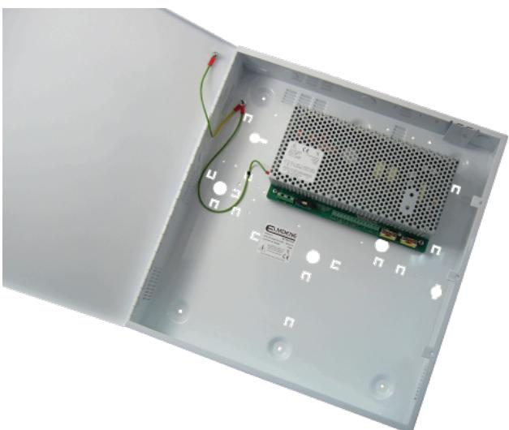

## STX2410-E

Produktblad

EN 54-4 godkänd, 24 V 10 A + 0,7 A Intelligent strömförsörjning

#### Allmänt

STX2410-E är ett fullt utrustad och EN54-4 godkänd strömförsörjning, idealisk för användning i brandlarmsinstallationer. Den har intelligent batteriladdning, övervakning och signalering. Den reglerade spänningsutgången ger 27,6 VDC, klarar en last på 10 A, ger samtidigt upp till 0,7 A för att ladda reservkraftsbatterierna och är försedd med ett elektronisktkortslutningsskydd. Maximallivslängd på batterierna säkerställs genom en aktiv batteriövervakning och laddning i tre laddningsnivåer: snabb, absorb eller temperaturkompenserad beroende på batteriernas tillstånd. När batterierna är fulladdade växlar aggregatet över till Eco-strömsparläge, där batterierna laddas fyra timmar varje 24-timmarsperiod med kontinuerlig övervakning. EcoCharge-tekniken minskar slöseri av energi vid laddning av redan fulladdade batterier och förlänger batteriernas livslängd. Djupurladdningsskyddet förhindrar förtida batterifel vid drift och standby under längre perioder.

#### Installation

A STX2410-E levereras i en fristående kapsling för väggmontage med plats för två 17 Ah batterier (medföljer ej). Kapslingen är av vitlackerad metall och försedd med hål för enkel installation på vägg. Det finns två potentialfria reläutgångar för fel. Den ena utgången aktiveras vid fel på utspänning, batterifel, laddningsfel eller intern fel. Den andra utgången aktiveras vid nätfel. Dessa utgångar säkerställer att eventuella feltillstånd rapporteras till övervakningsutrustningen så att lämpliga åtgärder kan vidtagas. Batteriladdningskretsen aktiveras endast när ett batteri är korrekt anslutet och spänningen är högre än 14 V. Dessutom finns ett RS232 seriellt gränssnitt som kan tillhandahålla information om diagnostik och felrapportering till ett övervakningssystem.

#### Standardprestanda

- EGodkänd enligt EN54-4/CPR
- ENominell reglerad spänningsutgång med upp till 10 A strömbelastning vid 27,6 VDC
- EFristående kapsling med plats för två 17 Ah batterier
- EDjupurladdningsskydd
- EFelindikerings LED (gul) blinkar vid detektering av utgångsfel, batterifelt, laddningsfelt och nätfel
- ENätindikerings LED (Grön) visar att 230 VAC nätspänning finns
- ELED-indikering på insidan av enheten för feldiagnostik
- E2 x Reläutgångar: Fel & Nätfel
- ETemperaturkompenserad laddning
- ENätspänning 110 - 240 VAC
- EEcoCharge teknologi som reducerar strömförbrukningen
- EBatteriövervakning detekterar saknat batteri, lågbatterispänning, kortslutning, polaritetsvändning och impedansfel
- EElektroniskt kortslutningsskydd kopplar ner utgången tills dess att överlasten eller kortslutningen försvinner

# STX2410-E

EN 54-4 godkänd, 24 V 10 A + 0,7 A Intelligent strömförsörjning

### Tekniska data

| Elektriskt                                     |                                                                                                      |
|------------------------------------------------|------------------------------------------------------------------------------------------------------|
| Märkspänning                                   | 110 till 240 VAC                                                                                     |
| Strömförbrukning                               | 4 A max vid full belastning                                                                          |
| Utgång                                         |                                                                                                      |
| Spänning                                       | 27,6 VDC                                                                                             |
| Utgångsström                                   | 10 A                                                                                                 |
| Rippel                                         | 100 mV max                                                                                           |
| Konstant strömladdning                         | 0,7 A                                                                                                |
| Standby batteri                                |                                                                                                      |
| Kapacitet i kapsling/extern batteribox      | 2 x 17 Ah / 2 x 65 Ah                                                                                |
| L                                              | Konstant snabbladdning till 80 % kapacitet inom 24 timmar. Hålladdning till 100 % inom 48 timmar. |
| Djupurladdningsskydd                           | Tröskelspänning 21 V                                                                                 |
| Tröskelspänning för varning av lågt batteri | 23 V                                                                                                 |
| Mekaniska data                                 |                                                                                                      |
| Färg                                           | Vit                                                                                                  |
| Mått                                           | 400 x 420 x 80 mm                                                                                    |
| Vikt                                           | 6,4 kg (exklusive batterier)                                                                         |
| Material                                       | Stål                                                                                                 |
| Miljö                                          |                                                                                                      |
|                                                | -10 till +40 C                                                                                       |
| Lagringstemperatur                             | -20 till +80 C                                                                                       |
| Relativ luftfuktighet                          | 75 % icke kondenserande                                                                              |
| Standarder & Föreskrifter                      |                                                                                                      |
| Certifiering                                   | EN54-4                                                                                               |
| Indikeringar                                   |                                                                                                      |
| På fronten                                     | Grön LED - nätspänning, Gul-LED - fel                                                                |
| På insidan av enheten                          | Orange LED - feldiagnostik                                                                           |
| Signalutgångar                                 |                                                                                                      |
| Felrelä                                        | 100 mA vid 60 VDC N/C                                                                                |
| Nätfelsrelä                                    | 100 mA vid 60 VDC N/C                                                                                |

#### Order data

| Artikelnummer | Beskrivning                                                                 |
|---------------|-----------------------------------------------------------------------------|
| BATT-BOX-65   | Extern batteribox för användning med strömförsörjningsaggregat STX2410-E |
| STX2410-E     | EN 54-4 godkänd, 24 V 10 A + 0,7 A Intelligent strömförsörjning             |

