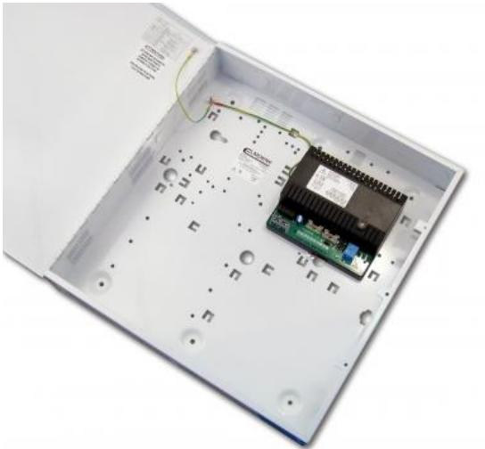

## STX2405-E

Produktblad

EN 54-4 godkänd, 24 V 5 A + 0,85 A Intelligent strömförsörjning

#### Allmänt

STX2405-E är en fullt utrustad och EN54-4 godkänd strömförsörjning, idealisk för användning i

brandlarmsinstallationer. Den har intelligent batteriladdning, övervakning och signalering. Den reglerade utgången ger 27,6 VDC, klarar en last på 5 A och ger samtidigt upp till 0,85 A för att ladda reservkraftsbatterierna.

Maximal livslängd på batterierna garanteras genom kontinuerlig övervakning och två olika laddningsnivåer: Snabbladdning och temperaturkompenserad flödesladdning.

Vid full laddning går enheten över i Eco energisparläge, varvid batterierna laddas i 4 timmar varje 24 timmarsperiod medan de kontinuerligt övervakas.

Ett djupurladdningsskydd förebygger förtida batterifel vid drift i standby under längre perioder.

Enheten är försedd med LED-indikeringar för nät, fel och diagnos.

#### Installer friendly

STX2405-E levereras i en fristående kapsling för väggmontage med plats för 7 Ah batterier (ingår ej). Kapslingen är av vitlackerad metall och försedd med hål för enkel installation på vägg.

Det finns två potentalfria reläutgångar för fel. Den ena utgången aktiveras vid fel på utspänning, batterifel, laddningsfel eller internt fel. Den andra utgången aktiveras vid nätfel. Dessa utgångar säkerställer att eventuella feltillstånd rapporteras till övervakningsutrustningen så att lämpliga åtgärder kan vidtagas. Batteriladdningskretsen aktiveras endast när ett batteri är korrekt anslutet och spänningen är högre än 14 V.

En grön och en gul LED-indikering för nät respektive fel är synliga utifrån när kapslingen är stängd. På insidan finns en orange LED-indikering för diagnostik som blinkar olika beroende på typ av fel. Dessa indikeringar är till hjälp för att på ett enkelt sätt kunna identifiera och åtgärda olika typer av fel på plats.

#### Standardprestanda

- EGodkänd enligt EN54-4 & CPR-certifierad
- EFristående kapsling med plats för 17 Ah batterier
- EDjupurladdningsskydd
- ELED-indikering synlig från utsidan för nät och fel
- ELED-indikering på insidan för feldiagnostik
- E2x reläutgångar: Fel & Nätfel
- ETemperaturkompenserad laddning
- EEcoCharge teknologi vilket minskar strömförbrukningen
- EBatteriövervakning – batteri saknas, låg batterispänning, kortslutning, felvänd polaritet & kretsimpedansfel

Batteriövervakning - batteri saknas, låg batterispänning, kortslutning, felvänd polaritet & kretsimpedansfel

- EElektroniskt överbelastningsskydd stänger ner utgången tills dess att överbelastningen eller kortslutningen tas bort
# STX2405-E

EN 54-4 godkänd, 24 V 5 A + 0,85 A Intelligent strömförsörjning

### Tekniska data

| Ingång                             |                                              |
|------------------------------------|----------------------------------------------|
| Märkspänning                       | 110 - 240 VAC, 50 Hz - 60 Hz                 |
| Driftspänning                      | 90 VAC till 264 VAC                          |
| Ström                              | <2 A maximalt vid full last                  |
| Utgång                             |                                              |
| Spänning                           | 27,0 - 28,3 VDC med nätspänning              |
|                                    | 20,3 - 26,0 VDC i batteri standby läge       |
| Rippel                             | 100 mV max                                   |
| Kontinuerlig utgångsström          |                                              |
| - Med 2,1 Ah batterier             | 5,0 A icke-laddning / 5,0 A laddning         |
| - Med 7 Ah batterier               | 5,0 A icke-laddning / 5,0 A laddning         |
| - Med 17 Ah batterier              | 5,0 A icke-laddning / 5,0 A laddning         |
| Säkring – belastning               | 5 A                                          |
| Säkring – batteri                  | 5 A                                          |
| Konstant strömladdning             | 0,85 A                                       |
| Batterier                          |                                              |
| Batterikapacitet (i kapsling)      | Upp till 2 x 17 Ah                           |
| Batteriladdning                    | Konstant strömladdning till 80 % inom 24 tim |
|                                    | Flytande ladning till 100 % inom 48 tim      |
| Djupurladdningsskydd               | Batterierna frånkopplas vid 21 V             |
| Tröskelvärde för lågt batteri 23 V |                                              |
| Indikeringar                       |                                              |
| På fronten                         | Grön LED – spänning                          |
|                                    | Gul LED – fel                                |
| På insidan av enheten              | Orange LED – fault diagnostics               |
| Signalutgångar                     |                                              |
| Felrelä                            | 100 mA @ 60 VDC N/C (brytande kontakt)       |
| Nätfelsrelä                        | 100 mA @ 60 VDC N/C (brytande kontakt)       |
| Mekaniska data                     |                                              |
| Mått                               | 400 x 420 x 80 mm                            |
| Vikt                               | 5,9 kg (exklusive batterier)                 |
|                                    | 18,5 kg (inklusive 17 Ah batterier)          |
| Temperatur                         | -10 till +40 °C (drift)                      |
|                                    | -20 till +80 °C (förvaring)                  |
| Luftfuktighet                      | 75 % Relativ fuktighet icke kondenserande    |
| Material                           | 1,2 mm stål                                  |
| Färg                               | Vit                                          |

#### Order data

| Artikelnummer | Beskrivning                                                     |
|---------------|-----------------------------------------------------------------|
| STX2401-C     | EN 54-4 godkänd, 24 V 1 A + 0,3 A Intelligent strömförsörjning  |
| STX2402-E     | EN 54-4 godkänd, 24 V 2 A + 0,7 A Intelligent strömförsörjning  |
| STX2405-E     | EN 54-4 godkänd, 24 V 5 A + 0,85 A Intelligent strömförsörjning |

