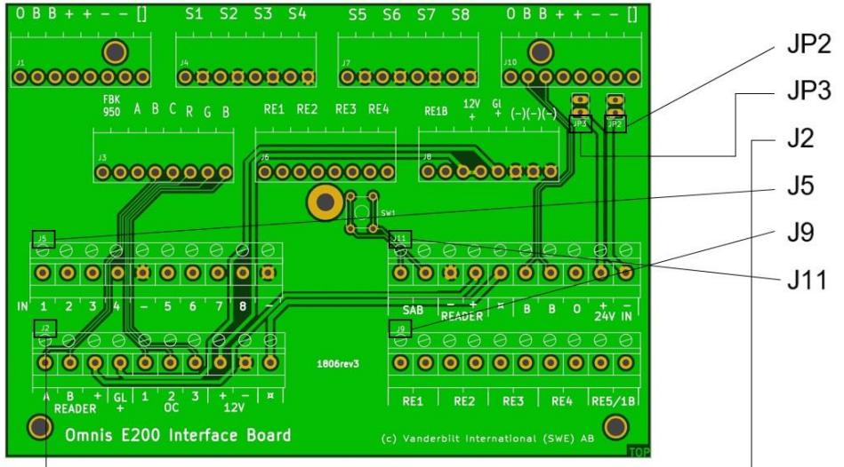

## **Omnis E200-IB Quick guide/Snabbguide**

The E200 Interface Board, E200-IB, is intended for use when an E2 is to be exchanged for an E200 and where existing cabling or space constraints complicates a direct swap.

E200 Interface Board, E200-IB, är tänkt att användas då en E2 skall bytas mot en E200 och där befintligt kablage eller utrymmesbegränsningar försvårar ett direkt utbyte.

| Important information                                                                                                                                                                                                                         | Viktig information                                                                                                                                                                                                                                                                                                                                                                             |  |  |
|-----------------------------------------------------------------------------------------------------------------------------------------------------------------------------------------------------------------------------------------------|------------------------------------------------------------------------------------------------------------------------------------------------------------------------------------------------------------------------------------------------------------------------------------------------------------------------------------------------------------------------------------------------|--|--|
| The E200-IB is delivered without enclosure. It is supposed to be mounted in the existing E2 housing.                                                                                                                                 | E200-IB levereras utan kapsling. Den är tänkt att monteras i existerande E2 kapsling.                                                                                                                                                                                                                                                                                                    |  |  |
| The metal stand-off, two jumpers and spring for the front tamper from the existing E2 is to be used for the E200- IB. There is no stand-off, jumpers for JP2 & JP3, or spring included in the E200-IB product.                 | Varken metalldistans till locket, jumprar till JP2 & JP3, eller fjäder till främre sabotagekontakt är inkluderade i produkten E200-IB. Använd metalldistans, jumprar och fjäder från befintlig E2. Om sabotagekontakten på E200-IB används, skall positionen SAB på J11 kopplas till en av ingångarna på E200. Det finns ingen bakre sabotagekontakt på E200-IB. |  |  |
| If the tamper contact on the E200-IB is used, the position SAB on J11 shall be connected to one of the inputs on the E200. There is no back tamper on the E200- IB.                                                            |                                                                                                                                                                                                                                                                                                                                                                                                |  |  |
| Jumpers JP2 & JP3 can be used for connecting/disconnecting the 24V plus or minus on position J10.                                                                                                                                    | Jumprarna JP2 & JP3 kan användas för att koppla samman/bryta 24V plus eller minus på position J10.                                                                                                                                                                                                                                                                                    |  |  |
| If the reader is exchanged at the same time as the E200-IB is installed, it is recommended to connect the new reader to the E200 directly. If the reader is kept, remember to change the setting on the E200 to clock&data. | Om läsaren byts ut i samband med att E200-IB installeras, rekommenderas att den nya läsaren kopplas in direkt på E200. Om befintlig läsare behålls, kom ihåg att ändra inställningen på E200 till clock&data.                                                                                                                                                                   |  |  |

© Vanderbilt International (IRL) Ltd Document no. A-100513 Edition 2018-08-28 Document version: 1

| GB |                                                                                                                                                                                                                                                                                                                                                                                           | SE |    |                                                                                                                                                                                                                                                                                                                                                                      |
|----|-------------------------------------------------------------------------------------------------------------------------------------------------------------------------------------------------------------------------------------------------------------------------------------------------------------------------------------------------------------------------------------------|----|----|----------------------------------------------------------------------------------------------------------------------------------------------------------------------------------------------------------------------------------------------------------------------------------------------------------------------------------------------------------------------|
| 1  | Remove all connectors from the existing E2 node.                                                                                                                                                                                                                                                                                                                                       | 1  |    | Lyft av alla plintar från den existerande E2 noden.                                                                                                                                                                                                                                                                                                               |
| 2  | Unscrew the metal stand-off and remove the spring from the tamper contact of the E2.                                                                                                                                                                                                                                                                                                | 2  |    | Skruva loss metalldistansen samt ta bort fjädern från sabotagekontakten på E2 noden.                                                                                                                                                                                                                                                                              |
| 3  | Remove the E2 node and replace it with the E200-IB.                                                                                                                                                                                                                                                                                                                                    | 3  | IB | Ta bort E2 noden och ersätt den med E200-                                                                                                                                                                                                                                                                                                                            |
| 4. | Secure the E200-IB by screwing the metal stand-off back on, and put the spring onto the tamper contact of the E200-IB.                                                                                                                                                                                                                                                              | 4  |    | Fäst E200-IB genom att skruva tillbaka metalldistansen, samt sätt på fjädern på E200-IB sabotagekontakt.                                                                                                                                                                                                                                                       |
| 5. | Put the connectors back onto the E200-IB. The positions and markings of the connectors are the same as on the E2.                                                                                                                                                                                                                                                                   | 5  |    | Sätt tillbaka plintarna på E200-IB. Positioner och märkning är de samma som på E2.                                                                                                                                                                                                                                                                             |
| 6. | Draw new cables from connectors J2, J5, J9 and J11 to an E200 node. The labels on these connectors correspond to the labels on the E200. Please note that minus for the inputs on the E200 is common. That means that only one cable from one of the minus connectors on J5 is necessary to connect to one of the minus connectors for the inputs on the E200. | 6  |    | Dra nya kablar från plintarna J2, J5, J9 och J11 till en E200 nod. Markeringen på dessa plintar motsvarar markeringarna på E200. Notera att minus för ingångarna är gemensam på E200. Det betyder att man bara behöver dra en kabel från någon av minusplintarna på J5 och koppla denna på någon av minusplintarna för ingångarna på E200 |