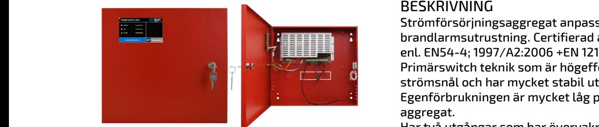
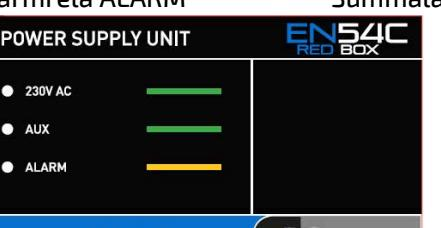
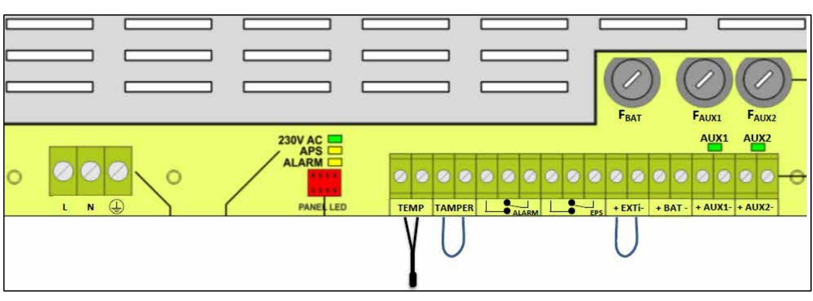

## EN54C – REDBOX

STRÖMFÖRSÖRJNING, certifierade enl. EN54-4, EN12101-10

#### Skydd:

Aggregatet är skyddat mot överbelastning och kortslutning.

Inbyggt skydd mot djupurladdning av batterierna. Nät, last och batteri är skyddas av säkring.

#### Indikeringar och larm

Normaldrift: Indikeras med 2st gröna lysdioder.

230V AC (grön) Nätspänning ok AUX (grön) Utspänning ok på AUX1 och AUX2.

ALARM (gul) Fel.

Larmrelä EPS Nätspänningsfel Larmrelä ALARM Summalarm

## BESKRIVNING

Strömförsörjningsaggregat anpassad för drift av brandlarmsutrustning. Certifierad av tredje part enl. EN54-4; 1997/A2:2006 +EN 12101-10 Primärswitch teknik som är högeffektiv och är strömsnål och har mycket stabil utspänning. Egenförbrukningen är mycket låg på alla aggregat.

Har två utgångar som har övervakning och larm.

#### Utförande:

Aggregaten är utförda i röd självventilerad plåtkapsling och avsett för väggmontage. Förberedd för 9st genomförningar 4 uppåt + 4st åt höger + 1st bakåt.

Plats för underhållsfria blybatterier enligt tabell.

## TEKNISKA DATA

| Inspänning               | 230VAC (-15% +10%)                     |  |  |  |
|--------------------------|----------------------------------------|--|--|--|
|                          | 1 fas 50-60Hz                          |  |  |  |
| Reglering                | max 0,6 %                              |  |  |  |
| Utspänning               | 27,6VDC                                |  |  |  |
|                          | Rippelspänn. max 0,1 % av utspänningen |  |  |  |
| Temp. omr.               | -5 – 40 C                              |  |  |  |
| Larmrelä                 | Växlande,                              |  |  |  |
|                          | Max 1A 50V                             |  |  |  |
| Kapsling                 | IP30                                   |  |  |  |
| CE-märkt                 | EN 60950-1:2007                        |  |  |  |
|                          | EN 61000-6-3:2008+A1:2012              |  |  |  |
|                          | EN IEC 63000:2019-01                   |  |  |  |
|                          | EN 50130-4:2015+A1:2015-03             |  |  |  |
| Certifieringar EN54-4/A2 |                                        |  |  |  |
|                          | EN12101-10                             |  |  |  |

| E:        | Typ         | Total utström         |                              | Batteriplats | Internförb.         | HxBxD           |
|-----------|-------------|-----------------------|------------------------------|--------------|---------------------|-----------------|
| nummer    |             | Kontinuerlig Drift | Intermittent Drift (5min) |              | vid batteridrift |                 |
|           |             | Imax a + Ilad         | Imax a + Ilad                |              |                     |                 |
| 52 574 99 | EN54C-2A7   | 1,6A + 0,4A           | 2A + 0A                      | 2 x 9Ah      | 52mA                | 305 x 330 x 82  |
| 52 575 00 | EN54C-2A17  | 1,2A + 0,8A           | 2A + 0A                      | 2 x 20Ah     | 52mA                | 402 x385 x 88   |
| 52 575 01 | EN54C-5A17  | 3,8A + 1,2A           | 5A + 0A                      | 2 x 20Ah     | 55mA                | 402 x385 x 88   |
|           | EN54C-10A40 | 8,2+ 1,8A             | 10A + 0A                     | 2 x 45Ah     | 85mA                | 407 x 420 x 178 |
| 52 575 03 | EN54C-10A65 | 7,4A + 2,6A           | 10A + 0A                     | 2 x 65Ah     | 85mA                | 648 x 410 x 180 |

Postadress/Postal address **Swansons Telemekanik AB** Hålstensvägen 4 SE-446 37 Älvängen

Telefon nr/Telephone no +46(0)303-746 320 Hemsida/Webb www.swtm.se

Telefax nr/Telefax no +46(0)303-748 490 e-post info@swtm.se

VAT.NO SE556289017701

# EN54C – REDBOX

STRÖMFÖRSÖRJNING, certifierade enl. EN54-4, EN12101-10 

## SÄKERHET

Endast auktoriserad och erfaren personal inom AC och DC får använda, arbeta, serva/underhålla, installera denna enhet.  **SM40 Strömförsörjning med plats för batteri**

Endast isolerade verktyg får användas i enheten. Observera att farliga spänningar och strömmar förekommer i apparaten både när interna säkringarna är av eller på.

Denna instruktion skall läsas igenom grundligt och förstås av all handhavande personal. Vid minsta tveksamhet om systemets uppbyggnad, funktion, komponenter samt säkerhet skall leverantören kontaktas.

Kontrollera att kretskort sitter fast och inte är transportskadade.

Om batterier används är dessa alltid elektrokemiskt aktiva. Kortslut inte batteripolerna.

## INKOPPLING

- Montera aggregatet fritt. Minst 100mm på varje sida.
- Lossa de två skruvarna i locket.
- Lätta försiktigt på locket och lossa bandkabeln till lysdiodskortet.
- Placera batterierna på avsedd plats i skåpet och anslut med batterikablarna.
- Anslut först 230V AC. Spänningsätt.
- 2st gröna LED tänds på fronten.
- Kontrollera att utspänningen är riktig.
- Anslut därefter lasten.
- Löser utgångssäkringarna, kontrollera inkoppling och inkopplade apparater.
- Larmrelä ritade i olarmat läge.

| Modell      | Säkring FBAT | Säkring FAUX1 | Säkring FAUX2 |
|-------------|-----------------|------------------|------------------|
| EN54C-2A7   | F 5 A/250 V     | F 4 A/250 V      | F 4 A/250 V      |
| EN54C-2A17  | F 5 A/250 V     | F 4 A/250 V      | F 4 A/250 V      |
| EN54C-5A17  | F 10 A/250 V    | F 6,3 A/250 V    | F 6,3 A/250 V    |
| EN54C-10A40 | F 12,5A/250 V   | F 10 A/250 V     | F 10 A/250 V     |
| EN54C-10A65 | F 12,5A/250 V   | F 10 A/250 V     | F 10 A/250 V     |

Postadress/Postal address **Swansons Telemekanik AB** Hålstensvägen 4 SE-446 37 Älvängen

Telefon nr/Telephone no +46(0)303-746 320 Hemsida/Webb www.swtm.se

Telefax nr/Telefax no +46(0)303-748 490 e-post info@swtm.se

VAT.NO SE556289017701