*®*

 *Installation, planering och service Rev 6*

| 1 Säkerhet och support  2                         |  |
|------------------------------------------------------|--|
| 1.1 Support  2                                    |  |
| 2 Systemöversikt  3                               |  |
| 2.1 Grundläggande  3                              |  |
| 2.2 Drifttillstånd  3                             |  |
| 2.2.1 Nätdrift  3                                 |  |
| 2.2.2 Batteridrift  3                             |  |
| 2.2.3 Batteriladdning  3                          |  |
| 2.3 Uppbyggnad  3                                 |  |
| 3 Installation och indikeringar  5                |  |
| 3.1 Montage och kapsling  5                       |  |
| 3.1.1 Mått Gari G1/G2  5                          |  |
| 3.2 Kretskort  6                                  |  |
| 3.2.1 Säkringar6                                  |  |
| 3.2.2 Indikeringar6                               |  |
| 3.2.3 Anslutningar  7                             |  |
| 3.3 Installation av batterier  8                  |  |
| 3.3.1 Batterier Gari G1  9                        |  |
| 3.3.2 Batterier Gari G2  9                        |  |
| 3.4 Konfiguration av enhet 10                     |  |
| 3.4.1 Konfiguration av parametrar (via USB) 10    |  |
| 3.4.2 Konfiguration av adress (via DIP-switch) 12 |  |
| 3.5 Systemanalys 13                               |  |
| 4 Servicemoment  15                               |  |
| 4.1 Byte/installation av batterier 15             |  |
| 4.2 Byte av säkringar 15                          |  |
| 4.2.1 Säkring på 230VAC matning 15                |  |
| 4.2.2 Säkring på utspänning till anläggning 15    |  |
| 4.2.3 Säkring mellan batterier 15                 |  |
| 5 SSF 17                                          |  |
| 5.1 Krav för att uppfylla godkännande 17          |  |
| 5.2 SSF regelverk 17                              |  |
| 6 Tekniska data  18                               |  |
| 7 Dokumenthistorik  19                            |  |
| 7.1 Revision 1 19                                 |  |
| 7.2 Revision 2 19                                 |  |
| 7.3 Revision 3 19                                 |  |
| 7.4 Revision 4 19                                 |  |
| 7.5 Revision 5 19                                 |  |

## **1 Säkerhet och support**

- **Endast auktoriserad och erfaren personal inom AC och DC får använda, arbeta, serva/underhålla och installera denna enhet.**
- **Endast isolerade verktyg får användas i enheten.**
- **Observera att farliga spänningar och strömmar förekommer i apparaten både när interna säkringarna är av eller på.**
- **Denna manual skall läsas igenom grundligt och förstås av all handhavande personal. Vid minsta tveksamhet om systemets uppbyggnad, funktion, komponenter samt säkerhet skall leverantören kontaktas.**
- **Bortbrytning av inkommande 230VAC sker genom att plint med nummer 3/4/5 lossas**
- **Dessa strömförsörjningar får endast användas med alarmsystem**
- **Uttjänta batterier skall återvinnas i enlighet med lokala regler**

## **1.1 Support**

För teknisk support, kontakta Swansons på mail **support@swtm.se**.

## **2 Systemöversikt**

## **2.1 Grundläggande**

Gari G1/G2 är ett kraftaggregat för avbrottsfri DC-matning som är godkänt enligt SSF1014 PS typ A. Modellerna G1 och G2 erbjuder samma funktioner, endast nominellt strömuttag skiljer. Gari är avsedd för matning av 24VDC system inom inbrottslarm och passerkontroll. Gari har ingångar och utgångar som kan konfigureras för olika funktionalitet samt kommunikationskanaler för interaktion med centralutrusningar. Konfiguration och kontroll av Gari kan även göras via PC-mjukvara som ansluter över USB..

## **2.2 Drifttillstånd**

### 2.2.1 **Nätdrift**

När Gari är ansluten till 230VAC kommer den interna AC/DC-omvandlaren att strömförsörja anläggningen. Så länge inte peak-strömmar (se tabell nedan) överskrids kommer batterier antingen befinna sig i uppladdning eller vila. Om inspänningen till Gari sjunker under 90VAC eller om strömuttaget går över peak-strömmen kommer batterierna att kopplas in för att säkerställa avbrottsfri kraft till anläggningen.

### 2.2.2 **Batteridrift**

När spänning från elnätet förvinner (strömavbrott) kommer batterierna i Gari att försörja anläggningen. Detta tillstånd kvarstår tills dess att a) nätspänning över 90VAC återkommer under minst 3 sekunder, eller b) batterierna laddas ur till en så låg nivå att de kan anses som urladdade. Om nivå för urladdade batterier nås kommer Gari att meddela kommunicerande system och sedan stänga av utspänningen samt frikoppla batterierna (s.k. deep-discharge protection).

### 2.2.3 **Batteriladdning**

Efter återgång till nätdrift samt vid visst tidsintervall kommer uppladdning av batterier ske. Denna uppladdning sker i tre steg:

- 1. BULK laddning batterierna laddas upp till 90% (tar ca. 24 timmar med standardinställningar)
- 2. ABS laddning batterierna toppas upp till 100% (tar ytterligare ca. 12 timmar)
- 3. Standby Batterierna anses fulladdade och frikopplas från laddning

Under och efter dessa steg sker kontinuerlig övervakning av batteriernas kvalité, interna resistans och laddningsgrad. Oavsett steg så kommer Gari att ansluta batterierna vid ev. nätavbrott inom 1uS. Batteriladdning sker helt enligt tillverkarnas rekommendationer, och det är därför viktigt att använda batterier av korrekt typ.

## **2.3 Uppbyggnad**

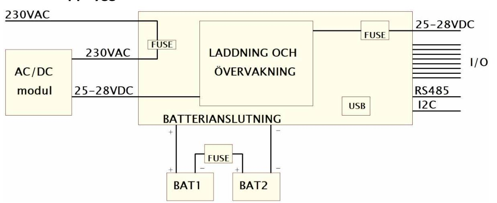

Gari matas nominellt med 230VAC. Denna matningsspänning skall vara fast installerad (EJ via stickkontakt) och göras av behörig installatör. Avsäkring för denna externa matning finns på kretskortet. Externt från kretskortet finns en AC/DC-modul som omvandlar 230VAC till DC, nominellt 27V. Denna spänning matar kretskortet som i sin tur laddar batterierna och distribuerar ut matningsspänning till anläggning. PÅ kretskortet finns avsäkring för anläggning. För att direkt styra larmsändare och/eller andra funktioner finns ingångar och utgångar på kretskortet. Det finns även anslutningar för kommunikation, DIP-switch för adressering, USB-kontakt (device) samt ett flertal indikeringar.

## **3 Installation och indikeringar**

## **3.1 Montage och kapsling**

Gari G1 och G2 levereras i SSF-godkänd kapsling för montage på vägg eller i stativ. Om enheten monteras i stativ måste baksida täckas för att följa SSF-godkännande. Gari har mikrobrytare för att detektera bortbrytning från vägg samt öppning av dörr. Hylsan till bortbrytningsskyddet kan justeras och vid montage mot vägg skall hylsan pressas hårt mot väggen och låsas i position med de två skruvarna för att förhindra manipulering av bortbrytningsskydd. Vid högsta larmklass (4) måste Gari monteras inom skyddat område, vid lägre larmklasser är Gari lämplig att montera både inom och utom skyddat område och kräver inte några kalibreringar.

### 3.1.1 **Mått Gari G1/G2**

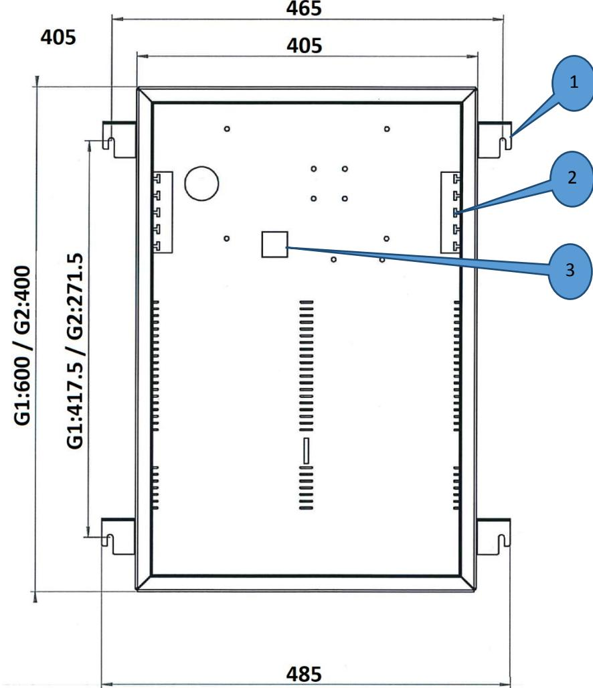

*Kombinerad skiss för Gari G1 och G2, alla mått i mm* 

- 1. Upphängningsvinkel, 4 st, levereras löst med aggregatet. Monteras, i bakkant för väggmontage, med 2st M5 bultar och tandad bricka, per fästvinkel. Fästs mot vägg med M6-bult eller likvärdig. Bredd passar 19' stativ.
- 2. Kabelgenomföringar, 2 st (vänster starkström, höger svagström)
- 3. Öppning för bortbrytningsskydd (justerbart) mot vägg. Om enheten monteras i stativ skall heltäckande bakstycke monteras för godkänd installation. Vid 19" montage kan fästvinklarna monteras i framkant för ett smidigare utförande. Även då måste ett heltäckande bakstycke monteras för godkänd installation.

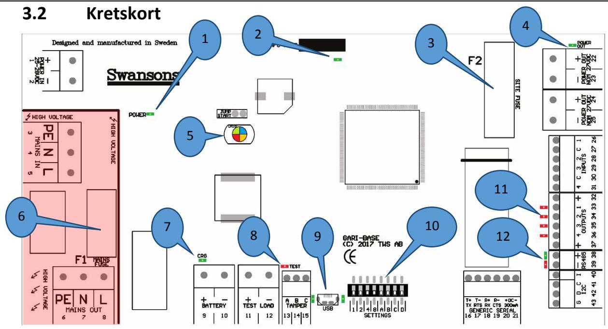

*Illustration över Gari kretskort. Notera att den röda delen är spänningssatt med 230VAC!* 

På Gari finns ett flertal anslutningar, där vissa är fabriksanslutna, ett flertal indikeringar samt säkringar och en DIP-switch. Beskrivning över alla dessa finns nedan.

### 3.2.1 **Säkringar**

På Gari finns tre säkringar varav två på kretskortet; säkring för 230VAC (6) samt säkring för anläggning (3). Mellan batterierna finns även en batterisäkring.

| Säkring        | Formfaktor      | Värde Gari G1 | Värde Gari G2 |
|----------------|-----------------|---------------|---------------|
| 3 – Anläggning | 6.3x32mm/5x20mm | 12.5AT        | 6.3AT         |
| 6 – Matning    | 5x20mm          | 4AT keramisk  | 2AT keramisk  |
| Batteri        | Blad            | 15AS          | 15AS          |

Notera: Högre avsäkringsvärde (A) eller annan typ än vad som visas i tabellen ovan får EJ användas.

#### 3.2.2 **Indikeringar**

På Gari finns ett flertal olika indikeringar för att visa aktuell status. En av dessa (5) är en RGB-lysdiod (röd/grön/blå) som kan visa många olika färger och kombinationer. Denna indikering syns även i frontpanelen då dörren till skåpet är stängd.

| Indikering | Färg | Tydelse                                               |
|------------|------|-------------------------------------------------------|
| 1 - Power  | Grön | Extern AC/DC modul matar systemet                     |
| 2          | Grön | Logikenhet är strömförsörjd                           |
| 4 - Out    | Grön | Anläggningen får spänning                             |
| 5          | Grön | Strömförsörjd via nät – Batteri fulladdat             |
|            | Blå  | Strömförsörjd via nät – Batteri laddas                |
|            | Gul  | Batteridrift                                          |
|            | Röd  | Felsignal (kan vara i kombination med grön eller blå) |
| 7 - Crg    | Grön | Batteriladdning pågår                                 |

| 8 - Test      | Röd       | Batteritest pågår                                            |  |
|---------------|-----------|--------------------------------------------------------------|--|
| 9 - USB       | Grön/Grön | USB redo/USB ansluten                                        |  |
| 11 - Utgångar | Röd x4    | Utgång aktiverad. En indikering per utgång.                  |  |
| 12 – RS485    | Grön/röd  | Kommunikation RS485, röd – sänder data, grön – mottager data |  |

### 3.2.3 **Anslutningar**

Flertalet av anslutningspunkterna på Gari är redan anslutna vid leverans. Det rekommenderas ej att ändra på dessa anslutningar utan att först kontakta support. De anslutningar som är gjorda från fabrik visas med skuggning i tabellen nedan.

| Nr.       | Funktion              | Förklaring                                     |
|-----------|-----------------------|------------------------------------------------|
| 1         | DC in +               | Matningsspänning från AC/DC modul (25-28VDC) + |
| 2         | DC in -               | Matningsspänning från AC/DC modul (25-28VDC) - |
| 3         | 230VAC in – Jord      | Fast anslutning till elnät JORD                |
| 4         | 230VAC in – Nolla     | Fast anslutning till elnät NOLLA               |
| 5         | 230VAC in – Fas       | Fast anslutning till elnät FAS                 |
| 6         | 230VAC ut – Jord      | Matning till AC/DC modul JORD                  |
| 7         | 230VAC ut – Nolla     | Matning till AC/DC modul NOLLA                 |
| 8         | 230VAC ut – Fas       | Matning till AC/DC modul FAS                   |
| 9         | Batteri +             | Anslutning till batteri + (2xAGM 12V)          |
| 10        | Batteri -             | Anslutning till batteri - (2xAGM 12V)          |
| 11        | Testload +            | Testlast +                                     |
| 12        | Testload -            | Testlast -                                     |
| 13        | Tamper A              | Första anslutning av sabotagebrytare(1         |
| 14        | Tamper B              | Gemensam anslutning av sabotagebrytare(1       |
| 15        | Tamper C              | Andra anslutning av sabotagebrytare(1          |
| 22, 24 | Matningsspänning ut + | Utspänning till anläggning +                   |
| 23, 25 | Matningsspänning ut - | Utspänning till anläggning -                   |
| 26        | Ingång 1              | Digital ingång 1                               |
| 27        | Gemensam ½            | Gemensam ingång 1/2                            |
| 28        | Ingång 2              | Digital ingång 2                               |
| 29        | Ingång 3              | Digital ingång 3                               |
| 30        | Gemensam 3/4          | Gemensam ingång 3/4                            |
| 31        | Ingång 4              | Digital ingång 4                               |
| 32        | Utgångar +            | Spänningsmatning för OC utgångar (max 200mA)   |

| 33 | Utgång 1    | OC utgång 1 (max 100mA sänkande)             |
|----|-------------|----------------------------------------------|
| 34 | Utgång 2    | OC utgång 2 (max 100mA sänkande)             |
| 35 | Utgång 3    | OC utgång 3 (max 100mA sänkande)             |
| 36 | Utgång 4    | OC utgång 4 (max 100mA sänkande)             |
| 37 | Utgångar +  | Spänningsmatning för OC utgångar (max 200mA) |
| 38 | RS485+      | Positiv koppling RS485                       |
| 39 | RS485-      | Negativ koppling RS485                       |
| 41 | I2C – Clock | Klocka för I2C-bus                           |
| 42 | I2C – Data  | Data för I2C-bus                             |
| 43 | I2C – GND   | Jord för I2C-bus                             |

### **3.3 Installation av batterier**

När batterier skall installeras i Gari är det viktigt att följande att nedanstående arbetsordning följs för att förhindra skador på batterier, system eller installatör. Batterier kan installeras med systemet i drift, men försiktighet skall iakttagas så att inte spänningsförande delar rörs.

Arbetsordning enligt följande:

- 1. Placera batterierna på deras avsedda plats (beskrivningar för respektive modell finns nedan)
- 2. Anslut medföljande bryggningskabel mellan batterierna UTAN att ha batterisäkring monterad
- 3. Anslut medföljande anslutningskabel mellan batteri och kretskort, var MYCKET noga med polaritet
- 4. Fäst batterierna med medföljande avlastningsband och spänn åt dessa
- 5. Kontrollera inkopplingar och polaritet
- 6. Återmontera batterisäkring
- 7. Vid behov, spänningssätt enheten

Batterier kan demonteras med systemet i drift, men försiktighet skall iakttagas så att inte spänningsförande delar rörs.

Arbetsordning enligt följande:

- 1. Ta ur batterisäkring
- 2. Montera loss kabel mellan batterier och kretskort
- 3. Montera loss kabel mellan batterier
- 4. Lossa avlastningsband
- 5. Lyft ur batterierna

#### 3.3.1 **Batterier Gari G1**

I kapsling för Gari G1 skall batterier av 100Ah kapacitet placeras stående på högkant med polerna mot luckan och fastspända mot bakstycket enligt följande skiss:

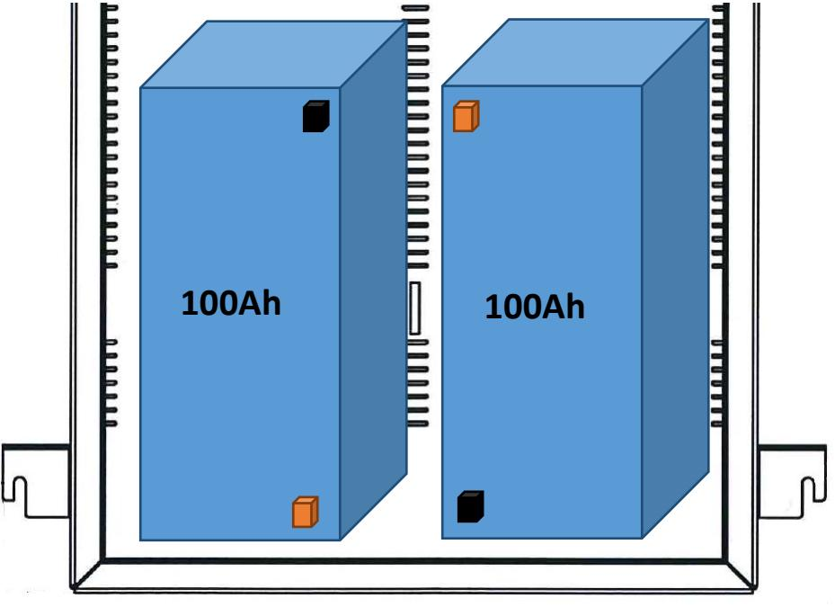

### 3.3.2 **Batterier Gari G2**

I kapsling för Gari G2 skall batterier av 45Ah kapacitet placeras stående på botten med polerna riktade uppåt och fastspända mot bakstycket enligt följande skiss:

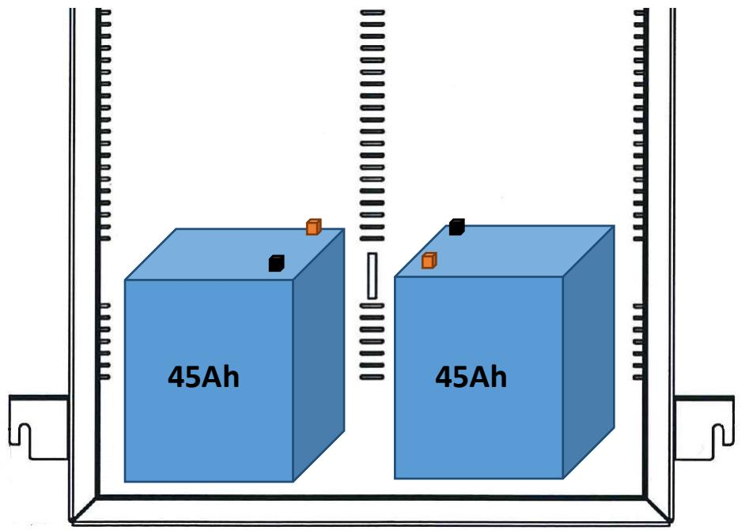

## **3.4 Konfiguration av enhet**

### 3.4.1 **Konfiguration av parametrar (via USB)**

För att konfigurerar driftsparametrar för Gari används mjukvaran Namida. Denna mjukvara kan köras direkt på all senare Windowsversioner och kräver ingen installation. Leta upp katalogen/enheten där mjukvaran har placerats och starta programmet "Namida.exe". Följande visas:

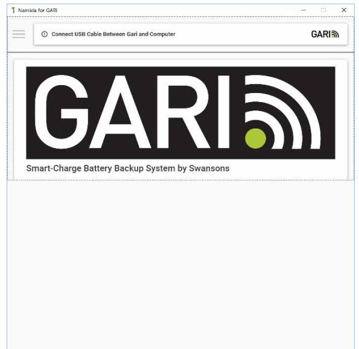

Anslut USB-kabel (standard micro-USB) mellan dator och Garis USB-port. Gari behöver i detta läge EJ vara spänningssatt.

Konfiguration av parametrar gör genom att klicka på menyn (s.k. "Hamburgermenyn") och välja "Configuration":

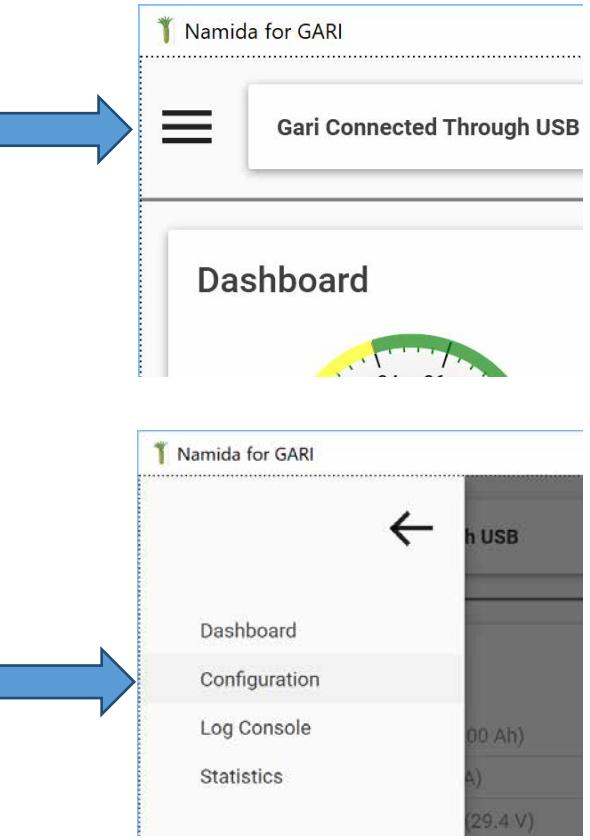

Följande parametrar kan anges:

| Parameter       | Rek. G1                          | Rek.G2 | Kommentar                                |  |
|-----------------|----------------------------------|--------|------------------------------------------|--|
| Battery         |                                  |        |                                          |  |
| Capacity        | 100Ah                            | 45Ah   | Rek. värde baseras på plats i skåp       |  |
| Charge current  | 4A                               | 2A     | Lägre värde påverkar uppladdningstid     |  |
| Charge Voltage  | 29,4V                            | 29,4V  | Kontrollera mot vald batterityp          |  |
| Site            |                                  |        |                                          |  |
| Warning level   | 7800mA                           | 3500mA | Lägre värde kan vara lämpligt            |  |
| Communication   |                                  |        |                                          |  |
| Protocol        | Valfritt                         |        | Beror på anslutning                      |  |
| Port            | Valfritt                         |        | Beror på anslutning                      |  |
| Input Function  |                                  |        |                                          |  |
| Input 1         | Battery Test                     |        | Sluten ingång startar batteritest        |  |
| Input2          | None                             |        |                                          |  |
| Input 3         | None                             |        |                                          |  |
| Input 4         | None                             |        |                                          |  |
| Output function |                                  |        |                                          |  |
| Output 1        | EPS Fault                        |        | Fel på nätspänning                       |  |
| Output 2        | APS Fault or Battery Test Active |        | Fel på batteri eller batteritest pågår(* |  |
| Output 3        | Power Output Fault               |        | Komponentfel/säkring                     |  |
| Output 4        | Tamper                           |        | Sabotage aktiv                           |  |

**) Konfigurationen på Output 2 skall sättas till "APS Fault or Battery Test Active" för att uppfylla krav enligt EN 50131-6 (4.2.6). Konfigurationen innebär att utgången används både till att signalera batterifel (APS Fault) och att ge återkoppling till central när manuellt fjärrtest begärts.* 

> *Att utgången går aktiv skall tolkas enligt följande: -Aktiv kortare än 2s i samband med fjärrtest: Fjärrtest begärt. -Aktiv längre än 2s: Fel detekterat.*

*Om kravet på återkoppling vid fjärrtest inte behöver uppfyllas kan Output 2 istället sättas till "APS Fault". Konfigurationen innebär att utgången används enbart till att signalera batterifel (APS Fault).* 

Om någon parameter ändras, klicka på "Save Settings" och invänta resultat. De parametrar som visas på sidan är de som lästs upp från Gari.

På sidan för konfiguration kan även mjukvara uppdateras i enhet samt att det går att bekräfta utbytt batteri. Denna funktion används för att säkert veta när nytt batteri installerats och denna tid visas även på *Dashboard*sidan. För att bekräfta utbytt batteri, klicka på knappen "Replace Battery", denna följs av en bekräftadialog.

| Output 4 Tamper |                                        | ﻬﺎ |
|-----------------|----------------------------------------|----|
| SAVE SETTINGS   |                                        |    |
|                 | Battery Age: 0 days REPLACE BATTERY |    |

### 3.4.2 **Konfiguration av adress (via DIP-switch)**

Om Gari konfigurerats för att använda protokoll mot överordnad plattform, t.ex. Sentrion eller CISS så kan adress behövas ställas in på enhetens DIP-Switch.:

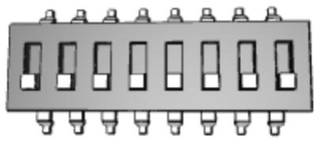

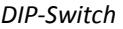

På kretskortet är DIP-Switchens 8 bytare märkta med 1, 2, 4, 8, A, B, C, D. Den första gruppen (1…8) används normalt för adress och den sista gruppen (A…D) för olika specialfunktionalitet.

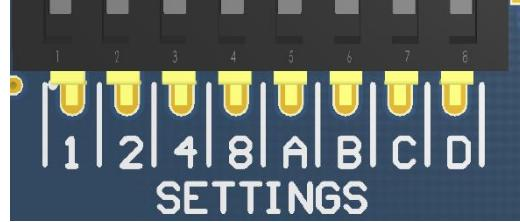

#### *Märkning på kretskort*

När adress skall ställas in motsvarar sifforna värden där värde anges genom att sätta switch till ON (vid leverans är alla switchar i OFF). OM Gari är monterad enligt manual så är ON upp och OFF ned. Värde 0, d.v.s. alla switchar i OFF motsvarar då första enhet på slingan. Sätts första switchen till ON kommer värdet bli 1, d.v.s. andra enheten på slingan. Om både switch som har värde 1 och switch som har värde 4 sätts blir då värdet 1+4=5, d.v.s. sjätte enheten på slingan. Nedanstående tabell visar hur olika adresser kan ställas in:

| Adress     | SW 1 | SW 2 | SW 3 | SW 4 |
|------------|------|------|------|------|
| 0 (första) | OFF  | OFF  | OFF  | OFF  |
| 1          | ON   | OFF  | OFF  | OFF  |
| 2          | OFF  | ON   | OFF  | OFF  |
| 3          | ON   | ON   | OFF  | OFF  |
| 4          | OFF  | OFF  | ON   | OFF  |
| 5          | ON   | OFF  | ON   | OFF  |
| 6          | OFF  | ON   | ON   | OFF  |
| 7          | ON   | ON   | ON   | OFF  |

| 8  | OFF | OFF | OFF | ON |
|----|-----|-----|-----|----|
| 9  | ON  | OFF | OFF | ON |
| 10 | OFF | ON  | OFF | ON |
| 11 | ON  | ON  | OFF | ON |
| 12 | OFF | OFF | ON  | ON |
| 13 | ON  | OFF | ON  | ON |
| 14 | OFF | ON  | ON  | ON |
| 15 | ON  | ON  | ON  | ON |

### **3.5 Systemanalys**

Samma verktyg som används för konfiguration, Namida, kan även användas för att få en överblick på statusen i anläggningen. När anläggningen är i drift, starta mjukvaran Namida på valfri PC med modernare version av Windows och anslut USB-kabel mellan dator och Gari. Namida kommer nu att presentera den s.k. *Dashboard*vyn där ett flertal av anläggningens parametrar går att läsa av. Notera att vissa mätares skala kan skilja sig beroende på hur enheten är konfigurerad.

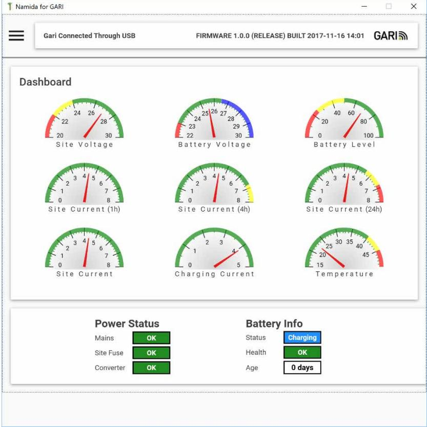

Överst visas nio olika mätare för systemstatus och nederst sex olika indikatorer, här följer en förklaring till dessa och vad man kan (och inte kan) förvänta sig:

| Mätare          | Normalvärde                                      | Kommentar                                                                                                                                                                                                                                 |
|-----------------|--------------------------------------------------|-------------------------------------------------------------------------------------------------------------------------------------------------------------------------------------------------------------------------------------------|
| Site Voltage    | Nätdrift 25-28, stabil Batteridrift över 21.5 | Detta är momentan utspänning. Under nätdrift skall den vara stabil på inställt värde. Vid batteridrift så sjunker den långsamt till batteri är urladdat (vid ca. 21.5V). Fel på utsäkring kommer resultera i 0V på denna mätare. |
| Battery Voltage | 21-29.4V                                         | Detta är momentan batterispänning. I vila med fulladdat                                                                                                                                                                                   |

|                    |                    | batteri är spänningen runt 26V. Under laddning kan den gå upp till ca. 29.4V och under batteridrift faller den långsamt ner till ca. 21.5V. Lägre än så på denna mätare indikerar felaktigt batteri, fel på batterisäkring eller urkopplat batteri. |
|--------------------|--------------------|--------------------------------------------------------------------------------------------------------------------------------------------------------------------------------------------------------------------------------------------------------------|
| Battery Level      | 0-100%             | Vi uppstart står denna mätare normalt på 70% efter laddning kommer den först gå upp till 80% och sedan nå 100%. Vid batteridrift visare denna mätare kvarstående laddning i batterierna.                                                            |
| Site Current (1h)  | 0-max A            | Medelströmmen I anläggningen under senaste timmen. Denna skall vara under inställd maxström. För att detta värde skall vara relevant måste anläggningen ha varit i drift mer än en timma.                                                           |
| Site Current (4h)  | 0-max A            | Som föregående mätare men denna visar ström över 4 timmar. Denna bör vara lägre än föregående.                                                                                                                                                            |
| Site Current (24h) | 0-max A            | Som föregående mätare men denna visar ström över 24 timmar. Denna bör vara lägre än föregående. Om denna når 75% av maxströmmen bör man se över anläggningens strömkonsumtion.                                                                      |
| Site Current       | 0-max A            | Momentan ström i anläggningen.                                                                                                                                                                                                                               |
| Charging current   | 0-"Charge Current" | Laddningsström till batterierna. Under en laddningsfas så ligger denna runt "Charge Current" tills batterierna når ca. 90% laddningsgrad. Efter detta faller den långsamt för att tillslut hamna på 0 när batterierna är fulladdade.                |
| Temperature        | 0-40ᵒ C            | Temperatur i kapsling. Om denna under längre tid ligger i det högre intervallet bör placeringen av enheten ses över för att inte skada batterier och elektronik.                                                                                       |

| Indikator    | Alternativ                    | Kommentar                                                                                                                                                             |  |  |  |
|--------------|-------------------------------|-----------------------------------------------------------------------------------------------------------------------------------------------------------------------|--|--|--|
| Power Status |                               |                                                                                                                                                                       |  |  |  |
| Mains        | OK/FAIL                       | Nätspänningsstatus                                                                                                                                                    |  |  |  |
| Site Fuse    | OK/FAIL                       | Säkring för utgång                                                                                                                                                    |  |  |  |
| Converter    | OK/FAIL                       | Status på AC/DC modul                                                                                                                                                 |  |  |  |
| Battery Info |                               |                                                                                                                                                                       |  |  |  |
| Status       | STAND BY/IN USE/FAIL/CHARGING | Berättar hur batteriet används. Normalt visas "STAND BY" som betyder att batteriet är fulladdat och väntar. "IN USE" betyder att anläggningen drivs på batteri. |  |  |  |
| Health       | OK/FAIL                       | Batterihälsa. Blir "FAIL" om defekter i batteriet detekteras vid batteritester.                                                                                    |  |  |  |
| Age          | NNN Days                      | Dagar sedan senaste batteribyte gjordes.                                                                                                                              |  |  |  |

## **4 Servicemoment**

## **4.1 Byte/installation av batterier**

#### **Felsymptom**

Enheten larmar för åldrat/felaktigt batteri eller batteri ej anslutet men säkring till batteri är hel och batterierna är korrekt anslutna. Batterier kan även behöva bytas ut p.g.a. att de nått rekommenderad ålder.

#### **Arbetsordning (se även kapitel om installation av batterier)**

- 1. Lyft bort anslutning för batteri (plint 9/10)
- 2. Lyft bort säkringen mellan batterierna
- 3. Montera loss anslutningskablarna på batterierna
- 4. Ersätt batterierna med nya dito av korrekt modell
- 5. Montera tillbaka kablaget (mellan batterier och anslutningskabel)
- 6. Sätt tillbaka batterisäkring
- 7. Kontrollera polaritet mot anslutningar
- 8. Återanslut plinten
- 9. Använd Namida för att nollställa batteriålder (se tidigare kapitel *Konfiguration av enhet* samt *Systemanalys*)

### **4.2 Byte av säkringar**

### 4.2.1 **Säkring på 230VAC matning**

#### **Felsymptom**

Trots att 230VAC kan uppmätas på plinten för inkommande nätspänning levererar inte AC/DC modulen någon spänning alls till Gari, d.v.s. spänningen mellan anslutning 4 och 5 är 230VAC men spänningen mellan 1 och 2 är 0VDC. Enheten fellarmar för nätspänningsfel/EPS.

#### **Arbetsordning**

- 1. Bryt bort inkommande 230VAC och kontrollera att ingen spänning finns på anslutning 4 och 5
- 2. Ta bort skyddshuv på säkringen (6)
- 3. Byt ut säkringen till ny säkring enligt tabell ovan
- 4. Sätt tillbaka skyddshuv
- 5. Återinkoppla 230VAC

### 4.2.2 **Säkring på utspänning till anläggning**

#### **Felsymptom**

Indikering vid utspänning (4) är släckt och ingen spänning finns ut på anslutningarna 22/24 – 23/25. För övrigt visar andra indikeringar korrekt och enheten fellarmar för säkringsfel/POF.

#### **Arbetsordning**

- 1. Lyft bort extern belastning (plint 22/23 och 24/25).
- 2. Byt ut säkringen (3) till ny säkring enligt tabell ovan

### 4.2.3 **Säkring mellan batterier**

#### **Felsymptom**

Batterierna är korrekt anslutna men huvudindikeringen (5) visar blinkande rött sken och enheten fellarmar för batteri ej anslutet/APS.

#### **Arbetsordning**

- 1. Lyft bort anslutning för batteri (plint 9/10)
- 2. Byt ut säkringen mellan batterierna till ny säkring enligt tabell ovan

# **5 SSF**

## **5.1 Krav för att uppfylla godkännande**

- GARI G1/G2 ska placeras i lokal som uppfyller kraven för Miljötålighetsklass I
- Inbrottslarmcentral skall vara verifierad för användning med GARI G1/G2 i aktuell larmklass
- Kommunikation med inbrottslarmcentral skall ske antingen via
	- o RS485: Protokollstöd krävs
	- o In- och utgångar: In- och utgångar skall vara konfigurerade enligt rekommendation i kapitel 3.4
- Strömförsörjning till central skall vara skyddad, tex genom
	- o Direkt anslutande montage av kapslingar
	- o Sabotageskyddad kabeldragning.

## **5.2 SSF regelverk**

Installationer som avser att uppfylla larmklassning enligt Svenska Stöldskyddsföreningens (SSF) normer skall uppfylla de krav som ställs i följande dokument. Dokumenten finns tillgängliga hos Svenska Stöldskyddsföreningen.

Notera att det är anläggningsfirmans ansvar att dessa krav uppfylls även om underentreprenörer anlitas. Dokumentlista:

- SSF 1014 Svenska Stöldskyddsföreningens norm för Materiel inbrottslarmanläggning
- SSF 1015 Svenska Stöldskyddsföreningens norm för Anläggarfirma inbrottslarmanläggning
- SSF 114 Regler för övervakad larmöverföringssystem Inbrottslarm
- SSF 136 Svenska Stöldskyddsföreningens regler för Larmcentraler
- SSF 1058 Anläggarintyg för inbrottslarmanläggning
- SS 3522 Byggnadsbeslag Lås för fast montering Klassindelning
- SS 455 12 01 Dokumentation av teletekniska anläggningar
- SS 424 14 38 Kabelförläggning i byggnader
- SS-EN 50131-1 Larmsystem Inbrottslarmsystem Del 1: Allmänna fordringar
- SS-EN 50131-6 Larmsystem Inbrottslarmsystem Del 6: Strömförsörjning
- SFS 1983:1097 Lag med vissa bestämmelser om larmanläggningar m.m.

## **6 Tekniska data**

| Strömmar och belastning |                                     |                            |                                          |                                              |                                                                                  |      |                                                   |                                     |                                                 |                                                |
|-------------------------|-------------------------------------|----------------------------|------------------------------------------|----------------------------------------------|----------------------------------------------------------------------------------|------|---------------------------------------------------|-------------------------------------|-------------------------------------------------|------------------------------------------------|
|                         | Ma (no tni m. ng )(1 | Ma tni ng A (2 | (nä t, n om Ut .) V (3 | Ma (SS x. F 1 ut /2 A ) | Ut A ( Ma (SS pe x. F 3 ak ut /4 ) A (4 ) |      | för Ma bru x. int kn ern ing | Ma x r ipp (+/ el -) | uts Lar pä mg nn rän ing s | spä nn sky Öv ing er dd s |
| Gari G1              | 230VAC                              | 2                          | 27                                       | 7.8                                          | 3.1                                                                              | 11.7 | 100mA                                             | 250mV                               | 22.5V                                           | 35V                                            |
| Gari                    |                                     |                            |                                          |                                              |                                                                                  |      |                                                   |                                     |                                                 |                                                |
| G2                      | 230VAC                              | 1                          | 27                                       | 3.5                                          | 1.4                                                                              | 5.25 | 100mA                                             | 250mV                               | 22.5V                                           | 35V                                            |

#### **Batterier och laddning**

|      | Ba t. k ap aci tet | Ba tte rity p | (SS Ba F 1 t. d /2 rift ) (5 | (SS Ba F 3 t. d /4 rift ) (5 | Lad dn ing 90 til % (4 l | Lad dn 10 ing 0% til (4 l | ba t.s Lar pä mg nn rän ing s | Dju nin pu ba gs rla tte niv dd ri (6 å - | Dju uts pu pä rla niv nn dd å ing nin (6(7 gs- |
|------|--------------------------------|------------------------|---------------------------------------------------|---------------------------------------------------|-----------------------------------------------|------------------------------------------------|-------------------------------------------------------|-------------------------------------------------------------------------------|------------------------------------------------------------------------------------|
| Gari |                                |                        |                                                   |                                                   |                                               |                                                |                                                       | 21.4-                                                                         | 20.9-                                                                              |
| G1   | 2x100Ah                        | 12V AGM                | 12h                                               | 30h                                               | 24h                                           | 36h                                            | 22.5V                                                 | 21.6V                                                                         | 21.6V                                                                              |
| Gari |                                |                        |                                                   |                                                   |                                               |                                                |                                                       | 21.4-                                                                         | 20.9-                                                                              |
| G2   | 2x45Ah                         | 12V AGM                | 12h                                               | 30h                                               | 24h                                           | 36h                                            | 22.5V                                                 | 21.6V                                                                         | 21.6V                                                                              |

#### **Fysiska data**

|      | dri ftt em Re p. k. | dri ftt em Ma p x. (8 | luf tfu kti Ma gh et x. | Bre dd (9(1 0 | Hö jd (10 | Dju p (10 | ba Vik tte t (u rie r) tan (11 | 50 Ty 15 p e 3 nl. -6 |
|------|------------------------------------|-----------------------------------------|-------------------------------------------|------------------------|-----------------|-----------------|-----------------------------------------------------|-----------------------------------------|
| Gari |                                    |                                         |                                           |                        |                 |                 |                                                     |                                         |
| G1   | 5-25ᵒC                             | 5-40ᵒC                                  | 80%                                       | 465/405                | 600             | 287             | 15                                                  | A                                       |
| Gari |                                    |                                         |                                           |                        |                 |                 |                                                     |                                         |
| G2   | 5-25ᵒC                             | 5-40ᵒC                                  | 80%                                       | 465/405                | 400             | 257             | 10                                                  | A                                       |

#### **Noteringar**

1) Produkten är testad för 230VAC +/-15% men har toleransen 100-264VAC/47-63Hz

2) Matningsström är uppmätt vid peak ström ut

3) Spänningen kan justeras mellan 25-28VDC vid nätdrift. Detta påverkar endast utspänning från enheten vid nätdrift

4) Överskriden utström (över peak) påverkar uppladdningstid av batterier

5) Drifttiden på batteri är baserad på maximal utström

6) Gränsen för djupurladdning är beroende av aktuell utström där högre ström=lägre gräns. När gränsen för djupurladdning nås och är stabil kommer bortkoppling av batterier ske (nedstängning av system) för att förhindra skador på batterierna

7) Detta motsvarar lägsta anläggningsspänning (utspänning från enheten) vid batteridrift

8) Gari kommer att reducera batteriladdning vid höga temperaturer för att undvika skador på batterierna

9) Första mått är mellan fästpunkter

10) Alla mått är i mm

11) Alla vikter är i kg

## **7 Dokumenthistorik**

## **7.1 Revision 1**

Dokumentet upprättat 2017-11-29

## **7.2 Revision 2**

Mindre justeringar efter elsäkerhetsbedömning, 2017-12-01

## **7.3 Revision 3**

Ny kolumn för djupurladdningsnivåer, justerad rippelspänning, förtydligande ang. batterityp. 2017-12-01

## **7.4 Revision 4**

Ytterligare förtydliganden. 2018-01-31

## **7.5 Revision 5**

Ytterligare förtydliganden. 2018-02-13

## **7.6 Revision 6**

Ytterligare förtydliganden angående montering. 2020-03-12

