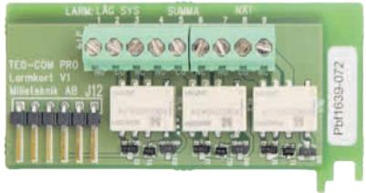
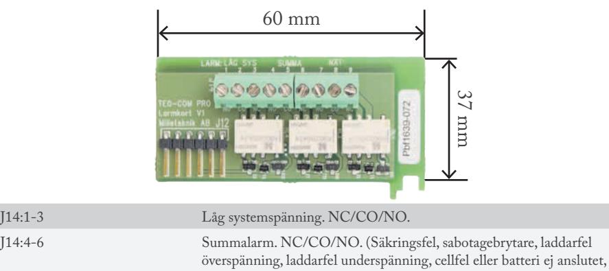
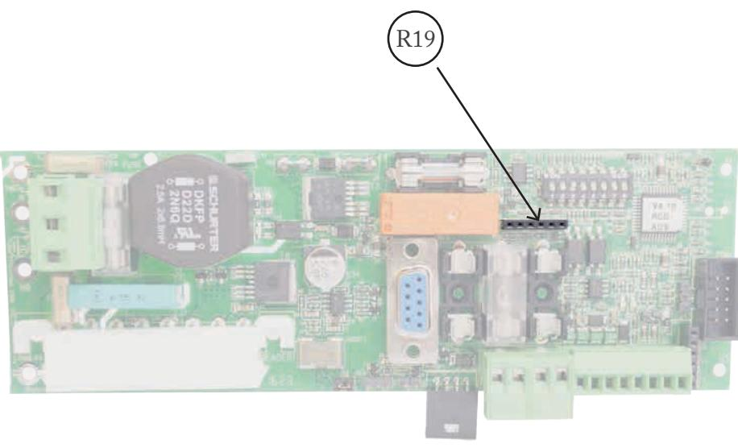
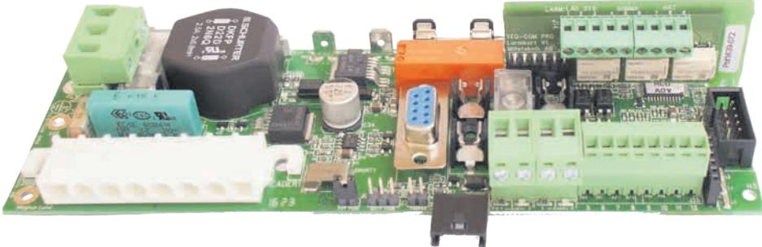
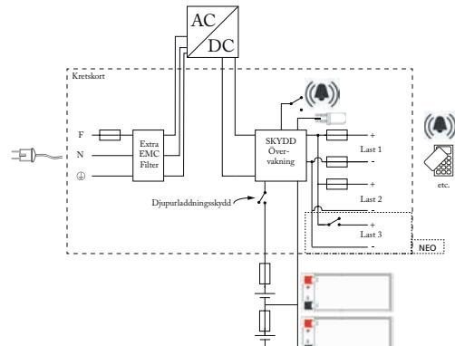
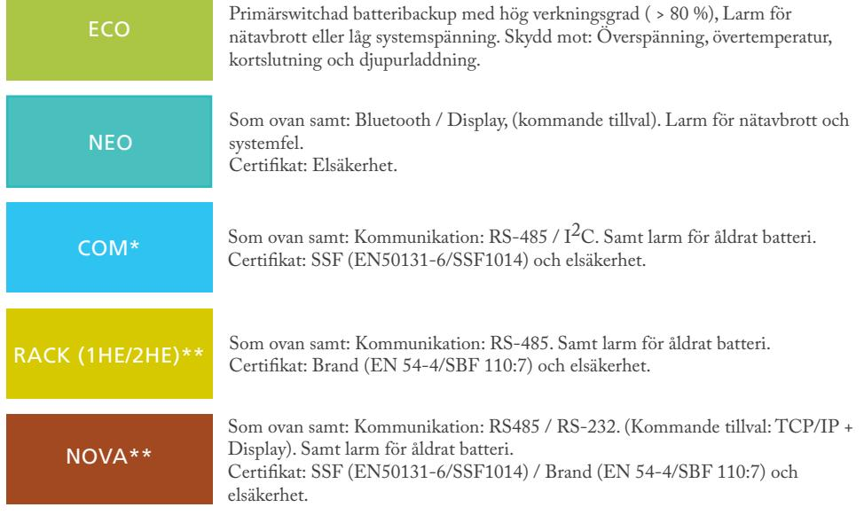
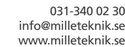

# T-LARMKORT

V1

# T-LARMKORT

Milleteknik ger reservkraft som säkerställer drift. Alla våra produkter är designade för bästa driftsäkerhet och lång livslängd - för såväl elektronik som batterier.

T-LARMKORT utökar funktionalitet för TEQ-COM PRO med tre externa larmutgångar.

### SÄKERHET - LÄS DET TA FÖRST!

- Kortet skall monteras av behörig person.
- Dokument som medföljer systemet skall förvaras i det eller i dess omedelbara närhet.
- Systemet bör ej vara ansluten till nät vid montering.
- Alla uppgifter med reservation för ändringar.

#### KRETSKORTSÖVERSIKT

### Anslutningar

låg batterispänning vid nätavbrott, åldrat batteri.)

Anslut larm för låg systemspänning på **J14:1-3**. NC/CO/NO. Anslut summalarm på **J14:4-6**. NC/CO/NO.

J14:7-9 Nätavbrottlarm. NC/CO/NO.

Anslut nätavbrottslarm på **J14:7-9**. NC/CO/NO.

# T-LARMKORT Montering på TEQ-COM PRO

## T-LARMKORT monteras på TEQ-COM kortet på **R19**, se nedan.

Milleteknik ger reservkraft som säkerställer drift för: Passagesystem, (nödutgångar), hållmagneter, kameraövervakning, rökluckor, talat utrymning, externa larmdon, integrerade säkerhetssystem, inbrottslarm*, brandlarm** och mer. Våra produktserier fyller behoven för såväl små som stora installationer av batteribackuper till alla typer av säkerhetssystem. Mer information hittar du på: www.milleteknik.se

Milleteknik AB Ögärdesvägen 8 B 433 30 Partille

