# NEO

PRO1

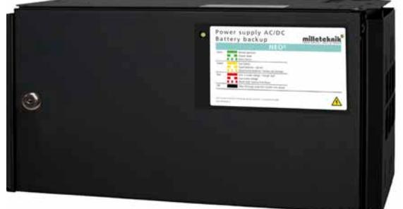

NEO 24V 15A FLX M NEO 24V 25A FLX M

1

### **Säkerhet - Läs detta först!**

- *• 100 mm fritt utrymme skall lämnas ovan och under enheten.*
- *• Enheten är avsett för bruk i kontrollerad inomhusmiljö.*
- *• Endast personer med behörighet bör installera och underhålla enheten.*
- *• Det är installatörens ansvar att enheten är lämpad för tänkt bruk.*
- *• Dokument som medföljer enheten skall förvaras i det eller i dess omedelbara närhet.*
- *• Ventilation skall ej övertäckas.*
- *• Nätspänning bör vara bortkopplad under installation.*
- *• Alla uppgifter med reservation för ändringar.*

#### Garanti och support

Produkten har två års garanti, från inköpsdatum (om inget annat avtalats). Kostnadsfri support under garantitiden nås på support@milleteknik.se eller telefon, 031-313 45 42. Ersättning för res- och eller arbetstid i samband med lokalisering av fel, installerande av reparerad eller utbytt vara ingår ej i garantin. Garantitiden kan, för vissa produkter, förlängas vid inköpstillfället med 3 år (vilket då ger totalt 5 års garanti). Kontakta Milleteknik för mer information.

Milleteknik ger support under produktens livslängd, dock som längst 10 år efter inköpsdatum. Byte till likvärdig produkt kan förekomma om Milleteknik bedömer att reparation inte är möjlig. Kostnader för support tillkommer efter det att garantitiden har gått ut.

Produktens livslängd, miljöpåverkan och återvinning

Produkten är designade för lång livslängd vilket minskar miljöpåverkan. Produktens livslängd är beroende på, bland annat miljöfaktorer, främst omgivningstemperatur, oförutsedd belastning på komponenter som blixtnedslag, yttre åverkan, handhavandefel, med flera.

Produkter återvinns genom att lämnas till närmaste återvinningsstation eller sändas åter till tillverkare. Kontakta din distributör för mer information. Kostnader som uppkommer i samband med återvinning ersätts ej.

Batterier skall alltid återvinnas och lämnas till återvinningsstation.

#### Om NEO-serien

NEO erbjuder flertalat larmfunktioner samt möjlighet till kommunikation mot överordnade system. NEO erbjuder hög driftsäkerhet, enkelhet och hög verkningsgrad i kombination med flertalet larmfunktioner som standard. DIN monterade nätaggregat möjliggör uppgradering av nätaggregat när systemen växer. 19" vinklar medföljer till samtliga NEO batteribackuper för montage i 19" Rack. Givetvis kan de också väggmonteras. Batteribackuperna kan också utökas med batteribox för längre reservdrifttider. IP-Klass 20.

Användningsområde

Passersystem, inbrottslarm, magneter, kodlås, slutbleck och rökluckor.

Om detta dokument

Gällande och senast publicerad utgåva av detta dokument finns på www.milleteknik.se eller kan rekvireras via e-post, info@milleteknik.se (ange enhetens namn och serienummer). Detta dokuments giltighet kan inte garanteras, då ny utgåva publiceras utan föregående meddelande.

Data och konstruktion kan ändras utan föregående meddelande. 3

#### Innehåll

| Garanti och support                                          | 2        |  |
|--------------------------------------------------------------|----------|--|
| Produktens livslängd, miljöpåverkan och återvinning          | 2        |  |
| Om NEO-serien                                                | 3        |  |
| Användningsområde                                            | 3        |  |
| Om detta dokument                                            | 3        |  |
| Reservdrifttid                                               | 5        |  |
| Komponentöversikt                                            | 6        |  |
| 1. Montering av FLX M på vägg eller i 19" rack               | 7        |  |
| 2. Inkoppling av batterier                                   | 8        |  |
| Beskrivning huvudkort: PRO1                                  | 9        |  |
| 3. Anslutning: elnät, last, kommunikation och larm           | 10       |  |
| 3.1 Elnät (230 V)                                            | 10       |  |
| 3.2 Last                                                     | 10       |  |
| 3.3 Andra anslutningar                                       | 10       |  |
| 3.4 Larm via kommunikation                                   | 11       |  |
| 3.5 Konfiguration av kommunikation via RS-485                | 11       |  |
| 3.6 Larm via busskommunikation: I2 C, RS-485              | 11       |  |
| 4. Driftsättning / Test                                      | 12       |  |
| Hur enheten skall startas                                    | 12       |  |
| Systemtest                                                   | 12       |  |
| Återställning                                                | 12       |  |
| Montering av batteribox. Vad som skall göras i batteribackup | 14       |  |
| Inkoppling batteribox med batteribackup                      | 15       |  |
| Inkopplingsschema och gul bygel                              | 16       |  |
| Batteribackup (FLX M) med 4 batteriboxar (FLX M)             | 17       |  |
| Underhåll                                                    | 18       |  |
| Batterier                                                    | 18       |  |
| Batteribyte                                                  | 18       |  |
| Batteriåtervinning                                           | 18       |  |
| Justering av sabotagekontakt (tillval)                       | 19       |  |
| Tekniska data                                                | 20       |  |
| Tekniska data huvudkort: PRO1                                | 21       |  |
| Tekniska data, nätaggregat: HRP-300-24                       |          |  |
| Tekniska data, nätaggregat: HRP-600-24                       | 23 24 |  |
| Tekniska data, kapsling: FLX M                               | 25       |  |

#### Reservdrifttid

#### Genom att koppla till extra batteier kan reservdrifttiden ökas, tabellen nedan är en vägledning till förväntad reservdrifttid.

| Reservdrifttid (Förväntad och efter batterityp) |                    |         | Medelström (timmar=h, minuter=min) |                                                  |        |           |        |        |        |
|----------------------------------------------------|--------------------|---------|---------------------------------------|--------------------------------------------------|--------|-----------|--------|--------|--------|
| System spänning                                 | Antal batterier | Batteri | Total batteri kapacitet            | Extra batteribox / batterihylla som krävs. | 4 A    | 6 A       | 8 A    | 10 A   | 15 A   |
| 12 V                                               | 2 st               | 20 Ah   | 40 Ah                                 | Ingen                                            | 6 h    | 3 h       | 2 h    | -      | -      |
| 12 V                                               | 2 st               | 40 Ah   | 90 Ah                                 | 1 st Batterybox 12V-FLX                       | 17,5 h | 12 h      | 9,5 h  | -      | -      |
| 12 V                                               | 4 st               | 40 Ah   | 180 Ah                                | 2 st Batterybox 12V-FLX                       | 35 h   | 23,5 h | 18 h   | -      | -      |
| 24 V                                               | 2 st               | 20 Ah   | 20 Ah                                 | Ingen                                            | 3 h    | 1,5 h     | 1 h    | 45 min | 20 min |
| 24 v                                               | 2 st               | 45 Ah   | 45 Ah                                 | 1 st Batterybox 24V-FLX                       | 9,5 h  | 5,5 h     | 3,5 h  | 2,5 h  | 1,5 h  |
| 24 v                                               | 4 st               | 45 Ah   | 90 Ah                                 | 2 st Batterybox 24V-FLX                       | 17,5 h | 12 h      | 10 h   | 7 h    | 4 h    |
| 24 v                                               | 6 st               | 45 Ah   | 135 Ah                                | 3 st Batterybox 24V-FLX                       | 26,5 h | 17,5 h | 13 h   | 10,5 h | 7 h    |
| 24 v                                               | 8 st               | 45 Ah   | 180 Ah                                | 4 st Batterybox 24V-FLX                       | 35 h   | 23,5 h | 18 h   | 14 h   | 11 h   |
| 24 v                                               | 2 st               | 75 Ah   | 75 Ah                                 | 1 st BS-Large 24 V                               | 14,5 h | 11 h      | 7,5 h  | 5,5 h  | 3 h    |
| 24 v                                               | 2 st               | 100 Ah  | 100 Ah                                | 1 st BS-Large 24 V                               | 19,5 h | 13 h      | 11,5 h | 8 h    | 4,5 h  |
| 24 v                                               | 2 st               | 125 Ah  | 125 Ah                                | 1 st BS-Large 24 V                               | 24 h   | 16 h      | 12,5 h | 10 h   | 5,5 h  |
| 24 v                                               | 2 st               | 150 Ah  | 150 Ah                                | 1 st BS-Large 24 V                               | 28 h   | 19 h      | 14 h   | 12 h   | 8 h    |
| 24 v                                               | 4 st               | 100 Ah  | 200 Ah                                | 2 st BS-Large 24 V                               | 39 h   | 26 h      | 20 h   | 16 h   | 10,5 h |
| 24 v                                               | 4 st               | 125 Ah  | 250 Ah                                | 2 st BS-Large 24 V                               | 48 h   | 32 h      | 24 h   | 20 h   | 12,5 h |
| 24 v                                               | 4 st               | 150 Ah  | 300 Ah                                | 2 st BS-Large 24 V                               | 56 h   | 38 h      | 28 h   | 23 h   | 16 h   |
| 24 v                                               | 6 st               | 125 Ah  | 375Ah                                 | 3 st BS-Large 24 V                               | 72 h   | 48 h      | 36 h   | 29 h   | 20 h   |
| 24 v                                               | 6 st               | 150 Ah  | 450 Ah                                | 3 st BS-Large 24 V                               | 84 h   | 56 h      | 42 h   | 34 h   | 22 h   |
| 24 v                                               | 8 st               | 125 Ah  | 500 Ah                                | 4 st BS-Large 24 V                               | 95 h   | 64 h      | 48 h   | 39 h   | 26 h   |
| 24 v                                               | 8 st               | 150 Ah  | 600 Ah                                | 4 st BS-Large 24 V                               | 112 h  | 75 h      | 56 h   | 45 h   | 31 h   |

Observera att vid uträkning har vi tagit hänsyn till att batterierna åldras. Hänsyn tagen till 80% av batteriets grundkapacitet.

Data och konstruktion kan ändras utan föregående meddelande. 5

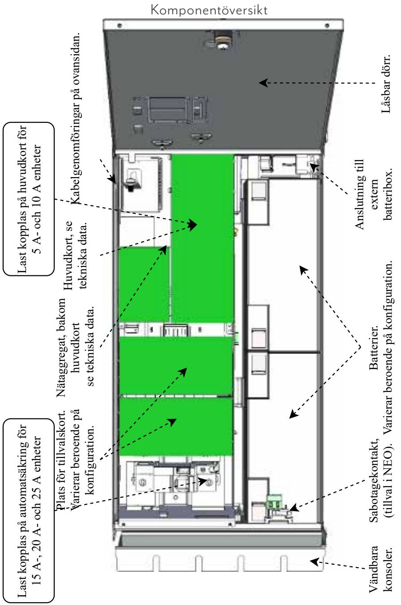

#### 1. Montering av FLX M på vägg eller i 19" rack

Enheten kan monteras i 19" rack eller på vägg. Medföljande konsoler kan fästas på två sätt: Vid montering på vägg skall konsolerna sitta bakåt, mot vägg. Vid montering i 19" rack skall konsolens sitta i framkant på enheten. Se bilder nedan.

Skjut in konsolen nedifrån och upp.

- *• Notera att sabotagekontakt skall fästas emot vägg vid anläggningar som kräver larmklass 3/4.*
- *• 100 mm fritt utrymme bör lämnas under för bästa ventilation. Täck inte sidorna.*

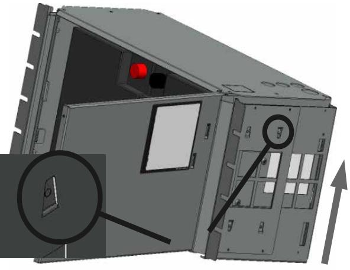

Konsoler vända mot framsidan för montering i 19" rack.

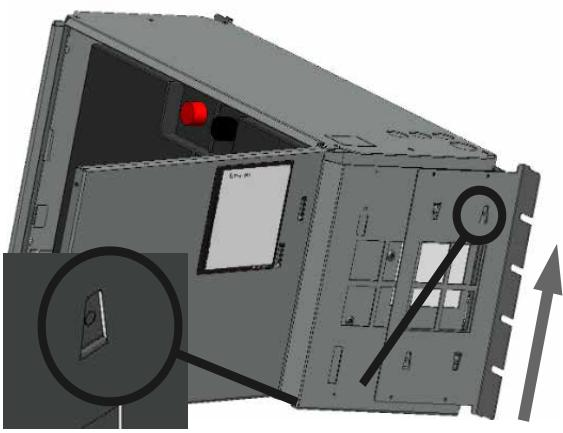

Konsoler vända mot baksidan för väggmontering.

Data och konstruktion kan ändras utan föregående meddelande. 7

8 8

2. Inkoppling av batterier

Batterikablage är monterat på kretskortet vid leverans. OBS - bilder nedan visar endast hur kablage skall kopplas.

Placera batterierna i skåpet med batteripolerna utåt, mot skåpluckan. Anslut batterikablaget.

- *• Bryt, om möjligt, nätspänning vid batteribyte.*
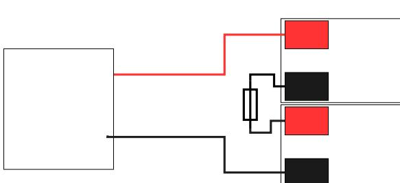

| Batteri 1 (B1)                                                      |                                        |
|---------------------------------------------------------------------|----------------------------------------|
| B1 +                                                                | + Batt in på kretskort                 |
| B1 -                                                                | Med säkring till B2 +                  |
| Kretsko Batteri 2 (B2) 24 V+ 24 V+ Baterbku Baterbku |                                        |
| B2 +                                                                | Med säkring till B1 -                  |
| B2 -                                                                | - Batt in på kretskort 24 V 24 V |

Baterbku

Baterbku

B4

B4

B -6ster baterox 1

Seriekoppling, batterier: 24 V

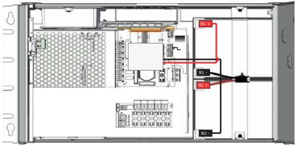

Seriekoppling, batterier: 24 V FLX S

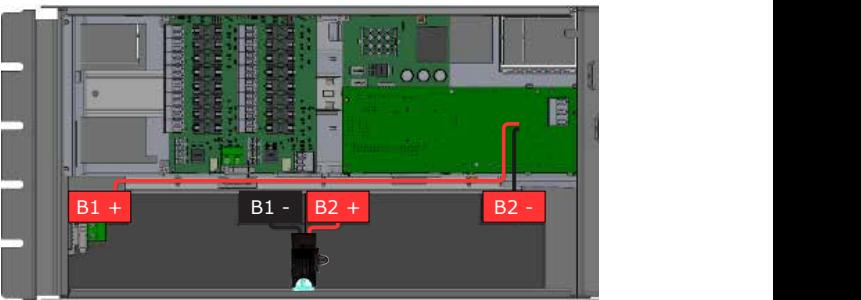

Seriekoppling, batterier: 24 V FLX M

8 Data och konstruktion kan ändras utan föregående meddelande.

B1 "2ster baterku

B1 B1 

B B

B B

B1

B14

B14

B1

B1

B1-

B1-

B2

B2

B6

B6

B1

B1

Dubel kabso från ketsor +

Dubel kabso från ketsor +

Dubel kabso från ketsor -

Dubel kabso från ketsor -

Kabelsko från B

Kabelsko från B

Kabelsko från B

Kabelsko från B

B1 Text

B1 Text

B2

B2

B16

B1

B12

B1

B1

#### Beskrivning huvudkort: PRO1

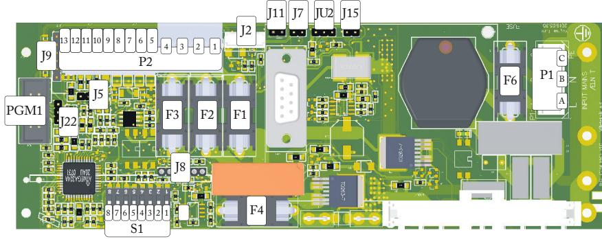

| J13        | Anslutning till effektkort (tillval).                                                                                                  | JU 2                                                  | Utgång till extern batterisäkring.                       |  |
|------------|-------------------------------------------------------------------------------------------------------------------------------------------|-------------------------------------------------------|----------------------------------------------------------|--|
| P2: 13     | + 5 V*                                                                                                                                    | J15                                                   | Utgång till extern säkring.                              |  |
| P2: 12     | TXD*                                                                                                                                      | PGM1                                                  | N/A                                                      |  |
| P2: 11     | RXD*                                                                                                                                      | J22                                                   | Extern indikeringsdiod (på skåplucka).                   |  |
| P2: 10     | System-minus (-).*                                                                                                                        | J5 Terminering vid bygel, (vid över 120 Ω, RS-485) |                                                          |  |
| P2: 9      | System-minus (-).*                                                                                                                        | F3 Säkring, last 2 plus +.                         |                                                          |  |
| P2: 8      | RS-485 + (plus) Anslutning.*                                                                                                              | F2                                                    | Säkring, last 1 minus -.                                 |  |
| P2: 7      | RS-485 - (minus) Anslutning.*                                                                                                             | F1                                                    | Säkring, last 1 plus +.                                  |  |
| P2: 6      | I2C                                                                                                                                       | J8                                                    | Anslutning till larmkort (tillval).                      |  |
| P2: 5      | I2C                                                                                                                                       |                                                       | Funktion                                                 |  |
|            | *Det är möjligt att ansluta kommunikation till extern larmcentral via anslutningar på P2. Se larmcentralens dokumentation för | switch 1                                           | Adress för extern kommunikation.                         |  |
|            |                                                                                                                                           | 2                                                     | Adress för extern kommunikation.                         |  |
|            |                                                                                                                                           | 3                                                     | Adress för extern kommunikation.                         |  |
|            |                                                                                                                                           | 4                                                     | Adress för extern kommunikation.                         |  |
|            |                                                                                                                                           | 5                                                     | Inställning av batterikapacitet.                         |  |
|            | kompatibelt protokoll.                                                                                                                    | 6                                                     | Inställning av batterikapacitet.                         |  |
|            |                                                                                                                                           |                                                       | Inställning av batterikapacitet.                         |  |
|            |                                                                                                                                           | 7 8                                                | Mjukvarureset.                                           |  |
| P2: 3-4 | Lastutgång 2, + / - till last. (Max totalt 10 A, för bägge utgångarna). Ej vid SSF.                                                 | F4                                                    | Säkring batteripaket (T16A).                             |  |
| P2: 1-2 | Lastutgång 1, + / - till last. (Max totalt 10 A, för bägge utgångarna).                                                             | F6                                                    | Säkring elnät (T2,5 A). Keramisk.                        |  |
| J2         | Anslutning fläkt                                                                                                                          | P1: A                                                 | Inkommande elnät: Fas / Line.                            |  |
| J11        | Anslutning sabotagekontakt.                                                                                                               | P1: B                                                 | Inkommande elnät: Nolla / Neutral.                       |  |
| J7         | Anslutning sabotagekontakt från batteribox.                                                                                            | P1: C                                                 | Inkommande elnät: Skyddsjord / Protected earth, (PE). |  |

#### 3. Anslutning: elnät, last, kommunikation och larm

3.1 Elnät (230 V)

För elnätskablage genom kabelgenomföringen på skåpets ovansida. Säkra elnätskabeln med buntband. Elnätskablage skall hållas åtskilt annat kablage för att

undvika (EMC) störningar. Anslutning P1, Elnät: Använd medföljande plint för att montera elnätskablar.

F=Fas.

N=Noll.

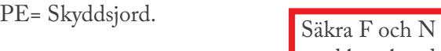

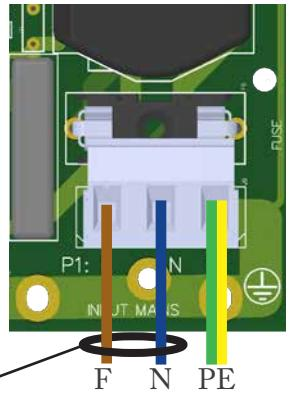

*• Sitter ett eller flera anslutningskort monterade skall last anslutas där. Se komponentöversikt.* 

Last 1-2 ansluts på 1-4. Maxström får ej överskridas. Se märkskylt på enhet.

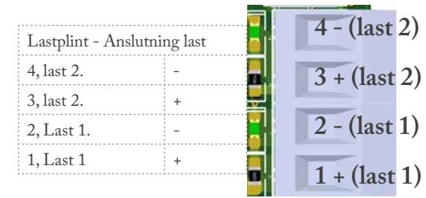

#### 3.3 Andra anslutningar

3.2 Last

elsäkerhet.

med buntband för

J2: Fläkt.

J11: Anslutning sabotagekontakt från batteribackup.

J7: Anslutning sabotagekontakt från batteribox. NC.

JU2: Ingång från externt batterisäkring i batteribox. NO.

12 11 10 9 8 765

J15: Ingång från externt avsäkringskort (tillval).

13

J22

NC med bygel.

PGM1

J9

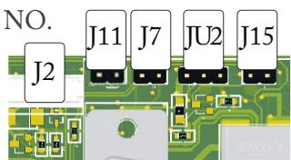

J8

4 123

F3 F2 F1

F4

P2:

8 7 6543 2 1 S1

P2

F6

C B A

P1

3.4 Larm via kommunikation

Kommunikation ansluts på plint 5-13. Larm via Busskommunikation och via LED på skåpets framsida. Se larmcentralens dokumentation för

| 13: +5 V             |
|----------------------|
| 12: TXD              |
| 11: RXD              |
| 10: System minus (-) |
| 9: System minus (-)  |
| 8: RS-485 +          |
| 7: RS-485 -          |
| 6:I2 C            |
| 5: I2 C           |
|                      |

3.5 Konfiguration av kommunikation via RS-485

Kommunikation via RS-485 ansluts på P2:7- & P2:8+.

ADRESS-konfiguration:

kompatibelt protokoll.

Värde dip-switch: Dip-switch 1=1 Dip-switch 2=2 Dip-switch 3=4 Adress ställs in på dip-switch S1 dip 1-4 enligt följande: Adressen ställs binärt på switchen. Är alla dip-switchar ställda till OFF är adressen 0+0+0+0(+1*)=1. Är dip-switch 1 & 3 ON är adressen 1+0+4+0(+1*)=6. Är dip-switch 2 & 4 ON är adressen 0+2+0+8(+1*)=11.

| Dip-switch 1=1 |
|----------------|
| Dip-switch 2=2 |
| Dip-switch 3=4 |
| Dip-switch 4=8 |

*Adresser i Sentrion adderar +1. Det betyder att 1 alltid skall läggas till i konfigurationen.

> 3.6 Larm via busskommunikation: I2 C, RS-485

- Låg systemspänning i nätdrift (överbelastning): utspänning, även kortvarigt, är för låg, (under 24,0 V).
- Fläktfel: Funktionsfel i fläkt, ej korrekt varvtalshastighet
- Övertemperatur: Systemets temperatursensor indikerar skadligt hög driftstemperatur, (över 32°C).
- Undertemperatur: Systemets temperatursensor indikerar skadligt låg driftstemperatur, (under 10°C).
- Låg batterispänning: Batterispänning vid nätavbrott spänningen i batteridrift är låg, (under 24,0 V DC).

Data och konstruktion kan ändras utan föregående meddelande. 11

### 4. Driftsättning / Test Hur enheten skall startas

Efter inkoppling skall uppstart ske i följande steg:

- Inkoppling/spänningssättning av batteridel.
- Spänningssättning av elnät.

Enheten fungerar normalt då indikeringsdiod på skåpluckans utsida lyser med fast grönt sken. Se frontpanel för övriga statusindikationer.

#### Systemtest

- 1. Slå till inkommande nätspänning.
- 2. Indikeringsdiod på skåpluckans utsida lyser med fast grönt sken. Bryt nätspänning för att kontrollera att enheten fungerar i batteridrift och larmar.
- 3. Indikeringsdiod på skåpluckan blinkar grönt. För larmtyp, se panel.
- 4. Slå till inkommande nätspänning. Indikeringsdiod, på skåpluckans utsida lyser med fast grönt sken. Normaldrift.

## Återställning

Återställ enheten genom att göra enheten helt spänningslös. Koppla bort batterikablage samt nätspänning och återanslut efter 5 sekunder.

> Frågor? Se baksidan för kontakt till support.

#### Larm som visas på skåplucka

| I normalläge visar indikeringsdioden ett fast grönt sken. |                                                                      |  |  |
|-----------------------------------------------------------|----------------------------------------------------------------------|--|--|
| Fast grönt sken.                                          | Normal drift.                                                        |  |  |
| Långsamt grönt blink, ej tillgängligt.                 | Sabotagelarm kan endast ges via direkt anslutning till undercentral. |  |  |
| Snabbt grönt blink.                                       | Nätavbrottslarm.                                                     |  |  |
| Fast gult sken                                            | Låg batterispänning.                                                 |  |  |
| Långsamt gult blink                                       | Åldrade batterier, (tillval).                                        |  |  |
| Snabbt gula blink                                         | Bortkopplade batterier / batterikortslutning.                        |  |  |
| Fast rött sken                                            | Över- underspänning / laddarfel.                                     |  |  |
| Långsamt rött blink                                       | Låg systemspänning.                                                  |  |  |
| Snabbt rött blink                                         | Lastsäkring har löst ut / batterisäkring har löst ut.                |  |  |
| Släckt/svart                                              | Djupurladdningsskydd är aktiverat.                                   |  |  |

Vid driftsatt system: Är indikeringsdioden släckt har djupurladdningsskyddet trätt i kraft.

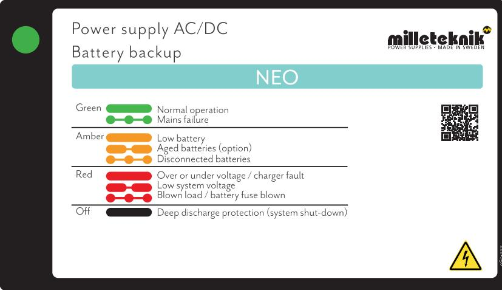

Montering av batteribox. Vad som skall göras i batteribackup

Det är möjligt att koppla till extra batteriboxar till batteribackup för utökad reservdrifttid.

Kabelgenomföring/knock-out finns på batteribackupens undersida och skall brytas loss innan montering.

Använd kablage som följer med batteriboxen för att möta kablage från batteribackup. Skall sabotagekontakt även sitta i batteribox? Se avsnitt "Sabotagekontakt vid extra batteribox."

Se bild A, nedan, för hur kablar skall mötas mellan skåpen.

- *• Klipp gul bygel i kontakt från batteribackup, se nästa sida.*
Enheten skall vara spänningslös vid montering och inkoppling. Lossa spännband i batteribackupen för att komma åt kabelgenomföringen från enhetens golv.

Den extra batteriboxen skjuts eller placeras under batteribackup, (eller föregående batteribox), batteribox skruvas därefter fast i rack eller vägg. De bägge kapslingarna skall möta varandra utan glapp, se bild B nedan.

OBS! Batterier skall vara nya vid installation och vid byte för att garanti och certifikat skall fortsätta att gälla.

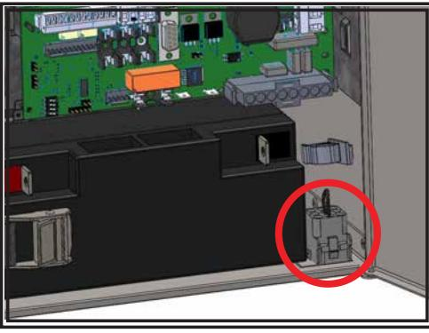

Bild A.

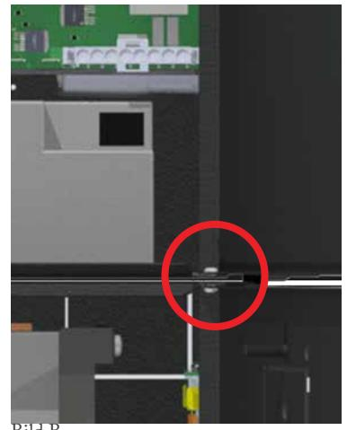

#### Inkoppling batteribox med batteribackup

Batterier måste vara nya vid installation och batteribyte för att certifierade normer skall upprätthållas.

- Sätt i batteri närmast dörren först.
Bilden nedan visar en batteribackup med extra batteribox med 2 batterier. Se kommande sidor för inkoppling av batteribox med 4 batterier. Bilden ger även en översikt över kopplingspunkter för batterikablar och batterisäkringar.

|                                                               | Kabel 1                | Kabel 2              |  |  |
|---------------------------------------------------------------|------------------------|----------------------|--|--|
|                                                               | Batteri 1 (B1)         |                      |  |  |
| B1 +                                                          | + Batt in på kretskort | Inkommande från B3 + |  |  |
| B1 -                                                          | Med säkring till B2 +  |                      |  |  |
|                                                               | Batteri 2 (B2)         |                      |  |  |
| B2 +                                                          | Med säkring till B1 -  |                      |  |  |
| B2 -                                                          | - Batt in på kretskort | Inkommande från B4 - |  |  |
|                                                               | Batteri 3 (B3)         |                      |  |  |
| B3 +                                                          | B1+                    |                      |  |  |
| B3 -                                                          | Med säkring till B4 +  |                      |  |  |
| Batteri 4 (B4)                                                |                        |                      |  |  |
| B4 +                                                          | Med säkring till B3 -  |                      |  |  |
| B4 -                                                          | Till B2 -              |                      |  |  |
| För efterföljande batteriboxar, följs samma kopplingsmönster. |                        |                      |  |  |

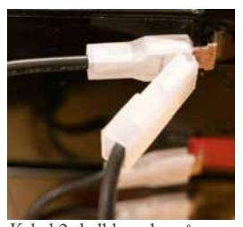

Kabel 2 skall kopplas på batteri med dubbelstift, (som

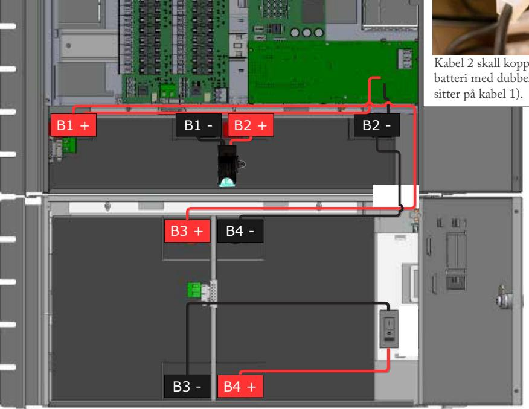

Data och konstruktion kan ändras utan föregående meddelande. 15

#### Inkopplingsschema och gul bygel

Larm till sabotagekontakt seriekopplas och därför måste slingan vara obruten till sista batteriboxkablaget. Gul bygel sluter slingan på varje kablage som går från batteribackup till batteribox och för att larm skall ges på sabotagekontakten i batteriboxen måste gul bygel på kablage klippas. Klipp inte gul bygel på sista kablage i batteribox, då kommer larm för sabotage inte ges i någon tillkopplad batteribackup eller batteribox.

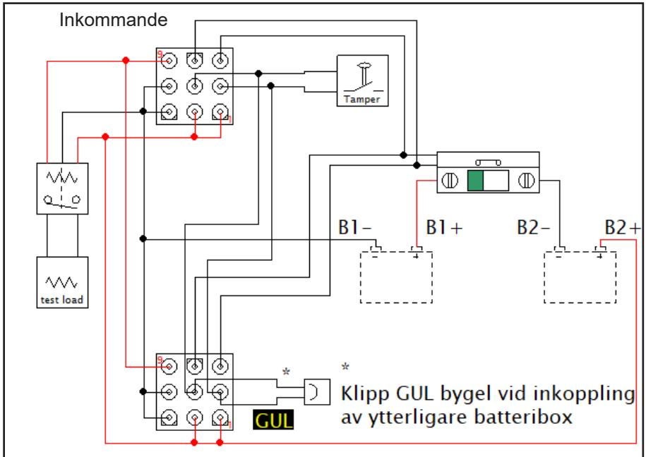

| Batteribackup utan batteribox  | Klipp ej gul bygel                                                                            | Gul bygling skall vara kvar i batteribackup |
|--------------------------------|-----------------------------------------------------------------------------------------------|------------------------------------------------|
| Batteribackup + 1 batteribox   | Klipp gul bygel från batteribackup                                                            | Gul bygling skall vara kvar i batteribox 1  |
| Batteribackup + 2 batteriboxar | Klipp gul bygel från batteribackup och från batteribox 1                                   | Gul bygling skall vara kvar i batteribox 2  |
| Batteribackup + 3 batteriboxar | Klipp gul bygel från batteribackup och från batteribox 1 och batteribox 2                  | Gul bygling skall vara kvar i batteribox 3  |
| Batteribackup + 4 batteriboxar | Klipp gul bygel från batteribackup och från batteribox 1, batteribox 2 och batteribox 3 | Gul bygling skall vara kvar i batteribox 4  |

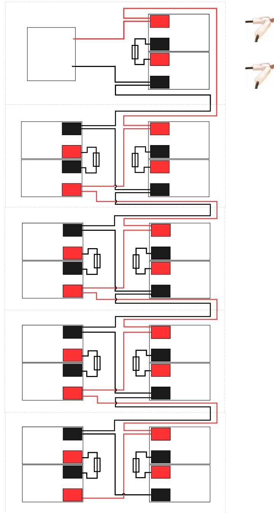

#### Batteribackup (FLX M) med 4 batteriboxar (FLX M)

Data och konstruktion kan ändras utan föregående meddelande. 17

B2

B1

24 V+ Baterbku

24 V+ Baterbku

B1 "2ster baterku

Kretsko

24 V-Baterbku

24 V-Baterbku

B1 Text

B1 Text

B2

B2

#### Underhåll

Systemet med undantag för batterier är underhållsfritt vid installation i inomhusmiljö.

#### Batterier

Batterier alstrar elektricitet genom en kemisk process och det sker därmed en

naturlig degradering av kapacitet. Den största faktorn för batteriers livslängd är temperatur. Ju högre temperatur desto kortare livslängd. En ideal temperatur är 20 °C. Tillverkningsdatum som är präglat på batteriet och livslängden (som batteritillverkaren anger) gäller vid helt outnyttjat batteri. Således varierar faktisk livslängd. Batterier bör bytas efter HALVA angiven (från

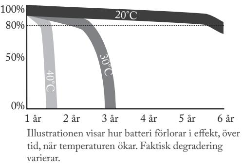

batteritillverkaren) livslängd för säker drift. Batterier inköpta via Milleteknik har en livslängd (från tillverkaren) på mellan 10-12 år med rekommenderat byte efter 5-6 år.

#### Batteribyte

Bryt, om möjligt, nätspänning vid batteribyte.

Koppla bort batterisäkring på kretskortet.

Koppla bort batterikablar. Notera hur batterikablar är monterade innan de avlägsnas.

Sätt in och spänn fast de nya batterierna.

Anslut batterikablarna på samma sätt som tidigare.

Sätt tillbaka batterisäkring på kretskort.

Slå till nätspänning. Eventuellt kan indikeringsdioden lysa orange under ett par timmar, tills batterier är laddade.

Testa systemet genom att kortvarigt koppla bort nätspänning, (= lasten drivs vidare av batterierna), och därefter slå till nätspänningen igen.

#### Batteriåtervinning

Alla batterier skall återvinnas. Återlämna till tillverkare eller lämna till återvinningsstation.

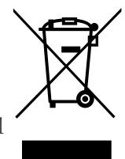

#### Justering av sabotagekontakt (tillval)

Sabotagekontaktens hävarm skall vid stängd skåpdörr vara i slutet läge (stängd). Går larm ("tamper alarm" / larm till undercentral) kan hävarmen behövas justeras. Hävarmen justeras genom följande steg:

- Nyp åt med en plattång mitt på hävarmen.
- Justera hävarmen försiktigt åt önskat håll (upp/ner).
- Kontrollera genom att stänga dörren. Ett klick hörs när kontakten sluts.
- Sabotagekontakten skall inte larma vid stängd och låst dörr.

Sabotagekontakt vid extra batteribox

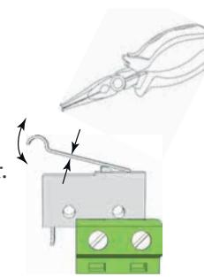

Har en eller flera batteriboxar kopplats till enheten skall sabotagekontakterna seriekopplas för att larm skall ges. Det är viktigt att seriekopplingen har slutning vid den sista sabotagekontakten. Seriekopplingen skall börja i enheten och sluta i den sista batteriboxen.

Data och konstruktion kan ändras utan föregående meddelande. 19

#### Tekniska data

|                          | NEO 24V 15A FLX M NEO 24V 25A FLX M              |                                                     |  |
|--------------------------|-----------------------------------------------------|-----------------------------------------------------|--|
| Kapsling                 | FLX M, se följande sidor för tekniska data.         |                                                     |  |
| Huvudkort                | PRO1, se följande sidor för tekniska data.          |                                                     |  |
| Tillval - ej standard | Grafisk display                                     |                                                     |  |
| Nätaggregat:             | HRP-300-24, se följande sidor för tekniska data. | HRP-600-24, se följande sidor för tekniska data. |  |
| Batteri:                 | 2 st 20 Ah                                          |                                                     |  |

#### Tekniska data huvudkort: PRO1

| Kortnamn:                                | PRO1                                                                                                 |                                   |                              |                                  |                     |     |
|------------------------------------------|------------------------------------------------------------------------------------------------------|-----------------------------------|------------------------------|----------------------------------|---------------------|-----|
| Lastutgång ström:                        | Beroende på nätaggregat och batterier. Se separat tabell.                                            |                                   |                              |                                  |                     |     |
| Egenförbrukning (med reläkort):       | Mindre än 210 mA. 100 mA utan effektsteg med alla reläer på externt larmkort dragna i normalläge. |                                   |                              |                                  |                     |     |
| Djupurladd ningsskydd 12 V enheter | 10 V (+/- 0,5 V)                                                                                  |                                   |                              |                                  |                     |     |
| Djupurladd ningsskydd 24 V enheter | 20 V (+/- 0,5 V)                                                                                  |                                   |                              |                                  |                     |     |
| Larmutgång:                              | RS485 alt. I2C. Reläkort (3 utgångar) som tillval.                                                   |                                   |                              |                                  |                     |     |
|                                          |                                                                                                      |                                   |                              |                                  |                     |     |
| Larmöversikt                             |                                                                                                      | Nätfelsrelä, EPSfel: Relä 1 | Summa larmrelä: Relä 2 | Batterifel, APSfel: Relä 3 | I2 C / RS-485 | LED |
| Nätavbrott                               |                                                                                                      | X                                 |                              |                                  | X                   | X   |
| Säkringsfel                              |                                                                                                      |                                   | X                            |                                  | X                   | X   |
| Sabotagebrytare                          |                                                                                                      |                                   | X                            |                                  | X                   | X   |
| Fläktfel                                 |                                                                                                      |                                   |                              |                                  | X                   |     |
| Laddarfel överspänning                   |                                                                                                      |                                   | X                            |                                  | X                   | X   |
| Laddarfel underspänning                  |                                                                                                      |                                   | X                            |                                  | X                   | X   |
| Cellfel / ej anslutet batteri            |                                                                                                      |                                   | X                            |                                  | X                   | X   |
| Låg systemspänning                       |                                                                                                      |                                   |                              | X                                | X                   | X   |
| Låg batterispänning /nätavbrott          |                                                                                                      |                                   | X                            |                                  | X                   | X   |
| Övertemperatur                           |                                                                                                      |                                   |                              |                                  | X                   |     |
| Undertemperatur                          |                                                                                                      |                                   |                              |                                  | X                   |     |
| Kort batteritid kvar                     |                                                                                                      |                                   |                              |                                  | X                   |     |
| Åldrat batteri                           |                                                                                                      |                                   | X                            |                                  | X                   | X   |
| Överström 100 % minutmedelvärde       |                                                                                                      |                                   |                              |                                  | X                   |     |
| Överström 80 % dygnsmedelvärde        |                                                                                                      |                                   |                              |                                  | X                   |     |
| Överström 175 % sekundmedelvärde      |                                                                                                      |                                   |                              |                                  | X                   |     |

Data och konstruktion kan ändras utan föregående meddelande. 21

#### Tekniska data, fortsättning

| Kortnamn:                                       | PRO1                                                                                                                                                                                                                                                                                                                                                                       |
|-------------------------------------------------|----------------------------------------------------------------------------------------------------------------------------------------------------------------------------------------------------------------------------------------------------------------------------------------------------------------------------------------------------------------------------|
| Omkopplingstid:                                 | När batterier är i vilocykel: < 5 mikrosekunder. När batterier är i laddcykel: 0 (ingen). Batterier vilar i 20 dygns cykler varefter en laddcykel tar vid och laddar batterierna i 72 h. Sker nätavbrott när batterier är i vilocykel kopplas batterier in på < 5 mikro sekunder. Sker nätavbrott när batterier är i laddcykel existerar ingen omkopplingstid. |
| Inkommande elnät:                            | 230-240 V AC, 47-63 Hz                                                                                                                                                                                                                                                                                                                                                     |
| Elnätssäkring upp till och med 15 A /24 V | T2,5AH250V. Keramisk.                                                                                                                                                                                                                                                                                                                                                      |
| Elnätssäkring över 15 A /24 V                | T4AH250V. Keramisk.                                                                                                                                                                                                                                                                                                                                                        |
| Utgångsspänning:                                | Max 27,9 V DC, spänningsgräns bör normalt vara 27,3 V. Min 20 V DC. Min gäller vid bortkopplad nätspänning i batteridrift.                                                                                                                                                                                                                                           |
| Överspänning, larmgräns:                     | 27,9 V                                                                                                                                                                                                                                                                                                                                                                     |
| Låg batterispän ning, larm ges:              | Batterispänning vid nätavbrott - spänningen i batteridrift är låg, (< 24,0 V DC).                                                                                                                                                                                                                                                                                          |
| Låg systemspän ning, larm ges:               | Systemspänning i nätdrift, även kortvarigt, är för låg, (24,0 V).                                                                                                                                                                                                                                                                                                          |

#### Tekniska data, nätaggregat: HRP-300-24

| Nätaggregat:                                         | HRP-300-24                                                                                                                                      |
|------------------------------------------------------|-------------------------------------------------------------------------------------------------------------------------------------------------|
| Utspänning:                                          | 27,3 V                                                                                                                                          |
| Utspänning, ripple:                                  | 150 mVp-p                                                                                                                                       |
| Överspänning,                                        | 30-34,8 V.                                                                                                                                      |
| Utspänning återuppladdning, ripple/strömgräns: | Mindre än 2 Vp-p                                                                                                                                |
| Verkningsgrad:                                       | 87 %                                                                                                                                            |
| Strömbegränsning:                                    | 105-135 %                                                                                                                                       |
| Konstantspänning:                                    | +/-0,5 %                                                                                                                                        |
| Reglernoggrann het                                | +/-1,0 %                                                                                                                                        |
| Nätspänning, frekvens:                            | 230-240 V AC, 47- 63 Hz                                                                                                                      |
| Not:                                                 | Nätaggregatet kan vara anpassat för denna batteribackup, vilket betyder standardnätaggregat ej får användas utan att först kontakta support. |

#### Tekniska data, nätaggregat: HRP-600-24

| Nätaggregat:                                         | HRP-600-24                                                                                                |
|------------------------------------------------------|-----------------------------------------------------------------------------------------------------------|
| Utspänning:                                          | 27,3 V                                                                                                    |
| Utspänning, ripple:                                  | 150 mVp-p                                                                                                 |
| Överspänning,                                        | 30-34,8 V.                                                                                                |
| Utspänning återuppladdning, ripple/strömgräns: | Mindre än 1,2 Vp-p                                                                                        |
| Verkningsgrad:                                       | 88 %                                                                                                      |
| Strömbegränsning:                                    | 105-135 %                                                                                                 |
| Konstantspänning:                                    | +/-0,5 %                                                                                                  |
| Reglernoggrann het                                | +/-1,0 %                                                                                                  |
| Nätspänning, frekvens:                            | 230-240 V AC, 47- 63 Hz                                                                                |
| Not:                                                 | Nätaggregatet är anpassat för denna batteribackup, vilket betyder standardnätaggregat ej får användas. |

| Kapsling                    | FLX M                                                             |
|-----------------------------|-------------------------------------------------------------------|
| Rekommenderad omgivning: | Miljöklass 1, inomhus , 20 % ~ 90 % relativ fuktighet             |
| Omgivningstem peratur:   | +5 °C till +40 °C (För bästa batterilivslängd +15 °C till +25 °C) |
| Kapslingsklass:             | IP 20                                                             |
| Rekommenderad montering: | Vägg eller 19" rack.                                              |
| Höjdenheter                 | 5 HE                                                              |
| Dimensioner:                | Höjd: 224 mm Bredd: 437 mm Djup: 212 mm                     |
| Kapslingens färg:           | Svart                                                             |
| Material:                   | Pulverlackad plåt                                                 |

Denna sida har avsiktligen lämnats tom

Denna sida har avsiktligen lämnats tom

Data och konstruktion kan ändras utan föregående meddelande. 27

Milleteknik AB, Ögärdesvägen 8 B, 433 30 Partille 031-34 00 230 www.milleteknik.se