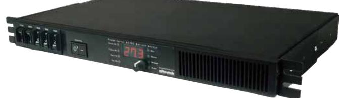

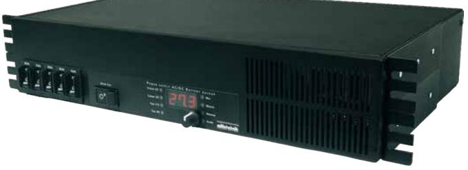

EN54 24V 15A 1U EN54 24V 25A 2U EN54 48V 7A 1U EN54 48V 13A 2U

Milleteknik ger reservkraft som säkerställer drift. Alla våra produkter är designade för bästa driftsäkerhet och lång livslängd - för såväl elektronik som batterier.

#### Säkerhet - Läs detta först!

- *• 100 mm fritt utrymme skall lämnas framför och bakom.*
- *• Enheten skall installeras i en låst och skyddad inomhusmiljö. Risk för åtkomst till batteripoler.*
- *• Endast personer med behörighet bör installera och underhålla systemet.*
- *• Det är installatörens ansvar att systemet är lämpad för tänkt bruk.*
- *• Dokument som medföljer systemet skall förvaras i det eller i dess omedelbara närhet.*
- *• Ventilation skall ej övertäckas.*
- *• Nätspänning bör vara bortkopplad under installation.*
- *• Alla uppgifter med reservation för ändringar.*

Testad och certifierad för godkännande enligt följande:

- SBF 110:8. Svensk brandsäkerhetsnorm. Krav enligt svensk lagstiftning vid brandlarmsanläggningar.
- EN 54-4:1997, EN 54-4:1997/AC:1999, EN 54-4:1997/A1:2002 och EN 54-4:1997/A2:2006, Europeisk brandsäkerhetsnorm. Krav enligt europeisk lagstiftning vid brandlarmsanläggningar.
- EMC Directive 2014/30/EU.
- Low Voltage Directive 2014/35/EU.
- CE-marking 765/2008.

Testad av RISE - Research Institutes of Sweden (tidigare SP) och certiferad av SBSC.

#### Innehåll

| EN54 1U och EN54 2U                                   | 4  |
|-------------------------------------------------------|----|
| Användningsområde                                     | 4  |
| Revisioner och om detta dokument                      | 4  |
| Installation                                          | 4  |
| Tekniska data                                         | 5  |
| Lastutgång ström                                      | 6  |
| Tekniska data, fortsättning                           | 6  |
| Batterikombinationer                                  | 7  |
| Montering                                             | 10 |
| Montering av batterihylla                             | 11 |
| Inkoppling av batterihylla                            | 11 |
| Frontindikation                                       | 12 |
| Indikeringspanel                                      | 12 |
| Display                                               | 12 |
| Not om batteriinställning                             | 13 |
| Översikt, baksida                                     | 14 |
| AC elnät inkoppling - 230 V AC                        | 14 |
| Kablage                                               | 14 |
| Kommunikation (tillval)                               | 15 |
| Utgångsanslutningar                                   | 16 |
| Hur systemet skall startas                            | 17 |
| Driftsättning                                         | 17 |
| Underhåll                                             | 18 |
| Batterier                                             | 18 |
| Batteriåtervinning                                    | 18 |
| Rekommenderade batterier                              | 18 |
| Bilaga 1                                              | 19 |
| Internresistans                                       | 19 |
| Bilaga 2                                              | 21 |
| Ställ in batterikapacitet via flervalsratt            | 21 |
| Bilaga 3                                              | 22 |
| Fullständig lista över inställningar via flervalsratt | 22 |
| EN54-COVER                                            | 24 |
| Montering                                             | 24 |

## EN54 1U och EN54 2U

EN54 1U och EN54 2U från Milleteknik erbjuder batteribackuper avsedda för att monteras i 19" rack. Med enheten erbjuder vi nytänkande då säkringarna manövreras via panelmonterade säkringar i fronten (utbytbara) och utgångarna via jackbara 6 mm2 plintar på kapslingens rygg/baksida. I ryggen hittar man också en jackbar larmplint med totalt 3 separata utgångar samt en RS-485 utgång som möjliggör kommunikation mot överordnade system som tillval. Vill man inte blotta de jackbara utgångarna i ryggen så monteras ett "hus" med kabelgenomföringar för dragavlastning i ryggen. "Huset" beställs separat och skall monteras om batteribackupen skall driva en anläggning som skall vara EN54-4/SBF110:7 godkänd. IP-Klass 30.

#### Användningsområde

Användningsområde är för alla brandlarmssystem där krav på EN54-4 klassade strömförsörjningar finns.

#### Revisioner och om detta dokument

För mer information om revisioner vänligen rekvirera revisionslogg från info@milleteknik.se. Gällande och senast publicerad utgåva av detta dokument finns på www.milleteknik.se eller kan rekvireras via e-post, info@milleteknik. se (ange enhetens namn och serienummer). Detta dokuments giltighet kan inte garanteras, då ny utgåva publiceras utan föregående meddelande.

#### Installation

Denna anvisning beskriver installation och driftsättning av: EN54 24V 15A 1U, marknadsförs även som: EN54 24V 15A 1U EN54 24V 25A 2U, marknadsförs även som: EN54 24V 25A 2U EN54 48V 7A 1U, marknadsförs även som: EN54 48V 7A 1U EN54 48V 13A 2U, marknadsförs även som: EN54 48V 13A 2U I denna anvisning så anges spänning för 24 V-system först. Spänning för 48 V-system anges inom parentes. Exempelvis: "Vid fulladdat tillstånd skall batteriernas spänning vara 27,3 V DC (48 V, 54,6 V DC)." HE/U står för höjdenheter och produkten är avsedd för montering i 19" rack. } 48 V-system. } 24 V-system.

#### Säkerhet

- *• Enheten skall installeras i en låst och skyddad inomhusmiljö.*
- *• Risk för åtkomst till batteripoler.*

#### Tekniska data

| Vikt (inklusive emballage):                   | 6,4 kg                                                                                                                       | 7,7 kg                                                                                                                                                                                                                  |                       | 6,4 kg                |                      | 7,7 kg                |  |  |  |
|-----------------------------------------------|------------------------------------------------------------------------------------------------------------------------------|-------------------------------------------------------------------------------------------------------------------------------------------------------------------------------------------------------------------------|-----------------------|-----------------------|----------------------|-----------------------|--|--|--|
| Kapsling/Täthet:                              |                                                                                                                              | IP 30                                                                                                                                                                                                                   |                       |                       |                      |                       |  |  |  |
| Dimension, (Höjd, bredd, djup):            | 44 x 444 x 280 mm                                                                                                            | 88 x 444 x 280 mm                                                                                                                                                                                                       |                       |                       | 44 x 444 x 280 mm    | 88 x 444 x 280 mm     |  |  |  |
| Höjdenheter:                                  | 1 HE                                                                                                                         | 2 HE                                                                                                                                                                                                                    |                       |                       |                      | 2 HE                  |  |  |  |
| Inkommande elnät:                             |                                                                                                                              | 1 HE 230-240 V AC, 47-63 Hz, Säkring T4H250.                                                                                                                                                                         |                       |                       |                      |                       |  |  |  |
| Utgångsspänning:                              |                                                                                                                              | Max 27,8 V DC, spänningsgräns bör normalt vara 27,3 V (48 V, 55 V DC). Min 19 V DC (48 V, 38 V DC). Min gäller vid bortkopplad nätspänning i batteridrift.                                                        |                       |                       |                      |                       |  |  |  |
| Laddspänning:                                 |                                                                                                                              | 27,3 V DC (48 V, 54,6 V DC) vid 20 °C omgivningstemperatur, ej temperaturkompenserande ut-/laddspänning.                                                                                                             |                       |                       |                      |                       |  |  |  |
| Utspänning, ripple:                           | < 210 mVp-p i normaldrift. (Max 2 V i ripplespänning vid återuppladdning av batterier, när nätaggregat går i strömgräns). |                                                                                                                                                                                                                         |                       |                       |                      |                       |  |  |  |
| Reglernoggrannhet:                            |                                                                                                                              | < 150 mV i normaldrift.                                                                                                                                                                                                 |                       |                       |                      |                       |  |  |  |
| Lastutgång ström:                             | Se sida 6.                                                                                                                   |                                                                                                                                                                                                                         |                       |                       |                      |                       |  |  |  |
|                                               |                                                                                                                              |                                                                                                                                                                                                                         | EN54 24V 15A 1U | EN54 24V 25A 2U | EN54 48V 7A 1U | EN54 48V 13A 2U |  |  |  |
| Lastsäkringar: (Från vänster till höger på | Lastsäkring 1                                                                                                                |                                                                                                                                                                                                                         | 10 A                  | 20 A                  | 10 A                 | 10 A                  |  |  |  |
| framsidan av enheten.)                        | Lastsäkring 2                                                                                                                | 10 A                                                                                                                                                                                                                    |                       | 10 A 20 A          |                      | 20 A                  |  |  |  |
|                                               |                                                                                                                              | Lastsäkring 1-5 som tillval installeras på fabrik, (upp till 30 A), och kan ej installeras i efterhand.                                                                                                              |                       |                       |                      |                       |  |  |  |
| Omgivningstemperatur:                         |                                                                                                                              | +5 °C till 40 °C @ Imax.a För optimal batterilivslängd 15 °C till 30 °C.                                                                                                                                             |                       |                       |                      |                       |  |  |  |
| Relativ luftfuktighet:                        |                                                                                                                              | 95 % ej kondenserande (maximalt).                                                                                                                                                                                       |                       |                       |                      |                       |  |  |  |
| Felutgång:                                    |                                                                                                                              | Potentialfria reläväxlingar klassade 1 A @ 30 V DC (samtliga felutgångar).                                                                                                                                              |                       |                       |                      |                       |  |  |  |
| Extern status-indikering:                     |                                                                                                                              | Släckt: Normaldrift. Blinksekvens: Felindikation, se sida 12 och 13.                                                                                                                                                    |                       |                       |                      |                       |  |  |  |
| Djupurladdning:                               |                                                                                                                              | Djupurladdningsskydd aktiveras: 1HE/24 V och 2HE/24 V system då strömförsörjningens spänningen understiger 19 V DC. (1 HE/48 V och 2 HE/48 V system då strömförsörjningens spänningen understiger 38 V DC.) |                       |                       |                      |                       |  |  |  |

} 48 V-system.

} 24 V-system.

### Tekniska data, fortsättning

| Omkopplingstid:                | När batterier är i vilocykel: < 5 mikrosekunder. När batterier är i laddcykel: 0 (ingen). Batterier vilar i 20 dygns cykler varefter en laddcykel tar vid och laddar batterierna i 72 h. Sker nätavbrott när batterier är i vilocykel kopplas batterier in < 5 mikrosekunder. Sker nätavbrott när batterier är i laddcykel existerar ingen omkopplingstid. |
|--------------------------------|------------------------------------------------------------------------------------------------------------------------------------------------------------------------------------------------------------------------------------------------------------------------------------------------------------------------------------------------------------------------------|
| Batterier:                     | Batterier ansluts externt.                                                                                                                                                                                                                                                                                                                                                   |
| Batterityp:                    | Slutna, ventilreglerade bly-syra typ, (UPLUS rekommenderas). Max 50 mΩ / batteri 14 Ah - 300 Ah.                                                                                                                                                                                                                                                                          |
| Beräkning av batterikapacitet: | Använd dimensioneringsverktyg på www.milleteknik.se för att beräkna behov av batterikapacitet.                                                                                                                                                                                                                                                                            |

#### Lastutgång ström

Internresistans, se bilaga 1, sida 19.

#### Batterikombinationer

| 24 V              |                                                                    | 48 V     |                                                  |
|-------------------|--------------------------------------------------------------------|----------|--------------------------------------------------|
| 28 Ah             | 2 x 28 Ah                                                          | 14 Ah    | 4 x 14 Ah                                        |
| 45 Ah             | 2 x 45 Ah                                                          | 20 Ah    | 4 x 20 Ah                                        |
| 55 F Ah           | 2 x 55 F Ah                                                        | 28 Ah    | 4 x 28 Ah                                        |
| 75 Ah 90 Ah    | 2 x 75 Ah 2 x 45 Ah 2 x 45 Ah                                | 45 Ah    | 2 x 45 Ah 2 x 45 Ah                           |
| 100 Ah / 100 F Ah | 2 x 100 Ah / 2 x 100 F Ah                                          | 55 F Ah  | 4 x 55 F Ah                                      |
| 110 Ah            | 2 x 55 F Ah 2 x 55 F Ah                                         | 75 Ah    | 2 x 75 Ah 2 x 75 Ah                           |
| 120 Ah            | 2 x 120 Ah                                                         | 90 Ah    | 2 x 45 Ah 2 x 45 Ah 2 x 45 Ah 2 x 45 Ah |
| 125 F Ah          | 2 x 125 F Ah                                                       | 100 F Ah | 4 x 100 F Ah                                     |
| 135 Ah            | 2 x 45 Ah 2 x 45 Ah 2 x 45 Ah                                | 110 Ah   | 4 x 55 Ah 4 x 55 Ah                           |
| 150 F Ah / 150 Ah | 2 x 150 F Ah eller 2 x 75 Ah 2 x 75 Ah                       | 120 Ah   | 2 x 120 Ah 2 x 120 Ah                         |
| 180 Ah            | 2 x 45 Ah 2 x 45 Ah 2 x 45 Ah 2 x 45 Ah                   | 125 F Ah | 4 x 125 F Ah                                     |
| 200 Ah            | 2 x 100 Ah / 4 x 100 F Ah 2 x 100 Ah                            | 150 F Ah | 4 x 150 Ah                                       |
| 240 Ah            | 2 x 120 Ah 2 x 120 Ah                                           | 200 F Ah | 4 x 100 F Ah 4 x 100 F Ah                     |
| 250 F Ah          | 4 x 125 F Ah                                                       |          |                                                  |
| 300 Ah            | 4 x 150 F Ah eller 2 x 100 F Ah 2 x 100 F Ah 2 x 100 F Ah |          |                                                  |

| Storlek på batteri                                         | 28 Ah | 45 Ah | 55 F Ah                                                    | 75 Ah  | 90 Ah  | 100 Ah / 100 F Ah | 110 Ah | 120 Ah / 125 F Ah |
|---------------------------------------------------------------|-------|-------|------------------------------------------------------------|--------|--------|----------------------|--------|----------------------|
| EN54 24V 15A 1U                                               |       |       |                                                            |        |        |                      |        |                      |
| Maximalt certifierat strömuttag nätdrift (Imax.A) | 12 A  | 11 A  | 10,3 A                                                     | 9,1 A  | 8,2 A  | 7,5 A                | 6,9 A  | 6,3 A                |
| Maximalt strömuttag batteridrift                              |       |       |                                                            | 14 A   |        |                      |        |                      |
|                                                               |       |       | Maximalt strömuttag batteridrift, (samma som Imax.b) 15 A  |        |        |                      |        |                      |
|                                                               |       |       |                                                            |        |        |                      |        |                      |
| Storlek på batteri                                         |       | 45 Ah | 55 F Ah                                                    | 75 Ah  | 90 Ah  | 100 Ah / 100 F Ah | 110 Ah | 120 Ah               |
| EN54 24V 25A 2U                                               |       |       |                                                            |        |        |                      |        |                      |
| Maximalt certifierat strömuttag nätdrift (Imax.A) |       | 24 A  | 23,3 A                                                     | 22,1 A | 21,2 A | 20,5 A               | 19,9 A | 19,3 A               |
| Maximalt strömuttag nätdrift                                  |       |       |                                                            | 27 A   |        |                      |        |                      |
|                                                               |       |       | Maximalt strömuttag batteridrift, (samma som Imax.b) 27 A  |        |        |                      |        |                      |
|                                                               |       |       |                                                            |        |        |                      |        |                      |
| Storlek på batteri                                         |       | 14 Ah | 20 Ah                                                      |        | 28 Ah  | 45 Ah                |        | 55 F Ah              |
| EN54 48V 7A 1U                                                |       |       |                                                            |        |        |                      |        |                      |
| Maximalt strömuttag nätdrift, (Imax.A)               |       | 6 A   | 5,6 A                                                      |        | 5,1 A  | 4,1 A                |        | 3,4 A                |
| Maximalt strömuttag nätdrift                                  |       |       |                                                            | 7,0 A  |        |                      |        |                      |
|                                                               |       |       | Maximalt strömuttag batteridrift, (samma som Imax.b) 7,0 A |        |        |                      |        |                      |
|                                                               |       |       |                                                            |        |        |                      |        |                      |
| Storlek på batteri                                         |       |       |                                                            | 20 Ah  | 28 Ah  | 45 Ah                |        | 55 F Ah              |
| EN54 48V 13A 2U                                               |       |       |                                                            |        |        |                      |        |                      |
| Maximalt certifierat strömuttag nätdrift (Imax.A) |       |       |                                                            | 11,6 A | 11,1 A | 10,1 A               |        | 9,4 A                |
| Maximalt strömuttag nätdrift                                  |       |       |                                                            | 13 A   |        |                      |        |                      |
|                                                               |       |       | Maximalt strömuttag batteridrift, (samma som Imax.b) 13 A  |        |        |                      |        |                      |
|                                                               |       |       |                                                            |        |        |                      |        |                      |

Not: Imin är alltid 0 A.

| 100 Ah / 90 Ah  |                      |          |        |                      |                      |        |          |          |          |
|--------------------|----------------------|----------|--------|----------------------|----------------------|--------|----------|----------|----------|
| 110 Ah 100 F Ah | 120 Ah / 125 F Ah | 125 F Ah | 135 Ah | 150 F Ah             | 180 Ah               | 200 Ah |          |          |          |
|                    |                      |          |        |                      |                      |        |          |          |          |
|                    |                      |          |        |                      |                      |        |          |          |          |
|                    | 6,3 A                | 6 A      | 5,3 A  | 4,3 A                | 2,5 A                | 1,3 A  |          |          |          |
|                    |                      |          |        |                      |                      |        |          |          |          |
|                    |                      |          |        |                      |                      |        |          |          |          |
|                    |                      |          |        |                      |                      |        |          |          |          |
|                    | 120 Ah               | 125 F Ah | 135 Ah | 150 F Ah             | 180 Ah               | 200 Ah | 240 Ah   | 250 F Ah | 300 Ah   |
|                    |                      |          |        |                      |                      |        |          |          |          |
|                    |                      |          |        |                      |                      |        |          |          |          |
|                    |                      |          |        |                      |                      |        |          |          |          |
| 19,9 A             | 19,3 A               | 19 A     | 18,3 A | 17,4 A               | 15,5 A               | 14,3 A | 11,8 A   | 11,2 A   | 8 A      |
|                    |                      |          |        |                      |                      |        |          |          |          |
|                    |                      |          |        |                      |                      |        |          |          |          |
|                    |                      |          |        |                      |                      |        |          |          |          |
|                    | 55 F Ah              |          | 75 Ah  | 90 Ah                | 100 Ah / 100 F Ah |        |          |          |          |
|                    |                      |          |        |                      |                      |        |          |          |          |
|                    |                      |          |        |                      |                      |        |          |          |          |
|                    |                      |          |        |                      |                      |        |          |          |          |
| 3,4 A              |                      |          | 2,2 A  | 1,3 A                | 0,65 A               |        |          |          |          |
|                    |                      |          |        |                      |                      |        |          |          |          |
|                    |                      |          |        |                      |                      |        |          |          |          |
|                    |                      |          |        |                      |                      |        |          |          |          |
|                    | 55 F Ah              | 75 Ah    | 90 Ah  | 100 Ah / 100 F Ah | 110 Ah               | 120 Ah | 125 F Ah | 150 F Ah | 200 F Ah |
|                    |                      |          |        |                      |                      |        |          |          |          |
|                    |                      |          |        |                      |                      |        |          |          |          |
|                    | 9,4 A                | 8,2 A    | 7,3 A  | 6,6 A                | 6 A                  | 5,4 A  | 5,1 A    | 3,5 A    | 0,4 A    |
|                    |                      |          |        |                      |                      |        |          |          |          |

Data och konstruktion kan ändras utan föregående meddelande. 9

#### Montering

*• 100 mm fritt utrymme skall lämnas framför och BAKOM enheten.* Montering skall ske i 19" rack. För installation av RACK EN54-COVER, se RACK EN54-COVER Monteringsanvisning (separat dokument).

### EN54 24V 15A 1U, EN54 48V 7A 1U

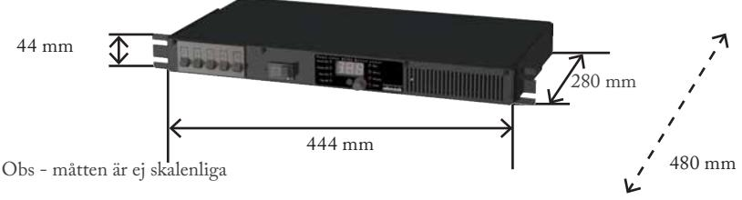

EN54 24V 25A 2U, EN54 48V 13A 2U

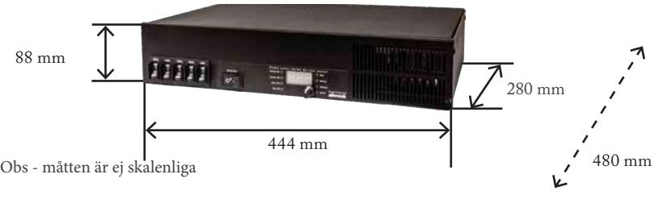

10 Data och konstruktion kan ändras utan föregående meddelande.

### Montering av batterihylla

För att enheten skall fungera krävs tillkoppling av batterier. Dessa skall placeras på en batterihylla som kommer med förberett kablage. Batterihyllan skall monteras i rack innan batterier placeras.

#### Säkerhet

- *• Enheten skall installeras i en låst och skyddad inomhusmiljö.*
- *• Risk för åtkomst till batteripoler. Polskydd skall täcka batteripoler.*

#### Inkoppling av batterihylla

Använd medföljande och förberett kablage för att koppla in batterierna som står på batterihyllan. Var försikigt så att polerna på batterierna inte kortsluts. Anslut först kablage i batterier, se 1 nedan. Kablage skall ha polskydd i gummi som täcker batteripol. Anslut sedan truckhanske på enhetens baksida, se 2 nedan.

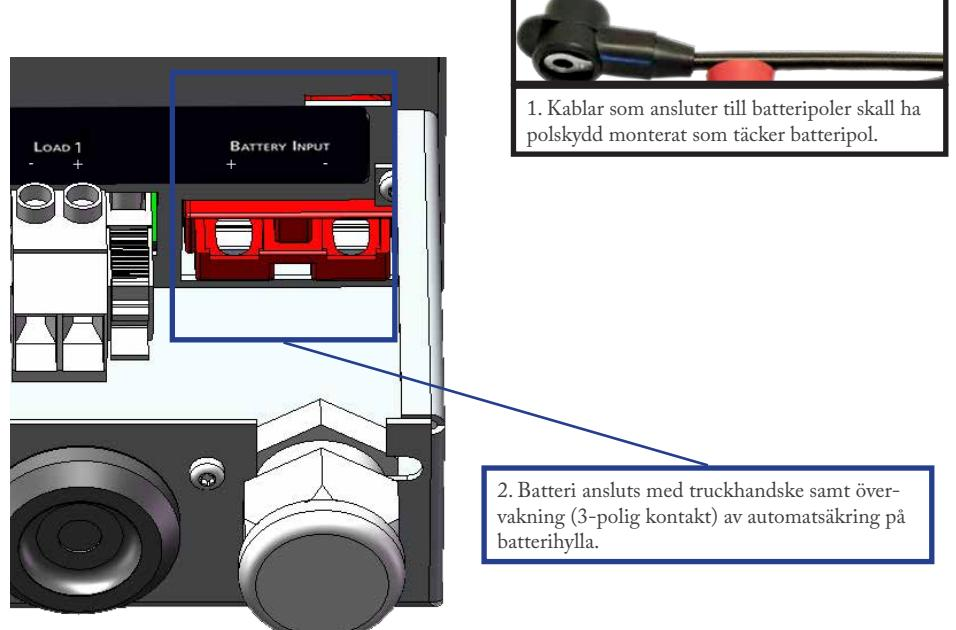

### Frontindikation

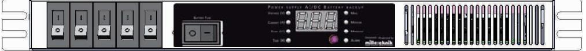

Framsida: Avsäkring last 1-5 (från vänster till höger). Batterisäkring.

### Indikeringspanel

| Lastsäkring 1-5 (1-2 standard, 3-5 tillval). | 1=Säkring intakt / 0=Säkring utlöst. |
|----------------------------------------------|--------------------------------------|
| Batterisäkring                               | 1=Säkring intakt / 0=Säkring utlöst. |
| Indikeringsdisplay med flervalsratt.         | Se sid 9 för inställningar och larm. |

## Display

Strömförsörjningen har som standard en frontdisplay för statusinformation. Flervalsratten ger möjlighet att läsa av värde på displayen. Genom att snurra på ratten väljer man önskad status från matrisen.

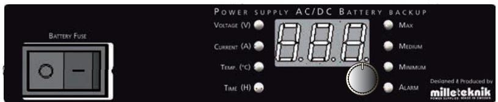

| Spänning (V)                                                       | Spänning         | Visar aktuell spänning              |  |  |  |  |  |  |
|--------------------------------------------------------------------|------------------|-------------------------------------|--|--|--|--|--|--|
| Max Spänning (V)                                                   | Spänning+Max     | Visar maxvärde för spänning         |  |  |  |  |  |  |
| Medelspänning (V)                                                  | Spänning+Medel   | Visar medelvärde för spänning       |  |  |  |  |  |  |
| Min Spänning (V)                                                   | Spänning+Min     | Visar min-värde för spänning        |  |  |  |  |  |  |
| Ström (A)                                                          | Ström            | Visar aktuell ström                 |  |  |  |  |  |  |
| Max Ström (A)                                                      | Ström+Max        | Visar maxvärde för ström            |  |  |  |  |  |  |
| Medelström (A)                                                     | Ström+Medel      | Visar medelvärde för ström          |  |  |  |  |  |  |
| Min Ström (A)                                                      | Ström+Min        | Visar min-värde för ström           |  |  |  |  |  |  |
| Temperatur, visar streck tempera turgivaren ej är ansluten (°C) | Temperatur       | Visar aktuell temperatur i systemet |  |  |  |  |  |  |
| Max Temperatur (°C)                                                | Temperatur+Max   | Visar maxvärde för temperatur       |  |  |  |  |  |  |
| Medeltemperatur (°C)                                               | Temperatur+Medel | Visar medelvärde för temperatur     |  |  |  |  |  |  |
| Min Temperatur (°C)                                                | Temperatur+Min   | Visar min-värde för temperatur      |  |  |  |  |  |  |
| Aktuell möjlig driftstid (H)                                       | Driftstid        | Visar aktuell driftstid i timmar.   |  |  |  |  |  |  |
| Minsta uppmätta driftstid (H)                                      | Driftstid+Min    | Visar kortast uppmätta driftstid    |  |  |  |  |  |  |

12 Data och konstruktion kan ändras utan föregående meddelande.

#### Not om batteriinställning

#### Se bilaga 2.

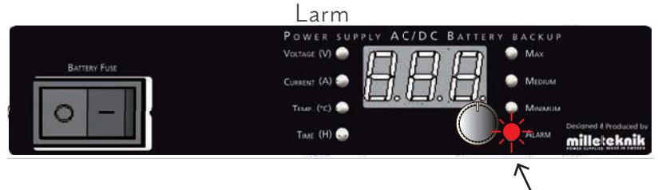

Larm indikeras genom att indikeringsdiod ALARM blinkar.

| Släckt  | Normaldrift                                                                                                                                                                                                                                                                                                                                                                                                                                                                                                                                           |
|---------|-------------------------------------------------------------------------------------------------------------------------------------------------------------------------------------------------------------------------------------------------------------------------------------------------------------------------------------------------------------------------------------------------------------------------------------------------------------------------------------------------------------------------------------------------------|
| 1 Blink | Nätavbrott                                                                                                                                                                                                                                                                                                                                                                                                                                                                                                                                            |
| 2 Blink | Fördröjt nätbortfall, (10 sekunders fördröjning).                                                                                                                                                                                                                                                                                                                                                                                                                                                                                                     |
| 3 Blink | Laddarfel. Om batterierna ej nått önskad spänning (26,7V) efter fullgjord laddningscykel. Laddarfel. Nätaggregat sjunker under gränsvärde (26,5V) under pågående vilofas för batterierna. Laddarfel. Om spänningen från nätaggregat sjunker under anslutningstestet för batterierna som sker var 10 sekund. Vid låg spänning i nätaggregat (26,7V), kopplas batterierna bort var 10:e minut, om låg spänning i nätaggregat kvarstår ges larm. Om nätaggregats-spänningen ligger under systemspänning (24V) vid nätdrift ge larm. |
| 4 Blink | Överspänning nätaggregat > 27,9 V DC, (48 V < 55,8 V DC,).                                                                                                                                                                                                                                                                                                                                                                                                                                                                                            |
| 5 Blink | Åldrade batterier, misslyckat veckotest. Celltest, batteriets inre resistans har stigit över gränsvärdet. Misslyckat anslutningstest. Batterier är ej anslutna eller batterispänning under 16 V.                                                                                                                                                                                                                                                                                                                                             |
| 6 Blink | Låg batterispänning i batteridrift.                                                                                                                                                                                                                                                                                                                                                                                                                                                                                                                   |
| 7 Blink | Temperaturlarm, temperaturen ligger under eller över gränsvärde. Säkringsfel, last eller batterisäkring har löst ut. Säkringsfel från externt kort med lastutgångar. Jordfel (D-Sub). Signalfel (D-Sub). Temperaturgivaren är felaktig eller saknas. Fläktfel.                                                                                                                                                                                                                                                                      |
| 8 Blink | Systemet är inte kalibrerat.                                                                                                                                                                                                                                                                                                                                                                                                                                                                                                                          |
|         |                                                                                                                                                                                                                                                                                                                                                                                                                                                                                                                                                       |

# Översikt, baksida

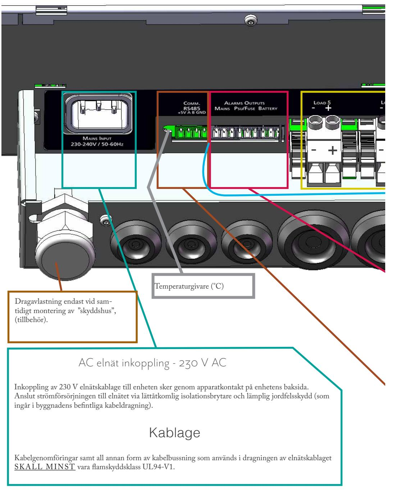

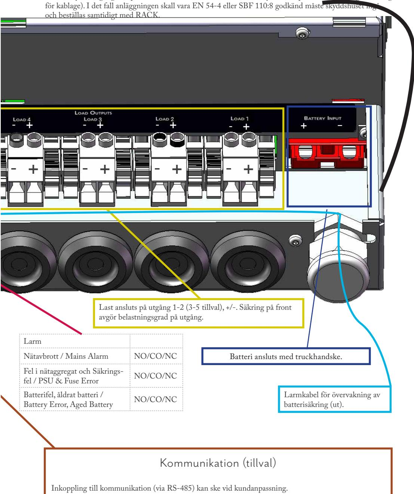

För att skydda utgångarna på baksidan finns ett tillval i form av ett skyddshus i plåt (inklusive dragavlastning

Data och konstruktion kan ändras utan föregående meddelande. 15

## Utgångsanslutningar

- Anslut 27,3 V, (48 V, 54,6 V).utgångsanslutningarna till last, dubbelt försörjningskablage, via kopplingsplintarna på enhetens baksida.
- Automatsäkring D10 eller D20, D-karaktäristik är monterad (på framsidan av enheten. Säkringarnas nummer på framsidan räknas från vänster till höger).
- Anslutning skall göras med, för ändamålet, lämpligt klassad kabel.
- Minsta kabelarea för anslutningskabel är: 10 A = 1,5 mm2 20 A = 4,0 mm2 30 A = 6,0 mm2
- Maximal kabelarea är 6 mm2.
- Kontrollera att lasten är ansluten med korrekt polaritet.
- Skilj tydligt lastkablage från elnätskablage.

## Maximal ledningsresistans:

Spänningsfallet i utgångskablaget skall beräknas så att det säkerställer att lägsta spänningen i slutet av kablaget överskrider ansluten lasts minsta drivspänning, vid lägsta möjliga utspänning från strömförsörjningsenheten.

ILAST är summan av de anslutna lasterna.

Kabelresistansen (RKABEL) är summan av kabelresistansen i båda ledarna x kabellängden.

Kabelresistansen (RKABEL) för 1,5 mm2 är 0,009 Ω / m.

Kabelresistansen (RKABEL) för 4 mm2 är 0,009 Ω / m.

Kabelresistansen (RKABEL) för 6 mm2 är 0,005 Ω / m.

Kabelresistansen (RKABEL) för 10 mm2 är 0,009 Ω / m.

Kabelresistansen (RKABEL) för 16 mm2 är 0,002 Ω / m.

Minsta lastspänning i batteridrift med hänsyn till spänningsfall i sladdar = VUT(MIN) - (ILAST x RKABEL).

Hur systemet skall startas

Efter inkoppling skall start ske i följande steg:

- 1. Inkoppling/spänningssättning av batteridel.
- 2. Spänningssättning till elnät.
- 3. Spänningssätt till last genom att slå till automatsäkring.

### Driftsättning

När samtliga anslutningar gjorts, systemet har konfigurerats och de tre stegen ovan är genomförda - då skall följande hända:

- Statusindikering är släckt i normaldrift.
- Lasten kommer att ström-försörjas. Kontrollera med voltmeter att lastspänning är mellan 26 & 27,3 V DC (48 V, 52-54,6 V DC).
- Batterierna skall ta laddning. Kontrollera detta genom att mäta över batteripolerna. (Beroende på batteriernas kondition kan spänningen variera men skall ligga över 24 V DC, (48 V DC) och sakta öka med cirka 0,01 V/ 10 sek,. Vid fulladdat tillstånd skall batteriernas spänning vara 27,3 V DC (48 V, 54,6 V DC).
- Indikeringsdiod ALARM på panel skall vara släckt.
- Alla fellarmsreläer skall vara i draget tillstånd. Kontrollera att slutning finns mellan CO och NC. Sätt mätinstrumentet på kontinuitetsmätning och testa slutning. Denna skall då indikera kortslutning.
- Alla reläutgångar är normalt spänningssatta och därmed ger de larm vis spänningslöst läge. Vid anslutning till kommunikation skickar det yttre och överordnade systemet frågor. Det yttre och överordnade systemet skall då ge larm vid exempelvis spänningslös enhet.

Data och konstruktion kan ändras utan föregående meddelande. 17

#### Underhåll

Underhållet på strömförsörjningen är minimalt. Batterierna, dock, har en begränsad livscykel och ett underhållsschema skall finnas för att avgöra intervall för batteribyte.

#### Batterier

Batterier alstrar elektricitet genom en kemisk process och det sker därmed en naturlig degradering av kapacitet. Den största faktorn för batteriers livslängd är temperatur. Ju högre temperatur desto kortare livslängd. En ideal temperatur är 20 °C.

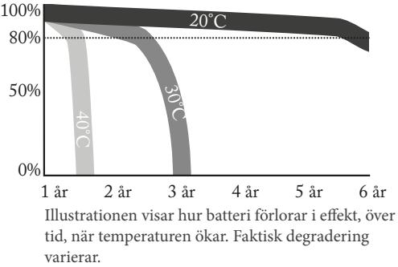

**• OBS!** *Batterier måste vara nya vid installation och byte för att certifierade normer skall upprätthållas.*

#### Batteriåtervinning

Återvinn alla batterier. Återlämna till tillverkare eller lämna till närmaste återvinningsstation.

# Uplus batterier 10 — 12 år MT113-12V75-01* 12 V MT113-12V100-01* 12 V MT113-12V150-01* 12 V Frontmatade batterier +12 år MT114-12V62-FT*/** 12 V MT114-12V100-FT*/** 12 V MT114-12V125-FT*/** 12 V MT114-12V150-FT*/** 12 V

#### Rekommenderade batterier

18 Data och konstruktion kan ändras utan föregående meddelande.

| Internresistans |                             |                                       |                               |              |              |                |                                    |
|-----------------|-----------------------------|---------------------------------------|-------------------------------|--------------|--------------|----------------|------------------------------------|
| kapacitet       | resistans Intern (mΩ) | testlast 24 V Volt dip vid (mV) | Testlast av kapaci tet (%) | Testlast (A) | Testlast (Ω) | Effektmotstånd | Marginal (gräns för larm =0,6V) |
|                 | 23                          | 115,00                                | 0,35                          | 2,50         | 10           |                | 4,22                               |
|                 | 17                          | 125,00                                | 0,26                          | 3,68         | 6,8          |                | 3,80                               |
|                 | 14                          | 102,94                                | 0,18                          | 3,68         | 6,8          |                | 4,83                               |
|                 | 10                          | 151,52                                | 0,27                          | 7,58         | 3,3          |                | 2,96                               |
|                 | 9                           | 692,31                                | 0,85                          | 38,46        | 0,65         | 3,3R           |                                    |
|                 |                             |                                       | 0,28                          | 15,15        | 1,65         | 2//3,3R        |                                    |
|                 | 6,6                         | 300,00                                | 0,30                          | 22,73        | 1,1          | 2//3,3R        | 1,00                               |
|                 |                             |                                       |                               |              |              | 2//3,3R        |                                    |
|                 | 4,9                         | 222,73                                | 0,23                          | 22,73        | 1,1          | 3//3,3R        | 1,69                               |
|                 |                             |                                       |                               |              |              | 3//3,3R        |                                    |
|                 | 4                           | 303,03                                | 0,32                          | 37,88        | 0,66         | 3//3,3R        | 0,98                               |
|                 |                             |                                       |                               |              |              | 3//3,3R        |                                    |
|                 |                             |                                       |                               |              |              | 3//3,3R        |                                    |
|                 | 2,5                         | 189,39                                | 0,25                          | 37,88        | 0,66         | 3//3,3R        | 2,17                               |
|                 |                             |                                       |                               |              |              | 3//3,3R        |                                    |
|                 |                             |                                       |                               |              |              | 3//3,3R        |                                    |
|                 |                             |                                       |                               |              |              | 3//3,3R        |                                    |
|                 |                             |                                       |                               |              |              | 3//3,3R        |                                    |
|                 | 1,25                        | 132,98                                | 0,18                          | 53,19        | 0,47         | 3//3,3R        | 3,51                               |

## Bilaga 1 Internresistans

Data och konstruktion kan ändras utan föregående meddelande. 19

| Marginal (gräns för larm =0,6V)    | 4,22    | 3,80    | 4,83   | 2,96      |           |           | 1,00    |         | 1,69    |         | 0,98    |         |         | 2,17    |         |         |         |         | 3,51    |
|---------------------------------------|---------|---------|--------|-----------|-----------|-----------|---------|---------|---------|---------|---------|---------|---------|---------|---------|---------|---------|---------|---------|
| Effektmotstånd                        | 10R+10R | 10R+10R | 10R    | 3,3R+3,3R | 3,3R+3,3R | 3,3R+3,3R | 2//6,8R | 2//6,8R | 3//6,8R | 3//6,8R | 3//6,8R | 3//6,8R | 3//6,8R | 3//6,8R | 3//6,8R | 3//6,8R | 3//6,8R | 3//6,8R | 3//6,8R |
| Testlast (Ω)                          | 10      | 6,8     | 6,8    | 3,3       | 0,65      | 1,65      | 1,1     |         | 1,1     |         | 0,66    |         |         | 0,66    |         |         |         |         | 0,47    |
| Testlast (A)                          | 2,50    | 3,68    | 3,68   | 7,58      | 38,46     | 15,15     | 22,73   |         | 22,73   |         | 37,88   |         |         | 37,88   |         |         |         |         | 53,19   |
| Testlast av kapaci- tet (%)        | 0,35    | 0,26    | 0,18   | 0,27      | 0,85      | 0,28      | 0,30    |         | 0,23    |         | 0,32    |         |         | 0,25    |         |         |         |         | 0,18    |
| testlast 48 V Volt dip vid (mV) | 115,00  | 125,00  | 102,94 | 151,52    | 692,31    |           | 300,00  |         | 222,73  |         | 303,03  |         |         | 189,39  |         |         |         |         | 132,98  |
| resistans Intern- (mΩ)          | 23      | 17      | 14     | 10        | 9         |           | 6,6     |         | 4,9     |         | 4       |         |         | 2,5     |         |         |         |         | 1,25    |
| Capacity Battery 48 V (Ah)   | 7,2     | 14      | 20     | 28        | 45        | 55        | 75      | 90      | 100     | 110     | 120     | 125     | 135     | 150     | 180     | 200     | 240     | 250     | 300     |

## Bilaga 2 Ställ in batterikapacitet via flervalsratt

Du kan ställa in batterikapacitet genom att trycka och hålla in flervalsratten tills det att C00 visas i displayen. Vrid flervalsratten tills det att c01 visas och tryck in flervalsratten för att ställa in batterikapacitet. Vrid till önskad batterikapacitet visas och tryck lätt för att spara inställningen.

Vrid till C00 och tryck in knappen en gång för att gå tillbaka till den vanliga menyn.

Standardinställning från fabrik är 2 x 20 Ah.

Enheten behåller inställningar även om strömmen bryts helt till enheten. Du behöver alltså inte ställa in batterikapacitet igen vid batteribyte.

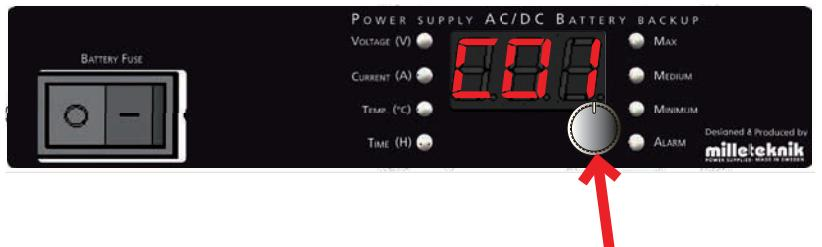

Vrid flervalsratten C01 att ställa in batterikapacitet

## Bilaga 3 Fullständig lista över inställningar via flervalsratt

Konfigurationsläge på displayen, nås genom ett långt knapptryck.

( J) värdet är justerbart

(N) värdet är nollställbart

(U) Kan utföra ett test/funktion

| c00 | Återgå till vanligt visningsläge                                |
|-----|-----------------------------------------------------------------|
| c01 | Inställning av batterikapacitet i Ah ( J)                       |
| c02 | Inställning av minsta tillåtna batteridriftstid ( J)            |
| c03 | Larmgräns för låg batterispänning i batteridrift ( J)           |
| c04 | Fördröjning larm nätbortfall ( J)                               |
| c05 | Larm för låg systemspänning ( J)                                |
| c06 | Visa relästatus, 100-tal = SDS-relä, 10-tal = LoBat, 1-tal = AC |
| c07 | Laddcykel ( J)                                                  |
| c08 | Högsta uppmätta spänning (N)                                    |
| c09 | Lägsta uppmätta spänning (N)                                    |
| c10 | Högsta uppmätta temperatur (N)                                  |
| c11 | Lägsta uppmätta temperatur (N)                                  |
| c12 | Antal minuter med övertemperatur (N)                            |
| c13 | Antal minuter med undertemperatur (N)                           |
| c14 | Sekundräknare lastström över 170% av nominell last (N)          |
| c15 | Minuträknare lastström över 100% av nominell last (N)           |
| c16 | Dygnsräknare lastström över 80% av nominell last (N)            |
| c17 | Utför batterianslutningstest (U)                                |
| c18 | Utför Celltest (U)                                              |
| c19 | Utför Veckotest (U)                                             |
| c20 | Kalibrera batterispänning ( J)                                  |
| c21 | Kalibrera spänning från nätagg ( J)                             |
| c22 | Kalibrera nollström (N)                                         |
| c23 | Kalibrera Ström ( J)                                            |
| c24 | Inställning av nominell last ( J)                               |
| c25 | Gränsvärde för djupurladdningsskydd ( J)                        |

| OBS! 1HE har hårdvarustyrd djupurladdning |                                                      |
|-------------------------------------------|------------------------------------------------------|
| c26                                       | Gränsvärde för veckotest ( J)                        |
| c27                                       | Ursprungligt värde för Celltest ( J)                 |
| c28                                       | Tillåtet ytterligare spänningsfall vid celltest ( J) |
| c29                                       | Rådata från A/D-omvandlaren                          |
| c30                                       | Rådata från A/D-omvandlaren                          |
| c31                                       | Rådata från A/D-omvandlaren                          |
| c32                                       | Rådata från A/D-omvandlaren                          |
| c33                                       | Rådata från A/D-omvandlaren                          |
| c34                                       | Rådata från A/D-omvandlaren                          |
| c35                                       | Rådata från A/D-omvandlaren                          |
| c36                                       | Interna flaggor                                      |
| c37                                       | Interna flaggor                                      |

Data och konstruktion kan ändras utan föregående meddelande. 23

# EN54-COVER

EN54-COVER till rackmonterade EN54 är ett obligatoriskt tillval för installation i anläggningar som är EN 54-4 eller SBF 110:8 godkända.

#### Montering

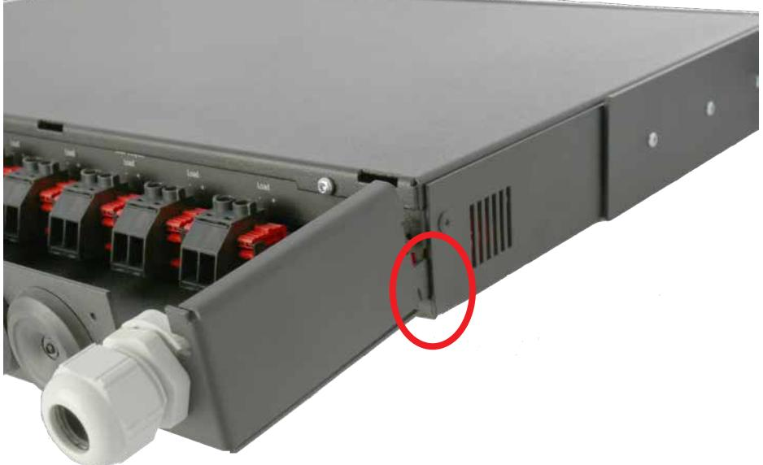

- 1. Skjut in hakarna i RACK EN54-COVERet på backsidan av enheten.
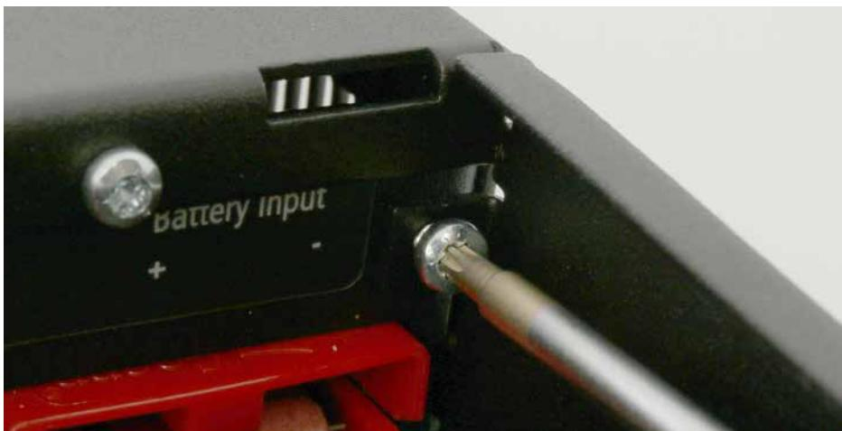

- 2. Skruva fast EN54-COVER, (2 skruv).
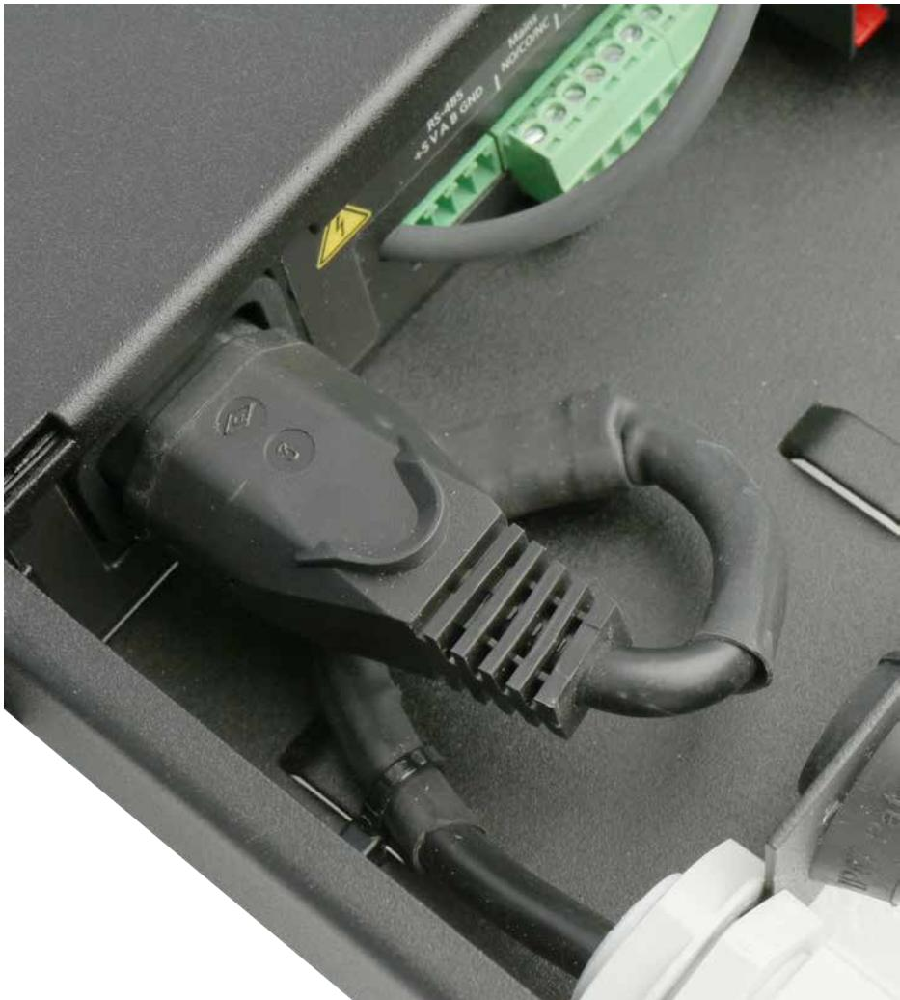

3. Anslut övrigt kablage innan anslutning till elnät. Not: Elnätskabel skall sitta som på bilden. Temperaturgivares skyddshylsa kan behöva monteras bort för att få genom temperaturgivaren i kabelgenomföring.

*• Alla anslutande kablar skall gå genom kabelgenomföringarna.*

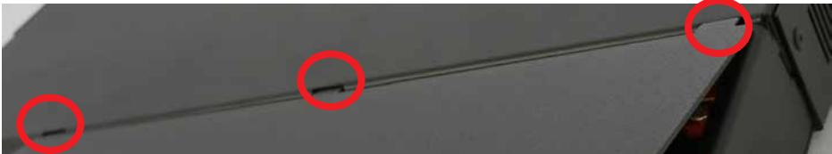

4. Skjut in hakarna i RACK EN54-COVERets lock på backsidan av RACKenheten.

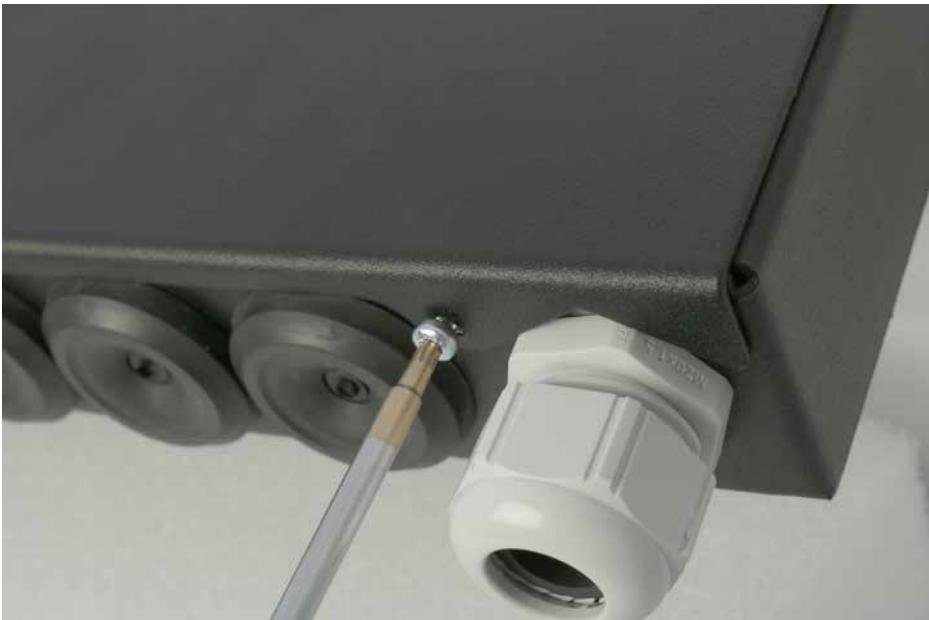

- 5. Skruva fast locket, (2skruv).
Data och konstruktion kan ändras utan föregående meddelande. 27

 200305

Milleteknik AB Ögärdesvägen 8 B 433 30 Partille

031-340 02 30 info@milleteknik.se www.milleteknik.se

EN54 RACK_1HE_2HE_2020refresh.indd 28 2020-03-05 16:11:04