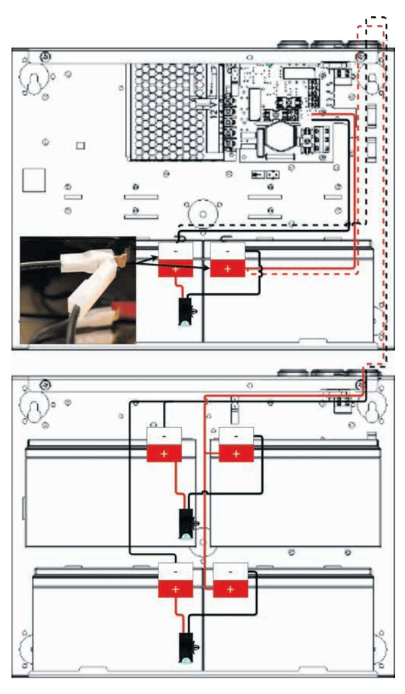
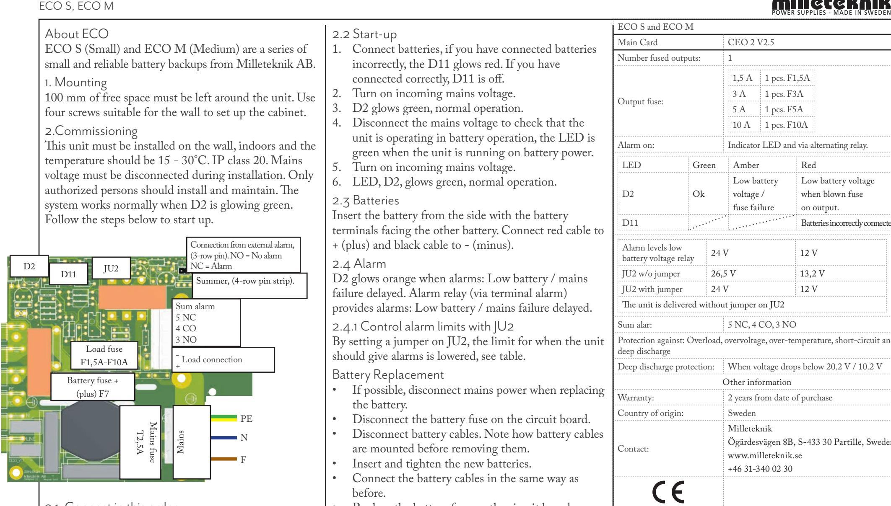
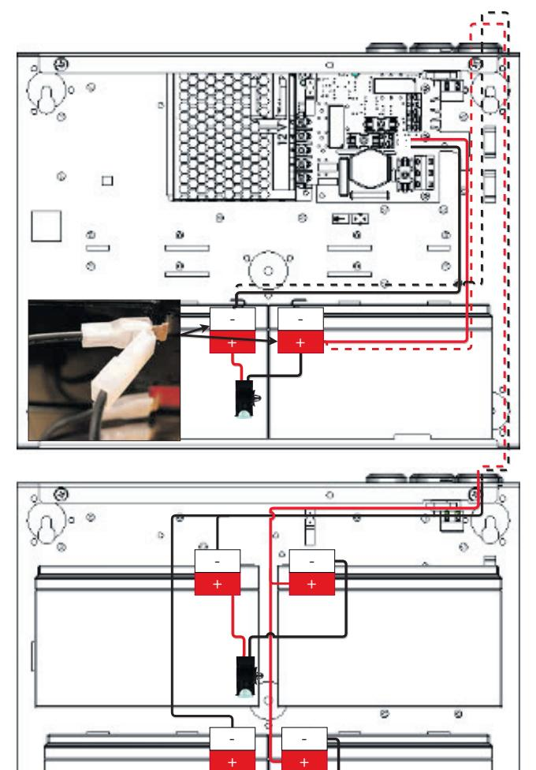

|                                                                                                                                                                                                                                                                                                                                                                                                                                                                                                                                                                                                                                                                                       | POWER SUPPLIES - MADE IN SWEDEN ECO S och ECO M                                                                                                                                                                                                                                                                                                                                                                                                                                                                                                                                                                                                                                                                                                                                                                                                                                                                                                                                                                                                                                                                                                                                                                                                                                                                               |                                                                                        |                                                                                        |                                                              |  |
|---------------------------------------------------------------------------------------------------------------------------------------------------------------------------------------------------------------------------------------------------------------------------------------------------------------------------------------------------------------------------------------------------------------------------------------------------------------------------------------------------------------------------------------------------------------------------------------------------------------------------------------------------------------------------------------|----------------------------------------------------------------------------------------------------------------------------------------------------------------------------------------------------------------------------------------------------------------------------------------------------------------------------------------------------------------------------------------------------------------------------------------------------------------------------------------------------------------------------------------------------------------------------------------------------------------------------------------------------------------------------------------------------------------------------------------------------------------------------------------------------------------------------------------------------------------------------------------------------------------------------------------------------------------------------------------------------------------------------------------------------------------------------------------------------------------------------------------------------------------------------------------------------------------------------------------------------------------------------------------------------------------------------------|----------------------------------------------------------------------------------------|----------------------------------------------------------------------------------------|--------------------------------------------------------------|--|
| Om ECO                                                                                                                                                                                                                                                                                                                                                                                                                                                                                                                                                                                                                                                                                | 2.2 Uppstart 1. Koppla in batterier, har du kopplat batterier fel lyser D11 rött. Har du kopplat rätt är D11 släckt. 2. Slå till inkommande nätspänning. 3. D2 lyser grönt, normaldrift. 4. Bryt nätspänning för att kontrollera att enheten fungerar i batteridrift, lysdiod lyser grönt då                                                                                                                                                                                                                                                                                                                                                                                                                                                                                                                                                                                                                                                                                                                                                                                                                                                                                                                                                                                                       | Huvudkort                                                                              | CEO3 V2.5                                                                              |                                                              |  |
| ECO S (Small) och ECO M (Medium) är en serie små                                                                                                                                                                                                                                                                                                                                                                                                                                                                                                                                                                                                                                      |                                                                                                                                                                                                                                                                                                                                                                                                                                                                                                                                                                                                                                                                                                                                                                                                                                                                                                                                                                                                                                                                                                                                                                                                                                                                                                                                  | Antal avsäkrade utgångar:                                                              | 1 st                                                                                   |                                                              |  |
| och driftsäkra batteribackuper från Milleteknik AB. 1.Montering 100 mm fritt utrymme skall lämnas kring enheten. Använd fyra för väggen lämpliga skruvar för att sätta upp skåpet.                                                                                                                                                                                                                                                                                                                                                                                                                                                                                        |                                                                                                                                                                                                                                                                                                                                                                                                                                                                                                                                                                                                                                                                                                                                                                                                                                                                                                                                                                                                                                                                                                                                                                                                                                                                                                                                  | Säkring på utgång:                                                                     | 1,5 A 1 st. F1,5A 3 A 1 st. F3A 5 A 1 st. F5A 10 A 1 st. F10A     |                                                              |  |
| 2.Driftsättning                                                                                                                                                                                                                                                                                                                                                                                                                                                                                                                                                                                                                                                                       | enheten drivs på batteri.                                                                                                                                                                                                                                                                                                                                                                                                                                                                                                                                                                                                                                                                                                                                                                                                                                                                                                                                                                                                                                                                                                                                                                                                                                                                                                        | Larm via:                                                                              |                                                                                        | Indikeringsdiod och via växlande relä.                       |  |
| Denna enhet skall installeras på vägg, inomhus och                                                                                                                                                                                                                                                                                                                                                                                                                                                                                                                                                                                                                                    | 5. Slå till inkommande nätspänning. 6. Lysdiod, D2 , lyser grönt, normaldrift. 2.3 Batterier Skjut in batteriet från sidan med batteripolerna mot kortsidan. Anslut röd kabel till + (plus) och svart kabel till - (minus). Se andra sidan för mer information. 2.4 Larm Larm för låg batterispänning / fördröjt nätavbrott. (D2) Larm för bortkopplat batteri vid uppstart, (D11) Larm för överspänning, (D11) Larmrelä (via plint summalarm) ger larm för: Låg batterispänning / fördröjt nätavbrott. 2.4.1 Styr larmgränser med JU2 Genom att sätta en bygel på JU2 kan gränsen för när enheten skall ge larm sänkas, se tabell. Batteribyte • Bryt, om möjligt, nätspänning vid batteribyte. • Koppla bort batterisäkring på kretskortet. • Koppla bort batterikablar. Notera hur batterikablar är monterade innan de avlägsnas. • Sätt in och spänn fast de nya batterierna. • Anslut batterikablarna på samma sätt som tidigare. • Sätt tillbaka batterisäkring på kretskort. • Slå till nätspänning. Eventuellt kan indikeringsdioden lysa orange under ett par timmar, tills batterier är laddade. • Testa systemet genom att kortvarigt koppla bort nätspänning, (= lasten drivs vidare av batterierna), | Indikeringsdiod Grönt                                                               | Orange                                                                                 | Rött                                                         |  |
| temperaturen skall vara 15 - 30 °C. IP-klass 20. Nätspänning skall vara bortkopplad under installation. Endast personer med behörighet bör installera och underhålla. Systemet fungerar normalt då D2 lyser med fast grönt sken. Följ stegen nedan för att driftsätta. Anslutning från externt larm, (3-radig stiftlist). NO=Ej larm NC=Larm D2 JU2 D11 Anslutning till Summer, (4-radig stiftlist). Summalarm 5 NC 4 CO 3 NO Utgångssäkring - Utgång, anslutning F1,5A-F10A + till last: Batterisäkring + (plus) F7 El Anslutningsplint PE nä tss T2 Elnät N äk ,5A rin g F |                                                                                                                                                                                                                                                                                                                                                                                                                                                                                                                                                                                                                                                                                                                                                                                                                                                                                                                                                                                                                                                                                                                                                                                                                                                                                                                                  | D2 Ok                                                                               | Låg batteri spänning / säkringsfel                                               | Låg batterispänning vid trasig säkring på utgång.      |  |
|                                                                                                                                                                                                                                                                                                                                                                                                                                                                                                                                                                                                                                                                                       |                                                                                                                                                                                                                                                                                                                                                                                                                                                                                                                                                                                                                                                                                                                                                                                                                                                                                                                                                                                                                                                                                                                                                                                                                                                                                                                                  | D11                                                                                    | Överspänning                                                                           | Batterier felkopplade Batterier bortkopplade vid start |  |
|                                                                                                                                                                                                                                                                                                                                                                                                                                                                                                                                                                                                                                                                                       |                                                                                                                                                                                                                                                                                                                                                                                                                                                                                                                                                                                                                                                                                                                                                                                                                                                                                                                                                                                                                                                                                                                                                                                                                                                                                                                                  | Larmgräns låg batte rispänning relä                                                 | 24 V enheter                                                                           | 12 V enheter                                                 |  |
|                                                                                                                                                                                                                                                                                                                                                                                                                                                                                                                                                                                                                                                                                       |                                                                                                                                                                                                                                                                                                                                                                                                                                                                                                                                                                                                                                                                                                                                                                                                                                                                                                                                                                                                                                                                                                                                                                                                                                                                                                                                  | JU2 utan bygel                                                                         | 26,5 V                                                                                 | 13,2 V                                                       |  |
|                                                                                                                                                                                                                                                                                                                                                                                                                                                                                                                                                                                                                                                                                       |                                                                                                                                                                                                                                                                                                                                                                                                                                                                                                                                                                                                                                                                                                                                                                                                                                                                                                                                                                                                                                                                                                                                                                                                                                                                                                                                  | JU2 med bygel                                                                          | 24 V 12 V                                                                           |                                                              |  |
|                                                                                                                                                                                                                                                                                                                                                                                                                                                                                                                                                                                                                                                                                       |                                                                                                                                                                                                                                                                                                                                                                                                                                                                                                                                                                                                                                                                                                                                                                                                                                                                                                                                                                                                                                                                                                                                                                                                                                                                                                                                  | Enheten levereras utan bygel på JU2                                                    |                                                                                        |                                                              |  |
|                                                                                                                                                                                                                                                                                                                                                                                                                                                                                                                                                                                                                                                                                       |                                                                                                                                                                                                                                                                                                                                                                                                                                                                                                                                                                                                                                                                                                                                                                                                                                                                                                                                                                                                                                                                                                                                                                                                                                                                                                                                  | Summalarm: 5 NC, 4 CO, 3 NO                                                         |                                                                                        |                                                              |  |
|                                                                                                                                                                                                                                                                                                                                                                                                                                                                                                                                                                                                                                                                                       |                                                                                                                                                                                                                                                                                                                                                                                                                                                                                                                                                                                                                                                                                                                                                                                                                                                                                                                                                                                                                                                                                                                                                                                                                                                                                                                                  | Skydd mot: Överlast, överspänning, övertemperatur, kortslutning och djupur laddning |                                                                                        |                                                              |  |
|                                                                                                                                                                                                                                                                                                                                                                                                                                                                                                                                                                                                                                                                                       |                                                                                                                                                                                                                                                                                                                                                                                                                                                                                                                                                                                                                                                                                                                                                                                                                                                                                                                                                                                                                                                                                                                                                                                                                                                                                                                                  | Djupurladdningsskydd:                                                                  |                                                                                        | När spänning sjunker under 20,2 V / 10,2 V                   |  |
|                                                                                                                                                                                                                                                                                                                                                                                                                                                                                                                                                                                                                                                                                       |                                                                                                                                                                                                                                                                                                                                                                                                                                                                                                                                                                                                                                                                                                                                                                                                                                                                                                                                                                                                                                                                                                                                                                                                                                                                                                                                  | Övrig information                                                                      |                                                                                        |                                                              |  |
|                                                                                                                                                                                                                                                                                                                                                                                                                                                                                                                                                                                                                                                                                       |                                                                                                                                                                                                                                                                                                                                                                                                                                                                                                                                                                                                                                                                                                                                                                                                                                                                                                                                                                                                                                                                                                                                                                                                                                                                                                                                  | Garantitid:                                                                            | 2 år                                                                                   |                                                              |  |
|                                                                                                                                                                                                                                                                                                                                                                                                                                                                                                                                                                                                                                                                                       |                                                                                                                                                                                                                                                                                                                                                                                                                                                                                                                                                                                                                                                                                                                                                                                                                                                                                                                                                                                                                                                                                                                                                                                                                                                                                                                                  | Tillverkningsland:                                                                     | Sverige                                                                                |                                                              |  |
|                                                                                                                                                                                                                                                                                                                                                                                                                                                                                                                                                                                                                                                                                       |                                                                                                                                                                                                                                                                                                                                                                                                                                                                                                                                                                                                                                                                                                                                                                                                                                                                                                                                                                                                                                                                                                                                                                                                                                                                                                                                  | Kontakt                                                                                | Milleteknik Ögärdesvägen 8B, 433 30 Partille www.milleteknik.se 031-340 02 30 |                                                              |  |
| 2.1. Anslut i denna ordning • Last på lastutgång, (se Anslutning till last ovan). • Batterier, (se punkt 2.3. Batteri). • Summalarm, valfritt, (se Summalarm ovan). • Elnät, (se ovan).                                                                                                                                                                                                                                                                                                                                                                                                                                                                       |                                                                                                                                                                                                                                                                                                                                                                                                                                                                                                                                                                                                                                                                                                                                                                                                                                                                                                                                                                                                                                                                                                                                                                                                                                                                                                                                  |                                                                                        |                                                                                        |                                                              |  |

och därefter slå till nätspänningen igen.

350-195 201113

## Battery box 24V M

# Om

Battery box 24 V M är en batteribox för att utöka drifttiden på ECO M batteribackup

#### 1. Montering

100 mm fritt utrymme skall lämnas kring enheten. Använd fyra för väggen lämpliga skruvar för att sätta upp skåpet.

## 2. Driftsättning

Denna enhet skall installeras på vägg, inomhus och temperaturen skall vara 15 - 30 °C. IP-klass 20. Nätspänning skall vara bortkopplad under installation. Endast personer med behörighet bör installera och underhålla. Systemet fungerar normalt då D2 lyser med fast grönt sken. Följ stegen nedan för att driftsätta.

2.1 Anslut batterier i batteribox

Skjut in batteriet från sidan med batteripolerna mot kortsidan. Anslut röd kabel till + (plus) och svart kabel till - (minus).

- Koppla från batterisäkring på batteribackup eller koppla från nätspänning.
- Sätt in batterier börja nedifrån. Använd bara nya batterier vid installation och batteribyte.
- Koppla på säkringar på batterier .
- Koppla ihop kablar från batteribox till batteribackup. Kablar dras på baksidan och in genom kabelgenomföringar på batteribackupens ovansida.
- Skruva kablage från både batteribox och batterier i batteribackup på kretskortet. Skruvplinten skall ta bägge kablagen.
- Anslut på en av polerna (på batteri i batteribackup) med dubbelkontakten, se bild till höger.
- Sätt tillbaka batterisäkring i batteribackup eller koppla till nätspänning.
- 2.2 Driftsättning av batteribackup med batteribox
- Efter anslutning av kablage, följ instruktioner för driftsättning av batteribox.

-+

Kretsko PCB

B1

-+ B1 B2 -+

2 x1V bateri =12V parlekopling

1 x2V bateri =12V

Kretsko PCB

| Antal batterier                                                                                                                  | Battery box 24 V M 4 st                                                                                                                                                                                                              |                                                                                                                  |
|----------------------------------------------------------------------------------------------------------------------------------|-----------------------------------------------------------------------------------------------------------------------------------------------------------------------------------------------------------------------------------------|------------------------------------------------------------------------------------------------------------------|
| Batterityp                                                                                                                       | 7 Ah eller 14 Ah                                                                                                                                                                                                                        |                                                                                                                  |
| Batterimärkspänning                                                                                                              | 12 V                                                                                                                                                                                                                                    |                                                                                                                  |
| Batteribyte                                                                                                                      | Blanda inte nya och använda batterier.                                                                                                                                                                                                  | Använd alltid nya batterier vid batteribyte.                                                                     |
| Garantitid:                                                                                                                      | 2 år                                                                                                                                                                                                                                    |                                                                                                                  |
| Tillverkningsland:                                                                                                               | Sverige                                                                                                                                                                                                                                 |                                                                                                                  |
| Kontakt                                                                                                                          | Milleteknik Ögärdesvägen 8B, 433 30 Partille www.milleteknik.se 031-340 02 30                                                                                                                                                  |                                                                                                                  |
|                                                                                                                                  |                                                                                                                                                                                                                                         |                                                                                                                  |
|                                                                                                                                  |                                                                                                                                                                                                                                         |                                                                                                                  |
| Batteri 1 x2V bateri =12V till - (minus). Kretsko • PCB - Inkoppling B1 1 batteri, 12 V enheter. + | Skjut in batteri från sidan på enheten med batteripolerna mot mitten. Anslut röd kabel till + (plus) och svart kabel Använd alltid nya batterier och blanda aldrig batterityp. Parallellkoppling 2 batterier, 12 V enheter. | 2 x1V bateri =24V serilkoping Kretsko PCB - Seriekoppling, 2 batte B1 rier, 24 V enheter. + |
| 1 st. 12 V, 7,2 Ah.                                                                                                              | 2 st. 12 V, 2,3 Ah.                                                                                                                                                                                                                     | 2 st 12 V, 2,3 Ah.                                                                                               |
|                                                                                                                                  | 2 st. 12 V, 7,2 Ah.                                                                                                                                                                                                                     | 2 st 12 V, 4,5 Ah.                                                                                               |
|                                                                                                                                  | 2 st. 12 V, 14 Ah.                                                                                                                                                                                                                      | 2 st 12 V, 7,2 Ah.                                                                                               |

4 x12V bateri =24V serikopling

-+

-+

Kretsko PCB

B1 B2 -+

-+

B B4 -+

-+

B1

Kretsko PCB

B1

-+ B1

2 x1V bateri =12V parlekopling

1 x2V bateri =12V

Kretsko PCB

2 x1V bateri =12V parlekopling

4 x12V bateri =24V serikopling

B2 -+

-+

-+

Kretsko PCB

B1 B2 -+

B B4 -+

2.1. Connect in this order

- Load on load output, (see Connection to load above).
- Batteries, (see section 2.3. Battery).
- Sum alarm, optional, (see Sum alarm above).
- Mains, (see above).
- 1. Connect batteries, if you have connected batteries incorrectly, the D11 glows red. If you have connected correctly, D11 is off.
- 2. Turn on incoming mains voltage.
- 3. D2 glows green, normal operation.
- 4. Disconnect the mains voltage to check that the unit is operating in battery operation, the LED is green when the unit is running on battery power.
- 5. Turn on incoming mains voltage.
- 6. LED, D2, glows green, normal operation.

Insert the battery from the side with the battery terminals facing the other battery. Connect red cable to

D2 glows orange when alarms: Low battery / mains failure delayed. Alarm relay (via terminal alarm) provides alarms: Low battery / mains failure delayed.

2.4.1 Control alarm limits with JU2

By setting a jumper on JU2, the limit for when the unit should give alarms is lowered, see table.

- If possible, disconnect mains power when replacing
- Disconnect the battery fuse on the circuit board.
- Disconnect battery cables. Note how battery cables are mounted before removing them.
- Insert and tighten the new batteries.
- Connect the battery cables in the same way as
- Replace the battery fuse on the circuit board.
- Turn on mains voltage. Optionally, the LED can light orange for a couple of hours until batteries are charged.
- Test the system by briefly disconnecting the mains voltage (= the load is driven on by the batteries), and then switching on the mains again.

| ECO S and ECO M                                   |       |                                                                                                     |                                                                                |        |                                                      |                                 |
|---------------------------------------------------|-------|-----------------------------------------------------------------------------------------------------|--------------------------------------------------------------------------------|--------|------------------------------------------------------|---------------------------------|
| Main Card                                         |       | CEO 2 V2.5                                                                                          |                                                                                |        |                                                      |                                 |
| Number fused outputs:                             |       | 1                                                                                                   |                                                                                |        |                                                      |                                 |
| Output fuse:                                      |       | 1,5 A 1 pcs. F1,5A 3 A 1 pcs. F3A 5 A 1 pcs. F5A 10 A 1 pcs. F10A              |                                                                                |        |                                                      |                                 |
| Alarm on:                                         |       |                                                                                                     | Indicator LED and via alternating relay.                                       |        |                                                      |                                 |
| LED                                               | Green |                                                                                                     | Amber                                                                          |        | Red                                                  |                                 |
| D2                                                | Ok    |                                                                                                     | Low battery voltage / fuse failure                                       |        | Low battery voltage when blown fuse on output. |                                 |
| D11                                               |       |                                                                                                     |                                                                                |        |                                                      | Batteries incorrectly connected |
| Alarm levels low 24 V battery voltage relay |       |                                                                                                     |                                                                                | 12 V   |                                                      |                                 |
| JU2 w/o jumper                                    |       | 26,5 V                                                                                              |                                                                                | 13,2 V |                                                      |                                 |
| JU2 with jumper 24 V                           |       |                                                                                                     |                                                                                | 12 V   |                                                      |                                 |
| The unit is delivered without jumper on JU2       |       |                                                                                                     |                                                                                |        |                                                      |                                 |
| Sum alar:                                         |       | 5 NC, 4 CO, 3 NO                                                                                    |                                                                                |        |                                                      |                                 |
| deep discharge                                    |       |                                                                                                     | Protection against: Overload, overvoltage, over-temperature, short-circuit and |        |                                                      |                                 |
| Deep discharge protection:                        |       | When voltage drops below 20.2 V / 10.2 V                                                            |                                                                                |        |                                                      |                                 |
|                                                   |       | Other information                                                                                   |                                                                                |        |                                                      |                                 |
| Warranty:                                         |       | 2 years from date of purchase                                                                       |                                                                                |        |                                                      |                                 |
| Country of origin:                                |       | Sweden                                                                                              |                                                                                |        |                                                      |                                 |
| Contact:                                          |       | Milleteknik Ögärdesvägen 8B, S-433 30 Partille, Sweden www.milleteknik.se +46 31-340 02 30 |                                                                                |        |                                                      |                                 |
|                                                   |       |                                                                                                     |                                                                                |        |                                                      |                                 |

# Battery box 24V M

About Battery box 24V M Battery box 24 V M is a battery box to extend the operating time of the ECO M battery backup

#### 1. Mounting

100 mm of free space must be left around the unit. Use four screws suitable for the wall to set up the cabinet.

### 2.Commissioning

This unit must be installed on the wall, indoors and the temperature should be 15 - 30°C. IP class 20. Mains voltage must be disconnected during installation. Only authorized persons should install and maintain. The system works normally when D2 is glowing green. Follow the steps below to start up.

2.1 Connect batteries in the battery box Insert the battery from the side with the battery terminals facing the other battery. Connect red cable to + (plus) and black cable to - (minus).

- Disconnect battery fuse on battery backup or disconnect from mains voltage.
- Insert batteries start from the bottom. Only use new batteries during installation and battery replacement.
- Connect fuses to batteries.
- Connect cables from battery box to battery backup. Cables are routed on the back and in through cable penetrations on the top of the battery backup.
- Unscrew wiring from both battery box and batteries in the battery backup on the circuit board. The screw terminal should take both cables.
- Connect to one of the terminals (on battery in battery backup) with the double connector, see picture to the right.
- Put the battery fuse back in the battery backup or connect to the mains voltage.
- 2.2 Commissioning of battery backup with battery box
- After connecting cables, follow instructions for commissioning battery box.

|                     | POWER SUPPLIES - MADE IN SWEDEN                                                                     |  |  |
|---------------------|-----------------------------------------------------------------------------------------------------|--|--|
|                     | Battery box 24 V M                                                                                  |  |  |
| No of batteries     | 4 pcs                                                                                               |  |  |
| Battery type        | 7 Ah or 14 Ah                                                                                       |  |  |
| Battery Voltage     | 12 V                                                                                                |  |  |
| Battery Replacement | Always use new batteries when changing bat teries. Do not mix new and used batteries.            |  |  |
|                     | Other information                                                                                   |  |  |
| Warranty:           | 2 years from date of purchase                                                                       |  |  |
| Country of origin:  | Sweden                                                                                              |  |  |
| Contact:            | Milleteknik Ögärdesvägen 8B, S-433 30 Partille, Sweden www.milleteknik.se +46 31-340 02 30 |  |  |
|                     |                                                                                                     |  |  |

