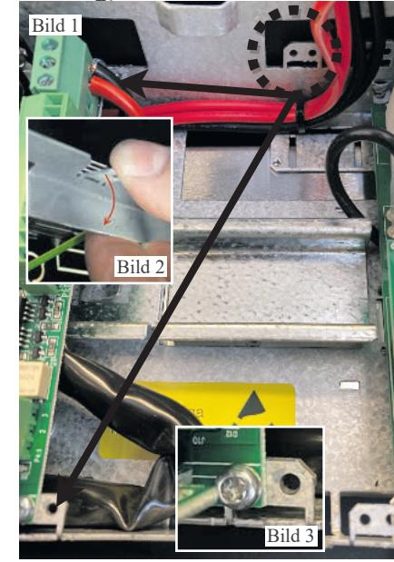
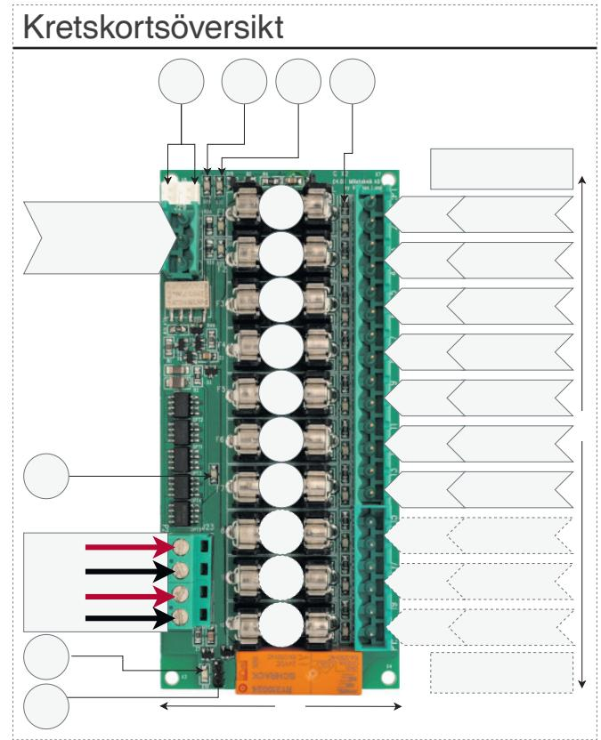

# 10 output module POWER SUPPLIES - MADE IN SWEDEN Om kortet

10 output module (i tabellen nedan 10 OUT) är en avsäkringsmodul med sju prioriterade (=alltid spänning) utgångar och tre oprioriterade utgångar. Kontrollera vid beställning att kortet passar till den batteribackup kortet skall installeras i.

Kortet monteras på plåt i batteriback.

Översikt av inkoppling och igångsättning.

- 1. Sätt fast kortet i batteribackup. Batteribackup skall vara spänningslös.
- 2. Koppla in matning (24 V) från batteribackupens lastutgång till kortets 24V-ingång.
- 3. Koppla in last.
- 4. Koppla till larm (valfritt) och styrning (valfritt).
- 5. Driftsätt batteribackup.

# I vilka batteribackuper passar kortet?

#### 10 output module passar till:

| Variantöversikt  | Kretskort i batteribackup    |
|------------------|------------------------------|
| BB=Batteribackup | PRO1, PRO2, PRO2 v3 och PRO3 |
| BB 24V 5A FLX S  | 1 st 10 OUT                  |
| BB 24V 10A FLX S | 1 st 10 OUT                  |
| BB 24V 5A FLX M  | 2 st 10 OUT                  |
| BB 24V 10A FLX M | 2 st 10 OUT                  |
| BB 24V 15A FLX M | 2 st 10 OUT, (ej i PRO3)     |
| BB 24V 25A FLX M | 2 st 10 OUT (ej i PRO3)      |
| BB 24V 5A FLX L  | 2 st 10 OUT                  |
| BB 24V 10A FLX L | 2 st 10 OUT                  |
| BB 24V 15A FLX L | 2 st 10 OUT (ej i PRO3)      |
| BB 24V 25A FLX L | 2 st 10 OUT (ej i PRO3)      |

## 1.Montering

*• Kontrollera att kortet passar med enheten innan montering sker. Även om kortet passar mekanisk är det inte säkert att det stödjs elektriskt.*

*• Det är installatörens ansvar att kortet är kompatibelt med batteribackup.*

- 1. Börja med att vika ner plåten i batteribackupen som kortet skall i, se bilderna nedan.
- 2. Skruva fast kortet med medföljande skruv, saknas skruv använd plåtskruv (2,9 x 6,5), innan anslutningar görs, (för att undvika kortslutning).

Vik ner "öronen" och skruva fast kortet.

### 2.Inkoppling av matning från batteribackup

Koppla in matning (24 V) från batteribackupens lastutgång till kortets 24V-ingång.

# 3.Inkoppling av last

*• Maxlast är 5A per lastutgång, och kortets totala last får ej överstiga 16 A.*

Anslut lastkablage till P1:1-14 på avsäkrings-modul för prioriterad last. P1:15-20 för oprioriterad last. (Kort levereras med T2A säkringar).

### 4. Inkoppling av larm och last

Larm ansluts på plint FUSE ALARM 1-3 Först därefter kan batteribackup driftsättas. Se manual för batteribackup. Se batteribackupens manual för vilket huvudkort som sitter i batteribackupen.

| PRO1                                                 |   | 10 output module |  |
|------------------------------------------------------|---|------------------|--|
| Larm: J15                                            | e | FUSE ALARM 2-3   |  |
| Last: Lastutgång 1                                   | e | IN 12 V/ 24 V    |  |
| PRO2 & PRO2 V3                                       |   | 10 output module |  |
| J7. Larm: Ansl. larm från ext. säkringskort.   | e | FUSE ALARM 2-3   |  |
| Last: Lastutgång 1                                   | e | IN 12 V/ 24 V    |  |
| PRO3                                                 |   | 10 output module |  |
| Larm J5                                              | e | J11 och J12      |  |
| Last: Lastutgång 1                                   | e | IN 12 V/ 24 V    |  |
| Avsnitt i batteribackup manual: Larm: 3.3, last 3.2. |   |                  |  |

## 5. Driftsätt batteribackup

När kortet är inkopplat, last och larm är anslutna kan batteribackup startas, se batteribackupens manual.

Vänd bladet för kretskortsöversikt och tekniska data.

## 10 output module POWER SUPPLIES - MADE IN SWEDEN

| Kretskortsöversikt, förklaring |          |                                                                                                                                                             |                                                      |  |  |  |
|--------------------------------|----------|-------------------------------------------------------------------------------------------------------------------------------------------------------------|------------------------------------------------------|--|--|--|
| JU1                            |          | Byglad aktiverad alla 10 utgångar. Ej byglad: Prioriterade utgångar är aktiverade vid batteridrift. Kortet levereras utan bygel monterad från fabrik. |                                                      |  |  |  |
| D10                            |          | Lyser grönt när alla utgångar är aktiverade.                                                                                                                |                                                      |  |  |  |
| 24 V in                        |          |                                                                                                                                                             | Inkommande 24 V, använd valfri ingång.               |  |  |  |
| D17                            |          |                                                                                                                                                             | Lyser orange om prioriterade utgångar är aktiverade. |  |  |  |
| F1-F10                         |          | Lastsäkringar                                                                                                                                               |                                                      |  |  |  |
| FUSE 1-3                       |          | Larmutgång, NO, CO, NC.                                                                                                                                     |                                                      |  |  |  |
| J11 och J12                    |          | Intern koppling till huvudkort.                                                                                                                             |                                                      |  |  |  |
| D30                            |          | Röd indikeringsdiod - Lyser med fast rött sken när någon säkring är trasig.                                                                              |                                                      |  |  |  |
| D29                            |          | Grön indikeringsdiod - Lyser med fast grönt sken när alla säkringar är hela.                                                                             |                                                      |  |  |  |
| D1-D10                         | säkring. | Grön indikeringsdiod. Lyser med fast grönt sken vid hel                                                                                                     |                                                      |  |  |  |
|                                |          | Grupp 1                                                                                                                                                     | Last 1; + Last 2; +                               |  |  |  |
|                                |          | Grupp 2                                                                                                                                                     | Last 3; -                                            |  |  |  |
|                                |          |                                                                                                                                                             | Last 4; +                                            |  |  |  |
|                                |          | Grupp 3                                                                                                                                                     | Last 5; -                                            |  |  |  |
| Grupp 1-10                     |          |                                                                                                                                                             | Last 6; +                                            |  |  |  |
|                                |          | Grupp 4                                                                                                                                                     | Last 7; -                                            |  |  |  |
|                                |          |                                                                                                                                                             | Last 8; +                                            |  |  |  |
|                                |          | Grupp 5                                                                                                                                                     | Last 9; -                                            |  |  |  |
|                                |          |                                                                                                                                                             | Last 10; +                                           |  |  |  |
|                                |          | Grupp 6                                                                                                                                                     | Last 11; -                                           |  |  |  |
|                                |          |                                                                                                                                                             | Last 12; +                                           |  |  |  |
|                                |          | Grupp 7                                                                                                                                                     | Last 13; -                                           |  |  |  |
|                                |          |                                                                                                                                                             | Last 14; +                                           |  |  |  |
|                                |          | Grupp 8                                                                                                                                                     | Last 15; -                                           |  |  |  |
|                                |          |                                                                                                                                                             | Last 16; +                                           |  |  |  |
|                                |          | Grupp 9                                                                                                                                                     | Last 17; -                                           |  |  |  |
|                                |          |                                                                                                                                                             | Last 18; +                                           |  |  |  |
|                                |          | Grupp 10                                                                                                                                                    | Last 19; -                                           |  |  |  |
|                                |          |                                                                                                                                                             | Last 20; +                                           |  |  |  |

| Tekniska data              |                                                                                                                                                                                                                                                                                                             |  |  |  |
|----------------------------|-------------------------------------------------------------------------------------------------------------------------------------------------------------------------------------------------------------------------------------------------------------------------------------------------------------|--|--|--|
| Artikelbenämning           | 10 output module                                                                                                                                                                                                                                                                                            |  |  |  |
| Artikelnummer              | A-FU122410OP01IQ                                                                                                                                                                                                                                                                                            |  |  |  |
| Mått                       | 120 x 55 mm                                                                                                                                                                                                                                                                                                 |  |  |  |
| Ingångar                   | Två ingångar. (För alternativ strömmatning vid byte av näraggregat. För att inte bryta lastspänning.) En plint kan användas som överbygling till nästa tillvalskort, (endast om batteribackupen har plats för två kort).                                                                           |  |  |  |
| Utspänning                 | 12 V eller 24 V                                                                                                                                                                                                                                                                                             |  |  |  |
| Utgångar                   | Sju prioriterade lastutgångar och tre oprioriterade. Grupp 1-7 är prioriterade lastutgångar. (= alltid spänning). Grupp 8-10 är oprioriterade lastutgångar. Oprioriterade utgångar släpper lasten vid larm.                                                                                        |  |  |  |
| Avsäkring:                 | Lastutgång: + avsäkrad.                                                                                                                                                                                                                                                                                     |  |  |  |
| Maxlast                    | Maxlast: 10 A per utgång och totalt 16 A.                                                                                                                                                                                                                                                                   |  |  |  |
| Larmutgångar               | Larmutgångar: Summalarm vid säkringsfel. Larm på potentialfri reläkontakt.                                                                                                                                                                                                                               |  |  |  |
| Fellarm:                   | Utlöst lastsäkring, potentialfri växling. Slutning CO/ NO. PRO1: Via larmplint J13 (NC-CO). PRO2: Via larmplint J13 (NC-CO). PRO2 v3: Via J11 och J12 till moderkort vidare till det överordnade systemet. PRO 3: Via J11 och J12 till moderkort vidare till det överordnade systemet. |  |  |  |
| Indikering:                | Driftsindikering: en indikeringsdiod per lastutgång+/-. Fast grönt sken= normaldrift, släckt = trasig säkring.                                                                                                                                                                                           |  |  |  |
| Övrig information          |                                                                                                                                                                                                                                                                                                             |  |  |  |
| Tillbehör                  | S2 adapter: Adapter för montering av L-modul på DIN- skena.                                                                                                                                                                                                                                              |  |  |  |
| Garantitid:                | 2 år                                                                                                                                                                                                                                                                                                        |  |  |  |
| Tillverkningsland: Sverige |                                                                                                                                                                                                                                                                                                             |  |  |  |
| Kontakt                    | Milleteknik Ögärdesvägen 8B, 433 30 Partille www.milleteknik.se 031-340 02 30                                                                                                                                                                                                                      |  |  |  |
|                            |                                                                                                                                                                                                                                                                                                             |  |  |  |

