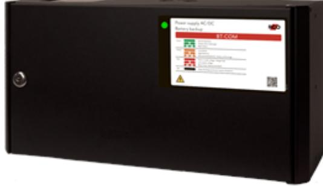

## BT-10 FLX SMALL COM

Artikelnummer: 28160122, E-nummer: 5257455

BT-10 FLX SMALL COM ur BT-BOX FLX-serien som används främst i säkerhetssystem där en SSF 1014 godkänd batteribackup krävs eller när kunden vill ha de bästa funktionerna i sina säkerhetsanläggningar. Denna batteribackup är godkänd enligt SSF1014, larmklass 3.

- 2 avsäkrade utgångar
- Larmklass 3

- Kommunicerar via buss emot UC-50
Systemet är bland många andra funktioner utrustat med larm vid nätavbrott, låg batterispänning, frånkopplat batteri, cellkortslutning, åldrat batteri, utlöst lastsäkring, över/underspänning, låg systemspänning, sabotage.

BT-COM-serien kan kompletteras med en batterilåda. Batterilådan är ansluten via en snabbanslutningskabel. Batterilådan har plats för 2x14 Ah-batterier per batterilåda, godkänd för 70Ah (via 2x batteriboxar).

För larmklass LK1-2 = 1,1A

För larmklass LK3 = 0,45A

2 avsäkrade utgångar. Vägg/19" montage. Batterityper (2x): 14Ah, **ingår ej.**

**Med tillval,** 2x (max 2) BT-Box FLX S erbjuds en medellast om; LK1-2=5,5A, LK3=2,3A.

| Utförande:                        | Svart                                              |
|-----------------------------------|----------------------------------------------------|
| Utgångar:                         | 2 st                                               |
| Miljöklass:                       | Klass 1                                            |
| Kapslingsklassning:               | IP32                                               |
| Temperaturområde:                 | 5 till 40°C (optimalt 15 till 25 °C)               |
| Montering:                        | Vägg eller hylla                                   |
| Mått (BxHxD):                     | 215x430x220mm                                      |
| Vikt:                             | 7kg                                                |
| Antal kabelgenomföringar:         | 9 st                                               |
| Inbygd fläkt:                     | Ja                                                 |
| Matningsspänning:                 | 110V-264VAC/47-63Hz                                |
| Max. utgångsström:                | 10A                                                |
| Typ av försörjningsspänning:      | DC                                                 |
| Första utgångsspänning (min-max): | 21-27,3                                            |
| Matningsspänning:                 | 27,3VDC                                            |
| Möjlig batteri kombination:       | 2x 7,2Ah / 2x 14Ah                                 |
| Batterityp:                       | 12V AGM-batteri                                    |
| Testad och godkänd med:           | 10+ Design Life 7,2Ah and 14Ah batteries (up to 10 |
| SBSC Certifierad:                 | SSF1014, Larmklass 3                               |
| Benämning producent (SBSC):       | NOVA 27 100-XS2_PRO1                               |