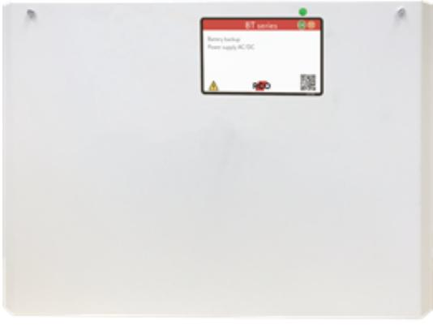

## BT-5 MEDIUM

Artikelnummer: 28160113, E-nummer: 5257460

BT-5 Medium används främst i säkerhetssystem där en enkel och pålitlig strömförsörjning med batteribackupfunktion behövs. BT-5 Medium erbjuder IQ-Charge vilket innebär att batterierna aldrig laddas med mer än 1A. Detta förhindrar batterierna från överladdning och förlänger deras liv avsevärt.

- •1 avsäkrad utgång
- •IQ-Charge

- ••Snabbanslutningskabel
En avsäkrad utgång, stabiliserad spänning, skydd mot överlast, överspänning, kortslutning och djupurladdning.

BT-5 Medium kan kompletteras med en batterilåda, batterilådan placeras under batteribackupen och ansluts via en snabbanslutningskabel.

Batterilådan har plats för 4x 14Ah-batterier per batterilåda.

Batterityper (2x): 7,2Ah alt. 14Ah, **Ingår ej.**

| Utförande:                        | VIt                                           |
|-----------------------------------|-----------------------------------------------|
| Utgångar:                         | 1 st                                          |
| Miljöklass:                       | Klass 1                                       |
| Kapslingsklassning:               | IP20                                          |
| Temperaturområde:                 | 5-40°C                                        |
| Montering:                        | Vägg                                          |
| Mått (BxHxD):                     | 242x350x150mm                                 |
| Vikt:                             | 4kg                                           |
| Antal kabelgenomföringar:         | 3                                             |
| Inbygd fläkt:                     | Ja                                            |
| Matningsspänning:                 | 110V-264VAC/47-63Hz                           |
| Max. utgångsström:                | 5                                             |
| Typ av försörjningsspänning:      | DC                                            |
| Första utgångsspänning (min-max): | 21-27,3                                       |
| Matningsspänning:                 | 27,3VDC                                       |
| Möjlig batteri kombination:       | 2x 7,2Ah or 2x 14Ah                           |
| Batterityp:                       | 12V AGM                                       |
| Testad och godkänd med:           | UPLUS 10+ Design Life 7,2Ah or 14Ah batteries |
| Benämning producent (SBSC):       | ECO 24V 5A M                                  |