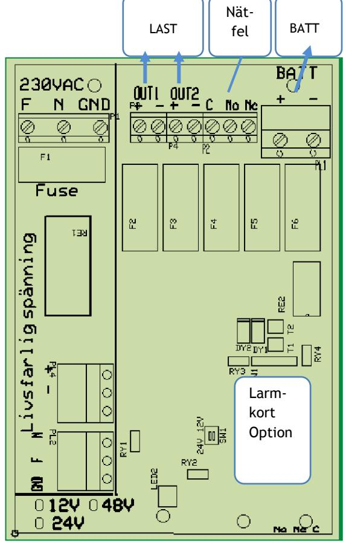
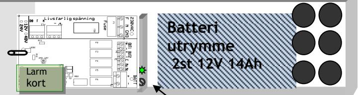
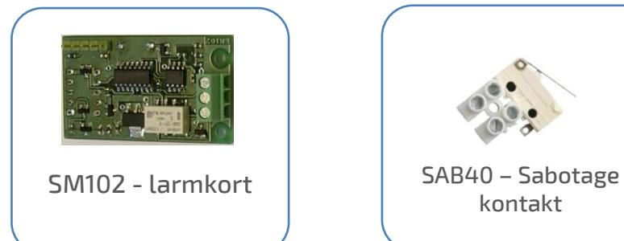
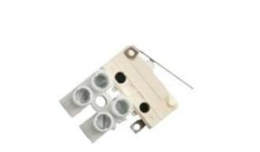
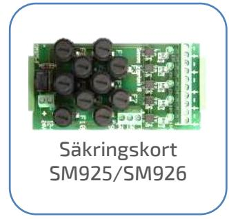
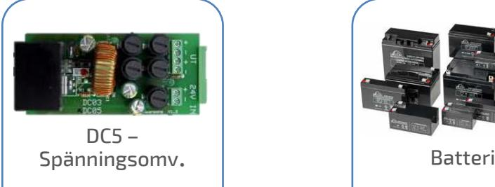
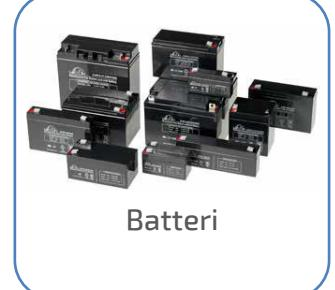

 **SM40** 

Skydd: Aggregatet är skyddad mot överbelastning och kortslutning. Inbyggt skydd mot djupurladdning av batterierna. Nät, last och batteri skyddas av 2-poliga säkringar. Indikeringar och larm: Nätspänning indikeras med grön lysdiod på fronten. Alla SM3100 är försedda med larmrelä för nätavbrott.

#### EXTRAUTRUSTNING

- Larmkort: Kan förses med larmkort SM101/SM102 (gäller ej 48V mod.)
- Säkringskort: SM926 ger 5st 2-poligt avsäkrade utgångar med indikering och summalarms-reläutgång med växlande kontakter. "Klickas" fast på DIN-skena.

Sabotageskydd: Monteras i förborrade hål.

#### BESKRIVNING

En riktig 19" strömförsörjning som är helt färdig med rackvinklar och som har plats för batterier. Väldigt enkel inkoppling och snygg design. Passar i standard 19" stativ med korta fästjärn. Lämplig för drift av alla typer av svagströmsanläggningar som elektronikutrustningar, telecom, larm, styr, och passagesystem.

Utförande: Aggregatet är utfört i kiselgrå självventilerad plåtkapsling och avsett för 19" montage. SM3100 är primärswitchad och har mycket lågt rippel och noggrann utspänning. Det finns 6st genomförningar bakåt. Plats finns för max 2st 12V 14Ah underhållsfria blybatterier i aggregatet. Med batterienhet kan man få ytterligare batteri- kapacitet – upp till 24V 28Ah

| TEKNISKA DATA    |                |
|------------------|----------------|
| Inspänning       | 230VAC +/- 15% |
|                  | 1 fas 50-60Hz  |
| Reglering        | max 0,6 %      |
| Rippelspänn.     | max 0,1 % av   |
|                  | Utspänningen   |
| Egenförbrukning  |                |
| vid batteridrift | 20mA           |
| Temp. omr.       | -15 – 40 C     |
|                  |                |

CE-märkt - EN61000-6-3:2001, EN61000-6-2:2005 

| E: nummer | Typ           | Utspänning            | Utström          | Batteriplats (max) | Verkningsgrad | H x B x D (mm)     |
|-----------|---------------|-----------------------|------------------|-----------------------|---------------|-----------------------|
| 52 471 51 | SM3100/ 12-5  | 13,6V                 | 5A               | 2 x 14Ah              | 0,86          | 132 (3HE) x 480 x 200 |
| 52 471 52 | SM3100/ 12-10 | 13,6V                 | 10A              | 2 x 14Ah              | 0,86          | 132 (3HE) x 480 x 200 |
| 52 471 56 | SM3100/ 24-5  | 27,3V                 | 5A               | 2 x 14Ah              | 0,84          | 132 (3HE) x 480 x 200 |
| 52 471 57 | SM3100/ 24-10 | 27,3V                 | 10A              | 2 x 14Ah              | 0,88          | 132 (3HE) x 480 x 200 |
| 52 471 58 | SM3100/ 48-5  | 54,6V                 | 5A               | 4 x 2,3Ah             | 0,88          | 132 (3HE) x 480 x 200 |
| 52 471 59 | SM3100/ 48-10 | 54,6V                 | 10A              | 4 x 2,3Ah             | 0,87          | 132 (3HE) x 480 x 200 |
| 52 471 60 | SBX193        | Batterilåda 19"       |                  | 4 x 14Ah              |               | 132 (3HE) x 480 x 200 |
| 52 569 91 | Sab.40        | Sabotagekontakt       |                  |                       |               |                       |
| 52 569 93 | SM102         | Larmkort. låg batt sp | Laddspänningsfel | Batterikretsfel       |               |                       |

Postadress/Postal address **Swansons Telemekanik AB** Hålstensvägen 4 SE-446 37 Älvängen

Telefon nr/Telephone no +46(0)303-746 320

Hemsida/Webb www.swtm.se e-post info@swtm.se

VAT.NO SE556289017701

## SÄKERHET  **SM40**

Endast auktoriserad och erfaren personal inom AC och DC får använda, arbeta,  **Strömförsörjning med plats för batteri**

> serva/underhålla, installera denna enhet. Endast isolerade verktyg får användas i enheten.

Observera att farliga spänningar och strömmar förekommer i apparaten både när interna säkringarna är av eller på.

Denna instruktion skall läsas igenom grundligt och förstås av all handhavande personal. Vid minsta tveksamhet om systemets uppbyggnad, funktion, komponenter samt säkerhet skall leverantören kontaktas.

Kontrollera att kretskort sitter fast och inte är transportskadade.

Om batterier används är dessa alltid elektrokemiskt aktiva.

Kortslut inte batteripolerna.

## INKOPPLING

 

- Montera aggregatet fritt.
- Anslut först 230V AC.
- Lysdiod för nätspänning tänds. Kontrollera att utspänningen är riktig.
- Vid behov justera utspänningen med V2.
- Om lysdiod för nätindikering ej tänds kontrollera inspänning och ingångssäkringarna.
- Anslut batterierna och därefter lasten.
- Löser utgångssäkringarna, kontrollera inkoppling och inkopplade apparater.

### TEKNISKA DATA

Inspänning 88-264VAC

Utspänning 12V 13,7V +/- 0,05V Utspänning 24V 27,3V +/- 0,1V Temp. omr. -15 – 40 C

1 fas 50-60Hz

Postadress/Postal address **Swansons Telemekanik AB** Hålstensvägen 4 SE-446 37 Älvängen

Telefon nr/Telephone no +46(0)303-746 320

Hemsida/Webb www.swtm.se e-post info@swtm.se

VAT.NO SE556289017701

# **Spänningsjustering**

| Modell       | Säkring S1, S2 | Säkring S3, S4 | Säkring S5, S6 |
|--------------|-------------------|-------------------|-------------------|
|              |                   |                   |                   |
| SM3100/12-3  | 1AT Cer           | 3,15AS            | 4AS               |
| SM3100/12-5  | 2AT Cer           | 5AS               | 6,3AS             |
| SM3100/12-10 | 2AT Cer           | 10AS              | 15AS              |
|              |                   |                   |                   |
| SM3100/24-3  | 2AT Cer           | 3,15AS            | 4AS               |
| SM3100/24-5  | 2AT Cer           | 5AS               | 6,3AS             |
| SM3100/24-10 | 3AT Cer           | 10AS              | 15AS              |
|              |                   |                   |                   |
| SM3100/48-5  | 6,3AT Cer         | 5AS               | 15AS              |
| SM3100/48-10 | 6,3AT Cer         | 10AS              | 15AS              |

#### Optional Accessories  **Strömförsörjning med plats för batteri**

 **SM40** 

kontakt

Postadress/Postal address **Swansons Telemekanik AB** Hålstensvägen 4 SE-446 37 Älvängen

Telefon nr/Telephone no +46(0)303-746 320 Hemsida/Webb e-post

www.swtm.se info@swtm.se

VAT.NO SE556289017701