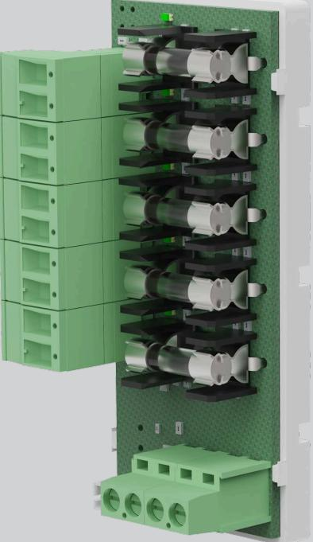
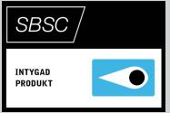

# ASSA ABLOY ARX Power Fuse 05

ASSA ABLOY ARX Power Fuse 05 är ett avsäkringskort med 5st 2A avsäkrade utgångar.

Kortet fästs enkelt med snäppfästen i de färdiga slitsarna i ARX Power-kapslingen och i strömförsörjning PS eller PSCserien. På kortet finns tydliga indikeringsdioder som visar status på säkring.

Det finns två ingångar vilket ger möjlighet att koppla alternativ strömmatning vid byte av nätaggregat utan att bryta lastspänning.

Enheten kan avge larm för utlöst lastsäkring som kopplas till strömförsörjning. Medföljande kabel med plintar är förberedda för snabbt och enkelt montage i ARX Power serien.

# ASSA ABLOY ARX Power Fuse 05

### Avsäkringskort till ARX Power- och PS, PSC-serien

### **Data**

- Ingångar 2 (för alternativ strömmatning eller som överbygling till ev. nästa tillvalskort)
- Utgångar
- Matning
- Maxlast
- Säkring utgång
- Indikeringar
- Larmutgångar Summalarm säkringsfel –potentialfritt relä
- Miljöklass 1

#### **Certifikat**

- Certifierad för larmklass 1/2 tillsammans med ARX Power 9101S, ARX Power
LK 2, Security Grade 3, MK 1 Environment Class 1. EN50131-1-A1

- Certifierad för larmklass 3/4 tillsammans med ARX Power 9008 LK 3/4 Security Grade 4, MK 1 Environment Class 1. EN50131-1-A1
- SBSC intyg 16-130

#### **Mått och vikt**

Höjd 85 mm Bredd 37 mm Vikt 0,2kg

**Artikelnummer**

- ARX Power Fuse 05 S5529X00F160 E58 014 36
ASSA ABLOY Opening Solutions Sweden P.O. Box 371 SE-631 05 Eskilstuna Sweden Phone +46 (0)16 17 70 00 Fax +46 (0)16 17 70 49 Customer support:

Phone intl. +46 (0)16 17 71 00 Phone nat. 0771-640 640 Fax +46 (0)16 17 73 72 e-mail: helpdesk.se.openingsolutions@assaabloy.com www.assaabloyopeningsolutions.se

