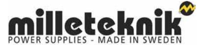

According to the EMC Directive 2014/30/EU & the Low Voltage Directive LVD 2014/35/EU

Type of equipment: DC UPS / Power Supply with batteries.

# Brand name or trade mark: ECO

## Type designation(s)/Model no(s):

ECO 12V 5A S

ECO 24V 1A S

### Manufacturer's name, address, telephone & fax no:

Milleteknik AB Ögärdesvägen 8 B SE-433 30 PARTILLE, SWEDEN Phone: +46-31-34 00 230, Fax: --Manufacturer's authorized representative within EU (for manufacturers outside EU): --

### The following standards and/or technications, which comply with good engineering practice in safety

matters in force within the EEA, have been applied: Standard Test report/technical construction file/normative

F

#### document.

Immunity: EN50130-4:2011 +/A1:2014

Name and Ref No. when issued

REACH Regulation: Directive 1907/2006

WEEE Regulation: Directive 20021961E

RoHS Regulation: Directive 2015/863

Emission: EN 61000-6-3:2007, A1:2011

Additional information: The product is CE-marked in 2021.

In addition, the products are tested for the following standard:

As manufacturer/ the manufacturer's authorized representative established within EEA, we declare under our sole responsibility that the equipment follows the provisions of the Directives stated above.

Date and place of issue Signature of authorized person: Partille

Name & Position

Elias Bylund, Product Specialist

Milleteknik AB Ögärdesvägen 8 B 433 30

031-340 02 30 info@milleteknik.se www.milleteknik.se

2021-6-01