USER MANUAL EN Edition: 1 from 24.11.2020 Supersedes the edition:

# **Power supplies HPSB series**

**Buffer switched mode power supply.**

## **Features:**

- supply voltage ~200 240 V
- DC 13,8 V; 27,6 V or 54 V uninterruptible power supply
- available versions with space for **7 Ah – 65 Ah** batteries
- available versions with current efficiencies **13,8 V: 2A/3A/5A/7A/10A/15A/20A 27,6 V: 2A/3A/5A/7A/10A 54 V: 3A/5A**
- high efficiency (up to 90%)
- battery charging and maintenance control
- battery charging current jumper selectable (models with charging current adjustment)
- LED optical indication
- deep discharge battery protection (UVP)
- battery output protection against short circuit and reverse connection
- protections:
	- o SCP short-circuit protection
	- o OLP overload protection
	- o over voltage protection
	- o surge protection
	- o against sabotage: unwanted enclosure opening
- warranty 2 years from the production date

# **TABLE OF CONTENTS:**

## **1. Technical description.**

- **1.1. General description**
- **1.2. Block diagram**
- **1.3. Description of components and connectors**
- **1.4. Specifications**
- **2. Installation.** 
	- **2.1. Requirements**

**2.2. Installation procedure** 

- **3. Operating status indication.** 
	- **3.1. Optical indication**
- **4. Maintenance**

## **1. Technical description.**

## **1.1. General description.**

Switch mode buffer power supply units HPSB are intended for continuous power supply to devices that require stabilised voltage of 12, 24 or 48 V DC (±15%).

| PSU's name    | Output voltage | Output current max. | Charging current |
|---------------|----------------|---------------------|------------------|
| HPSB-12V2A-B  | 13,8 V         | 2,5 A               | 0,5 A            |
| HPSB-12V3A-B  | 13,8 V         | 3,5 A               | 0,5 A            |
| HPSB-12V3A-C  | 13,8 V         | 3,5 A               | 0,5 A            |
| HPSB-12V5A-C  | 13,8 V         | 5,5 A               | 0,5 / 1 A        |
| HPSB-12V7A-C  | 13,8 V         | 7 A                 | 1 / 2 A          |
| HPSB-12V10A-C | 13,8 V         | 10 A                | 1 / 4 A          |
| HPSB-12V15A-D | 13,8 V         | 15 A                | 2 / 4 A          |
| HPSB-12V20A-E | 13,8 V         | 20 A                | 2 / 4 / 8 A      |
| HPSB-24V2A-B  | 27,6 V         | 2,2 A               | 0,2 / 0,5 A      |
| HPSB-24V3A-B  | 27,6 V         | 3,5 A               | 0,5 / 1 A        |
| HPSB-24V5A-C  | 27,6 V         | 5 A                 | 0,5 / 2 A        |
| HPSB-24V7A-C  | 27,6 V         | 7 A                 | 1 / 2 A          |
| HPSB-24V10A-D | 27,6 V         | 10 A                | 1 / 2 / 4 A      |
| HPSB-48V3A-B  | 54 V           | 3 A                 | 0,5 / 1 A        |
| HPSB-48V5A-C  | 54 V           | 5 A                 | 0,5 / 1 / 2 A    |

Displaying parameters of the power supply:

**Total current of the receivers + battery charging current mustn't cross maximum current of power supply.**

In case of power failure, a battery back-up is activated immediately. The PSU is constructed based on the switch mode PSU, with high energy efficiency. The PSU is housed in a metal enclosure (colour RAL 9003) which can accommodate a battery (batteries). A micro switch indicates door opening (front cover).

- **1.2. Block diagram (rys.1).**
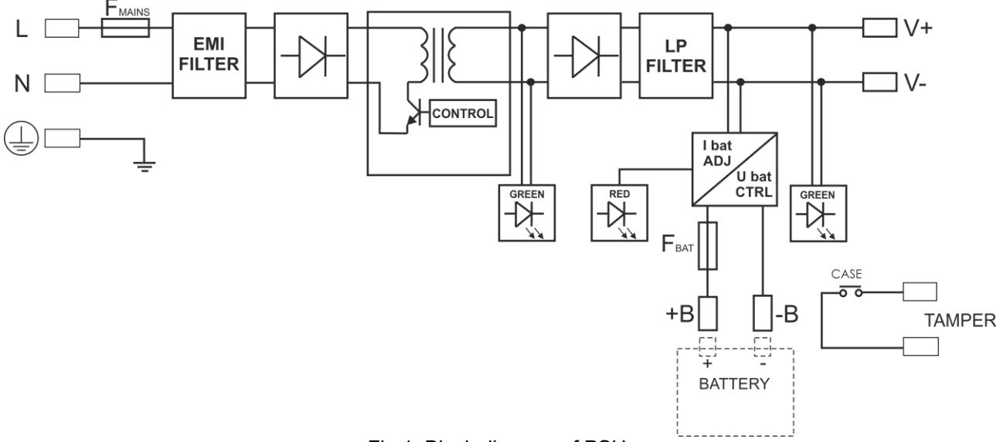

Fig.1. Block diagram of PSU.

# **1.3. Description of components and connectors.**

| Table 1. Description of PSU components and connectors (see Fig. 2a, 2b, 2c, 2d, 2e). |  |
|--------------------------------------------------------------------------------------|--|
|                                                                                      |  |

| Part no. | Description                                                                                                                                                                                                                                                                                                                                                                        |  |  |  |  |
|----------|------------------------------------------------------------------------------------------------------------------------------------------------------------------------------------------------------------------------------------------------------------------------------------------------------------------------------------------------------------------------------------|--|--|--|--|
| [1]      | LED for DC output voltage                                                                                                                                                                                                                                                                                                                                                          |  |  |  |  |
| [2]      | The potentiometer for output voltage adjustment                                                                                                                                                                                                                                                                                                                                    |  |  |  |  |
| [3]      | Connector to external LED indicators                                                                                                                                                                                                                                                                                                                                               |  |  |  |  |
| [4]      | The output of the PSU (V+, V-)                                                                                                                                                                                                                                                                                                                                                     |  |  |  |  |
| [5]      | Battery terminals (B+, B-)                                                                                                                                                                                                                                                                                                                                                         |  |  |  |  |
| [6]      | L-N power supply connector 230V AC, – protection connector                                                                                                                                                                                                                                                                                                                      |  |  |  |  |
| [7]      | Selection jumper for charging current: Power supply units: 12V5A; 12V7A; 12V10A; 12V15A; 24V2A; 24V3A; 24V5A; 24V7A; 48V3A:  IBAT = , IBAT = I1  IBAT = , IBAT = I2 Power supply units: 12V20A; 24V10A; 48V5A:  I1= I2= I3= IBAT = I1  I1= I2= I3= IBAT = I2  I1= I2= I3= IBAT = I3 |  |  |  |  |
| [8]      | Battery fuse                                                                                                                                                                                                                                                                                                                                                                       |  |  |  |  |

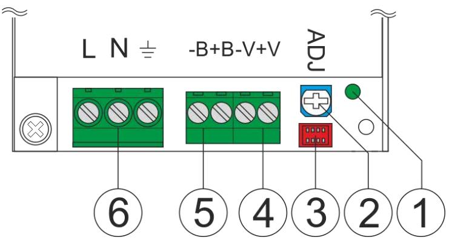

Fig. 2a. View of power supply module (models 12V2A, 12V3A)

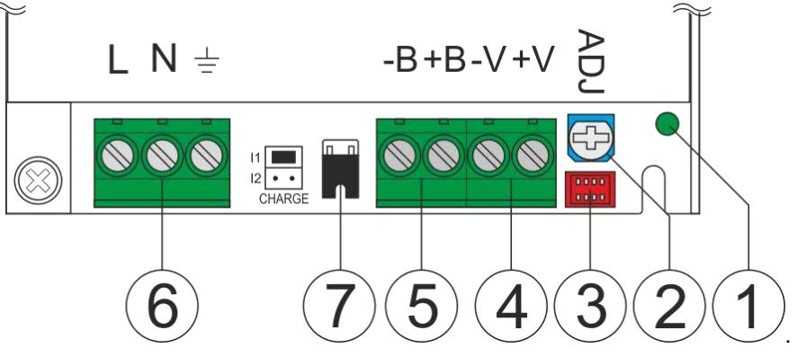

Fig. 2b. View of power supply module (models 12V5A, 12V7A, 24V2A, 24V3A)

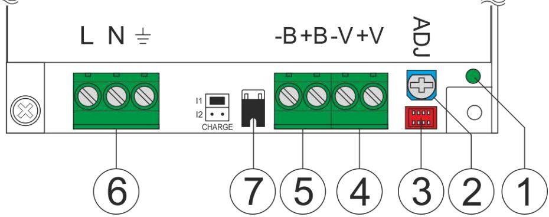

Fig. 2c. View of power supply module (models 12V10A, 24V5A, 48V3A)

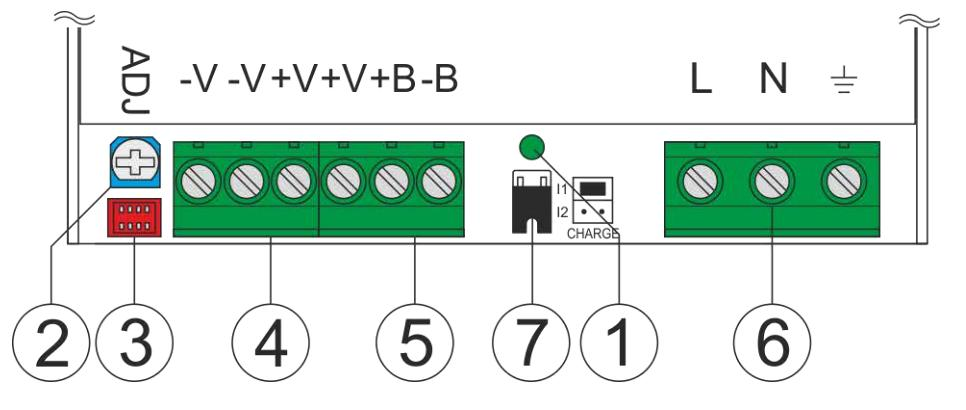

Fig. 2d. View of power supply module (models 12V15A, 24V7A)

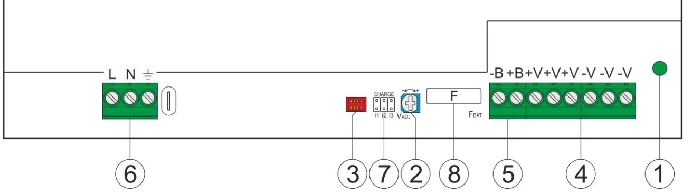

Fig. 2e. View of power supply module (models 12V20A, 24V10A, 48V5A)

| Table 2. View of PSU (see Fig. 3). |  |  |  |  |
|------------------------------------|--|--|--|--|
|                                    |  |  |  |  |

| Element no. | Description                                         |
|-------------|-----------------------------------------------------|
| [1]         | PSU module                                          |
| [2]         | Cable grommet                                       |
| [3]         | TAMPER; microswitch of antisabotage protection (NC) |
| [4]         | Battery connectors: +BAT = red, - BAT = black       |

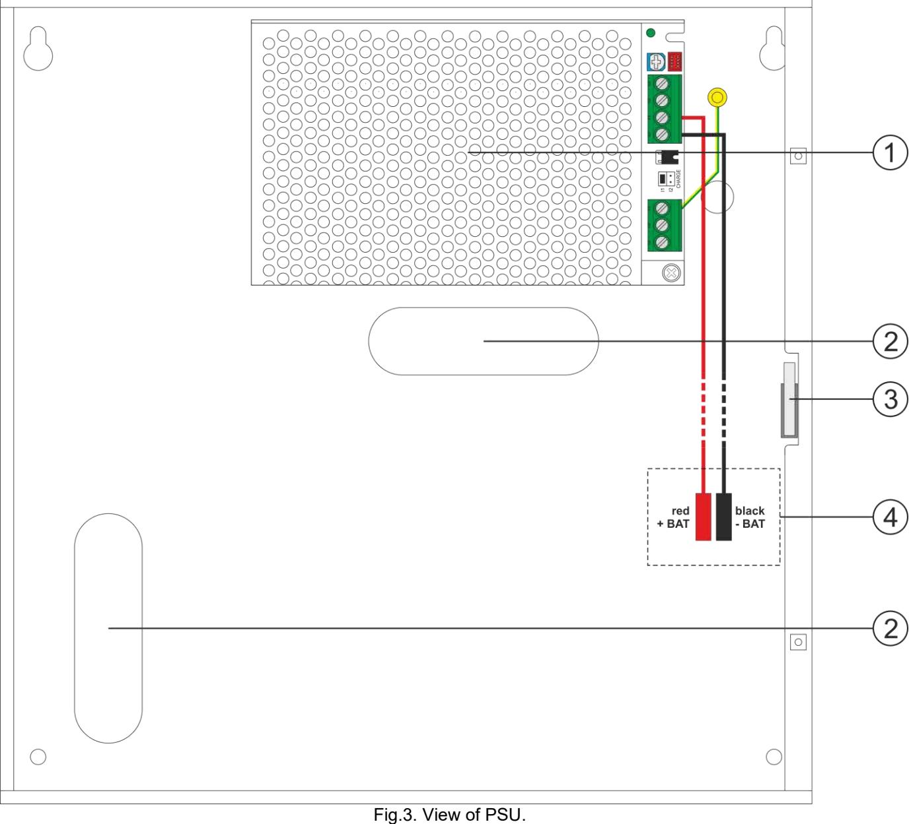

- **electrical parameters (tab.3)**
- **mechanical parameters (tab.4)**
- **operation safety (tab.5)**
- **operating parameters (tab.6)**

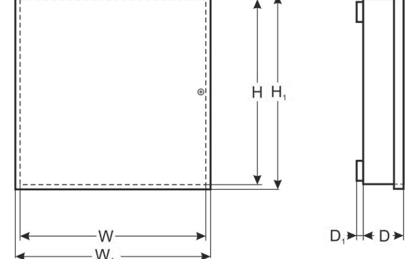

| Models                                                 | HPSB-12V2A-B                                                                                        | HPSB-12V3A-B                                             | HPSB-12V3A-C      | HPSB-12V5A-C                                | HPSB-12V7A-C                                                           | HPSB-12V10A-C | HPSB-12V15A-D                   | HPSB-12V20A-E |
|--------------------------------------------------------|-----------------------------------------------------------------------------------------------------|----------------------------------------------------------|-------------------|---------------------------------------------|------------------------------------------------------------------------|---------------|---------------------------------|---------------|
| PSU type                                               | A (EPS - External Power Source), II environmental class                                          |                                                          |                   |                                             |                                                                        |               |                                 |               |
| Supply voltage                                         | ~ 200 - 240 V                                                                                 |                                                          |                   |                                             |                                                                        |               |                                 |               |
| Current consumption                                    | 0,4 A                                                                                            | 0,5 A                                                 | 0,5 A          | 0,8 A                                    | 1 A                                                                    | 1,3 A         | 2 A                             | 1,5 A         |
| Power frequency                                        |                                                                                                     |                                                          |                   |                                             | 50/60 Hz                                                               |               |                                 |               |
| Inrush current                                         |                                                                                                     |                                                          | 40 A              |                                             |                                                                        | 50 A          | 60 A                            |               |
| PSU power                                              | 35 W                                                                                                | 48 W                                                     | 48 W              | 76 W                                        | 97 W                                                                | 138 W         | 207 W                           | 276 W         |
| Output current max.                                    | 2,5 A                                                                                               | 3,5 A                                                    | 3,5 A             | 5,5 A                                       | 7 A                                                                 | 10 A          | 15 A                            | 20 A          |
| Efficiency                                             | 87%                                                                                                 | 87%                                                      | 87%               | 87%                                         | 87%                                                                    | 87%           | 87%                             | 86%           |
| Output voltage                                         |                                                                                                     |                                                          |                   | 11 - 13,8 V –                            | buffer operation                                                       |               |                                 |               |
|                                                        |                                                                                                     |                                                          |                   | 10 - 13,8 V –                            | battery-assisted operation                                             |               |                                 |               |
| Adjustment range UAUX                                  |                                                                                                     |                                                          |                   | 13,5                                        | – 14,4 V                                                         |               |                                 |               |
| Ripple voltage (max.)                                  |                                                                                                     |                                                          |                   | 100 mV p-p                                  |                                                                        |               | 250 mV p-p                      | 150 mV p-p    |
| Current consumption by                                 |                                                                                                     |                                                          |                   |                                             |                                                                        |               |                                 |               |
| the PSU systems during                                 | 40 mA                                                                                            | 40 mA                                                 | 40 mA          | 15 mA                                    | 15 mA                                                               | 30 mA      | 30 mA                        | 30 mA      |
| battery-assisted operation                             |                                                                                                     |                                                          |                   |                                             |                                                                        |               |                                 |               |
| Fitting battery                                        | 7Ah                                                                                                 | 7Ah                                                      | 17Ah              | 17Ah                                        | 17Ah                                                                   | 17Ah          | 40Ah                            | 65Ah          |
| Jumper selectable battery                              | 0,5 A                                                                                               | 0,5 A                                                    | 0,5 A             | I1: 0,5 A                                   | I1: 1 A                                                                | I1: 1 A       | I1: 2 A                         | I1: 2 A       |
| charging current                                       |                                                                                                     |                                                          |                   | I2: 1 A                                  | I2: 2 A                                                                | I2: 4 A       | I2: 4 A                         | I2: 4 A       |
|                                                        |                                                                                                     |                                                          |                   |                                             |                                                                        |               |                                 | I3: 8 A       |
| Net / gross weight                                     | 1/1,1 kg                                                                                            | 1,3/1,4 kg                                               | 1,7/1,8 kg        | 1,8/1,9 kg                                  | 2,3/2,4 kg                                                             | 2,6/2,7 kg    | 5/5,6 kg                        | 7/7,8 kg      |
| Battery circuit protection SCP and reverse polarity |                                                                                                     |                                                          |                   |                                             |                                                                        |               |                                 |               |
| connection                                             | - polymer fuse                                                                                   | - polymer fuse                                        | - polymer fuse | -                                           | FBAT fuse (in case of a failure, fuse-element replacement required) |               |                                 |               |
|                                                        | (returnable)                                                                                        | (returnable)                                             | (returnable)      |                                             |                                                                        |               |                                 |               |
| Overload protection OLP                                |                                                                                                     |                                                          |                   |                                             |                                                                        |               |                                 |               |
|                                                        |                                                                                                     |                                                          |                   | 105-150% of the PSU power, automatic return |                                                                        |               |                                 |               |
| Overvoltage protection OVP                          | >37V activation of protection requires disconnection of main supply voltage for approx. 1 minute |                                                          |                   |                                             |                                                                        |               |                                 |               |
| Deep discharge battery                                 |                                                                                                     |                                                          |                   |                                             |                                                                        |               |                                 |               |
| protection UVP                                         |                                                                                                     | U<9,5 V (± 5%) – disconnection of battery terminal |                   |                                             |                                                                        |               |                                 |               |
| Optical indication                                     |                                                                                                     | - LEDs on PCB of power supply unit                    |                   |                                             |                                                                        |               |                                 |               |
|                                                        | - LED indicators on power supply's cover (see section 3.1)                                       |                                                          |                   |                                             |                                                                        |               |                                 |               |
| Tamper protection:                                     |                                                                                                     |                                                          |                   |                                             |                                                                        |               |                                 |               |
| - TAMPER indicates                                  | - microswitch, NC contacts (enclosure closed),                                                   |                                                          |                   |                                             |                                                                        |               |                                 |               |
| enclosure opening                                      | 0,5 A@50 V DC (max.)                                                                                |                                                          |                   |                                             |                                                                        |               |                                 |               |
| Fuses: - FBAT                                       | -                                                                                                   | -                                                        | -                 | T 6,3A/250V                                 | F 8A/250V                                                              | T 10A/250V    | T15A                            | T20A          |
| Terminals:                                             |                                                                                                     |                                                          |                   |                                             |                                                                        |               |                                 |               |
| Mains supply:                                          | 2,5 mm2 0,5 – (AWG 26 – 12)                                                                |                                                          |                   |                                             |                                                                        |               |                                 |               |
| Outputs:                                               |                                                                                                     |                                                          |                   |                                             |                                                                        |               |                                 |               |
| Battery outputs:                                       |                                                                                                     | Battery wires 6,3F –                                     |                   | 45cm, angle muffs ML062                     |                                                                        |               | Battery wires Ф6 (M6-2,5), 45cm |               |
| TAMPER:                                                |                                                                                                     | 40cm wires                                               |                   |                                             |                                                                        |               |                                 |               |
| Notes                                                  | convectional cooling Forced cooling                                                              |                                                          |                   |                                             |                                                                        |               |                                 |               |

| Models                                   | HPSB-24V2A-B                                                                                                          | HPSB-24V3A-B | HPSB-24V5A-C | HPSB-24V7A-C   | HPSB-24V10A-D | HPSB-48V3A-B         | HPSB-48V5A-C   |
|------------------------------------------|-----------------------------------------------------------------------------------------------------------------------|--------------|--------------|----------------|---------------|----------------------|----------------|
| PSU type                                 | A (EPS - External Power Source), II environmental class                                                            |              |              |                |               |                      |                |
| Supply voltage                           | ~ 200-240 V                                                                                                           |              |              |                |               |                      |                |
| Current consumption                      | 0,8 A                                                                                                                 | 1 A          | 1,3 A        | 2 A            | 1,5 A         | 1,5 A                | 1,5 A          |
| Power frequency                          |                                                                                                                       | 50/60 Hz     |              |                |               |                      |                |
| Inrush current                           |                                                                                                                       | 40 A         | 50 A         | 60 A           |               | 50 A              | 60 A        |
| PSU power                                | 61 W                                                                                                                  | 97 W         | 138 W        | 194 W          | 276 W         | 162 W                | 270 W          |
| Output current max.                      | 2,2 A                                                                                                                 | 3,5 A        | 5 A          | 7 A            | 10 A          | 3 A                  | 5 A            |
| Efficiency                               | 90%                                                                                                                   | 87%          | 90%          | 88%            | 87%           | 90%                  | 87%            |
| Output voltage                           | 22 – 27,6 V – buffer operation 44 - 54 V – buffer operation                                            |              |              |                |               |                      |                |
|                                          | 20 - 27,6 V – battery-assisted operation 40 - 54 V – battery-assisted operation                        |              |              |                |               |                      |                |
| Adjustment range UAUX                    | 27 – 28,8 V 53 – 56 V                                                                                        |              |              |                |               |                      |                |
| Ripple voltage (max.)                    | 100 mV p-p                                                                                                            |              |              | 150 mV p-p     |               |                      |                |
| Current consumption by                   |                                                                                                                       |              |              |                |               |                      |                |
| the PSU systems during                   | 15 mA                                                                                                                 | 15 mA        | 30 mA        | 30 mA          | 30 mA         | 30 mA                | 30 mA          |
| battery-assisted operation               |                                                                                                                       |              |              |                |               |                      |                |
| Fitting battery                          | 2x 7Ah                                                                                                                | 2x 7Ah       | 2x 17Ah      | 2x 17Ah        | 2x 40Ah       | 4x 7Ah               | 4x 17Ah        |
| Jumper selectable battery                | I1: 0,2 A                                                                                                             | I1: 0,5 A    | I1: 0,5 A    | I1: 1 A        | I1: 1 A       | I1: 0,5 A            | I1: 0,5 A      |
| charging current                         | I2: 0,5 A                                                                                                             | I2: 1 A      | I2: 2 A      | I2: 2 A        | I2: 2 A       | I2: 1 A              | I2: 1 A        |
|                                          |                                                                                                                       |              |              |                | I3: 4 A       |                      | I3: 2 A        |
| Net / gross weight                       | 1,8/1,9 kg                                                                                                            | 2,3/2,4 kg   | 5/5,6 kg     | 5/5,6 kg       | 7/7,8 kg      | 5/5,6 kg             | 7/7,8 kg       |
| Battery circuit protection               |                                                                                                                       |              |              |                |               |                      |                |
| SCP and reverse polarity connection   | - FBAT fuse (in case of a failure, fuse-element replacement required)                                           |              |              |                |               |                      |                |
|                                          |                                                                                                                       |              |              |                |               |                      |                |
|                                          |                                                                                                                       |              |              |                |               |                      |                |
| Deep discharge battery protection UVP | U<38 V (± 5%) – disconnection of battery U<19 V (± 5%) – disconnection of battery terminal terminal |              |              |                |               |                      |                |
| Optical indication                       | - LEDs on PCB of power supply unit                                                                                 |              |              |                |               |                      |                |
|                                          | - LED indicators on power supply's cover (see section 3.1)                                                         |              |              |                |               |                      |                |
| Tamper protection:                       |                                                                                                                       |              |              |                |               |                      |                |
| - TAMPER indicates                    | - microswitch, NC contacts (enclosure closed),                                                                     |              |              |                |               |                      |                |
| enclosure opening                        | 0,5 A@50 V DC (max.)                                                                                                  |              |              |                |               |                      |                |
| Fuses: - FBAT                         | F 3,15A/250V                                                                                                          | F 4A/250V    | T 6,3A/250V  | T7,5A          | T10A          | F 3,15A/250V         | T5A            |
| Terminals:                               |                                                                                                                       |              |              |                |               |                      |                |
| Mains supply:                            | 2,5 mm2 0,5 – (AWG 26 – 12)                                                                                  |              |              |                |               |                      |                |
| Outputs:                                 |                                                                                                                       |              |              |                |               |                      |                |
| Battery outputs:                         | Battery wires 6,3F – 45cm, angle muffs ML062 Battery wires Ф6 Battery wires 6,3F – 45cm,                  |              |              |                |               |                      |                |
|                                          | (M6-2,5), 45cm angle muffs ML062                                                                                   |              |              |                |               |                      |                |
|                                          | Wires 40cm                                                                                                            |              |              |                |               |                      |                |
| TAMPER:                                  |                                                                                                                       |              |              |                |               |                      |                |
| Notes                                    | convectional cooling                                                                                                  |              |              | Forced cooling |               | convectional cooling | Forced cooling |

# **Table 4. Mechanical parameters.**

|                                             | HPSB-12V2A-B                                                          | HPSB-12V3A-B | HPSB-12V3A-C HPSB-12V5A-C 4V2A-B HPSB-2 | HPSB-12V10A-C HPSB-12V7A-C HPSB-24V3A-B | HPSB-12V15A-D HPSB-24V5A-C HPSB-24V7A-C HPSB-48V3A-B | HPSB-24V10A-D HPSB-12V20A-E HPSB-48V5A-C |
|---------------------------------------------|-----------------------------------------------------------------------|--------------|--------------------------------------------------|-----------------------------------------------|---------------------------------------------------------------|------------------------------------------------|
| Enclosure dimensions (WxH) [±2mm]        | 170x180                                                               | 200x230      | 230x300                                          | 300x300                                       | 330x380                                                       | 460x390                                        |
| Enclosure dimensions (W1xH1xD1+D) [±2mm] | 175x185x82+8                                                          | 205x237x82+8 | 237x305x82+8                                     | 305x305 x105+8                             | 335x385x173 +14                                            | 465x395x173+ 14                             |
| Fixing (WxH)                                | 145x152                                                               | 175x202      | 205x272                                          | 274x265                                       | 298x310                                                       | 425x322                                        |
| Fitting battery (WxHxD)                  | 155x100x75                                                            | 190x100x75   | 215x172x75                                       | 250x172x100                                   | 325x178x168                                                   | 450x190x168                                    |
| Enclosure                                   | Steel sheet DC01 0,7mm Steel sheet DC01 1mm                        |              |                                                  |                                               |                                                               |                                                |
| Closing                                     | Cheese head screw (at the front), lock assembly possible              |              |                                                  |                                               |                                                               |                                                |
| Notes                                       | Enclosure does not adjoin assembly surface so that cables can be led. |              |                                                  |                                               |                                                               |                                                |

## **Table 5. Operation safety.**

| Protection class EN 62368-1                              | I (first)        |
|----------------------------------------------------------|------------------|
| Degree of Protection EN 60529                            | IP20             |
| Electrical strength of insulation:                       |                  |
| - between input input and output circuits of the PSU     | 3000 V AC min.   |
| - between input circuit and PE protection circuit        | 1500 V AC min.   |
| - between output circuit and PE protection circuit       | 500 V AC min.    |
| Insulation resistance:                                   |                  |
| - between input circuit and output or protection circuit | 100 MΩ, 500 V DC |

## **Table 6. Operating parameters.**

| Environmental Class                           | II                           |
|-----------------------------------------------|------------------------------|
| Operating temperature                         | -10ºC+40ºC                   |
| Storage temperature                           | -20ºC+60ºC                   |
| Relative humidity                             | 20%90%, without condensation |
| Vibrations during operation                   | unacceptable                 |
| Impulse waves during operation                | unacceptable                 |
| Direct insulation                             | unacceptable                 |
| Vibrations and impulse waves during transport | Wg PN-83/T-42106             |

## **2. Installation.**

# **2.1 Requirements.**

The buffer PSU is to be mounted by a qualified installer, holding relevant permits and licenses (applicable and required for a given country) for 230 V interference and low-voltage installations. The unit should be mounted in confined spaces, in accordance with the II-nd environmental class, with normal relative humidity (RH=90% maximum, without condensing) and temperature from -10°C do +40°C. The PSU shall work in a vertical position that guarantees sufficient convectional air-flow through ventilating holes of the enclosure.

As the PSU is designed for a continuous operation and is not equipped with a power-switch, therefore an appropriate overload protection shall be guaranteed in the power supply circuit. Moreover, the user shall be informed about the method of unplugging (usually through assigning an appropriate fuse in the fuse-box). The electrical system shall follow valid standards and regulations.

## **2.2 Installation procedure.**

## **CAUTION!**

**Before installation, make sure that the voltage in the 230 V power-supply circuit is cut off. To switch off power use an external switch in which the distance between the contacts of all poles in the disconnection state is not less than 3mm.** 

 **It is required to install an installation switch with a nominal current of min. 3 A in the power supply circuits outside the power supply unit.**

- 1. Mount the PSU in a selected location and connect the wires.
- 2. Connect the power cables (~230 V) to AC 230 V clips of the transformer. Connect the ground wire to the clip marked by the earth symbol . Use a three-core cable (with a yellow and green protection wire) to make the connection. Lead the cables to the appropriate clips of the subplate through the insulating bushing.

**The shock protection circuit shall be performed with a particular care, i.e. the yellow and green wire coat of the power cable shall stick to one side of the ' ' terminal - in the PSU enclosure. Operation of the PSU without a properly made and fully operational shock protection circuit is UNACCEPTABLE! It can cause a device failure or an electric shock**.

- 3. Check output voltage and adjust if necessary using potentiometer (see table: displaying parameters of the power supply).
- 4. Connect equipment to the appropriate output terminals of power supply (positive connector +V, negative connector -V).
- 5. Use the IBAT jumper to set the maximum battery charging current, taking into account the battery parameters.
- 6. Mount the battery in the battery compartment of the enclosure (Fig. 3). Connect the batteries with the PSU paying special attention to the correct polarity and type of connections (Fig.4):

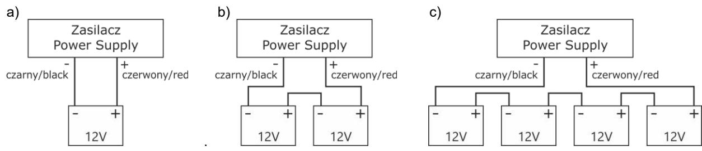

Fig. 4 Connecting batteries depending on voltage version of power supply: a) version 12V, b) version 24V, c) version 48V

- 7. Switch on the 230 V supply. LEDs on cover of power supply should light (CHARGE diode only during charging).
- 8. After installing and checking proper working, the enclosure can be closed.

# **3. Operating status indication.**

 The power supply unit features LED and acoustic status indication

- **3.1 Optical indication.**
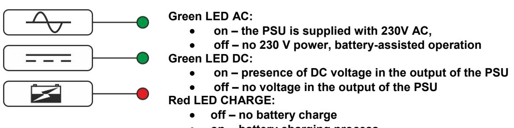

- **on - battery charging process**
Moreover, PSU is equipped with LED indicating presence of voltage at PSU output, located on PCB of PSU module.

#### **4. Maintenance.**

Any and all maintenance operations may be performed following the disconnection of the PSU from the power supply network. The PSU does not require performing any specific maintenance measures, however, in the case of significant dust rate, its interior is recommended to be cleaned with compressed air. In the case of a fuse replacement, use a replacement of the same parameters.

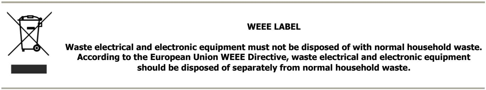

**CAUTION!** The power supply unit is adapted for cooperation with the sealed lead-acid batteries (SLA). After the operation period they must not be thrown but recycled according to the applicable law. 

## **Pulsar sp. j.** Siedlec 150, 32-744 Łapczyca, Poland Tel. (+48) 14-610-19-40, Fax. (+48) 14-610-19-50 E-mail: biuro@pulsar.pl, sales@pulsar.pl http:// www.pulsar.pl, www.zasilacze.pl