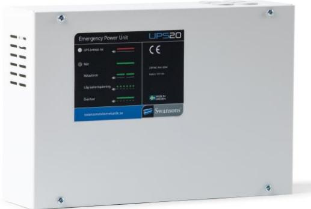
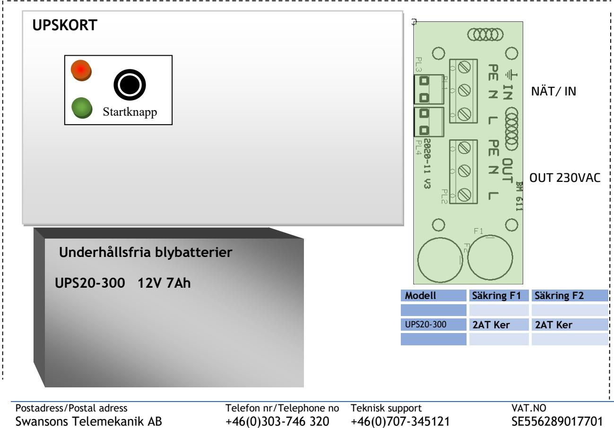

**SM40** 

## SKYDD

Aggregatet är skyddat mot överbelastning och kortslutning. Inbyggt skydd mot djupurladdning av batterierna. Nät, last och skyddas av 1-poliga säkringar.

## FUNKTION

UPS20 har en utgång.

- UTGÅNG 1 en ren UPS utgång där det är konstant spänning både vid nätdrift och vid batteridrift.
## BESKRIVNING

UPS aggregat med små dimensioner och lång backup tid. Perfekt för drift av dörrautomatik, nödljusanläggningar eller andra system som behöver avbrottsfri kraft.  **Strömförsörjning med plats för batteri**

> UPS20 är en 1-fas standby /offline UPS med inbyggt underhållsfritt blybatteri. Snabb omkopplingstid, 2-8mS till UPS läge och snabb uppladdningstid (7 tim) av batteriet. DS-serien är utrustad med APFC teknik som gör det möjligt att använda UPS: ens fulla kraft, oberoende vilken sorts last som används och det gör att den även kan driva större laster. Den har låg effektförbrukning – detta sparar energikostnader och miljö.

Utförande: Aggregatet är utfört i en vit självventilerad plåtkapsling och avsedd för väggmontage.

Det finns 4st genomföringar uppåt och en genomföring från baksidan (knockout). Är försedd med underhållsfria blybatterier med 10års livslängd.

#### TEKNISKA DATA

| Inspänning                | 88-265 VAC      |
|---------------------------|-----------------|
| Batterispänning           | 13,6 VDC        |
| Effekt, kontinuerligt     | 300 W           |
| Effekt, temporärt (15min) | 350 W           |
| Säkringar 230 V-sidan     | 2AT keramisk    |
| Temperaturområde          | -10° til +30° C |
| Verkningsgrad AC-mode     | 95%             |
| Verkningsgrad Batt-mode   | 80%             |
| Laddtid 7 timer           | 90%             |
|                           |                 |

CE-märkt enligt EN61000-1-2 och EN61000-3-4

| Art.nr. | Typ       | Utsp. och effekt och batteri     | Effekt i 60 minuter | HxBxD mm    |
|---------|-----------|----------------------------------|---------------------|-------------|
|         |           |                                  |                     |             |
| 5257528 | UPS20-300 | UPS Offline 230VAC Fyrk 300W 7Ah | 50W                 | 310x360x110 |
|         |           |                                  |                     |             |

Postadress/Postal adress Swansons Telemekanik AB Hålstensvägen 4 SE-446 37 Älvängen

Telefon nr/Telephone no +46(0)303-746 320 Hemsida/Webb www.swtm.se

Teknisk support +46(0)707-345121 e-post info@swtm.se

VAT.NO SE556289017701

# **UPS20 UPS MED INBYGGDA BATTERIER**

## SÄKERHET

Denna instruktion skall läsas igenom grundligt och förstås av all handhavande personal. Endast auktoriserad och erfaren personal inom AC och DC får använda, arbeta, underhålla, installera denna enhet.  **SM40 Strömförsörjning med plats för batteri**

Endast isolerade verktyg får användas i enheten.

Observera att farliga spänningar och strömmar förekommer i apparaten både när interna säkringarna är av eller på.

Livsfarlig spänning existerar mellan batteripoler och jord. Vid batteribyte stäng av UPS20 och bryt inkommande spänning och vänta i 30 sekunder.

Vid minsta tveksamhet om systemets uppbyggnad, funktion, komponenter samt säkerhet skall leverantören kontaktas. Batterierna är alltid elektrokemiskt aktiva. Kortslut inte batteripolerna.

# INKOPPLING

- Montera aggregatet fritt. Minst 100mm på varje sida.
- Denna UPS måste installeras som fast installation. Använd ej stickpropp.
- Anslut 230VAC-kabeln och koppla in batteriet innan nätspänningen slås till. Enheten startar ej utan batteri.
- Tryck ned startknappen (ca 3 sek) tills det piper och röd + grön lampa tänds.
- UPS20 går att starta i batteridrift/nätdrift.
- Vid batteridrift larmar/piper UPS20 med jämna intervaller och grön lysdiod blinkar med samma intervall. Intervallen ökar när batterispänningen sjunker.
- Röd lysdiod indikerar ett alvarligt fel. Bryt spänning och kontakta teknisk support.
- Löser utgångssäkringen, kontrollera inkoppling och inkopplade apparater.
- Utgång lämnar spänning kontinuerligt.

Swansons Telemekanik AB Hålstensvägen 4 SE-446 37 Älvängen

+46(0)303-746 320 Hemsida/Webb www.swtm.se

+46(0)707-345121 e-post info@swtm.se