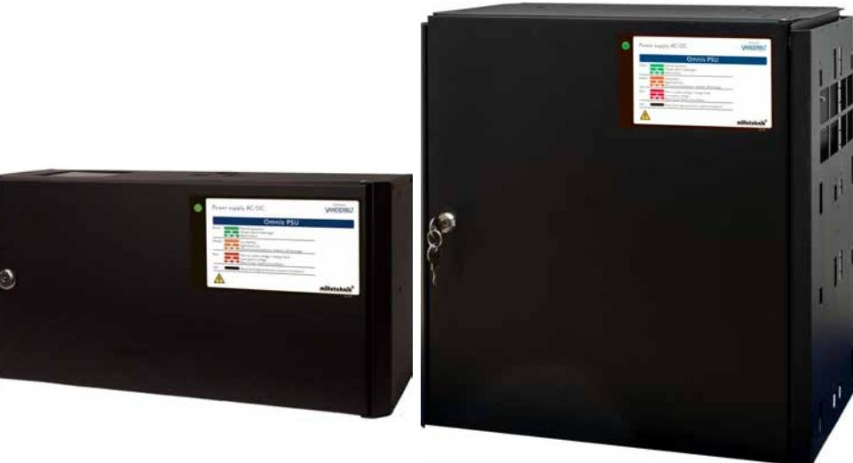
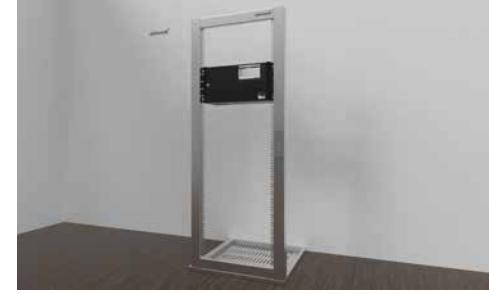
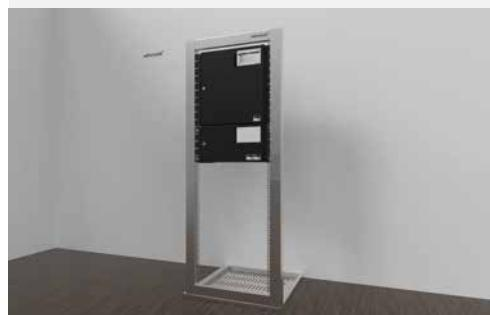
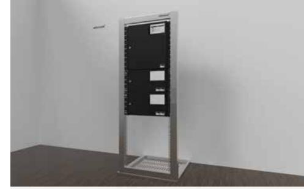
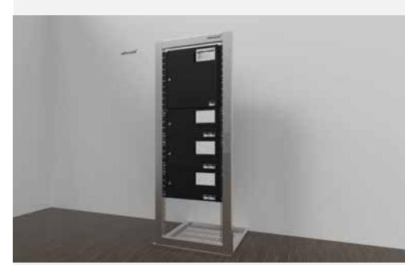
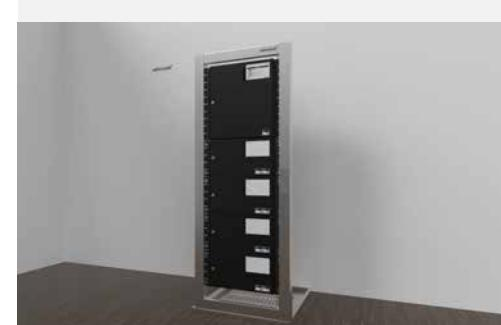
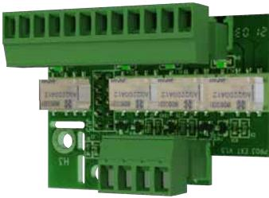
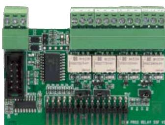
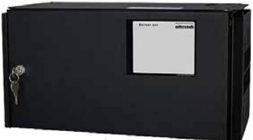

# **Översikt:**

P-serien består av en rad olika batteribackuper i varierande storlekar som kommunicerar överordnat med Omnis via OSDP. Tillsammans med smarta tillbehör såsom; avsäkringskort för uppdelning av last, reläkort för larmutgångar och batteriboxar för ökad batterikapacitet står P-Serien för strömförsörjningen i en godkänd Omnis-anläggning upp till larmklass 3.

## **Huvudfeatures inkluderar:**

- Godkänd i SSF1014:5 Larmklass 3 och EN50131-3 Grade 3
- OSDP-kommunikation med E100 / E100-S via RS485
- Kapslingsstorlekar rymmer 14Ah eller 45Ah batterier
- Maxlast från 5A till 25A
- Modulärt system
- Stabiliserad spänning
- Kontrollerad laddning
- Dashboard-vy via E100 / E100-S webinterface för bland annat:
	- Tid spenderad med över 80% av maximal last
	- Medellast för senaste 24h
	- Förväntat batteridrifttid

## **Funktionalitet:**

P-Serien består av SSF1014:5 godkända stömförsörjningsenheter för Omnissystemet med batterikapacitet från 2x 14Ah ända upp till 225Ah (10x 45Ah).

**Skydd för:** Överbelastning, överspänning, övertemperatur, kortslutning och djupurladdning.

**Larm för (via RS485):** Fördröjt nätavbrottslarm (10 sek), låg batterispänning, över/underspänning, frånkopplat batteri, åldrat batteri, batterikapacitet för låg, cellkortslutning, laddarfel, låg systemspänning, utlöst lastsäkring, sabotage.

**Utgångar för strömuttag:** 1 st dubbelpoligt avsäkrad utgång + 1 st enkelpoligt (+) avsäkrad utgång finns på baskortet. Beroende på modell, finns ytterligare 5 / 10 / 20 avsäkrade utgångar som levereras individuellt avsäkrade till 2A med möjlighet att utöka upp till 10A per utgång.

**P5S:** 2 Prioriterade lastutgångar

**P5L:** 2+5 Prioriterade lastutgångar

**P10L:** 2+10 Prioriterade lastutgångar (varav 3 valbart oprioriterade)

**P15L:** 2+10 Prioriterade lastutgångar (varav 3 valbart oprioriterade)

**P25L:** 2+20 Prioriterade lastutgångar (varav 6 valbart oprioriterade)

Den välventilerade kapslingen är lackerad i svart färg med struktur, lysdiod för larmindikering samt utrustad med 3 st knockouts för kabelgenomföringar samt knockout i ryggen. Samtliga enheter kan både väggmonteras och rackmonteras (vändbara vinklar medföljer). Observera att batterier tillkommer.

P-serien erbjuder **INTELLIGENT CHARGING** vilket innebär att när batterierna är fulladdade kommer de att kopplas ur elektroniskt för standby-läge i upp till 20 dygn. Genom att var 20:e dygn ladda batterierna (istället för att de inte alls används) bidrar systemet till att förlänga batteri-livslängden med upp till 50%. Batterierna ansluts automatiskt igen på mindre än 50 mikrosekunder när de behövs.

Systemet är också utrustat med interna effektmotstånd för kvalificerat batterikapacitetstest, som meddelar när batterierna behöver bytas ut.

P-Serien är systemcertifierad och testad tillsammans med AGM UPLUS 10+ Design Life batterier. P-Serien kan kompletteras med batteriboxar vid behov. Batteriboxen placeras under batteribackupen och har beroende på modell, plats för upp till 4x 14Ah batterier, eller 2x 45Ah batterier. Batteriboxen ansluts enkelt via kablage som medföljer batteriboxen.

Large-kapsling med 1 Batteribox

Large-kapsling med 2 Batteriboxar

Large-kapsling med 3 Batteriboxar

Large-kapsling med 4 Batteriboxar

| Teknisk specifikation                   | P5S             | P5L             | P10L            | P15L            | P25L            |
|-----------------------------------------|-----------------|-----------------|-----------------|-----------------|-----------------|
| Nätspänning                             |                 |                 | 230V AC         |                 |                 |
| Utspänning                              |                 |                 | 27,3V DC        |                 |                 |
| Arbetstemperatur:                       |                 |                 | +5 C till +40 C |                 |                 |
| Dimensioner (B x H x D) mm:             | 437 x 222 x 145 | 437 x 444 x 212 | 437 x 444 x 212 | 437 x 444 x 212 | 437 x 444 x 212 |
| Höjdeneheter (HE) för 19" stativ:       | 5               | 10              | 10              | 10              | 10              |
| Vikt (utan batterier) kg:               | 5,5             | 13              | 14              | 16              | 16              |
| Kapslingsklass:                         | IP32            | IP32            | IP32            | IP32            | IP32            |
| Batterikapacitet i egen kapsling:       | 14Ah (2x14Ah)   | 45Ah (2x45Ah)   | 45Ah (2x45Ah)   | 45Ah (2x45Ah)   | 45Ah (2x45Ah)   |
| Maximal batterikapacitet                | 42Ah (6x14Ah)   | 45Ah (2x45Ah)   | 90Ah (4x45Ah)   | 180Ah (8x45Ah)  | 225Ah (10x45Ah) |
| Max antal batteriboxar (Small):         | 1               | -               | -               | -               | -               |
| Max antal batteriboxar (Large):         | -               | -               | 1               | 3               | 4               |
| Maxlast:                                | 5A              | 5A              | 10A             | 15A             | 25A             |
| 1Godkänd medellast utan batteriboxar:   | 1,1A            | 3,6A            | 3,6A            | 3,6A            | 3,6A            |
| 1Godkänd medellast 1 Batteribox:        | 3,3A            | -               | 7,4A            | 7,4A            | 7,4A            |
| 1Godkänd medellast 2 Batteriboxar:      | -               | -               | -               | 11,1A           | 11,1A           |
| 1Godkänd medellast 3 Batteriboxar:      | -               | -               | -               | 14,8A           | 14,,8A          |
| 1Godkänd medellast 4 Batteriboxar:      | -               | -               | -               | -               | 18,6A           |
| Antal utgångar oprioriterad last:       | -               | -               | -               | 3 (valbara)     | 6 (valbara)     |
| Antal utgångar för prioriterad last:    | 2               | 2+5             | 2+10            | 2+10            | 2+20            |
| Antal växlande reläutgångar på baskort: | 0               | 0               | 0               | 0               | 0               |
| Lediga platser för tillvalskort:        | 2               | 2               | 2               | 1               | 0               |

1 = Godkänd medellast enligt SSF1014:5 Larmklass 2.

**vanderbiltindustries.com**

@VanderbiltInd Vanderbilt Industries

## **Vanderbilt International Ltd.**

Clonshaugh Business and Technology Park Clonshaugh, Dublin D17 KV 84, Ireland

+353 1 437 2560

## **Tillbehör:**

### **PR1 - Reläkort till Omnis PSU 5A-10A**

Utökningskort för installationer där busskommunikation ej används. Fyra stycken växlande reläutgångar som jackas in på moderkortet på Omnis PSU. Avsedd för enheter med upp till 10A maxlast.

## **PR2 - Reläkort till Omnis PSU 15A-25A**

Utökningskort för installationer där busskommunikation ej används. Fyra stycken växlande reläutgångar som jackas in på moderkortet på Omnis PSU. Avsedd för enheter med 15A-25A maxlast.

Batteribox för utökning av batterikapacitet. Avsedd för Large-kapslingar och rymmer 2x 45Ah batterier.

PR1 - Reläkort till Omnis PSU 5A-10A

PR2 - Reläkort till Omnis PSU 15A-25A

#### Omnis Batteribox 24V Large

## **Orderinformation:**

| Typ        | Artikelnummer    | E-nummer  | Beskrivning                           |
|------------|------------------|-----------|---------------------------------------|
| P5S        | N54506-Z110-A300 | 58 717 83 | P5S - Omnis PSU 5A Small              |
| P5L        | Kommande produkt |           | P5L - Omnis PSU 5A Large              |
| P10L       | Kommande produkt |           | P10L - Omnis PSU 10A Large            |
| P15L       | Kommande produkt |           | P15L - Omnis PSU 15A Large            |
| P25L       | N54506-Z114-A300 | 58 717 87 | P25L - Omnis PSU 25A Large            |
| Batteribox | N54506-H120-A100 | 58 710 47 | Batteribox Large 24V                  |
| PR1        | N54506-Z121-A100 | 58 717 88 | PR1 - Reläkort till Omnis PSU 5A-10A  |
| PR2        | N54506-Z122-A100 | 58 717 89 | PR2 - Reläkort till Omnis PSU 15A-25A |

### **vanderbiltindustries.com**

@VanderbiltInd Vanderbilt Industries

# **Vanderbilt International Ltd.**

Clonshaugh Business and Technology Park Clonshaugh, Dublin D17 KV 84, Ireland +353 1 437 2560