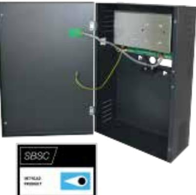

## PSV 1265-B1

## Strömförsörjningsaggregat SBSC godkänd i larmklass 3 med ViP (voltage in Parallel) funktion, 12 VDC 6,5A.

## **Produktdetajler:**

| Godkännanden                     | EN-ST-000279/ Grade 3, Safety EN 62368-1:2014/AC 2015 No: SE-100168, EMC EN 61000-6-3, SE-100168, EN 50131-6 Grade 3, EN 50130-5 Class II, 21-203 Larmklass 3 |
|----------------------------------|------------------------------------------------------------------------------------------------------------------------------------------------------------------------------|
| Matningsspänning                 | 230 VAC                                                                                                                                                                      |
| Utspänning                       | 13,8 VDC                                                                                                                                                                     |
| Belastning                       | 6,5 A                                                                                                                                                                        |
| Plats för ackumulator (ingår ej) | 12 V/7Ah eller 12V/12Ah eller 12V/18Ah                                                                                                                                    |
| Sabotageskydd                    | Öppnings- samt bortbrytningsskydd, max 48V / 100 mA                                                                                                                       |
| Kapsling                         | Metall                                                                                                                                                                       |
| Färg                             | Grå                                                                                                                                                                          |
| Mått (L x B x H) mm              | 265x385x115                                                                                                                                                                  |
| Grade                            | 3                                                                                                                                                                            |

Strömförsörjningsaggregat med ViP funktion kan parallellkopplas för att ge mer ström, redundans samt kompensera för spänningsfall i kablaget. Plats för en 12V/ 7Ah, 12 V/ 12 Ah eller 12V/18Ah ackumulator. Sabotagekontakt. Enheten har skydd mot kortslutning och överbelastning. Indikering för nätbortfall, lågutspänning, batterifel samt säkringsfel sker med LED och aktiverar separata utgångar med reläer.

Strömförsörjningen är testad och certifierad av VdS i Tyskland enligt normen EN 50131-6 Grade 3 samt av SBSC för larmklass 3. Strömförsörjningen är också testad och godkänd av INTERTEK för Safety och EMC för att ge trygga och driftsäkra anläggningar.

## **BESTÄLLINGSINFORMATION Typ E-nr Beskrivning**

Powered by TCPDF (www.tcpdf.org)

PSV 1265-B1 Strömförsörjning, VIP, 12 V 6,5 A, Grå