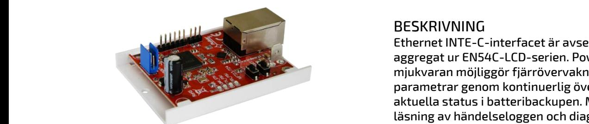
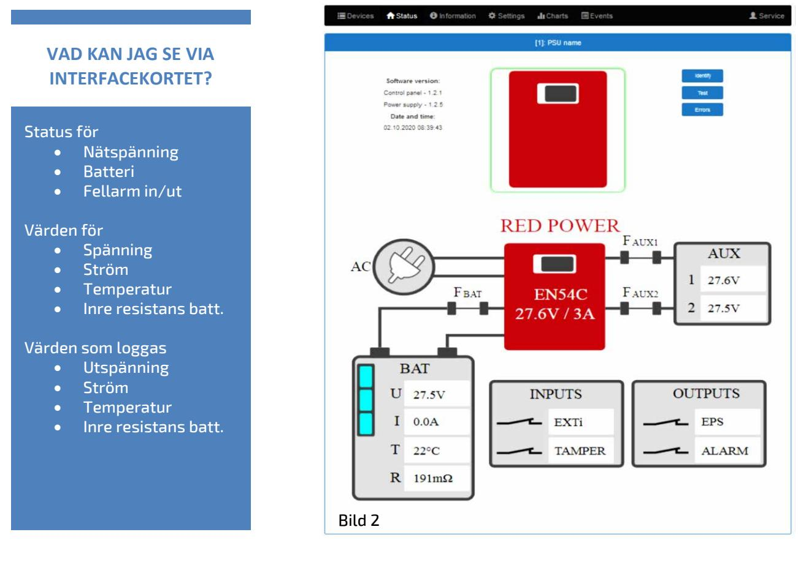

## ETHERNET INTERFACE INTE-C V1

FÖR BATTERIBACKUP 54C REDBOX

## Funktioner:

- PowerSecurity webbapplikation
- Inbyggd webbserver för konfiguration
- Galvanisk isolering mellan Ethernetgränssnittet och strömförsörjningen
- Automatiska e-postmeddelanden vid PSU-fel
- Optisk indikering av kommunikation

## BESKRIVNING

Ethernet INTE-C-interfacet är avsett för att sitta i aggregat ur EN54C-LCD-serien. PowerSecuritymjukvaran möjliggör fjärrövervakning av olika parametrar genom kontinuerlig övervakning av aktuella status i batteribackupen. Möjliggör även läsning av händelseloggen och diagram över strömmar och spänningar och utför fjärrbatteritest. Se bild 2 Strömförsörjs genom seriekontakten.

## TEKNISKA DATA

LAN hastighet 10/100Mb/s TTL hastighet 115200 bauds Datautgång Ethernet RJ-45 Länkar (se även hemsidan) Mjukvara

Manual

| E:      | Typ           | Anslutnin | Spännings                   | Loggning  | Montage                | Mått         |
|---------|---------------|-----------|-----------------------------|-----------|------------------------|--------------|
| nummer  |               | g         | försörjning                 | av värden |                        |              |
| 5257606 | INTE-C EN54-4 | RJ45      | Internt via seriell port | Ja        | Internt i EN54C/LCD | 71 x 50 x 20 |

Postadress/Postal address **Swansons Telemekanik AB** Osbackevägen 5 SE-449 44 Nol

Telefon nr/Telephone no +46(0)303-746 320 Hemsida/Webb www.swtm.se

e-post info@swtm.se VAT.NO SE556289017701