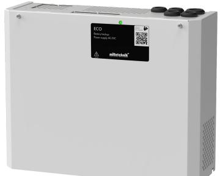

# PRODUKTBLAD - STRÖMFÖRSÖRJNING FRÅN MILLETEKNIK

#### Namn, artikelnummer och e-nummer

| Namn          | Artikelnummer  | E-nummer |
|---------------|----------------|----------|
| ECO 12V 5A M  | ME01C10212P050 | 5213705  |
| ECO 12V 10A M | ME01C10212P100 | 5213519  |
| ECO 24V 5A M  | ME01C10224P050 | 5213521  |
| ECO 24V 10A M | ME01C10224P100 | 5213522  |

## ECO strömförsörjning med batteribackup

ECO M

ECO M monteras på vägg.

## Beskrivning

Primärswitchad batteribackup, 12 V, 5 A, med plats för två 14 Ah batterier.

Primärswitchad batteribackup, 24 V, 10 A, med plats för två 7,2 Ah eller två 14 Ah batterier.

# Användningsområde

ECO strömförsörjer passersystem, låssystem eller rökluckor och andra säkerhetsprodukter i en fastighet som drivs av 12 V DC eller 24 V DC. Likriktaren i strömförsörjningen omvandlar 230 V DC ner till 12 V DC eller 24 V DC.

Batterier driver, exempelvis passersystemet, vidare när elnätet går ner.

Lång livslängd, energieffektiv och support finns tillgänglig om något skulle krångla, nu eller om 10 år.

Spänning, ström och effekt

Spänning ut: 13,6 VDC, (12 V). 27,3 VDC, (24 V).

Laddström: 5 A. 10 A.

Strömuttag: 5A. 10 A.

#### Reservdrifttid på batterier

Reservdrifttiden i batteridrift beror på hur stor belastning som är inkopplad på strömförsörjningen. Varierar belastningen, som vid frekvent öppning av dörrlås, sjunker tiden som batterier kan

driva vidare säkerhetssystemet. För att få en uppskattning av reservdriffterser se: [www.milletek](https://www.milleteknik.se/Manualer/FaQ/Reservdrifttider/)[nik.se/Manualer/FaQ/Reservdrifttider/](https://www.milleteknik.se/Manualer/FaQ/Reservdrifttider/)

# Batteri och batterityp

Två 7,2 Ah batterier.

Två 14 Ah batterier.

Batterityp: 12 V, AGM blysyra batteri, underhållsfritt. Batterier ingår ej.

## Lastutgångar

Två lastutgångar.

## Larm

Larm ges för: Fördröjt nätavbrottslarm eller låg batterispänning, bortkopplade batterier vid uppstart och säkringsfel.

## Skydd

Kontrollerad laddning av batterier skyddar mot överladdning och förlänger livslängden på batterier. Batterier laddas med som mest 0,5 A.

Skydd mot: Djupurladdning av batterier, kortslutning, överlast, överspänning och övertemperatur.

#### Säkringar

Elnätssäkring: 2,5 A.

Lastsäkring: 3 A. 5 A. 10 A.

Batterisäkring: 10 A.

### Indikeringar och kommunikation

Lysdiod visar information och larm på kretskort och på kapslingens dörr.

#### Kapsling, utförande

Plåtskåp för väggmontering, pulverlackat vitt. Fem kabelgenomföringar. Buntbandshållare i kapsling.

| Mått, höjd x bredd x djup | IP-klass |
|---------------------------|----------|
| 272 x 334 x 115 mm        | IP20     |

Vikt

| Namn                           | Nettovikt | Vikt m förp. |
|--------------------------------|-----------|-----------------|
| Batteribackup ECO 12 V10A M | 3,7 kg    | 4,1 kg          |
| Batteribackup ECO 12V 5A M  | 3,6 kg    | 4,0 kg          |

| Namn                           | Nettovikt | Vikt m förp. |
|--------------------------------|-----------|-----------------|
| Batteribackup ECO 24V 10A M | 3,7 kg    | 4,1 kg          |
| Batteribackup ECO 24V 5A M  | 3,7 kg    | 4,1 kg          |

# Installationskrav

Enheten är avsedd för fast installation. Enheten skall installeras inomhus, miljöklass 1, omgivningstemperatur: +5°C – 40°C. Rekommenderad omgivningstemperatur är +15°C - 25°C.

# Krav som produkten uppfyller

| EMC: | EMC Direktivet 2014/30EU           |  |
|------|------------------------------------|--|
| El:  | Lågspänningsdirektivet: 2014/35/EU |  |
| CE:  | CE direktivet enligt:765/2008      |  |
|      |                                    |  |

# Garanti

Produkten har två års garanti för tillverkningsfel. Batterier och förslitningsdelar omfattas ej av garanti.

# Utbyggbar, tillval och tillbehör

Produkten kan utökas med ett [ECO mains failure](https://www.milleteknik.se/produkt/eco-mains-failure-alarm-card/) [alarm card.](https://www.milleteknik.se/produkt/eco-mains-failure-alarm-card/)

Tillverkning, livslängd, miljöpåverkan och återvinning

Tillverkad av Milleteknik i Partille, Sverige.

Produkten är designad och konstruerad för lång livslängd vilket minskar miljöpåverkan. Produktens livslängd (förutom slitagedelar) är beroende på, bland annat miljöfaktorer, främst omgivningstemperatur, oförutsedd belastning på komponenter som blixtnedslag, yttre åverkan, handhavandefel, med flera. Produkter återvinns, enkelt då de är moduluppbyggda, genom att lämnas till närmaste återvinningsstation eller sändas åter till tillverkare. Kontakta din distributör för mer information. Kostnader som uppkommer i samband med återvinning ersätts ej.

#### Länk till senaste informationen

Produkter är föremål för uppdateringar, du hittar alltid den senaste informationen på [www.milletek](https://www.milleteknik.se/)[nik.se.](https://www.milleteknik.se/)

# [ECO](https://www.milleteknik.se/produkt-kategori/eco/)

Alla uppgifter publiceras med reservation för eventuella fel.

### Om dessa uppgifter

Alla uppgifter publiceras med reservation för eventuella fel. Uppdateras utan föregående meddelande.