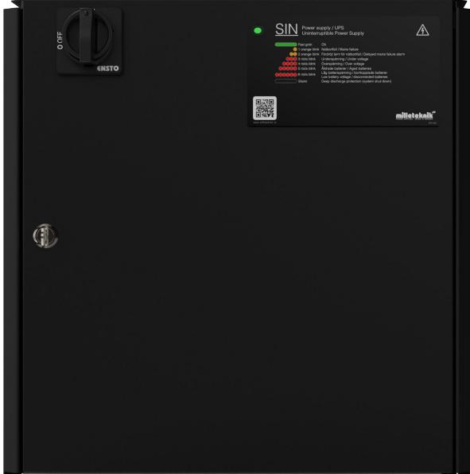
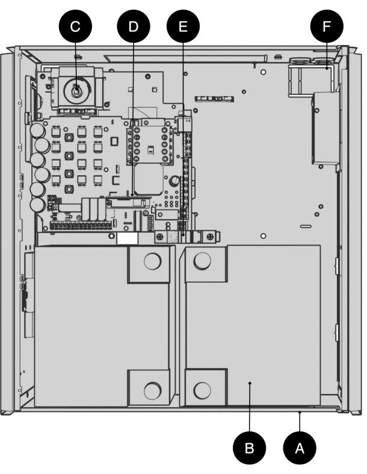
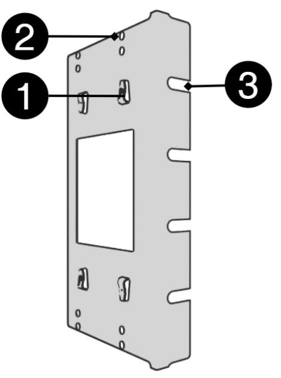
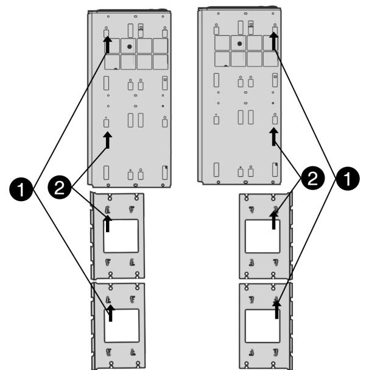
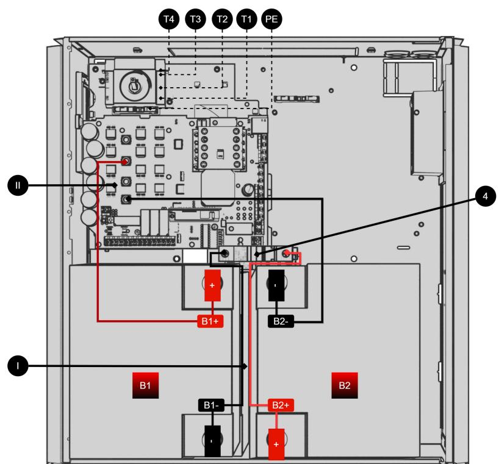
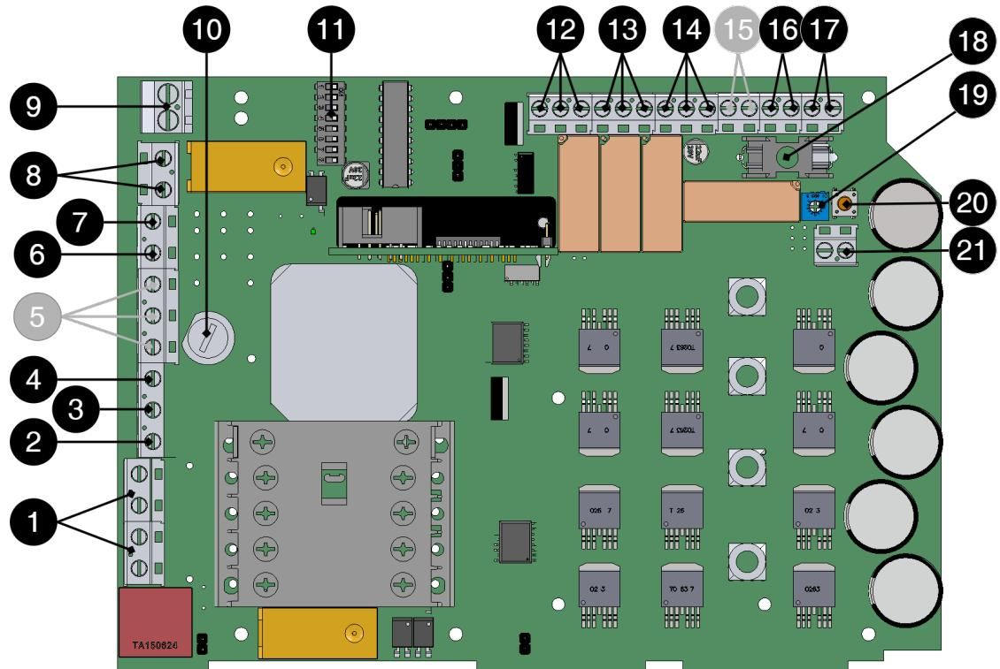
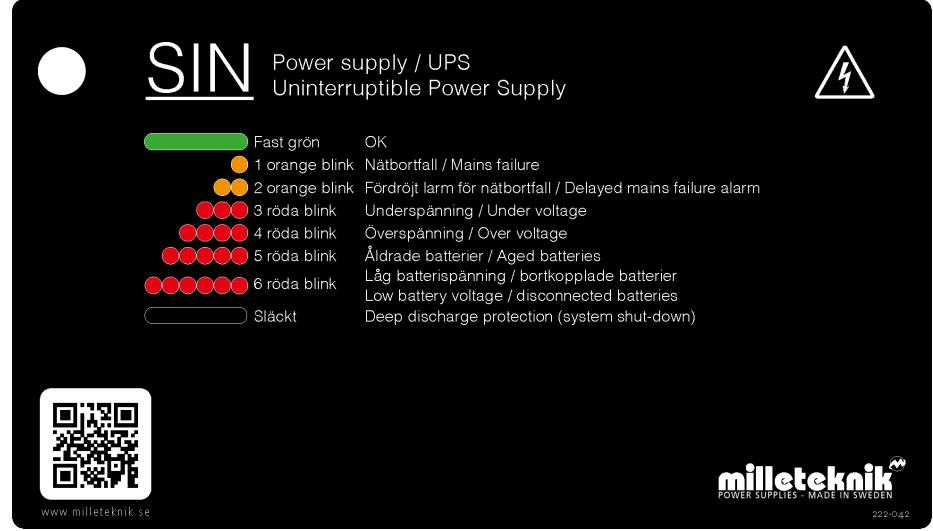
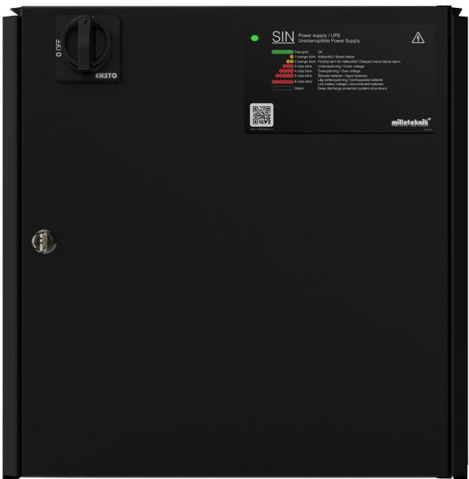

# SINUS UPS

SIN UPS 1100W FLX L, SIN UPS 1500W FLX L

350-209 Publiceringsdatum 2023-03-09

| 1. Om Sinus UPS från Milleteknik  4                                                  |  |
|--------------------------------------------------------------------------------------|--|
| 2. Komponentöversikt SINUS FLX L  5                                                  |  |
| 3. Kapsling  5                                                                       |  |
| 3.1. Konsol  5                                                                       |  |
| 3.2. Skjut fast konsoler  6                                                          |  |
| 3.3. Montering  7                                                                    |  |
| 4. Inkoppling 230 V  8                                                               |  |
| 4.1. In: Batteriinkoppling  8                                                        |  |
| 4.2. Lastfrånskiljare inkommande elnät (in: 230 V)  9                                |  |
| 5. Ut: 230 V  9                                                                      |  |
| 6. Beskrivning moderkort: 1FAS Multi  9                                              |  |
| 7. Larminkoppling  10                                                                |  |
| 7.1. Anslut summalarm för självtest  10                                              |  |
| 7.1.1. Anslut larm för låg batterispänning  10                                       |  |
| 7.2. Anslut larm för nätavbrott  11                                                  |  |
| 8. Driftsättning - hur enheten skall startas  11                                     |  |
| 8.1. Uppstart utan elnät (in: 230 V)  11                                             |  |
| 9. Funktioner växelriktare  12                                                       |  |
| 9.1. Batterier UPS  12                                                               |  |
| 9.2. Batteriladdare UPS  12                                                          |  |
| 9.3. Skydd UPS-standard 62040-1-1  12                                                |  |
| 9.4. Självtestsystem  13                                                             |  |
| 9.5. Larm självdiagnos  13                                                           |  |
| 9.6. Larm låg batterispänning  14                                                    |  |
| 9.7. Larm nätdrift / nätavbrott  14                                                  |  |
| 9.8. Inhibit  14                                                                     |  |
| 10. Skötselanvisning UPS  14                                                         |  |
| 10.1. Batteribyte UPS  14                                                            |  |
| 11. Dimensionering UPS  15                                                           |  |
| 12. Frontpanel och statusindikeringar  15                                            |  |
| 13. FaQ UPS  16                                                                      |  |
| 13.1. Kontrollåtgärder vid larm UPS - Batteriladdning, över- eller underspänning  16 |  |
| 13.2. Kontrollåtgärder vid larm UPS - Larm för åldrat batteri  16                    |  |
| 13.3. Kontrollåtgärder vid larm UPS - UPS fel / växelriktafel  16                    |  |
| 13.4. Kontrollåtgärder vid larm UPS - Överspänning, för hög laddström  16            |  |
| 13.5. Testlast i UPS (del av självtestsystem)  16                                    |  |
| 13.6. Ges larm när batterier laddas upp efter nätavbrott?  16                        |  |
| 13.7. Teknikfakta larm: Felaktig laddspänning  17                                    |  |
| 13.8. Teknikfakta larm: Överspänning  17                                             |  |
| 13.9. Teknikfakta larm: Åldrat batteri  17                                           |  |
| 13.10. Teknikfakta larm: Växelriktarprov  17                                         |  |
| 14. SIN  18                                                                          |  |
| 14.1. SIN - UPS Produktblad / tekniska data  18                                      |  |
| 14.1.1. SIN namn, artikelnummer och e-nummer  18                                     |  |
| 14.1.2. Maximal märkeffekt  18                                                       |  |
| 14.1.3. OM UPS  18                                                                   |  |
| 14.1.4. Fast installation  19                                                        |  |
| 14.2. Användningsområden  19                                                         |  |
| 14.3. Regelverk och certifieringar  19                                               |  |
| 14.3.1. Krav som produkten uppfyller  19                                             |  |
| 14.4. Kretskort - Tekniska data  19                                                  |  |
| 14.4.1. Tekniska data, moderkort: 1FAS Multi  19                                     |  |
| 230 V spänning in  20                                                                |  |

| 230 V utspänning  20                                            |  |
|-----------------------------------------------------------------|--|
| Batteriladdning  20                                             |  |
| Skydd  20                                                       |  |
| Säkringar 1FAS Multi  20                                        |  |
| Självtest  20                                                   |  |
| Larm  21                                                        |  |
| 14.5. Tekniska data kapsling  21                                |  |
| 14.5.1. Kapslingar - Tekniska Data FLX L  21                    |  |
| 14.6. Batterier  21                                             |  |
| 14.6.1. Batterier ingår ej  21                                  |  |
| 14.6.2. 45 Ah, 12 V AGM-batteri  21                             |  |
| 14.7. Länk till senaste informationen  22                       |  |
| 14.8. Garanti, support, tillverkningsland och ursprungsland  22 |  |
| 14.8.1. Garanti  22                                             |  |
| 14.8.2. Support  22                                             |  |
| Reservdelar  22                                                 |  |
| Frågor om produkters prestanda?  22                             |  |
| 14.8.3. Kontakta oss  22                                        |  |
| 14.8.4. Tillverkningsland  23                                   |  |
| 14.8.5. Tillverkare  23                                         |  |
| 15. Adress och kontaktuppgifter  23                             |  |
|                                                                 |  |

# 1. OM SINUS UPS FRÅN MILLETEKNIK

SIN växelriktare är en Off-line UPS som går in och ersätter matningen från elnätet vid nätavbrott, tills elnätet återkommer (eller batterierna helt urladdats). SIN växelriktare är designade med senaste switchteknik och mikroprocessorövervakning, för: Högsta verkningsgrad och driftsäkerhet, ger lång livslängd hos både elektronik och batterier. Väl skyddad med isolationsbrytare, batteriautomatsäkring, skydd mot övertemperatur, överlast, kortslutning. Fullständig självtest inklusive avancerat batteritest. Enheterna är installations- och servicevänliga: Kompakt volym. Utanpåliggande väggfästen för uppsättning utan att behöva öppna elskåpet för snabb uppsättning. Moduluppbyggd. All elektronik på kassett för enkel service eller uppgradering.

UPS laddas med inbyggt nätaggregat och drivs vid nätavbrott vidare av batterier.

### **SÄKERHET - LÄS DETTA FÖRST**

- Enheten skall monteras av behörig person.
- Det är installatörens ansvar att systemet är lämpat för tänkt bruk.
- Dokument som medföljer systemet skall förvaras i dess omedelbara närhet.
- Systemet bör ej vara ansluten till nät vid montering.
- Alla uppgifter är med reservation för ändringar.

# 2. KOMPONENTÖVERSIKT SINUS FLX L

Batterier skall placeras som på bilden.

Tabell 1. Komponentöversikt

| Bokstav | Förklaring                                                                                |
|---------|-------------------------------------------------------------------------------------------|
| A       | Skåp i pulverlackad plåt med fäste för vändbar konsol för montering i vägg eller 19" rack |
| B       | Batterier                                                                                 |
| C       | Isolationsbrytare                                                                         |
| D       | Moderkort                                                                                 |
| E       | Batterisäkring                                                                            |
| F       | Kabelgenomföringar                                                                        |

# 3. KAPSLING

#### 3.1. Konsol

Medföljande konsoler kan fästas på två sätt: Vid montering på vägg skall konsolerna sitta bakåt, mot vägg. Vid montering i 19" rack skall konsolen sitta i framkant på enheten.

| Nr | Förklaring                                                        |
|----|-------------------------------------------------------------------|
| 1  | Gem i konsol som säkrar konsolen till kapslingen.                 |
| 2  | Hål för skruv - kan användas för att säkra konsolen i kapslingen. |
| 3  | Konsolen skruvas fast i vägg eller 19" rack.                      |

### 3.2. Skjut fast konsoler

Enheten kan monteras i 19" rack eller på vägg. Medföljande konsoler kan fästas på två sätt: Vid montering på vägg skall konsolerna sitta bakåt, mot vägg. Vid montering i 19" rack skall konsolens sitta i framkant på enheten.

#### Figur 1. FLX L - montera konsoler

Vänster konsol: vänd mot framsidan för montering i 19" rack.

Höger konsol vända mot baksidan för montering på vägg.

| Nr | Förklaring                                     |
|----|------------------------------------------------|
| 1  | Börja med att sätta fast den översta konsolen. |
| 2  | Sätt fast den undre konsolen.                  |

#### **VIKTIGT**

Lämna 100 mm fritt kring luftgaller.

#### 3.3. Montering

Använd lämplig skruv för montering på vägg eller i 19" rack. Skruv för montering på vägg eller i rack ingår ej.

# 4. INKOPPLING 230 V

#### 4.1. In: Batteriinkoppling

| Tabell 2. Översikt inkommande elnät och batterinkoppling |  |  |  |  |  |  |
|----------------------------------------------------------|--|--|--|--|--|--|
|----------------------------------------------------------|--|--|--|--|--|--|

| Nr / bokstav | Förklaring                          |  |  |  |
|--------------|-------------------------------------|--|--|--|
| I, III       | Batterikablage till automatsäkring. |  |  |  |
| II           | Batterikablage från moderkort.      |  |  |  |
| 4            | Batterisäkring (automatsäkring)     |  |  |  |
| T3           | Intern nödstopp.                    |  |  |  |
| T2           | FAS elnät, inkommande.              |  |  |  |
| T1           | Nolla elnät, inkommande.            |  |  |  |
| PE           | Inkommande skyddsjord.              |  |  |  |

Anslut som bilden visar; - ev. inkommande styrd - inkommande elnätets fas till plint T2 på isolationsbrytare, - inkommande noll till plint T1. - skyddsjord till plint "PE".

Tabell 3. Batterinummer

| B1, B2 | Förklaring                    |  |  |  |  |
|--------|-------------------------------|--|--|--|--|
| B1+    | + från kretskort till batteri |  |  |  |  |
| B1-    | - från säkring till batteri.  |  |  |  |  |

| B1, B2 | Förklaring                     |
|--------|--------------------------------|
| B2+    | + från säkring till batteri.   |
| B2-    | - från kretskort till batteri. |

## 4.2. Lastfrånskiljare inkommande elnät (in: 230 V)

För högsta säkerhet, koppla alltid ifrån elnätet före installation och service. Anslut en lastfrånskiljare (strömbrytare) på den inkommande kabeln från elnätet. Placera den lätt åtkomligt och märk upp den tydligt. Med en lastfrånskiljare installerad kan inkommande spänning lätt brytas vid service och funktionsprov.

# 5. UT: 230 V

Utgående fas/last till PICTO märkt 4 på kretskortsöversikt (alltid spänning ut). Utgående fas/last till (NÖDLJUS) märkt 3 på kretskortsöversikt (endast spänningssatt vid nätbortfall). Utgående noll, till NOLL, märkt 2 på kretskortsöversikt. Skyddsjord, till GND, märkt 9 på kretskortsöversikt.

# 6. BESKRIVNING MODERKORT: 1FAS MULTI

Figur 2. 1FAS Multi

#### Tabell 4. Kretskortsöversikt, förklaring

| Nr | På kretskort | Förklaring          |  |  |  |  |  |
|----|--------------|---------------------|--|--|--|--|--|
| 1  | -            | Interna kopplingar. |  |  |  |  |  |

| Nr  | På kretskort  | Förklaring                                                                               |  |  |  |  |  |  |
|-----|---------------|------------------------------------------------------------------------------------------|--|--|--|--|--|--|
| 2   | NOLL          | Noll, utgående.                                                                          |  |  |  |  |  |  |
| (3) | (NÖDLJUS)     | (Anslutning till nödljus /Ledljus. Fas, endast spänning vid nätbortfall.)                |  |  |  |  |  |  |
|     | (0 V / 230 V) |                                                                                          |  |  |  |  |  |  |
|     | (PHASE)       |                                                                                          |  |  |  |  |  |  |
| 4   | (PICTO)       | Utgående Fas, alltid fasspänning på. (Anslutning till pictogram.)                        |  |  |  |  |  |  |
|     | 230 V / 230 V |                                                                                          |  |  |  |  |  |  |
|     | PAHSE         |                                                                                          |  |  |  |  |  |  |
| 5   | -             | Används ej.                                                                              |  |  |  |  |  |  |
| 6   | NOLLA         | NOLL inkommande, (fabrikskopplad).                                                       |  |  |  |  |  |  |
|     | NEUTRAL       |                                                                                          |  |  |  |  |  |  |
| 7   | FAS           | FAS inkommande, (fabrikskopplad).                                                        |  |  |  |  |  |  |
| 8   | TESTLOAD      | Intern koppling till testlast.                                                           |  |  |  |  |  |  |
| 9   | PE            | Skyddsjord                                                                               |  |  |  |  |  |  |
| 10  | F2            | Säkring kontaktor.                                                                       |  |  |  |  |  |  |
| 11  | SW1           | Dip-Switch.                                                                              |  |  |  |  |  |  |
| 12  | MAINS FAILURE | Nätbortfallslarm, NO/COM/NC.                                                             |  |  |  |  |  |  |
|     | NC CO NO      |                                                                                          |  |  |  |  |  |  |
| 13  | LOW BATT      | Larm för låg batterspänning , NO/COM/NC.                                                 |  |  |  |  |  |  |
|     | NC CO NC      |                                                                                          |  |  |  |  |  |  |
| 14  | ALARM: SDS    | Självdiagnoslarm, NO/COM/NC.                                                             |  |  |  |  |  |  |
|     | NC CO NC      |                                                                                          |  |  |  |  |  |  |
| 15  | -             | Används ej.                                                                              |  |  |  |  |  |  |
| 16  | -EMERG.STOP   | Nödstopp, (fabrikskopplad).                                                              |  |  |  |  |  |  |
|     | AC/DC+        |                                                                                          |  |  |  |  |  |  |
| 17  | + AC/DC -     | Intern koppling, nätaggregat.                                                            |  |  |  |  |  |  |
| 18  | F1            | Säkring, batteriladdare, T10A/T16A.                                                      |  |  |  |  |  |  |
| 19  | P1            | Potentiometer för utspänningsjustering.                                                  |  |  |  |  |  |  |
| 20  | SW2           | Tryckknapp för start av UPS i batteridrift enbart, utan att elnät är inkopplat/påslaget. |  |  |  |  |  |  |
| 21  | -             | Anslutning till fläkt                                                                    |  |  |  |  |  |  |

# 7. LARMINKOPPLING

Självtest, larm för låg batterispänning och larm för nätavbrott.

### 7.1. Anslut summalarm för självtest

Felaktig laddspänning (över-/underspänning), åldrat batteri – när batteribyte bör ske, eller ej fungerande växelriktare till 14. Larm - kontakt NO och CO.

#### 7.1.1. Anslut larm för låg batterispänning

Larm vid viss förbrukad energi i batteridrift (= fördröjt nätavbrottlarm), till kretskortsplint 13. Larmgränsen ställs in på SW1 enligt tabell. Larm kontakt NO och CO.

#### Tabell 5. SW1

| Dip-switch                             | 1   | 2   | 3   | 4   | 5   | 6   | 7          | 8     |
|----------------------------------------|-----|-----|-----|-----|-----|-----|------------|-------|
| Låg batterispänning, (i batteridrift). |     |     |     |     |     |     | Används ej | Reset |
| Larm vid 75% kvar*                     | ON  | OFF | OFF | -   | -   | -   | -          | -     |
| Larm vid 50% kvar                      | OFF | ON  | OFF | -   | -   | -   | -          | -     |
| Larm vid 25% kvar                      | OFF | OFF | ON  | -   | -   | -   | -          | -     |
| Nätbortfallslarm, (tidsfördröjt).      |     |     |     |     |     | -   | -          |       |
| Larm direkt vid nätbortfall*           | -   | -   | -   | OFF | OFF | OFF | -          | -     |
| Larm fördröjt 3 minuter.               | -   | -   | -   | OFF | OFF | ON  | -          | -     |
| Larm fördröjt 15 minuter.              | -   | -   | -   | OFF | ON  | OFF | -          | -     |
| Larm fördröjt 30 minuter.              | -   | -   | -   | OFF | ON  | ON  | -          | -     |
| Larm fördröjt 60 minuter.              | -   | -   | -   | ON  | OFF | OFF | -          | -     |
| Larm fördröjt 120 minuter.             | -   | -   | -   | ON  | OFF | ON  | -          | -     |
| Larm fördröjt 240 minuter.             | -   | -   | -   | ON  | ON  | OFF | -          | -     |
| Larm fördröjt 600 minuter.             | -   | -   | -   | ON  | ON  | ON  | -          | -     |

*Inställning från fabrik.

# 7.2. Anslut larm för nätavbrott

Tidsfördröjning från direkt till 10 timmars fördröjning i följande steg; (3s,3,15, 30min,1,2,4,10h) till kretskortsplint 12 . Tidsfördröjningen ställs in på SW1 enligt tabell [11]. Larm - kontakt NO och CO.

# 8. DRIFTSÄTTNING - HUR ENHETEN SKALL STARTAS

Efter inkoppling skall uppstart ske i följande steg:

|  | Tabell 6. Driftsättning - ordningen |  |
|--|-------------------------------------|--|
|--|-------------------------------------|--|

| Steg | Förklaring                                                                                                                                                                                                                                                                              |  |
|------|-----------------------------------------------------------------------------------------------------------------------------------------------------------------------------------------------------------------------------------------------------------------------------------------|--|
| 1    | Vrid isolationsbrytare till "0" och öppna skåpet.                                                                                                                                                                                                                                       |  |
| 2    | Anslut in- och utgående kabel, larm samt slå till automatsäkringen för batteripaketet.                                                                                                                                                                                                  |  |
| 3    | Stäng elskåpet och vrid isolationsbrytare till "1".                                                                                                                                                                                                                                     |  |
| 4    | Koppla till elnätet.                                                                                                                                                                                                                                                                    |  |
| 5    | Systemet startar automatiskt upp. Lysdiodindikering på skåpsluckan blinkar tills den lyser konstant GRÖN. UPS är driftsatt och aktiverad. Lasten matas direkt från elnätet i normalläge samt från batterierna över växelriktaren i batteridrift. Omkopplingstid är typiskt 20 ms. |  |
| 6    | Koppla temporärt bort nätspänning via arbetsbrytare eller säkringscentral för att prova att UPS fungerar (ansluten last drivs vidare i batteridrift).                                                                                                                                |  |
| 7    | Koppla åter till nätspänning.                                                                                                                                                                                                                                                           |  |

## 8.1. Uppstart utan elnät (in: 230 V)

I det fall att fast matning inte finns framdragen / ej är inkopplad kan UPS:en, för att säkerställa funktion, startas med hjälp av fulladdade batterier.

Följ stegen nedan för att starta enheten i batteridrift.

| Steg | Förklaring                                        |  |
|------|---------------------------------------------------|--|
| 1    | Vrid isolationsbrytare till "0" och öppna skåpet. |  |

| Steg | Förklaring                                                                                            |  |
|------|-------------------------------------------------------------------------------------------------------|--|
| 2    | Vrid isolationsbrytare till "1" och slå till batterisäkring.                                          |  |
| 3    | Håll inne SW2 tills dess att UPS startat upp och går.                                                 |  |
| 4    | Vrid tillbaka isolationsbrytare till läge "0", slå ifrån batteriautomatsäkring och stäng skåpet igen. |  |

# 9. FUNKTIONER VÄXELRIKTARE

SINUS UPS växelriktare är en Off-line UPS som går in och ersätter matningen från elnätet vid nätavbrott, tills elnätet återkommer (eller batterierna helt urladdats). Omkopplingstiden är typ 20ms. Växelriktaren ersätter elnätets sinusspänning med en strömbegränsad sinusspänning.

#### **NOTERA**

Vid nätavbrott startar växelriktaren upp och drar c:a 20W energi även olastad, (tomgångseffekt).

### 9.1. Batterier UPS

Batterierna är ventilreglerade underhållsfria 10-12 årsbatterier särskilt lämpade för UPS drift med hög kortvarig effektförbrukning. Automatsäkring för batteri skyddar mot eventuell intern kortslutning. Batterierna skyddas från överlast av växelriktaren genom elektronisk strömbegränsning. Batterierna är skyddade mot skadlig djupurladdning så att all strömkonsumtion upphör när batterispänningen understiger kritiskt värde (19 V). Endast återvändande elnät och därigenom ström från batteriladdare upphäver djupurladdningsskyddet. Batterierna skyddas även mot "kokning-gasning" på grund av överladdning, genom att frånkopplas från laddström.

## 9.2. Batteriladdare UPS

Batterierna laddas till 27,3V slutspänning under strömbegränsning för att uppnå optimal livslängd vid rumstemperatur +20°C—+25°C. Laddaren är överström- och kortslutningsskyddad och skyddar även batterierna från överladdning/hög laddström.

### 9.3. Skydd UPS-standard 62040-1-1

Elektronisk strömbegränsning och övertemperaturskydd samt automatiskt avstängning vid kraftig överbelastning eller kortslutning efter 3-5 sekunder enligt UPS-STANDARD EN62040-1-1. Växelriktaren är därmed kortslutningsskyddad.

#### **VARNING**

Nätspänning får ej kopplas till växelriktarens utgång, (2-4 på kretskortsöversikt).

## 9.4. Självtestsystem

I aggregatet ingår som standard ett självtestsystem (STS) som kontinuerligt övervakar alla funktioner i systemet.

Självtestet har tre olika delar:

1. Batteriladdning. Larm ges vid över- eller underladdning. Underspänning indikeras endast om laddare vid uppladdade batterier inte ger rätt laddspänning. Inga felaktiga larm när batterierna återuppladdas efter nätavbrott, då batterispänningen naturligt är låg. Larm indikeras med 3 röda blink på lysdiod på frontpanel samtidigt som självdiagnoslarm sätts. Vid överspänning kopplas laddningen ifrån batterierna för att undvika att de börjar "koka-gasa". Vid överspänning ges 4 röda blink på lysdiod på frontpanel samtidigt som självdiagnoslarm sätts.

2. Larm för åldrat batteri. Batteriernas kapacitet eller åldring testas regelbundet (varje vecka). Vid prov som visar på att aktuell batterikapacitet sjunkit till under 80% av ursprunglig märkkapacitet ges larm för att varna om att batterierna är i behov av byte. Reservdriftens tillförlitlighet testas härmed i enlighet med uppställda dimensioneringskrav på önskad reservdrifttid i batteridrift. Batterier som förlorat 20% av sin kapacitet eller mer accelererar åldrandet. De bör därför bytas. Denna gräns defineras som batteriets livslängd. Vid larm för åldrat batteri ges 5 röda blink på lysdiod på skåpsfront samtidigt som självdiagnoslarm sätts.

3. Växelriktaren provkör över intern testlast motsvarande märkeffekt, samtidigt med test av batteriåldring. (varje vecka). Därmed kontrolleras att utspänning är tillräcklig i UPSdrift under belastning. Vid växelriktarfel ges 7 röda blink på lysdiod på frontpanel (ev komletterande blinkningar vid fler larm) samtidigt som självdiagnoslarm sätts.

## 9.5. Larm självdiagnos

Vid larm självdiagnos växlar larmkontakt till kontakt mellan NO-CO på 14.

Larm ges vid:

- 1. Felaktig laddspänning (under- eller överspänning)
Underspänning. Var 45:e minut vid nätspänning underspänning kopplas batteriet bort från laddning (<0,2 sek.), så att laddaren är olastad. Om den olastade laddarens hållspänningen understiger 26,5 V ges larm (på potentialfri kontakt) och lysdiod på frontpanel blinkar upprepat 3 röda blink ORANGE.

Överspänning. Om laddspänningen överstiger 27,9V, kopplas omedelbart laddningen bort och larm ges (på potentialfri kontakt) och lysdiod på frontpanel blinkar upprepat 4 röda blink.

- 2. Åldrat batteri
Varje vecka provlastas batteriet med hög, förutbestämd och kortvarig belastningsström över interna belastningsmotstånd motsvarande märkeffekt. Aktuell batterikapacitet mäts. Vid ca 20 % förlust av batterikapacitet i förhållande till ett nytt batteri, bör batterierna bytas. Mikroprocessorn tar så att säga ett fingeravtryck av batteriets aktuella tillstånd i och med högströmsprovet och jämför med inprogrammerade värden på likadana batterier (typ, kvalitet/livslängd och storlek) som under kontrollerade former har åldrats och löpande uppmätts under identisk belastningsprovning. Vid test som ger indikation på mer än 20 % åldrat batteri ges larm (på potentialfri kontakt) och lysdiod på frontpanel blinkar upprepat 5 röda blink.

- 3. Växelriktarprov.
Varje vecka, samtidigt med batteriprovning, provkörs växelriktaren över intern belastning. Om växelriktaren inte lämnar tillräcklig utspänning ges larm (på potentialfri kontakt) och lysdiod på frontpanel blinkar upprepat 7 röda blink. Om ytterligare fel indikeras kommer dessa fel kompletternade att blinka fram enligt ovan.

### 9.6. Larm låg batterispänning

Larmet sker efter en tids nätavbrott (= fördröjt nätavbrottslarm), när återstående batterikapacitet i batteridrift understiger en på förhand inställd nivå. Vid larm låg batterispänning växlar larmkontakt till kontakt mellan NO-CO på plint 13. Indikering med lysdiod på frontpanel med 6 röda blink.

#### 9.7. Larm nätdrift / nätavbrott

Vid normal nätdrift är lysdiod på frontpanel konstant tänd. Vid nätavbrott startar växelriktare i batteridrift varvid lysdiod blinkar 1 blink orange för att när tiden för eventuell inställd tidsfördröjning av nätlarm inträffar blinkar lysdiod 2 blink orange . Vid larm nätavbrott växlar larmkontakt till kontakt mellan NO-CO på plint 12.

Vid normal nätdrift är lysdiod på frontpanel konstant tänd. Vid nätavbrott startar växelriktare i batteridrift varvid lysdiod blinkar 1 grönt blink. Vid larm nätavbrott växlar larmkontakt till kontakt mellan NO-CO på plint 17.

#### 9.8. Inhibit

Funktionen inhibit används ej i denna applikation och är därför byglad från fabrik.

# 10. SKÖTSELANVISNING UPS

Enheten är underhållsfritt vid installation i rumstempererad inomhusmiljö +15°C—+25°C. Batterierna bör dock bytas efter 10-12 år för att hålla hög garanterad säkerhet. Vid utökat temperaturområde +5°C—+15°C/+25°C—+30°C kommer batterierna att åldras dubbelt så snabbt. Ytterligare kallare eller varmare omgivningstemperatur innebär att tillförlitligheten riskeras.

### 10.1. Batteribyte UPS

| Steg | Förklaring                                                                                                                                                                                                                                                                                                        |  |
|------|-------------------------------------------------------------------------------------------------------------------------------------------------------------------------------------------------------------------------------------------------------------------------------------------------------------------|--|
| 1    | Vrid isolationsbrytare till "0" och öppna skåpet. Ingående fasspänning bryts. Växelriktaren sätts i aktivt stoppläge (drivs pänningen till elektroniken kopplas bort.                                                                                                                                          |  |
| 2    | Koppla för säkerhets skull även bort nätspänningen.                                                                                                                                                                                                                                                               |  |
| 3    | Koppla bort batterierna genom att ställa batteriautomatsäkring till "0 – OFF".                                                                                                                                                                                                                                    |  |
| 4    | Lossa batterikablar och och byt batterier. Var försiktig så att inte batterierna kortsluts! Ta ut det övre batteriet och för därefter upp det undre batteriet förbi batteriets automatsäkring. Notera och var noggrann med batteriernas orientering avseende batteripoler +/- och batterikablars montering! |  |
| 5    | Anslut batterikablarna till de nya batterierna med rätt polaritet. Var försiktig så att batterier inte kortsluts!                                                                                                                                                                                                 |  |
| 6    | Ställ batteriautomatsäkringar till "1 – ON".                                                                                                                                                                                                                                                                      |  |
| 7    | Stäng elskåpet och vrid isolationsbrytare till "1".                                                                                                                                                                                                                                                               |  |
| 8    | Koppla till elnätet igen om det varit bortkopplat.                                                                                                                                                                                                                                                                |  |
| 9    | SjälvTestSystemet startar automatiskt upp. Lysdiodindikering på skåpsluckan blinkar tills den lyser konstant GRÖN. UPS är driftsatt och aktiverad. Lasten matas direkt från elnätet i normalläge samt från batterierna över växelriktaren i batteridrift. Omkopplingstid är 20 ms.                          |  |
| 10   | Koppla temporärt bort nätspänning för att prova att UPS fungerar (ansluten last drivs vidare i batteridrift).                                                                                                                                                                                                     |  |
| 11   | Koppla åter till nätspänning.                                                                                                                                                                                                                                                                                     |  |

# 11. DIMENSIONERING UPS

Dimensionera ansluten last så att den sammantaget blir maximalt så stor som växelriktarens maximala märkeffekt (W), helst mindre för att dels erhålla säkerhetsmarginaler, dels kompensera för förluster i kopplingar/kablage och lasten som innebär större verklig effektförbrukning från växelriktaren än angiven märkeffekt på lasten. Ta hänsyn till tillfällig starteffekt, så att den inte överstiger angiven max – kortvarig – starteffekt (VA) hos växelriktaren. Reservdrift av last bör ske inom en timme från det att nätfel inträffat, då växelriktaren förbrukar effekt i tomgång, som successivt tömmer batterierna.

# 12. FRONTPANEL OCH STATUSINDIKERINGAR

Tabell 7. Panelförklaring

| Indikeringsdiod | Text                                         | Översättning                                     |
|-----------------|----------------------------------------------|--------------------------------------------------|
| Grönt fast sken | Normal operation                             | Enheten fungerar normalt                         |
| 1 orange blink  | Mains failure                                | Nätavbrottslarm                                  |
| 2 oranga blink  | Delayed mains failure alarm                  | Fördröjt nätavbrottslarm                         |
| 3 röda blink    | Under voltage                                | Underspänningslarm                               |
| 4 röda blink    | Over Voltage                                 | Överspänningslarm                                |
| 5 röda blink    | Aged batteries                               | Larm för åldrade batterier                       |
| 6 röda blink    | Low battery voltage / disconnected batteries | Låg batterispänning eller bortkopplade batterier |
| Svart / släckt  | Deep discharge protection                    | Djupurladdningsskydd har trätt in                |

# 13. FAQ UPS

# 13.1. Kontrollåtgärder vid larm UPS - Batteriladdning, över- eller underspänning

Över- eller underspänning indikeras om enheten, när batterierna är laddade, inte ger rätt laddspänning. Larm indikeras med blink på frontpanel samtidigt som summalarm sätts.

Åtgärd vid larm: Kontrollera laddspänning. Mät spänning till 27,3 V. Vid tvåpolig nätaggregatplint, (röd plus-, svart minus-kabel).

### 13.2. Kontrollåtgärder vid larm UPS - Larm för åldrat batteri

Batteriernas kapacitet och åldring testas varje vecka. Visar test att batterikapacitet har sjunkit till under 60 % - 80 % av batteriets ursprungliga kapacitet ges larm för åldrat batteri

Åtgärd vid larm: Byt batterier.

#### 13.3. Kontrollåtgärder vid larm UPS - UPS fel / växelriktafel

Vid växelriktarfel blinkar LED på frontpanel samtidigt som summalarm sätts.

Åtgärd vid larm:

- Kontrollera säkringar i enheten.
- Kontrollera med multimeter att enheten ger laddning ut, (230 V ) i nätdrift och i batteridrift.
- Batterier har tillräcklig spänning, (27 V). Mät på batteripolerna.

### 13.4. Kontrollåtgärder vid larm UPS - Överspänning, för hög laddström

Om laddspänningen i normaldrift överstiger 27,9 V kopplas laddningen bort.

Kontrollera med multimeter att enhetens laddningen inte överstiger 27,9 V.

Kontakta support för vidare hjälp av justering av nätaggretatets spänning.

### 13.5. Testlast i UPS (del av självtestsystem)

Enheten provkör varje vecka mot intern testlast. Detta för att kontrollera att utspänningen är tillräcklig för UPS drift och därmed att batterier inte är åldrade.

#### 13.6. Ges larm när batterier laddas upp efter nätavbrott?

Inga larm ges när batterierna laddas efter nätavbrott.

# 13.7. Teknikfakta larm: Felaktig laddspänning

Larm för felaktig laddspänning ges om laddarens spänning understiger 26,5 V.

Underspänning kan vara naturlig efter längre tids urladdning, UPS-drift. För att säkerställa att nätaggregatet inte går sönder vid återuppladdning görs test var 45:e minut att laddspänning är korrekt.

Larm för felaktid laddspänning/trasigt nätaggregat visas på panel och via potentialfri reläväxling.

#### 13.8. Teknikfakta larm: Överspänning

Om laddspänningen i normaldrift överstiger 27,9 V kopplas laddningen bort.Larm ges även på potentialfri reläväxling.

#### 13.9. Teknikfakta larm: Åldrat batteri

Varje vecka provlastas batterier med hög, förutbestämd och kortvarig belastningsström över interna belastningsmotstånd som motsvarar batteriernas märkeffekt. Aktuell batterikapacitet mäts. Mikroprocessorn tar ett "fingeravtryck" av batteriets aktuella tillstånd i belastningsprovet. Sedan jämförs med taget värde med inprogrammerade batterivärde. Vid test som ger indikation på mellan än 20 % - 40 % av usprunglig batterikapaciet ger larm för åldrat batteri. Larm ges även på potentialfri reläväxling.

#### 13.10. Teknikfakta larm: Växelriktarprov

Varje vecka provkörs enheten med intern belastning. Om enhetens växelriktare inte lämnar tillräcklig utspänning ges larm. Larm ges även på potentialfri reläväxling.

### 14.1. SIN - UPS Produktblad / tekniska data

#### 14.1.1. SIN namn, artikelnummer och e-nummer

| Namn                  | Artikelnummer  | E-nummer |
|-----------------------|----------------|----------|
| SINUS UPS 1100W FLX L | FL01U0031FP011 | 5213661  |
| SINUS UPS 1500W FLX L | FL01U0031FP015 | 5213662  |

#### 14.1.2. Maximal märkeffekt

| Namn            | Kontinuerlig effekt |
|-----------------|---------------------|
| SIN 1100W FLX L | 1100 W              |
| SIN 1500W FLX L | 1500 W              |

#### 14.1.3. OM UPS

UPS:en är designade med senaste switchteknik och mikroprocessorövervakning, för högsta verkningsgrad och driftsäkerhet, ger lång livslängd hos både elektronik och batterier. UPS är väl skyddad med isolationsbrytare, batteriautomatsäkring, skydd mot övertemperatur, överlast, kortslutning.

- Fullständig självtest inklusive avancerat batteritest.

Enheterna är installations- och servicevänliga: - Kompakt volym. - Utanpåliggande väggfästen medföljer för uppsättning utan att behöva öppna elskåpet. -

Moduluppbyggd. All elektronik på kassett med jackbara anslutningar, för enkel service eller uppgradering.

#### 14.1.4. Fast installation

Produkten är avsedd för fast installation. Installation skall utföras av behörig installatör.

### 14.2. Användningsområden

UPS används mest för:

- Kameraövervakning,
- PoE-switchar och övriga säkerhetssystem.
- Grind och portstyrning av mindre och större industri- och garageportar.

#### **PRODUKTEN ÄR EJ AVSEDD FÖR NÖDLJUSSTYRNING**

Tändfas saknas. Eftermontering av tändfas är ej möjligt.

### 14.3. Regelverk och certifieringar

#### 14.3.1. Krav som produkten uppfyller

| EMC:      | EMC Direktivet 2014/30EU                                                 |
|-----------|--------------------------------------------------------------------------|
| El:       | Lågspänningsdirektivet: 2014/35/EU                                       |
|           | EN 62368-1                                                               |
| CE:       | CE direktivet enligt:765/2008                                            |
| Emission: | EN61000-6-:2001 EN55022:1998:-A1:2000, A2:2003 Klass B, EN61000-3-2:2001 |
| Immunity: | EN61000-6-2:2005, EN61000-4-2, -3, 4, -5, -6, -11                        |

### 14.4. Kretskort - Tekniska data

#### 14.4.1. Tekniska data, moderkort: 1FAS Multi

Tabell 8. 1FAS Multi V9

| Info             | Förklaring |
|------------------|------------|
| Artikelbenämning | 1FAS Multi |

| Info               | Förklaring                                   |
|--------------------|----------------------------------------------|
| Produktbeskrivning | Moderkort för styrning av UPS.               |
| Mått               | 200 x 145 x 60 mm                            |
| Max drifteffekt:   | 1100 W / 1500 W                              |
| Spänningsform      | Enfas sinus                                  |
| Max starteffet:    | 2 kVA                                        |
| Laddström:         | 6,5 A                                        |
| Indikering         | Lysdiod som visar driftstatus, larm och fel. |

#### **230 V SPÄNNING IN**

| Spänning     | Förklaring / kommentar          |
|--------------|---------------------------------|
| Spänning in: | 230V -15%, +20% i nätdrift.     |
| Nätström:    | Laddare max 0,4 A + belastning. |

#### **230 V UTSPÄNNING**

| Spänning UT         | Förklaring/kommentar        |
|---------------------|-----------------------------|
| Spänning ut:        | 230 V - 10% i batteridrift. |
| Spänningsform:      | 1-Fas sinusspänning.        |
| Verkningsgrad, ca:  | 90%                         |
| Tomgångseffekt, ca: | 10 W                        |

#### **BATTERILADDNING**

I / U enligt DIN 41773 Strömbegränsning.

#### **SKYDD**

| Typ av skydd                   | Förklaring                                                                                                                                      |
|--------------------------------|-------------------------------------------------------------------------------------------------------------------------------------------------|
| Strömbegränsning, elektronisk: | Typ av märkkapacitet.                                                                                                                           |
| Kortslutningsskydd:            | Avstängning inom 5 sek vid kraftig överlast/kortslutning enligt UPS EN62040-1-1standard. Automatisk återuppstart när nätspänning återkommer. |
| Djupurladdningsskydd:          | När batteripolspänning understiger 19 V.                                                                                                        |
| Överladdningsskydd:            | Bortkoppling av laddspänning vid överladdning, 27,9 V.                                                                                          |
| Automatsäkring:                | Batterier är avsäkrade.                                                                                                                         |
| Tillval: Jordfelsbrytare:      | Kan installeras på utgång (extra skyddsoption enligt EN62040-1-1).                                                                              |

### **SÄKRINGAR 1FAS MULTI**

| På kretskort | Säkring | Förklaring              |
|--------------|---------|-------------------------|
| F1           | T16A    | Säkring batteriladdare. |
| F2           | T0,5A   | Säkring kontaktor.      |

### **SJÄLVTEST**

| Typ av självtest | Förklaring                                                                                                                                                                                                                                                                        |
|------------------|-----------------------------------------------------------------------------------------------------------------------------------------------------------------------------------------------------------------------------------------------------------------------------------|
| Batterladdning   | Kontinuerlig övervakning av batteriladdare.                                                                                                                                                                                                                                       |
| Batteriåldring   | Automatisk provbelastning av batterier under hög, kortvarig ur- laddningsström för att konstatera batteriåld ring. Provet jämför upp- mätt batterikapacitet med programmerade värden för att ge larm när batteriet har tappat 20% - 40% kapacitet av nyvärde och bör bytas. |

| Typ av självtest | Förklaring                                                                                                                      |
|------------------|---------------------------------------------------------------------------------------------------------------------------------|
| Växelriktare     | Provbelastning av UPS (motsvarande märkeffekt över intern testlast) för att kontrollera funktion och tillräcklig utspänning. |

#### **LARM**

Samtliga larm sker på potentialfri reläväxling.

| Larmtyp                       | Förklaring                                                                                                          |
|-------------------------------|---------------------------------------------------------------------------------------------------------------------|
| Nätavbrottslarm               | Larm vid nätavbrott inställbar tidsfördröjning från direkt till 10 h (3s ,3, 15, 30m, 1, 2, 4, 10h).                |
| Larm låg batterispän ning: | Larm på inställbar larmnivå motsvarande viss förbrukad batterikapacitet (standard 75%) vid nätav brott           |
| Summalarm, Självtest:         | Felaktig laddspänning, över- eller underspänning, åldrat batteri som bör bytas eller ej fungerande växelriktare. |

# 14.5. Tekniska data kapsling

#### 14.5.1. Kapslingar - Tekniska Data FLX L

| Info                      | Förklaring                                                       |  |  |  |  |
|---------------------------|------------------------------------------------------------------|--|--|--|--|
| Namn                      | FLX L                                                            |  |  |  |  |
| Kapslingsklass            | IP 32                                                            |  |  |  |  |
| Mått                      | Höjd: 444 mm, bred 438 mm, djup 212 mm                           |  |  |  |  |
| Höjdenheter               | 10 HE                                                            |  |  |  |  |
| Montering                 | Vägg eller 19" rack                                              |  |  |  |  |
| Omgivningstemperatur      | +5 °C - +40 °C. För bästa batteri-livslängd: +15 °C till +25 °C. |  |  |  |  |
| Omgivning                 | Miljöklass 1, inomhus. 20% ~ 90% relativ fuktighet               |  |  |  |  |
| Material                  | Pulverlackerad plåt                                              |  |  |  |  |
| Färg                      | Svart                                                            |  |  |  |  |
| Kabelgenomföringar, antal | 4                                                                |  |  |  |  |
| Batterier som får plats   | 2 stycken 12 V, 45 Ah.                                           |  |  |  |  |
| Fläkt                     | Ja                                                               |  |  |  |  |

### 14.6. Batterier

#### 14.6.1. Batterier ingår ej

Batterier säljs separat.

14.6.2. 45 Ah, 12 V AGM-batteri

| Batterityp                            | V    | Ah    |  |
|---------------------------------------|------|-------|--|
| Underhållsfritt AGM, blysyra-batteri. | 12 V | 45 Ah |  |

Tabell 9. 10+ Design life* batteri

| Artikelnummer  | E-nummer | Artikelnamn                                  | Termi nal | Mått. Höjd, bredd, djup | Vikt per styck | Fabrikat |
|----------------|----------|----------------------------------------------|--------------|----------------------------|-------------------|----------|
| MT113-12V45-01 | 5230546  | UPLUS 12V 45Ah 10+ Design life batteri | M6 Bult      | 197x165x170 mm             | 14,5 kg           | UPLUS    |

*Design life är hållbarheten i år för ej använt batteri. Omgivningsfaktorer som värme och last påverkar livslängden. Batterier som har en hållbarhet (+10 Design Life) på 10+ år brukar behöva bytas efter 4-5 år.

#### 14.7. Länk till senaste informationen

Produkter är föremål för uppdateringar, du hittar alltid den senaste informationen på vår webbplats.

### 14.8. Garanti, support, tillverkningsland och ursprungsland

#### 14.8.1. Garanti

Produkten har två års garanti, från inköpsdatum (om inget annat avtalats). Kostnadsfri support under garantitiden nås på support@milleteknik.se eller telefon, 031-34 00 230. Ersättning för res- och eller arbetstid i samband med lokalisering av fel, installerande av reparerad eller utbytt vara ingår ej i garantin. Kontakta Milleteknik för mer information. Milleteknik ger support under produktens livslängd, dock som längst 10 år efter inköpsdatum. Byte till likvärdig produkt kan förekomma om Milleteknik bedömer att reparation inte är möjlig. Kostnader för support tillkommer efter det att garantitiden har gått ut.

#### 14.8.2. Support

Behöver du hjälp med installation eller inkoppling? Vår supporttelefon finns tillgänglig måndag-torsdag 08:00-16:00 och fredagar 08:00-15:00. Telefonsupport har stängt mellan 11:30-13:15.

Du kan även skicka e-post, vi svarar, under vardagar, inom 24 timmar.

Telefon: 031- 340 02 30, e-post: [support@milleteknik.se.](mailto:support@milleteknik.se) Du hittar mer information på [www.milletek](http://www.milleteknik.se)[nik.se.](http://www.milleteknik.se)

#### **RESERVDELAR**

Support hanterar frågor om reservdelar, se kontaktuppgifter ovan.

#### **FRÅGOR OM PRODUKTERS PRESTANDA?**

Telefon till försäljning: 031- 340 02 30, e-post: [sales@milleteknik.se](mailto:sales@milleteknik.se)

14.8.3. Kontakta oss

Milleteknik AB Ögärdesvägen 8 B 433 30 Partille Sverige +46 31-34 00 230

www.milleteknik.se

14.8.4. Tillverkningsland

Sverige

14.8.5. Tillverkare

Designad och producerad av Milleteknik AB

# 15. ADRESS OCH KONTAKTUPPGIFTER

Milleteknik AB Ögärdesvägen 8 B 433 30 Partille 031-340 02 30 www.milleteknik.se Den här sidan är avsiktligt lämnad tom.