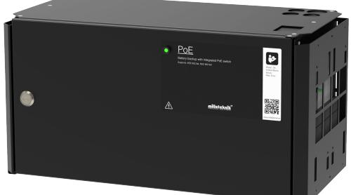

# PRODUKTBLAD - STRÖMFÖRSÖRJNING FRÅN MILLETEKNIK

## Namn, artikelnummer och e-nummer

| Namn                      | Artikelnummer      | E-num mer |
|---------------------------|--------------------|--------------|
| PoE M-switch 4p FLX M  | FM01N10224P01004PM | 51 728 96    |
| PoE M-switch 8p FLX M  | FM01N10224P01008PM | 51 728 97    |
| PoE M-switch 16p FLX M | FM01N10224P01016PM | 51 728 98    |

## PoE

PoE M-switch 4p FLX M+. PoE M-switch 8p FLX M+, PoE M-switch 16p FLX M+

Managed PoE-switch med 4 PoE Portar.

Managed PoE-switch med 8 PoE portar.

ManagedPoE-switch med 16 PoE portar.

# Beskrivning

Primärswitchad fyra, åtta eller 16 portars PoE strömförsörjning med batteribackup 24 V, 30,8 W/ port, med plats för två 20 Ah batteri.

## Användningsområde

Strömförsörjning med reservkraft för att driva PoEenheter som övervakningskameror och andra PoE drivna enheter. En extra lastugång för att driva andra 24 V applikationer.

Batterier driver, exempelvis passersystemet, vidare när elnätet går ner.

Lång livslängd, energieffektiv och support finns tillgänglig om något skulle krångla, nu eller om 10 år.

Spänning, ström och effekt

Spänning ut: 27,3 VDC, (24 V).

Laddström: 10 A. 13,5 A

Strömuttag: 30,8 W/ PoE-port, 5 A på 24 V lastutgång .

# Reservdrifttid på batterier

Reservdrifttiden i batteridrift beror på hur stor belastning som är inkopplad på strömförsörjningen. Varierar belastningen, som vid frekvent öppning av dörrlås, sjunker tiden som batterier kan driva vidare säkerhetssystemet. För att få en uppskattning av reservdriffterser se: [www.milletek](https://www.milleteknik.se/Manualer/FaQ/Reservdrifttider/)[nik.se/Manualer/FaQ/Reservdrifttider/](https://www.milleteknik.se/Manualer/FaQ/Reservdrifttider/)

# Batteri och batterityp

Två 7 Ah, Två 14 Ah, eller två 20 Ah batterier.

PoE M-switch 8p FLX M: två 20 Ah batterier.

PoE M-switch 16p FLX M: två 14 Ah batterier.

Batterityp: 12 V, AGM blysyra batteri, underhållsfritt. Batterier ingår ej.

## Lastutgångar

PoE-switch kan driva last till PoE-enheter och moderkort kan driva en (1) 24 V lastutgång för att driva andra applikationer .

## Larm

Larm ges för: Fördröjt nätavbrottslarm eller låg batterispänning, bortkopplade batterier, säkringsfel och överladdning av batterier.

Larm ges för: Fördröjt nätavbrottslarm eller låg batterispänning, bortkopplade batterier vid uppstart och säkringsfel.

## Skydd

Skydd mot överbelastning, överspänning, övertemperatur, kortslutning och djupurladdning.

Kontrollerad laddning av batterier skyddar mot överladdning och förlänger livslängden på batterier. Batterier laddas med som mest 4,5 A.

## Säkringar

Elnätssäkring: 2,5 A.

Lastsäkring: Säkring på matning till PoE-switch (8p): 10 A. Säkring på lastutgång: 10 A.Säkring på matning till PoE-switch (16p): 13,5 A.

Batterisäkring: 30 A.

## Indikeringar och kommunikation

Lysdiod visar information och larm på kretskort och på kapslingens dörr.

PoE strömförsörjning kan ej kommunicera via protokoll (RS-485/I2C) mot UC.

## Kapsling, utförande

Plåtskåp för väggmontering eller i 19" rackskåp (5 HE). Pulverlackat svart. Fyra kabelgenomföringar på ovansidan och utslagshål på baksidan. Buntbandshållare i kapsling.

| Mått, höjd x bredd x djup | IP-klass |
|---------------------------|----------|
| 224 x 437 x 212 mm        | IP32     |

#### Vikt

| Namn                    | Nettovikt | Vikt m förp. |
|-------------------------|-----------|--------------|
| PoEM- switch 16p FLX M+ | 8,2 kg    | 8,95 kg      |
| PoE M-switch 4p FLX M+  | 7,8 kg    | 8,55 kg      |
| PoEM- switch 8p FLX M+  | 8 kg      | 8,75 kg      |

#### Installationskrav

Enheten är avsedd för fast installation. Enheten skall installeras inomhus, miljöklass 1, omgivningstemperatur: +5°C – 40°C. Rekommenderad omgivningstemperatur är +15°C - 25°C.

## Krav som produkten uppfyller

| EMC: | EMC Direktivet 2014/30EU                                     |
|------|--------------------------------------------------------------|
| El:  | Lågspänningsdirektivet: 2014/35/EU                           |
| PoE: | IEEE 802.3af, IEEE 802.3at/30,8 W upp till typ2, klass 4. |
| CE:  | CE direktivet enligt:765/2008                                |
|      |                                                              |

## Garanti

Produkten har två års garanti för tillverkningsfel. Batterier och förslitningsdelar omfattas ej av garanti.

## Utbyggbar, tillval och tillbehör

[Sabotagekontakt](https://www.milleteknik.se/produkt/tamperswitch/)

Tillverkning, livslängd, miljöpåverkan och återvinning

Tillverkad av Milleteknik i Partille, Sverige.

Produkten är designad och konstruerad för lång livslängd vilket minskar miljöpåverkan. Produktens livslängd (förutom slitagedelar) är beroende på, bland annat miljöfaktorer, främst omgivningstemperatur, oförutsedd belastning på komponenter som blixtnedslag, yttre åverkan, handhavandefel, med flera. Produkter återvinns, enkelt då de är

moduluppbyggda, genom att lämnas till närmaste återvinningsstation eller sändas åter till tillverkare.1Kontakta din distributör för mer information.

#### Länk till senaste informationen

Produkter är föremål för uppdateringar, du hittar alltid den senaste informationen på [www.milletek](https://www.milleteknik.se/)[nik.se.](https://www.milleteknik.se/)

[PoE](https://www.milleteknik.se/produkt-kategori/poe-batteribackuper/)

Länk till tekniska specifikationer

[PoE M-switch 4p FLX M+ Svenska](https://www.milleteknik.se/Manualer/PoE/TD/PoE_M_Switch_4p_FLX_M_TecSpec-sv.pdf)

[PoE M-switch 4p FLX M+ English](https://www.milleteknik.se/Manualer/PoE/TD/PoE_M_Switch_4p_FLX_M_TecSpec-en.pdf)

[PoE M-switch 8p FLX M+ Svenska](https://www.milleteknik.se/Manualer/PoE/TD/PoE_M_Switch_8p_FLX_M_TecSpec-sv.pdf)

[PoE M-switch 8p FLX M+ English](https://www.milleteknik.se/Manualer/PoE/TD/PoE_M_Switch_8p_FLX_M_TecSpec-en.pdf)

[PoE M-switch 16p FLX M+ Svenska](https://www.milleteknik.se/Manualer/PoE/TD/PoE_Switch_16p_FLX_M_TecSpec-sv.pdf)

[PoE M-switch 16p FLX M+ English](https://www.milleteknik.se/Manualer/PoE/TD/PoE_Switch_16p_FLX_M_TecSpec-en.pdf)

## Övrigt

Skillnaden på PoE, PoE+ och PoE++.

| -                  | PoE             | Poe+            | PoE++           |
|--------------------|-----------------|-----------------|-----------------|
| Officiellt namn | IEEE 802.3af | IEEE 802.3at | IEEE 802.3bt |
| Maxeffekt          | 13 W            | 25 W            | 71 W            |
| Kompati bela.   | -               | PoE             | PoE, PoE+       |

a.Strömmatningen följer med "uppåt", men inte "ned". En PoE kan aldrig driva en PoE+/PoE++ enhet som kräver mer än 13 W.

#### Om dessa uppgifter

Alla uppgifter publiceras med reservation för eventuella fel. Uppdateras utan föregående meddelande.

1Kostnader som uppkommer i samband med återvinning ersätts ej.